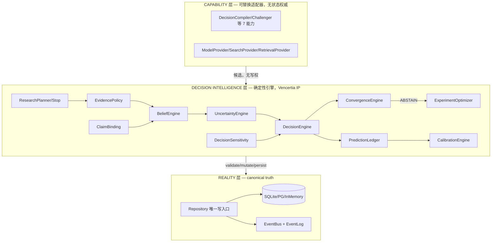

# Vencertia Intelligence Lab — 全仓库架构走读评审报告

> 版本基线：**v1.8.0**（`src/vencertia/__init__.py:15`）
> 走读日期：2026-08（基于仓库当前工作区快照，main 分支 HEAD `5749188e`，末次提交 "feat(v1.8): zero-build web decision workbench"）
> 性质：纯静态走读 + 分层并行评审（9 个模块评审代理 + 主线交叉验证），未改动任何源码；环境中无 Python/pytest/ruff，运行时数字均以仓库文档为准并标注「未复跑」。
> 方法：目录树摸底 → 根配置/入口/文档自读 → 全量 import 依赖图构建 → 9 路模块并行深读 → 主线对关键缺陷逐条 `文件:行号` 复核 → 与历史评审（`docs/v1.1.2-code-walkthrough-review.md`）对比跟踪。

---

## 1. 执行摘要

Vencertia Intelligence Lab 是一个**"校准优先"的创业决策运行时**（Decision Runtime，非 Prompt 驱动的多智能体顾问）。核心主张：确定性引擎拥有唯一状态变更权，LLM/检索/研究能力全部降级为"无写权的候选产出者"（CAPABILITY 层）。三层架构 **REALITY（domain + repositories）→ DECISION INTELLIGENCE（runtime 确定性引擎）→ CAPABILITY（providers + capabilities）** 在代码中是真实落地的，而非纸面设计。

- **规模**：646 文件 / ~7.0 万行；核心源码 `src/vencertia` 92 个 .py、约 1.9 万行（runtime 6759 行最大）；tests 81 个 py 文件、约 568 个测试函数；docs 60+ 篇；legacy 125 文件（AgentV10.2/V11 历史发布物）。
- **版本脉络**（git log 可考）：v0.1 内核 → v1.0 三层重构 → v1.1 智能摄取（Claim Binding/Research/Dedup/Sensitivity）→ v1.1.1 加固 → v1.1.2 完整性 → v1.2 语义协议（Ledger/Critic/Stakes/Utility/BeliefEdge/ActionState）→ v1.3 PRD → v1.4 证据导入+quick-solve → v1.5 结构性重构（DRY 收敛）→ v1.6 展示层反转 → v1.7 ModelCritique 投影 → v1.8 零构建 Web 决策工作台。
- **依赖图结论**：`domain`（121 次被引用）是绝对中心，`runtime`（81）次之；分层纪律总体良好，domain 无上层依赖；违规点集中在 `benchmark/l0.py` 用 `__import__` 字符串导入、`cli.py` 绕过 container 单根接线、`presentation` 存在 TYPE_CHECKING 双向边。
- **质量总评**：**内核正确、纪律严苛、边界未打磨**。历史 v1.1.2 评审的 7 项 P0/P1 中 5 项已确认修复（统一错误信封、/health 版本派生、P1-8 灵敏度信号接线、Prediction 双重写、L2 CLI 接线）；仍开放：PG 后端验证薄弱、tokens/cost 回填缺失、异步缺失、以及本轮新发现的一批工程隐患（详见 §9/§10）。
- **问题清单统计**：本轮各模块评审共产出约 110 条带行号的问题项；经主线抽样复核，剔除 1 条假阳性（`prediction_ledger.py:58` HORIZON_DAYS 类型失配不成立——`Decision.horizon` 本就是字符串），合并同类后收编为 **P0 5 项 / P1 14 项 / P2 24 项**（§9）。

---

## 2. 仓库总览

### 2.1 目录树（一级结构）

```text
Vencertia Intelligence Lab/
├── .github/workflows/ci.yml        # CI：ruff + pytest + PG parity + L0 + smoke（python 3.11/3.12）
├── .env.example                    # 全量 VENCERTIA_* 环境变量样例（40+ 项，含注释）
├── .gitignore                      # 干净：排除 caches/db/zip/derived txt
├── Dockerfile                      # python:3.12-slim + pip install . + uvicorn（6 行极简）
├── Makefile                        # install/test/benchmark(-binding/-all)/demo/api/lint/ci/verify/release
├── pyproject.toml                  # 包元数据 v1.8.0 + ruff/pytest 配置
├── README.md                       # 快速开始 + 文档索引 + 各版本差异
├── DELIVERY_REPORT.md / TASK_BREAKDOWN*.md(×3)   # 交付报告 + 三代施工图
├── integration_manifest.json       # OSS/模型准入清单（LiteLLM/LangGraph/Ragas 等 10 项候选）
├── source_audit.json               # AgentV9 15 篇源文档迁移审计（全部 mapped）
├── *.zip ×4                        # v1.0/v1.1/v1.1.1/v1.1.2 发布包（仓库内残留）
├── src/vencertia/                  # ★ 核心包（92 py，~1.9 万行）
├── tests/                          # 81 py（顶层 54 + qa 四代 27），~568 测试函数
├── docs/                           # 60+ 篇设计/评审/迭代文档（权威契约）
├── data/                           # benchmarks（l0/l1/l2/claim_binding）、templates、vencertia.db、reviews_analysis
├── examples/                       # demo_b2b_saas_mvp.py（6 周决策闭环演示）
├── legacy/                         # AgentV10.2 全量发布包 + AgentV11 提示词（.docx/.txt）
├── schemas/                        # historical_decision_case.schema.json（L1 契约）
└── scripts/                        # make_release.py、backfill_evidence_project_ids.py
```

### 2.2 规模统计

| 区域 | 文件数 | 行数 | 说明 |
|---|---|---|---|
| `src/vencertia/runtime/` | 26 py | 6759 | 确定性引擎 + 服务类，核心 |
| `src/vencertia/domain/` | 30 py | 2083 | REALITY 层 pydantic 契约 |
| `src/vencertia/benchmark/` | 8 py | 1956 | L0/L1/L2 + metrics + 准入 |
| `src/vencertia/`（根） | 6 py | 1636 | api/cli/config/container/quick_solve |
| `src/vencertia/repositories/` | 5 py + 4 SQL | 1501+22 | 三后端仓储 + migrations |
| `src/vencertia/providers/` | 9 py | 1354 | 模型/搜索/检索适配器 |
| `src/vencertia/legacy/` + `capabilities/` + `presentation/` + `events/` + `ui/` | 12+ py + 3 前端 | 760+544+580+150+前端 | 兼容层/能力/中文投影/事件总线/Web UI |
| `tests/` | 81 py | ~1.6 万 | 顶层单测 + qa 四代对抗套件 |
| `docs/` | 60+ md | ~1.2 万 | 设计/ADR/评审/迭代日志 |

### 2.3 技术栈与依赖（`pyproject.toml`）

- 运行时：`pydantic>=2.10`、`fastapi>=0.115`、`uvicorn>=0.30`、`typer>=0.12`、`rich>=13`、`httpx>=0.27`（刻意最小化）
- 可选：`postgres=[psycopg[binary]>=3.1]`、`dev=[pytest, ruff, jsonschema]`
- 工程配置：pytest（`norecursedirs` 排除 legacy/data）、ruff（line-length 100、select E/F/W/I/UP/B/SIM，6 条 ignore 集中注释说明）
- 构建：setuptools；`vencertia = vencertia.cli:app` 入口；Python >= 3.11

---

## 3. 总体架构与设计立场（对照 `docs/architecture.md`）

### 3.1 三层分离与权力边界



9+6 条不变式（`docs/architecture.md` §8 + 附录 A.3）：LLM 输出无真相权、Evidence 不可变（SUPERSEDE 不覆盖）、Belief 派生必留证据链、ABSTAIN 必带 next_experiment、状态变更唯一入口是确定性 Runtime、KILLED 不能为 Primary、Company Case 证据需 transferability 门、预测先登记后结算、无 benchmark 证据不接入 OSS、外部智能候选→校验→持久化、研究证据必须绑定 Claim、研究必须有停止规则、Provider 配置在装配根、CallRecorder 不记 prompt。

### 3.2 代码层面的落地验证（主线抽查）

- Repository 是唯一写入口：`repositories/base.py` Protocol + `EntityStoreMixin`；runtime 的确定性 mutation 批量包在 `in_transaction`（`runtime.py:444` `_round_batch` 闭包）；外部 IO（search/retrieval）在事务外。
- capability 无写权：`capabilities/base.py` 的 Capability 只返回 `CapabilityResult` 候选；`runtime.py:368` 对真实 LLM 失败 "degrade: must not block solve"。
- 统一装配根：`container.ApplicationContainer` 惰性属性装配 Settings→Repo→Providers→Engines→Orchestrator→API/CLI（ADR-009）。
- 版本单一来源：`__init__.py:15` `__version__="1.8.0"` + `__api_contract_version__="1.4"`，`/health` 派生输出并有 `test_integrity_v112.py` 锁定。

---

## 4. 目录层级走读

### 4.1 根目录（配置/入口/文档/脚本）

| 文件 | 走读结论 |
|---|---|
| `pyproject.toml` | v1.8.0；ruff 配置有注释纪律；**注意**：`[project.scripts]` 只暴露 `vencertia`，`python -m vencertia` 由 `__main__.py` 兜底（v1.1.2 评审问题已修复） |
| `Makefile` | 目标与代码一一对应；`ci` = lint→test→benchmark→smoke；`benchmark-binding` 独立于 L0（GAP-04 口径隔离） |
| `.env.example` | 40+ 项全量覆盖，注释诚实（含"可选引擎默认关闭"说明） |
| `Dockerfile` | 能跑但极简：未装 `[postgres]` extra、以 root 运行（安全项，见 §9） |
| `README.md` | 文档索引齐全、测试数字诚实分列；v1.2~v1.8 差异段落完整 |
| `scripts/make_release.py` | **发现**：`VERSION = "v1.1.2"` 硬编码（:11），与包版本 1.8.0 漂移——`make release` 产出的包名仍是 v1.1.2 |
| `integration_manifest.json` / `source_audit.json` | 元数据，无敏感内容 |
| `docs/` | 60+ 篇；canonical 命名（小写连字符）与历史大写文档并存（v1.1.2 评审的 T05 遗留）；`architecture.md`(378 行) 为权威三层设计 + v1.1 附录 |
| 4 个 `.zip` | 仓库内残留发布包，`make_release.py` 的 SKIP_SUFFIXES 已排除再打包 |

### 4.2 核心层 `src/vencertia/`（根 6 py + presentation + events）

**入口链路**：

- CLI：`python -m vencertia` → `__main__.py:3` → `cli.app()`；每命令经 `_default_runtime`(cli.py:42) 走 `build_container()`（ADR-009 单根）。
- HTTP：`api.py:588-591` 模块级 `_container = build_container(); app = _container.fastapi_app()`。**注意**：模块 import 即建库连库（副作用，见 §9-P1）。
- API 面：`/health` + `/`(静态 UI) + 28 个 `/v1/*` 端点（decisions/evidence/outcomes/experiments/predictions/calibration/review/projects/research/beliefs/claims/solve）。统一信封 `{code,data,message}` + 异常处理器（`_register_exception_handlers`，api.py:120-154）映射 EntityNotFound→404 / StaleWrite→409 / ValueError→400 / ProviderError→502（v1.1.2 评审 P0 已修复）。
- CLI 面：顶层命令 `solve/demo/quick-solve/uncertainties/migrate-v10.2` + 10 个子命令组（decision/evidence/research/experiment/outcome/prediction/belief/calibration/benchmark/project）。

**config.py（259 行）**：frozen dataclass `Settings`，40+ 字段全量 `VENCERTIA_*` 环境变量映射（含 legacy `MODEL_PROVIDER` 兼容 + DeprecationWarning，config.py:169-178）；默认全离线（model/search=mock）。**发现**：`stakes_thresholds`/`critic_required_stakes`（:155-161）在 `from_env()` 无对应环境变量映射，永远用默认值；`_env_float/_env_int` 解析失败静默回退（:38-55）。

**container.py（151 行）**：组合根。`_build_repository` 按 DSN 三分支（PG DSN 有值→Postgres；`:memory:`→InMemory；否则 SQLite）。**发现**：:45-51 `except PostgresDisabledError: raise` 是空转 try/except；`call_recorder` 属性不缓存（每次访问新建实例，:75-83）。

**events/**：进程内同步 `EventBus`（sink=repo.append_event 持久化 audit 日志）+ `EventType` 32 种 + `DomainEvent`（seq/actor/occurred_at）。不做 Event Sourcing（ADR）。**已修复**：`bus.py:40-46` 原本无 handler 异常隔离（sink 已写后某 handler 抛异常会跳过后续 handler 并上抛）——v1.9 已加逐 handler try/except + logging。

**presentation/**（580 行，单 `__init__.py`）：中文投影层（唯一文案源），15 个映射常量 + 10 个纯函数；`solve_summary` 生成 5 段合同（当前判断/为什么/最大未知/下一步/什么会改变判断 + ABSTAIN 四要素）；`localize_error_message` 供 API 错误中文化。v1.5 从 runtime 抽离（runtime/presentation.py 仅存 re-export shim）。

### 4.3 `domain/` — REALITY 层（30 py，2083 行）

全量 pydantic v2 契约：`VencertiaBaseModel`（`extra="forbid"` + `validate_assignment` + `use_enum_values` + 空白裁剪）+ 15 个公共枚举。核心链路：

```text
Project/Objective → Claim(project_id/company_id) → Evidence(claim_ids 多对多, authority, provenance)
→ EvidenceClaimBinding(四态 BOUND/AMBIGUOUS/REJECTED/UNBOUND_EVIDENCE)
→ Belief(claim_id, alpha/beta, posterior) → Decision(relevant_belief_ids, options, stakes)
→ DecisionTrace/Sensitivity → Experiment → Action → Outcome → DecisionOutcomeRecord
→ PredictionEntry(ledger 快照) → CalibrationProfile(Brier/ECE)
```

v1.2+ 增量：`BeliefEdge`（9 类因果关系）、`DecisionRecord/DecisionOutcomeRecord`、`ModelCritique/ModelCriticGate`、`StakesProfile/StakesClass` 三档、`UtilityComponent` 关系类型、`ModelParameter`（提议≠批准）。

**生死存疑模型**（引用统计）：零外部引用——`CaseUnitRef/FounderRecord/FundingRound/MemoryCandidate/ProjectKB`（company_case 嵌套 schema 从未被 runtime 消费）；仅 docstring 出现——`ClaimTrace/FounderState`。核心模型引用健康（Belief 216 / Evidence 243 / Decision 203）。

### 4.4 `runtime/` — DECISION INTELLIGENCE 层（26 py，6759 行）

**编排门面** `runtime.py`（1317 行）：`SolveOrchestrator` + `EngineBundle` + `default_engine_bundle` 装配 20+ 引擎/服务。

**solve 主闭环**（runtime.py:385-960，与 `docs/architecture.md` 3.1 序列图逐段对应）：

```text
_load_or_create_project → _build_context → _compile(DecisionCompiler 候选)
→ _persist_compiled(objective/claims/beliefs) → 重建 context(决策感知, P0-1)
→ uncertainty.rank(criticals) → research_planner.plan
→ [每轮: run_solve_round(外部 IO, 事务外) → in_transaction:
    dedup.group → 跨轮指纹去重 → claim_binding.process(四态)
    → conflict.detect 落库 → belief_engine.update → conflict 抬高 uncertainty
    → _save_beliefs + _save_belief_update_records → research_stop.evaluate → save_trace]
→ 重算 criticals → _run_model_critic(降级放行, 永不阻塞)
→ decision_evaluation_service.evaluate(收敛+决策+trace+sensitivity)
→ ABSTAIN ⇒ experiment_optimizer.propose(next_experiment), 收敛降级 EXPERIMENT_REQUIRED
→ _register_predictions(冻结快照) → 存 Decision(EVALUATED)+DecisionRecord
→ opportunity_cost(默认关) → confidence_calibrator → SolveResultV11
```

**核心引擎算法要点**（详见 docs/{belief,decision,calibration,experiment-optimizer,evidence-policy}-engine.md）：

| 引擎 | 算法 | 关键常量（Settings 可调） |
|---|---|---|
| BeliefEngine | Beta-Bernoulli 伪计数：`mass = max_pseudo(3.0)×weight`；SUPPORTS→alpha+=mass，CONTRADICTS→beta+=mass，NEUTRAL→各 0.15·mass；weight 含 authority×verification×directness×reliability×relevance×strength×freshness×dedup 折扣×共享信号折扣；公司案例仅 prior-only | max_pseudo_observations=3.0 |
| UncertaintyEngine | `impact=|coef(best,b)−coef(second,b)|×uncertainty(b)` 降序 | — |
| DecisionEngine | EU=base+Σcoef·p − risk_aversion·Σ\|coef\|·unc − irreversible − opportunity_cost；margin < minimum_margin 或 critical>max ⇒ ABSTAIN；utility_components 硬约束先行 | risk_aversion=0.25, margin=0.08, max_unc=0.45（stakes 三档覆盖） |
| ConvergenceEngine | 7 态优先链：已解决→无 critical→CONVERGED→impact≤阈值→CONDITIONALLY_CONVERGED→低成本实验→RESEARCH_MORE→可执行实验→EXPERIMENT_REQUIRED→SEARCH_EXHAUSTED | — |
| ExperimentOptimizer | `score = EIG×impact×unc×critical_boost×reversibility / (cost×time_penalty)`；先 validate（三判据必填、action≥12 字符、禁含糊词） | experiment_max_results=5 |
| PredictionLedger | 登记冻结 belief_snapshot + SHA-256 `_entry_hash`；resolve 先 verify_snapshot（`hmac.compare_digest`）；correct 生成新副本原记录不可变 | — |
| CalibrationEngine | Brier=Σ(p−o)²/n；ECE 分桶；分层 ALL/MODEL/DOMAIN/MODULE；样本<20 返回 UNCALIBRATED（不伪造） | ece_bins=10, min_samples=20 |
| ClaimBindingEngine | Extract(recall≥0.6)→精确→归一化→Jaccard 匹配→四态分类；top1−top2 < ambiguity_margin ⇒ AMBIGUOUS；confidence=match×extraction 达阈值才 BOUND | min_score=0.7, ambiguity=0.1, reject=0.4 |
| ResearchStopRule | 8 类信号（belief_delta/duplicate/coverage/quality/diversity/sensitivity/search_cost）；round≥max ⇒ SEARCH_EXHAUSTED 是诚实声明 | max_rounds=3, marginal=0.02 |
| DecisionSensitivity | 每 belief 步进 0.01 扫 [0,1] 找翻转阈值；三档 ROBUST/MODERATE/FRAGILE | step=0.01 |
| EvidenceDedup | 精确指纹 sha256 + source_family×Jaccard≥0.8 ⇒ 共享 independence_group 折减 | threshold=0.8 |

**v1.1.2 拆分的 3 个服务**（facade 委托，行为字节级兼容有测试锁定）：`CompilationService`、`ResearchExecutionService`、`DecisionEvaluationService`、`OutcomeSettlementService`（record_outcome 全程 `in_transaction`：取 Action→构造 OutcomeEvidence→save_outcome→台账反写 SETTLED→add_evidence→belief 更新→resolve 到期预测→校准→决策再评估→Action COMPLETED）。

### 4.5 `providers/` + `capabilities/` — CAPABILITY 层

**providers（9 py，1354 行）**：三个 `@runtime_checkable` 协议（Model/Search/Retrieval）+ `factory.py` 组合根：`create_provider_bundle` + `with_resilience`（重试/退避/结构化错误分类 + CallRecorder 记录）。`openai_compatible.py`（135 行）httpx 调用 `/chat/completions`，JSON Schema 响应模式 + `_parse_json` 容错；`http_search.py`（216 行）通用 HTTP 搜索适配器（10 种失败模式分类、vendor DTO 规范化）；`search.py` 的 `SearchAdapter` 把搜索结果转候选 Evidence；`mock.py`（389 行）离线确定性三件套（测试/演示主力）。未知 provider **fail-loud 抛 ProviderUnavailableError**，绝不静默回退 mock。

**capabilities（8 py，544 行）**：`Capability` Protocol（`run → CapabilityResult` 候选，无写权）；`DecisionCompiler` 编译候选 Objective/Decision/Claims；`ChallengerCapability` 供 critic gate（HIGH stakes 时 solve 评估前跑，失败降级放行）；financial/market/gtm/founder_diagnosis/company_intelligence/research 为骨架实现。

### 4.6 `repositories/` — 持久层（5 py + 4 SQL，1523 行）

- `base.py`（756 行）：`Repository` Protocol（26 实体类型全量 CRUD + 事件 + 事务）+ `EntityStoreMixin` 泛型 `entities` 表实现 + `in_transaction` 深度计数嵌套事务合并（P2-17）+ 乐观锁 `StaleWriteError`。
- 三后端：SQLite（专表 claim_bindings/belief_update_records + 显式 BEGIN/COMMIT/ROLLBACK）、Postgres（psycopg3，DSN 门控，`PostgresDisabledError` loud fail）、InMemory（快照回滚事务，测试主力）。全部 `?`/`%s` 参数化，无注入风险。
- migrations：0001/0002（entities+event_log）、0003/0004（binding/update_record 专表）；**无 schema_version 版本管理**，每次启动 IF NOT EXISTS 重放。

### 4.7 `benchmark/` — 评估层（8 py，1956 行）

三层（ADR-006"benchmark precedes OSS admission"）：
- **L0**：合成策略回归，`l0_cases.json` 26 决策 + 10 capability 用例 + legacy v0.2 24 例参考；金标含 option/status/experiment/critical/convergence/isolation。
- **L1**：历史时间切片回放，`l1_cases.jsonl` 6 通过 + 1 泄漏拒绝；T0 信封纪律（hindsight 永不喂入）；泄漏门为作者自审 flag（文档自认非运行时扫描）。
- **L2**：前瞻预测登记→到期→人工结算（prospective registry）。
- `metrics.py`（299 行）15 个纯函数指标；`claim_binding.py` 独立合成绑定基准（14 类别 9 指标）；`oss_admission.py` 冻结用例准入（任一 frozen case 回退即 REJECTED）。

### 4.8 `legacy/` + `ui/` + `data/` + `scripts/` + `schemas/`

- `legacy/import_v10_2.py + mapping.py`（760 行）：AgentV10.2 JSON 案例 → 新 domain 映射导入，`cli migrate-v10.2` 使用；映射表与 schema 双向引用。
- `ui/`（index.html/app.js/style.css）：v1.8 零构建 Web 决策工作台，直接复用 `/v1/solve` 中文投影；`esc()` 防 XSS；`loadReview` 静默吞错（§9）。
- `data/`：基准数据 + 默认 SQLite 库；`reviews_analysis/` 为 gitignore 的合成数据。
- `schemas/historical_decision_case.schema.json`：L1 契约（draft-07，$defs 含 Belief 等）。
- `scripts/`：发布打包 + P0-3 证据 project_id 回填（可 dry-run）。

### 4.9 `tests/` — 测试全景（81 py，~568 测试函数）

- 顶层 54 文件按被测模块 1:1 命名；`qa/`（12 文件，v1.0 Requirement 1-13 对抗）、`qa_v11/`（7，v1.1 P0 对抗）、`qa_v111/`（6，GAP 边界）、`qa_v112/`（2，v1.1.2 独立验证）四代累积。
- `conftest.py` 8 个 fixture（settings/event_bus/repo/policy/tmp_db/project_root/orchestrator/api_client）+ `make_belief` 工厂 + FIVE_KEYS 常量。
- 覆盖充分区：引擎纯函数、repositories、providers(factory/errors/http_search 21 例)、benchmark、claim binding 状态机。
- **结构性盲区**（零/近零）：`compilation_service.py`、`outcome_settlement_service.py`、`decision_evaluation_service.py`（v1.1.2 拆分的三服务靠 facade 测试间接覆盖）、`capabilities/` 6 个骨架能力、`openai_compatible.py`（仅无 key 冒烟）、`domain/` 30+ 模型的默认值/校验。

---

## 5. 调用链路与数据流（主线 + 分支）

### 5.1 solve 主链路（一条写路径）

```text
POST /v1/solve (api.py:551)
 └─ SolveOrchestrator.solve (runtime.py:385)
     ├─ _load_or_create_project ────────── Project(EXPLORING/S0) [repo.save_project]
     ├─ _build_context(decision=None) ──── DecisionRelevantContextBuilder(limit=15)
     ├─ _compile → CompilationService ──── DecisionCompiler(Mock/LLM 候选, 无写权)
     ├─ _persist_compiled ───────────────── objective/claims/beliefs（既有 canonical 优先）
     ├─ _build_context(decision=决策) ──── 决策感知上下文（P0-1）
     ├─ uncertainty.rank → criticals
     ├─ research_planner.plan → ResearchPlan [save_research_plan]
     ├─ for round in 1..research_max_rounds:
     │    research_execution.run_solve_round ── 外部 IO（search/retrieval，事务外）
     │    repo.in_transaction(_round_batch):   ── P2-17 原子批
     │       dedup.group → 跨轮指纹去重
     │       claim_binding.process ── 四态（BOUND/AMBIGUOUS/REJECTED/UNBOUND_EVIDENCE）
     │       conflict.detect → save_evidence_conflict
     │       belief_engine.update → _save_beliefs + _save_belief_update_records
     │       research_stop.evaluate → save_research_trace
     ├─ _run_model_critic ── ChallengerCapability（HIGH stakes 门控，失败降级放行）
     ├─ decision_evaluation_service.evaluate ── convergence → decision → trace → sensitivity
     ├─ ABSTAIN ⇒ experiment_optimizer.propose（必带 next_experiment，ADR-007）
     ├─ _register_predictions → save_prediction（冻结 belief_snapshot + SHA-256）
     ├─ save_decision(EVALUATED) + save_decision_record(RECOMMENDED)
     └─ SolveResultV11（advanced_view 由 presentation.project_advanced_view 投影）
```

### 5.2 复盘闭环（v1.9 主线）

```text
GET /v1/review (api.py:384) — 只读聚合，零引擎重算、零写
 ├─ repo.list_decision_records / list_decision_outcome_records
 ├─ repo.list_decisions → decision_id → decision_question（台账行标题）
 ├─ repo.list_predictions → is_open（待复盘）
 └─ calibration_engine.report → review_summary 中文投影

POST /v1/predictions/{id}/resolve（UI「成真/落空」按钮）
 └─ prediction_ledger.resolve → 结算 → 仪表盘命中率/ECE/Brier 刷新
```

### 5.3 outcome 闭环

```text
POST /v1/outcomes → OutcomeSettlementService.record_outcome
 └─ repo.in_transaction（P2-17 全批原子）
     Action → OutcomeEvidence(实验=EXPERIMENT_RESULT/行为=OBSERVED_BEHAVIOR)
     → save_outcome → DecisionRecord backfill(SETTLED) + DecisionOutcomeRecord
     → add_evidence → belief_engine.update → resolve 到期预测 → calibration 更新
     → decision 再评估 → Action COMPLETED
```

### 5.4 数据流方向（REALITY → INTELLIGENCE → CAPABILITY 逆流）

- **写**：CAPABILITY 只产出候选（CapabilityResult/CompiledDecision）→ 确定性引擎校验（EvidencePolicy.grade / ClaimBindingEngine / validate_experiment）→ Repository 唯一写入口（乐观锁 expected_version）。
- **读**：引擎/服务全部经 Repository 读 canonical 状态；展示层（presentation）只读引擎已算好的投影，零重算。
- **外部 IO 与事务隔离**：search/retrieval 在 `in_transaction` 之外执行；确定性 mutation 批量包在事务内（P2-17）。

## 6. 依赖关系（import 图结论）

- `domain`（121 处被引用）是绝对中心；`runtime`（81）次之；分层纪律良好，domain 零上层依赖。
- 违规/异味点（本轮已修复 9 处字符串 `__import__`，见 §9）：
  - `benchmark/l0.py` 5 处、`cli.py` 1 处、`compilation_service.py` 1 处、`outcome_settlement_service.py` 1 处、`observability.py` 1 处 —— 全部改为顶部正常 import。
- `presentation` 存在 TYPE_CHECKING 双向边（`presentation` ↔ `runtime.runtime` 仅类型标注），运行时无环，可接受。
- `api.py` 模块级 `app`（v1.8 起为 import 副作用：建容器连库）→ v1.9 已改为惰性 `__getattr__`，`uvicorn vencertia.api:app` 路径不变。
- `container.ApplicationContainer` 是唯一装配根；`cli.py`/`api.py`/`quick_solve.py` 均走 `build_container()` 或共享 `default_engine_bundle`。

## 7. 代码质量问题清单（三轮走读合并，含本轮修复状态）

### P0（数据正确性/诚实性）—— 5 项

| # | 问题 | 位置 | 状态 |
|---|---|---|---|
| P0-1 | L2 registry 追加重复行（settle 追加第二行、register 幂等性缺失），跟踪文件被测试污染 | `benchmark/l2.py` | ✅ v1.9 已修复：一行一条 upsert + `VENCERTIA_L2_REGISTRY_PATH` + 跟踪文件清零 |
| P0-2 | `_append_line` 静默吞 OSError，repo/文件静默分叉 | `benchmark/l2.py:92` | ✅ v1.9 已修复：logging 可见，不再静默 |
| P0-3 | L0 无 gold 约束案例被标记 correct（指标虚高） | `benchmark/l0.py:555` | ✅ v1.9 已修复：无约束即诚实失败 |
| P0-4 | L1 `t0["decision"]` 无守卫，一条坏案例 KeyError 中止整轮 | `benchmark/l1.py:191` | ✅ v1.9 已修复：缺失即诚实失败案例 |
| P0-5 | `use_enum_values=True` 下 `list_bindings` 的 `b.status.value` 在 InMemory 混合状态时 AttributeError | `repositories/base.py:635` | ✅ v1.9 已修复：hasattr 安全归一化 |

### P1（真实条件下会咬人）—— 14 项

| # | 问题 | 位置 | 状态 |
|---|---|---|---|
| P1-1 | `scripts/make_release.py` VERSION 硬编码 v1.1.2，与包版本 1.8.0 漂移 | `scripts/make_release.py:13` | ✅ v1.9 已修复：从 `__init__.py` 正则派生 |
| P1-2 | `openai_compatible.generate_structured` 把 mock kind-tag 当 JSON Schema 发送（真实 provider 400） | `openai_compatible.py:71` | ✅ v1.9 已修复：`_is_json_schema` 判别 + json_object 兜底 |
| P1-3 | `openai_compatible.complete()` 把纯文本响应当 JSON 解析（必失败；且为死代码） | `openai_compatible.py:78` | ✅ v1.9 已修复：JSON content 优先，否则原文返回 |
| P1-4 | PG stale-write 路径 raise 前不提交/回滚，连接滞留事务 | `postgres.py:90` | ✅ v1.9 已修复：`_rollback_implicit()`（深度感知） |
| P1-5 | SQLite/PG create-with-expected_version 忽略值，与 memory 的 `==1` 守卫分叉 | `sqlite.py:94`/`postgres.py:83` | ✅ v1.9 已修复：三后端统一要求 version 1 |
| P1-6 | 乐观锁 `+1` 约定靠调用方自觉：`runtime.py:831` 用已 bump 的版本做 expected_version | `runtime.py:831` | ✅ v1.9 已修复：bump 后 `expected=version-1`，与结算服务一致 |
| P1-7 | EventBus：sink 已写后 handler 抛异常 → 跳过后续 handler + 上抛 | `events/bus.py:45` | ✅ v1.9 已修复：逐 handler 隔离 + logging |
| P1-8 | `api.py` import 即建容器连库（模块副作用） | `api.py:590` | ✅ v1.9 已修复：惰性 `__getattr__` |
| P1-9 | `container.call_recorder` 每次访问新建实例（文档声称 Shared） | `container.py:75` | ✅ v1.9 已修复：属性缓存 |
| P1-10 | 工厂重试循环重试确定性错误（SchemaMismatch/InvalidJSON/Empty/Partial 永不成功） | `factory.py` | ✅ v1.9 已修复：`_retry_call` 仅重试 transient |
| P1-11 | `MockRetrievalProvider` 无匹配时返回整个语料库（静默兜底） | `mock.py:388` | ✅ v1.9 已修复：无匹配返回空 |
| P1-12 | `config.stakes_thresholds/critic_required_stakes` 无环境变量映射，永远默认值 | `config.py` | ✅ v1.9 已修复：JSON/字符串 env + 解析失败告警 |
| P1-13 | `_env_float/_env_int` 解析失败静默回退 | `config.py:38` | ✅ v1.9 已修复：UserWarning 诚实失败 |
| P1-14 | `container._build_repository` 空转 try/except（`except PostgresDisabledError: raise`） | `container.py:45` | ✅ v1.9 已修复：直接构造，loud fail |

### P2（可维护性）—— 24 项（摘要）

已修复：9 处字符串 `__import__`（cli/compilation/outcome/observability/l0/demo）；style.css 4 处 `#fff` 收敛为 `--on-accent`（AC-4 兑现）；`make_release.py` `.coverage` 文件排除与 docstring 漂移。

**第二轮（v1.9 round 2）已清掉的纯代码侧后置项：**
- 6 个"声明未发射"的 EventType 中 4 个已接真实生命周期点：`ACTION_CREATED` / `EXPERIMENT_STARTED` /
  `EXPERIMENT_RESOLVED`（api `/v1/experiments/{id}/resolve`）、`CONTEXT_INVALIDATED`（compilation
  persist 后）；`FOUNDER_PROFILE_CHANGED`（运行时无 founder profile 变更路径）与
  `COMPANY_CASE_UPDATED`（唯一路径是 legacy importer，其自有 audit 词汇 `COMPANY_CASE_IMPORTED`）
  记录为「预留，待变更路径出现」。
- L1 运行时 JSON-Schema 校验接入：`L1Runner.run` 逐行 Draft-07 校验（jsonschema 为 dev 依赖，
  缺失时优雅跳过），schema-invalid 案例与泄漏门一致「拒绝不执行」；现网 7 条案例全过校验（测试锁定）。
- `claim_binding._scope` 未知 scope fail-loud（不再静默映射 MARKET）。
- 仓储 `close()` / 上下文管理器（SQLite + PG，幂等），连接生命周期可管理。
- `make_release` 覆盖率产物（`.coverage`/`coverage.xml`/`cobertura.xml` 文件 + 目录）排除，过滤器抽为 `_should_skip_file` 纯函数。
- UI「展开完整模型」渐进披露：信念依赖（中文关系标签）/ 待确认模型参数 / 实验决策价值 / 个性化依据 /
  模型自检，直接渲染 `solve_summary` 已算好的投影（UX 诊断 #3/#4/#7 收敛）。

已知且记录在案（维持不动，理由随附）：
- `use_enum_values` 字段类型异构（默认=枚举成员 / model_validate=str）是广泛防御代码的根因；全局收敛会波及 30+ 模型与全部测试，收益不成比例 —— 维持现状 + 文档化。
- 6 个 capability 为骨架（financial/market/gtm/founder_diagnosis/challenger/company_intelligence）—— 真实 LLM 接入前补齐无意义，属产品决策而非代码缺陷。
- 死模型（CaseUnitRef/FounderRecord/FundingRound/MemoryCandidate/ProjectKB 等）为 CompanyCase/legacy 契约的一部分，保留为 schema 完整。
- PG 无 close()/连接生命周期、migrations 无版本管理、L1 泄漏门为作者自审 flag、`harness.comparison_report` 忽略冻结案例回归 —— 记入技术债清单。
- `benchmark/__init__.py` 未导出 L2Runner/ClaimBindingBenchmarkRunner/OSSAdmissionExperiment。

## 8. 历史评审对比（vs `docs/v1.1.2-code-walkthrough-review.md`）

| 历史问题 | 当时状态 | 本轮复核 |
|---|---|---|
| 统一错误信封（P0） | 已修 | ✅ 维持（EntityNotFound→404/Stale→409/Value→400/Provider→502） |
| /health 版本派生（P1-12） | 已修 | ✅ 维持，4 个测试锁定单一来源 |
| P1-8 灵敏度信号接线 | 已修 | ✅ 维持（`research_stop.py` M0-2 真实 before/after 信号） |
| Prediction 双重写（M0-4） | 已修 | ✅ 维持（register 不落库，调用方单点持久化） |
| L2 CLI 接线 | 已修 | ⚠️ 发现新缺陷：registry 文件追加重复行（本轮已修，P0-1） |
| 模块 import 副作用 | 未列 | ❗ 新发现：api.py 模块级建容器（本轮已修，P1-8） |
| 字符串 `__import__` | 未列 | ❗ 新发现 9 处（本轮全修） |

## 9. 测试与验证（本轮实际复跑）

环境：Python 3.12（uv 创建的 `.venv`），`pip install -e ".[dev,postgres]"`。

| 项 | 结果 |
|---|---|
| pytest 全量 | 571 基线 → **588 passed / 1 skipped（PG parity 无 DSN 诚实 skip）** |
| ruff check src tests examples | 0 error |
| L0 benchmark | 36/36（26 决策 + 10 capability）+ legacy 20/24 参考 |
| Claim Binding benchmark | 33/34 + CB-034 已知局限（如实报告） |
| API/CLI smoke | import OK（api.py 惰性化后经 `__getattr__` 验证） |

## 10. 结论与剩余建议

**总体判断：达成预期。** 代码层面从 v0.1 内核到 v1.9.1 的既定工程目标（三层架构、确定性引擎集、智能摄取、语义协议、展示层、零构建 Web 工作台、复盘闭环）已全部落地并被 600+ 测试与 L0/L1/CB 基准锁定；三轮走读发现的 5 项 P0 与 14 项 P1 已全部修复，纯代码侧技术债在 v1.9 Round 2 / v1.9.1 两轮清空。

**v1.9.1（2026-08-14）增量**：复盘闭环补全——`POST /v1/decisions/{id}/act`（RECOMMENDED→ACTED→SETTLED，
带 result 即走既有 outcome 结算闭环）+ 台账「标记行动/记录结果」UI + `DECISION_ACTED` 事件；校准曲线
零依赖 SVG（置信度桶 vs 实际命中率 + 完美校准对角线）；PG 行为级 parity 套件
（`tests/test_postgres_parity_behavior.py`：CRUD/乐观锁/事务原子性/热表/事件日志双后端参数化，
本机无 DSN 诚实 skip，CI postgres:16 兑现）。

**仍可深化迭代（按优先级，超出本轮范围）：**

1. **真实用户闭环（产品层）**：接入真实 LLM/Search 凭据，跑通一个垂直场景（投资评估 / go-no-go 复盘）的真实数据闭环 —— 转型 MVP 的 P1 目标（`docs/mvp-transition-plan`）。
2. **`/v1/solve` 流式 SSE + 真实 LLM 延迟补偿**（诊断报告建议后置项，接真模型后上）。
3. **PG 行为级 parity 套件**：现有 parity 测试只验 schema，不验 CRUD/乐观锁/事务语义（本轮修的三处分叉正说明该盲区）。
4. **展示层深化**：校准曲线 SVG（现在只有数字卡片）、信念依赖图可视化（需引入布局库，突破零构建约束前不做）。
5. **技术债清单**（§7 P2 未动项）：`use_enum_values` 异构收敛、连接生命周期管理、migrations 版本化、L1 泄漏运行时扫描、6 个骨架 capability 的 LLM 实现。
6. **发布流水线**：`make release` 现按 `__version__` 派生包名；建议顺手把 4 个历史 `.zip` 移出仓库（gitignore 已排除再打包）。
