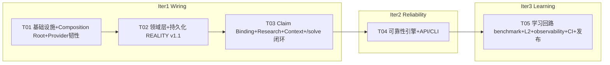

# TASK_BREAKDOWN_NEXT — Vencertia Adaptive Decision System v1.1（工程师施工图）

> 版本：1.1（增量）
> 阅读顺序：先读 `docs/v1.1-design.md`（架构）+ `docs/architecture-decisions-next.md`（ADR-008~012），再按本文件任务顺序实现。
> 任务总量：**5 个任务（T01–T05）**（硬上限），按层次分组（不按单文件拆分）。任务粒度原则：每个任务 3–6 个核心新文件；REALITY 层（T02）作为一个整体单元（沿用 v1.0 T02 先例）。
> 迭代节奏：**3 轮工程迭代** ——
> - **Iter1 Wiring**（T01→T02→T03）：装配根 + 领域 + Claim Binding/Research/Context + /solve 闭环
> - **Iter2 Reliability**（T04）：dedup + conflict + stopping + belief trace + decision sensitivity + experiment/prediction 加固 + API/CLI 增强
> - **Iter3 Learning**（T05）：benchmark L0/L1/L2 + OSS admission + calibration + observability + CI/ruff + 文档 + 发布
>
> 依赖最小化：运行时第三方依赖**零新增**；`ruff` 仅 dev/CI。

---

## 任务总览

| ID | 任务 | 迭代 | 依赖 | 优先级 |
|---|---|---|---|---|
| T01 | 项目基础设施 + Provider Composition Root + Provider 韧性 | Iter1 | — | P0 |
| T02 | 领域层扩展 + 持久化（REALITY v1.1） | Iter1 | T01 | P0 |
| T03 | Claim Binding + Research Pipeline + Context + /solve 闭环 | Iter1 | T02 | P0 |
| T04 | 可靠性引擎：dedup/conflict/stopping/belief trace/sensitivity + API/CLI | Iter2 | T03 | P0 |
| T05 | 学习回路：benchmark L0/L1/L2 + OSS admission + calibration + observability + CI/ruff + 文档 + 发布 | Iter3 | T04 | P1 |

---

## T01 — 项目基础设施 + Provider Composition Root + Provider 韧性（Iter1）

**依赖**：无

### 文件

| 文件 | 职责 |
|---|---|
| `Makefile` | `PYTHON ?= python3`（修复硬编码绝对路径）；新增 `lint`（ruff check）、`ci`（lint→test→benchmark→api-smoke→cli-smoke） |
| `.gitignore` | 追加 `*.db`、`*.zip`、`coverage/`、`.coverage`、`htmlcov/`、`data/benchmarks/output/` |
| `pyproject.toml` | version `1.1.0`；dev extra 增 `ruff>=0.5`；`[tool.ruff]` line-length=100 / target-version="py311" |
| `.github/workflows/ci.yml` | install → ruff check → pytest → benchmark L0 → API smoke（GET /health）→ CLI smoke（`vencertia --help`） |
| `src/vencertia/config.py` | 新增 Settings 字段（research_*/binding_*/dedup/freshness/sensitivity/context_rank_weights/provider_max_retries/call_log_enabled/semantic_rank_provider）；`policy_version="1.1"` |
| `src/vencertia/providers/factory.py` | **新增**：`ProviderBundle`、`create_model_provider/search/retrieval/bundle`、`register_model_provider`、`with_resilience()`（timeout/rate limit/invalid JSON/schema mismatch/unavailable/empty/partial → 重试 → 结构化错误） |
| `src/vencertia/container.py` | **新增**：`ApplicationContainer`（Settings→Repository→Providers→Engines→Orchestrator→FastAPI/typer）；`build_container()` |
| `src/vencertia/events/types.py` | 新增事件枚举：`RESEARCH_PLANNED/RESEARCH_STARTED/RESEARCH_COMPLETED/RESEARCH_EXHAUSTED/EVIDENCE_BOUND_TO_CLAIM/EVIDENCE_BINDING_REJECTED/DECISION_SENSITIVITY_COMPUTED/PROVIDER_SELECTED/PREDICTION_CORRECTED` |
| `src/vencertia/providers/openai_compatible.py` | 超时/HTTP/JSON/schema 错误映射为可识别异常类型；支持 `ProviderCallRecord` 所需的 request_id |
| `src/vencertia/providers/mock.py` | provider name 规范化；为后续 extract/match/research_plan 预留确定性模板挂点（完整模板在 T03） |
| `src/vencertia/api.py` | **接线改造**：`create_app` 改为从 `ApplicationContainer` 取 runtime/repo/settings（T05 再加新端点）；删除 `default_runtime` 硬编码 |
| `src/vencertia/cli.py` | **接线改造**：`_default_runtime` 改为 `build_container()` |

### 关键接口签名

```python
# providers/factory.py
class ProviderBundle(VencertiaBaseModel):
    model: ModelProvider
    search: SearchProvider | None = None
    retrieval: RetrievalProvider | None = None

def create_model_provider(settings: Settings) -> ModelProvider: ...
def create_search_provider(settings: Settings) -> SearchProvider | None: ...
def create_retrieval_provider(settings: Settings) -> RetrievalProvider | None: ...
def create_provider_bundle(settings: Settings) -> ProviderBundle: ...
def register_model_provider(name: str, factory: Callable[[Settings], ModelProvider]) -> None: ...
def with_resilience(provider: Any, settings: Settings) -> Any: ...   # 包装重试/错误映射

# container.py
class ApplicationContainer:
    def __init__(self, settings: Settings | None = None): ...
    @property
    def settings(self) -> Settings: ...
    @property
    def repository(self) -> Repository: ...
    @property
    def providers(self) -> ProviderBundle: ...
    @property
    def bus(self) -> EventBus: ...
    @property
    def engines(self) -> EngineBundle: ...
    @property
    def orchestrator(self) -> SolveOrchestrator: ...
    def fastapi_app(self) -> FastAPI: ...
    def typer_app(self) -> typer.Typer: ...

def build_container(settings: Settings | None = None) -> ApplicationContainer: ...

# events/types.py（新增枚举成员）
RESEARCH_PLANNED = "RESEARCH_PLANNED"
RESEARCH_STARTED = "RESEARCH_STARTED"
RESEARCH_COMPLETED = "RESEARCH_COMPLETED"
RESEARCH_EXHAUSTED = "RESEARCH_EXHAUSTED"
EVIDENCE_BOUND_TO_CLAIM = "EVIDENCE_BOUND_TO_CLAIM"
EVIDENCE_BINDING_REJECTED = "EVIDENCE_BINDING_REJECTED"
DECISION_SENSITIVITY_COMPUTED = "DECISION_SENSITIVITY_COMPUTED"
PROVIDER_SELECTED = "PROVIDER_SELECTED"
PREDICTION_CORRECTED = "PREDICTION_CORRECTED"
```

### 验收要点

- `make lint` 通过（ruff 0 error）；`make ci` 全绿。
- `MODEL_PROVIDER=mock` 与 `MODEL_PROVIDER=openai_compatible` 均能通过 `build_container()` 构建（后者无 key 时仍可构建，调用失败走结构化错误）。
- API/CLI 不再各自 new MockProvider（grep 确认 `MockProvider()` 只在 factory/mock 内部出现）。
- provider 失败测试：mock 一个 Timeout/InvalidJSON 的假 provider，`with_resilience` 重试后返回结构化错误，不抛裸异常。

---

## T02 — 领域层扩展 + 持久化（REALITY v1.1）（Iter1）

**依赖**：T01

### 文件

| 文件 | 职责 |
|---|---|
| `src/vencertia/domain/binding.py` | **新增**：`BindingMethod/BindingStatus/EvidenceClaimBinding/CandidateClaim/ClaimMatchResult/ClaimBindingInput/ClaimBindingOutput` |
| `src/vencertia/domain/research.py` | **新增**：`ResearchQuestion/ResearchPlan/ResearchTrace/ResearchStopReport` |
| `src/vencertia/domain/belief_update.py` | **新增**：`BeliefUpdateRecord` |
| `src/vencertia/domain/evidence_conflict.py` | **新增**：`ConflictType/EvidenceConflict` |
| `src/vencertia/domain/decision_trace.py` | **新增**：`BeliefContribution/DecisionTrace/FlipThreshold/DecisionSensitivity` |
| `src/vencertia/domain/observability.py` | **新增**：`ProviderCallRecord` |
| `src/vencertia/domain/evidence.py` | 扩展：`published_at/valid_from/valid_until/freshness_score/content_fingerprint/canonical_source_id/source_family/similarity_group`（全部可选） |
| `src/vencertia/domain/belief.py` | 扩展：`posterior_version/previous_snapshot/last_evidence_batch_id/policy_version` |
| `src/vencertia/domain/experiment.py` | 扩展：`executability/founder_constraints/sample_quality/ambiguity_clarity/measurement_reliability` |
| `src/vencertia/domain/prediction.py` | 扩展：`resolution_source` |
| `src/vencertia/domain/calibration.py` | 扩展：`CalibratedConfidence` |
| `src/vencertia/domain/__init__.py` | 导出全部新对象/枚举 |
| `src/vencertia/repositories/base.py` | `Repository` 协议 + `ENTITY_TYPES` 增补（candidate_claim/research_plan/research_trace/decision_sensitivity/decision_trace/evidence_conflict/call_record）；新方法见 §7 |
| `src/vencertia/repositories/sqlite.py` | `claim_bindings`、`belief_update_records` 专表 + 新方法实现 |
| `src/vencertia/repositories/postgres.py` / `memory.py` | 新方法实现（generic/内存） |
| `src/vencertia/repositories/migrations/0003_v1_1.sql` | **新增**：幂等建表 `claim_bindings`、`belief_update_records` |

### 关键接口签名

```python
# repositories/base.py 新增（EntityStoreMixin 提供 generic 默认实现）
def save_binding(self, b: EvidenceClaimBinding, expected_version: int | None = None) -> None: ...
def get_binding(self, binding_id: str) -> EvidenceClaimBinding | None: ...
def list_bindings(self, evidence_id: str | None = None, claim_id: str | None = None,
                  status: str | None = None) -> list[EvidenceClaimBinding]: ...
def save_candidate_claim(self, c: CandidateClaim, expected_version: int | None = None) -> None: ...
def list_candidate_claims(self, validation_status: str | None = None) -> list[CandidateClaim]: ...
def save_belief_update_record(self, r: BeliefUpdateRecord) -> None: ...
def list_belief_update_records(self, belief_id: str) -> list[BeliefUpdateRecord]: ...
def save_research_plan(self, p: ResearchPlan) -> None: ...
def get_research_plan(self, plan_id: str) -> ResearchPlan | None: ...
def list_research_plans(self, decision_id: str) -> list[ResearchPlan]: ...
def save_research_trace(self, t: ResearchTrace) -> None: ...
def list_research_traces(self, decision_id: str) -> list[ResearchTrace]: ...
def save_decision_trace(self, t: DecisionTrace) -> None: ...
def get_decision_trace(self, decision_id: str) -> DecisionTrace | None: ...
def save_decision_sensitivity(self, s: DecisionSensitivity, expected_version: int | None = None) -> None: ...
def get_decision_sensitivity(self, decision_id: str) -> DecisionSensitivity | None: ...
def save_evidence_conflict(self, c: EvidenceConflict, expected_version: int | None = None) -> None: ...
def list_evidence_conflicts(self, claim_id: str | None = None) -> list[EvidenceConflict]: ...
def save_call_record(self, r: ProviderCallRecord) -> None: ...
def list_call_records(self, kind: str | None = None, since: datetime | None = None) -> list[ProviderCallRecord]: ...
```

### 验收要点

- 全部新对象 pydantic 契约单测通过（`extra="forbid"` 生效；枚举值）。
- SQLite/Postgres/Memory 三后端 `list_bindings(evidence_id=...)` 与 `list_belief_update_records(belief_id=...)` 一致。
- 乐观锁：`save_binding(..., expected_version=stale)` 抛 `StaleWriteError`。
- v1.0 领域测试全部仍通过（扩展字段默认值向后兼容）。

---

## T03 — Claim Binding + Research Pipeline + Context + /solve 闭环（Iter1）

**依赖**：T02

### 文件

| 文件 | 职责 |
|---|---|
| `src/vencertia/runtime/claim_binding.py` | **新增**：`ClaimExtractor/DeterministicClaimMatcher/SemanticClaimMatcher(Protocol)/EvidenceClaimLinker/ClaimBindingEngine` |
| `src/vencertia/runtime/context_ranker.py` | **新增**：`ContextBundleV11/ContextRanker/SemanticRanker(Protocol)/DecisionRelevantContextBuilder` |
| `src/vencertia/runtime/research_planner.py` | **新增**：`ResearchPlanner` |
| `src/vencertia/runtime/research_stop.py` | **新增**：`ResearchStopRule`（最小实现：belief_delta + duplicate_rate + source_quality 判定） |
| `src/vencertia/capabilities/research.py` | 升级为 ResearchRun：ResearchPlanner → Search → candidate evidence（带 call record + fingerprint） |
| `src/vencertia/capabilities/__init__.py` | `DecisionCompiler.compile` 接收 ContextBundleV11 |
| `src/vencertia/providers/search.py` | `SearchAdapter` 输出补充 `canonical_source_id/source_family/content_fingerprint`；call record |
| `src/vencertia/runtime/evidence_policy.py` | freshness 折扣进 `effective_weight`；`EvidenceGrade.freshness_discount`；绑定级 scope 门 |
| `src/vencertia/runtime/belief_engine.py` | 生成并持久化 `BeliefUpdateRecord`；`posterior_version++`；`previous_snapshot`；`last_evidence_batch_id` |
| `src/vencertia/runtime/runtime.py` | solve 闭环重构（§6.1 图）：Context→Compile→Critical→Plan→Run→Dedup→Bind→Policy→Belief→Stop→Converge→Decision→Sensitivity→Experiment→Prediction→Persist；删除空绑定 `_research` |

### 关键接口签名

```python
# runtime/claim_binding.py
class ClaimExtractor:
    def __init__(self, model: ModelProvider | None = None, settings: Settings | None = None): ...
    def extract(self, result: dict, context: ContextBundle) -> list[CandidateClaim]: ...

class DeterministicClaimMatcher:
    def normalize(self, text: str) -> str: ...
    def match(self, candidate: CandidateClaim, existing: list[Claim],
              semantic: SemanticClaimMatcher | None = None) -> ClaimMatchResult: ...

class EvidenceClaimLinker:
    def link(self, evidence: Evidence, result: ClaimMatchResult,
             threshold: float) -> list[EvidenceClaimBinding]: ...

class ClaimBindingEngine:
    def __init__(self, extractor: ClaimExtractor, matcher: DeterministicClaimMatcher,
                 linker: EvidenceClaimLinker, policy: EvidencePolicy,
                 repo: Repository, bus: EventBus | None = None): ...
    def process(self, inp: ClaimBindingInput) -> ClaimBindingOutput: ...

# runtime/context_ranker.py
class ContextRanker:
    def score_evidence(self, e: Evidence, decision: Decision | None, beliefs: list[Belief]) -> float: ...
class DecisionRelevantContextBuilder(ContextBuilder):
    def build_for_decision(self, project_id: str, decision: Decision | None = None,
                           user_id: str | None = None, limit: int = 15) -> ContextBundleV11: ...

# runtime/research_planner.py
class ResearchPlanner:
    def plan(self, decision: Decision, beliefs: list[Belief],
             criticals: list[CriticalUncertainty], context: ContextBundleV11) -> ResearchPlan: ...

# runtime/research_stop.py
class ResearchStopRule:
    def evaluate(self, traces: list[ResearchTrace], beliefs_before: list[Belief],
                 beliefs_after: list[Belief], target_claims: list[str],
                 decision: Decision | None = None, round_no: int = 1) -> ResearchStopReport: ...

# runtime/runtime.py
class SolveResultV11(SolveResult):
    confidence_calibrated: CalibratedConfidence | None = None
    why: DecisionTrace | None = None
    belief_snapshot: list[dict] = []
    what_could_change_my_mind: list[str] = []
    robustness: str | None = None
    research_performed: list[ResearchTrace] = []
    evidence_used: list[str] = []
    evidence_rejected: list[dict] = []
    success_criteria: str | None = None
    failure_criteria: str | None = None
    stop_condition: str | None = None
```

### 验收要点

- **绑定四态**：existing match（绑到既有 claim）、multiple match（1 evidence 绑 ≥2 claim）、no match（`UNBOUND_EVIDENCE` 显式入库，事件 `EVIDENCE_BINDING_REJECTED`）、candidate claim 不绕过 deterministic validation。
- **solve 闭环**：mock 场景下 `EvidenceClaimBinding` 数量 > 0；`research_performed` 非空；`evidence_used` 与 belief 的 `supporting/contradicting_evidence_ids` 一致；`belief_snapshot` 含 `posterior_version`。
- **Context**：`build_for_decision` 返回 15 类组合；决定相关性排序中"决策不相关的强证据"排名低于"决策相关的中等证据"（构造对照用例）。
- **BeliefUpdateRecord**：每次 belief 更新落一条记录，含 old/new probability、freshness_discount、effective_weight。
- v1.0 测试全绿（solve 相关测试如 `test_solve_abstain_with_experiment` 不回归）。

---

## T04 — 可靠性引擎：dedup/conflict/stopping/belief trace/sensitivity + API/CLI 增强（Iter2）

**依赖**：T03

### 文件

| 文件 | 职责 |
|---|---|
| `src/vencertia/runtime/evidence_dedup.py` | **新增**：`EvidenceDedupEngine/DedupGroup/DedupResult`（fingerprint/canonical source/source family/independence/similarity） |
| `src/vencertia/runtime/conflict_engine.py` | **新增**：`ConflictEngine`（detect + apply_to_belief uncertainty raise） |
| `src/vencertia/runtime/decision_sensitivity.py` | **新增**：`DecisionSensitivityEngine`（翻转阈值 + STRONG/FRAGILE） |
| `src/vencertia/runtime/confidence_calibrator.py` | **新增**：`ConfidenceCalibrator`（raw→calibrated；样本不足 UNCALIBRATED） |
| `src/vencertia/runtime/experiment_optimizer.py` | criteria 强制校验（success/failure/ambiguity 非空 + 拒绝 vague action）；评分乘 executability×measurement_reliability + sample/ambiguity 惩罚 |
| `src/vencertia/runtime/prediction_ledger.py` | immutable resolve（仅增 resolution/outcome/resolved_at/resolution_source）+ `correct()` 新版本 + `PREDICTION_CORRECTED` 事件 |
| `src/vencertia/runtime/convergence_engine.py` | SEARCH_EXHAUSTED 判定注入 ResearchStop 信号 |
| `src/vencertia/runtime/calibration_engine.py` | `calibrate(raw, group)` → `CalibratedConfidence` |
| `src/vencertia/runtime/decision_engine.py` | `build_trace()` → `DecisionTrace` |
| `src/vencertia/api.py` | 新端点：`/v1/research/plan`、`/v1/research/run`、`/v1/evidence/bind`、`/v1/evidence/{id}/bindings`、`/v1/decisions/{id}/sensitivity`、`/v1/decisions/{id}/trace`、`/v1/beliefs/{id}/history`、`/v1/research/{decision_id}/trace`；solve 返回 v1.1 |
| `src/vencertia/cli.py` | 新命令：`research plan/run`、`evidence bind`、`decision sensitivity/trace`、`belief history` |

### 关键接口签名

```python
# runtime/evidence_dedup.py
class EvidenceDedupEngine:
    def fingerprint(self, evidence: Evidence) -> str: ...
    def canonical_source(self, evidence: Evidence) -> str: ...
    def source_family(self, evidence: Evidence) -> str: ...
    def group(self, evidence_list: list[Evidence]) -> DedupResult: ...

# runtime/conflict_engine.py
class ConflictEngine:
    def detect(self, evidence_by_claim: dict[str, list[Evidence]], threshold: float = 0.3) -> list[EvidenceConflict]: ...
    def apply_to_belief(self, belief: Belief, conflict: EvidenceConflict) -> Belief: ...

# runtime/decision_sensitivity.py
class DecisionSensitivityEngine:
    def compute(self, decision: Decision, beliefs: list[Belief],
                decision_result: DecisionResult) -> DecisionSensitivity: ...

# runtime/confidence_calibrator.py
class ConfidenceCalibrator:
    def __init__(self, calibration_engine: CalibrationEngine, min_samples: int = 20): ...
    def calibrate(self, raw: float, calibration_group: str = "default") -> CalibratedConfidence: ...

# runtime/experiment_optimizer.py
class ExperimentValidationResult(VencertiaBaseModel):
    valid: bool
    reasons: list[str]
def validate_experiment(exp: Experiment) -> ExperimentValidationResult: ...   # criteria 强制 + vague 拒绝

# runtime/prediction_ledger.py
def resolve(self, entry_id: str, outcome: bool, resolution_source: str | None = None) -> PredictionEntry: ...
def correct(self, entry_id: str, new_outcome: bool, source: str) -> PredictionEntry: ...  # 新版本 + audit
```

### 验收要点

- **dedup**：同一文本 10 条 → 1 条 canonical + 9 dropped（不持久化）；同 source family 相似文本 → 共享 independence_group，Belief 折减生效。
- **conflict**：支持/反驳权重均超阈值 → `EvidenceConflict(severity>0)`，belief.uncertainty 上升，`BeliefUpdateRecord.conflict_uncertainty_raise>0`。
- **sensitivity**：WTP 0.42 场景输出 `<0.28→HOLD`、`>0.61→GO` 型翻转；margin 小或无翻转近邻 → `FRAGILE_DECISION`。
- **experiment**：vague action（"再做些访谈"）被拒；缺 criteria 被拒。
- **prediction**：resolve 后 `predicted_probability` 不变；`correct()` 产生新版本 + `PREDICTION_CORRECTED` 事件。
- **API**：8 个新端点 smoke 通过；`/v1/solve` 返回标准输出段（DECISION…STOP CONDITION）。
- **calibration**：样本 < min_samples → `UNCALIBRATED`，calibrated=None。

---

## T05 — 学习回路：benchmark + OSS admission + calibration + observability + CI/ruff + 文档 + 发布（Iter3）

**依赖**：T04

### 文件

| 文件 | 职责 |
|---|---|
| `src/vencertia/benchmark/metrics.py` | 新指标：`compute_claim_binding_accuracy/compute_research_efficiency/compute_evidence_yield/compute_belief_delta_quality/compute_decision_change_precision`；N/A 语义（缺失数据 None） |
| `src/vencertia/benchmark/harness.py` | `BenchmarkReport` 支持 N/A；`oss_admission_experiment(baseline, candidate)` |
| `src/vencertia/benchmark/oss_admission.py` | **新增**：`OSSAdmissionExperiment` runner（frozen cases 双跑 → delta → ADMITTED/REJECTED） |
| `src/vencertia/benchmark/l0.py` | 新增能力用例：claim binding / unbound / multiple binding / research stop / provider factory / context injection / dedup / contradiction / sensitivity / calibration correction |
| `src/vencertia/benchmark/l1.py` | 新指标接入 L1 报告 |
| `src/vencertia/benchmark/l2.py` | **新增**：`L2Runner`（prospective 登记 + 到期结算骨架） |
| `data/benchmarks/l2/` | **新增**：`predictions.jsonl` schema 说明 + 样例；README |
| `src/vencertia/runtime/observability.py` | **新增**：`CallRecorder`（provider/model/request_id/latency/tokens/cost/success/retry；不记 prompt） |
| `src/vencertia/runtime/calibration_engine.py` | `calibrate()` 集成到 solve/API |
| `src/vencertia/runtime/runtime.py` | solve 输出接 `CalibratedConfidence` + `CallRecorder` |
| `tests/`（新增 9 个测试文件） | `test_claim_binding/test_research/test_research_stop/test_dedup/test_conflict/test_sensitivity/test_container/test_observability/test_l2` + 既有测试回归 |
| `docs/v1.1-design.md` / `docs/architecture-decisions-next.md` / `TASK_BREAKDOWN_NEXT.md` / `docs/v1.1-class-diagram.mermaid` / `docs/v1.1-sequence-diagram.mermaid` | 文档族 |
| 文档合并（§8.4） | 删除重复大写文档，保留小写连字符 canonical，更新引用 |
| `DELIVERY_REPORT.md` / `README.md` | v1.1 交付说明更新 |

### 关键接口签名

```python
# benchmark/metrics.py（新增；缺失数据返回 None）
def compute_claim_binding_accuracy(hits: int, predicted: int, relevant: int) -> dict | None: ...
def compute_research_efficiency(queries: list[int], evidence: list[int], time: list[float]) -> dict | None: ...
def compute_evidence_yield(new_evidence: int, retrieved: int) -> float | None: ...
def compute_belief_delta_quality(deltas: list[float], gold_deltas: list[float]) -> dict | None: ...
def compute_decision_change_precision(flips_predicted: list[bool], flips_actual: list[bool]) -> float | None: ...

# benchmark/harness.py
def oss_admission_experiment(baseline: BenchmarkReport, candidate: BenchmarkReport,
                             frozen_cases: list[str]) -> dict: ...
    # → {"baseline": {...}, "candidate": {...}, "delta": {...}, "admission": "CANDIDATE_ADMITTED|CANDIDATE_REJECTED",
    #    "frozen_case_count": n, "notes": [...]}

# runtime/observability.py
class CallRecorder:
    def __init__(self, repo: Repository, enabled: bool = True): ...
    def wrap(self, fn: Callable, kind: str, provider: str, model: str,
             task_kind: str) -> Callable: ...   # 记录 ProviderCallRecord，不记录 prompt

# benchmark/l2.py
class L2Runner:
    def register(self, entry: PredictionEntry) -> PredictionEntry: ...
    def settle(self, entry_id: str, outcome: bool, source: str) -> PredictionEntry: ...
    def due_report(self, as_of: datetime | None = None) -> list[PredictionEntry]: ...
```

### 验收要点

- L0 新增用例全绿（含新旧 24+ 例不回归）；L1 新指标输出含 `claim_binding_accuracy` 等（无数据 → N/A 不伪造）。
- `oss_admission_experiment`：baseline==candidate 冻结用例 → `CANDIDATE_ADMITTED`；故意劣化 → `CANDIDATE_REJECTED`。
- L2 可登记、可列出到期、可结算（人工 outcome），schema 落 `data/benchmarks/l2/`。
- `CallRecorder` 记录不包含 prompt 文本（测试断言敏感字段不存在）。
- `make ci` 全绿：install→ruff→pytest→benchmark L0→API smoke→CLI smoke。
- 重复文档已合并；`docs/architecture-decisions-next.md` 含 5 个 ADR。

---

## Shared Knowledge（跨任务约定）

- **统一响应**：API 响应恒为 `{code: 0, data, message}`；域错误 EntityNotFound→404、StaleWrite→409、ValueError→400。
- **状态变更唯一入口**：所有持久化经 Repository（乐观锁 expected_version）；capability 永远只产出 Candidate。
- **Candidate → Validation → 持久化**：任何外部智能输出（含 LLM/搜索/研究）必须先过确定性校验（ClaimBindingEngine / EvidencePolicy / ExperimentOptimizer.validate），失败不得污染 canonical 状态。
- **Evidence 不可变**：修正用 SUPERSEDE/新版本，不覆盖。
- **Belief 是派生状态**：每次更新必须生成 `BeliefUpdateRecord` 并 `posterior_version+=1`。
- **UNBOUND_EVIDENCE 是显式状态**：不偷偷绑定；允许重处理（`retry_count`）。
- **时间格式**：全部 `datetime`（UTC）；金额 float。
- **新对象 ID 前缀**：EB_/CC_/BUR_/RQ_/RP_/RT_/ECF_/DT_/DS_/PCR_。
- **事件**：Event Log 仅审计/replay，不做 Event Sourcing；新事件枚举一次到位（T01）。
- **可观测性红线**：`ProviderCallRecord` 不得含 prompt/敏感内容。
- **文档**：canonical 为小写连字符命名（`domain-model.md` 等）；本版本新增 `v1.1-*`。

---

## 任务依赖图


