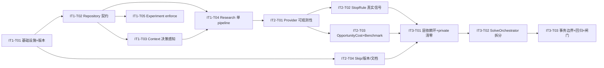

# TASK_BREAKDOWN_V1_1_2.md — Runtime Integrity Hardening 施工图

> 上游：`docs/v1.1.2-design.md`（审计 + 设计）· 基线：3bf22c8（390 passed / 1 skipped，L0 36/36，L1 6/6，Binding P1.0/R0.96/F1 0.9796）
> 执行顺序：Iter1（全部 P0）→ Iter2（P1）→ Iter3（P2 + 全量回归 + 发布闸门）
> 约束：SolveResult/API/CLI 向后兼容；新增依赖零；每个 P0 必须有验收测试。

---

## Iter 1 — 全部 P0（Runtime Integrity 语义断点修复）

### IT1-T01 项目基础设施与版本单一来源（P1-12 前置，含在 Iter1 底部收口）

| 项 | 内容 |
|---|---|
| 目标 | v1.1.2 版本单一来源 + 证据归属模型字段 |
| 文件 | `pyproject.toml`、`src/vencertia/__init__.py`、`src/vencertia/domain/evidence.py`、`src/vencertia/config.py`、`.env.example` |
| 接口 | `__version__="1.1.2"`、`__api_contract_version__="1.1"`；`Evidence.project_id: str\|None=None`、`Evidence.company_id: str\|None=None`；`Settings.opportunity_cost_enabled=False` |
| 验收 | `test_version_single_source`：pyproject/importlib.metadata/`__version__` 三值一致；Evidence 新旧 JSON 兼容（缺字段默认为 None） |
| 依赖 | 无 |

### IT1-T02 Repository 契约扩展（P0-3/P0-4/P2-17 地基）

| 项 | 内容 |
|---|---|
| 目标 | 证据隔离读/写边界 + action/outcome 公开查询 + 事务深度 |
| 文件 | `src/vencertia/repositories/base.py`、`src/vencertia/repositories/sqlite.py`、`src/vencertia/repositories/memory.py`、`src/vencertia/repositories/postgres.py` |
| 接口 | `list_evidence(claim_ids=None, project_id=None, include_shared=True)`；`add_evidence(evidence, *, allow_missing_project=False)`（PROJECT/CUSTOMER 无 project_id → ValueError）；`list_actions(project_id=None, decision_id=None, experiment_id=None)`；`list_outcomes(project_id=None, action_id=None)`；`in_transaction` 深度计数（`_store` 在 txn 内不提前 commit） |
| 验收 | `project_A_private_evidence_not_visible_to_project_B`；`repository_public_action_outcome_queries`（InMemory+SQLite parity）；`sqlite_store_does_not_commit_inside_txn` |
| 依赖 | IT1-T01（Evidence.project_id 字段） |

### IT1-T03 Context 决策感知 + ID namespace 修复（P0-1/P0-2）

| 项 | 内容 |
|---|---|
| 目标 | post-compile context 拿到当前 decision；decision_relevance 走真实 belief→claim 映射 |
| 文件 | `src/vencertia/runtime/runtime.py`（`_build_context(project, request, decision=None)`，solve :280 传 `compiled.decision`）、`src/vencertia/runtime/context_ranker.py`（`_decision_relevance(evidence, decision, claim_by_belief)` 删除字符串猜测）、`src/vencertia/runtime/context.py`、`tests/test_context.py` 等 fixture 补 project_id |
| 接口 | `ContextRanker.score_evidence(evidence, decision, beliefs, claim_by_belief=None)`；`DecisionRelevantContextBuilder.build_for_decision(..., decision=...)` |
| 验收 | `post_compile_context_uses_current_decision`；`relevant_evidence_outranks_unrelated_evidence_via_belief_mapping`；L0 `_cap_context_injection` 回归 |
| 依赖 | IT1-T02（list_evidence project 过滤供 context 使用） |

### IT1-T04 Research 单一 pipeline（P0-5）——新建 ResearchExecutionService

| 项 | 内容 |
|---|---|
| 目标 | solve / `/v1/research/run` / CLI `research run` 三路共享同一实现，不再丢弃 candidate evidence |
| 文件 | **新增** `src/vencertia/runtime/research_service.py`（ResearchExecutionResult + ResearchExecutionService）；改 `src/vencertia/runtime/runtime.py`（solve 研究循环委托）、`src/vencertia/api.py`（/v1/research/run）、`src/vencertia/cli.py`（research run）、`src/vencertia/runtime/__init__.py` |
| 接口 | `ResearchExecutionResult{plan_id, decision_id, traces, candidate_evidence, applied_evidence, rejected_evidence, bindings, belief_updates, conflicts, stop_report}`；`ResearchExecutionService.run_plan(decision_id, question_ids=None, max_queries=None)`；`run_solve_round(request, project, decision, plan, round_no)` |
| 验收 | `research_api_changes_belief_when_valid_evidence_arrives`；`research_cli_uses_same_pipeline`；`research_provider_failure_creates_no_fake_evidence`；solve 行为与基线一致（SolveResult schema 不变） |
| 依赖 | IT1-T02（applied 证据 project_id 回填）、IT1-T03（context 感知） |

### IT1-T05 Experiment validation 全链路 enforce（P0-6）

| 项 | 内容 |
|---|---|
| 目标 | 所有入口（solve/API/CLI/provider 输出/default）过同一 `validate_experiment` |
| 文件 | `src/vencertia/runtime/experiment_optimizer.py`（propose 内 enforce，输出 `rejected`）、`src/vencertia/runtime/runtime.py`（:493 分支 + default 校验 + rejected 进 trace）、`src/vencertia/api.py`（/v1/experiments/propose 响应带 rejected）、`src/vencertia/cli.py` |
| 接口 | `ExperimentProposalOutput` 增加 `rejected: list[dict]`（additive） |
| 验收 | `solve_never_persists_invalid_experiment`；`provider_generated_vague_experiment_is_rejected`；`default_experiment_passes_validator`；`test_experiment_optimizer.py` 现有 6 用例回归 |
| 依赖 | IT1-T02（save_experiment 不受影响，但 solve 落库路径校验顺序依赖 T02 事务语义） |

**Iter1 完成标准**：6 个 P0 验收测试全绿；全量 pytest 0 failed（预期仍 1 skipped 待 Iter2 修复）；L0 36/36 不降；L1 6/6 不退化；Evidence isolation 手测通过（Release Gate E）。

---

## Iter 2 — 全部 P1

### IT2-T01 Provider 可观测性接线（P1-7）

| 项 | 内容 |
|---|---|
| 目标 | CallRecorder 包裹 model/search/retrieval provider calls（与 `_Resilient*` 组合） |
| 文件 | `src/vencertia/runtime/observability.py`（record 支持 retry_count/tokens/cost）、`src/vencertia/providers/factory.py`（`create_provider_bundle(settings, recorder=None)` + `_Resilient*Provider(recorder=None)`）、`src/vencertia/container.py`（providers 属性传 recorder） |
| 接口 | `create_provider_bundle(settings, recorder=None)`；`CallRecorder.record(..., retry_count=0, tokens=None, cost=0.0)` |
| 验收 | `solve_records_model_call`；`research_records_search_calls`；`failed_provider_call_is_recorded`；ProviderCallRecord 无 prompt/敏感字段（红线测试） |
| 依赖 | Iter1 全部（research 单 pipeline 已接好） |

### IT2-T02 ResearchStopRule 真实信号（P1-8）

| 项 | 内容 |
|---|---|
| 目标 | source_quality/claim_coverage/belief_delta/decision_sensitivity_signal/cost 全部真实化 |
| 文件 | `src/vencertia/runtime/research_stop.py`（RoundSummary + 新信号计算）、`src/vencertia/runtime/runtime.py`（solve 传 round_summary）、`src/vencertia/runtime/research_service.py`（构造 RoundSummary） |
| 接口 | `ResearchStopRule.evaluate(..., round_summary: RoundSummary | None = None)`；signals 键：`belief_delta`（target-only）、`source_quality`（真实 authority 均值）、`claim_coverage`（claim-based）、`decision_sensitivity_signal`（新）、`decision_change_prob`（deprecated alias） |
| 验收 | 5 个新测试（见设计 7.8）+ 现有 qa_v11 research_stop 3 断言回归 |
| 依赖 | IT2-T01（provider 记录提供真实 latency）、IT1-T04（RoundSummary 数据源） |

### IT2-T03 OpportunityCost 裁决落定（P1-9）+ Benchmark 语义（P1-10）

| 项 | 内容 |
|---|---|
| 目标 | Option B（Deferred）落地 + L0/L1 指标口径修正 |
| 文件 | `src/vencertia/runtime/runtime.py`（opt-in 更新 hook）、`src/vencertia/benchmark/metrics.py`、`src/vencertia/benchmark/harness.py`、`src/vencertia/benchmark/l0.py`、`src/vencertia/benchmark/l1.py` |
| 接口 | metrics 新键 `policy_regression_pass_rate`/`decision_option_accuracy`/`decision_status_accuracy`；`BenchmarkCaseResult.chosen_utility/best_utility: float|None=None`；`compute_decision_regret` 无数据 → None |
| 验收 | `opportunity_cost_opt_in_updates_options_only_when_enabled`（默认 False 零变化）；`decision_accuracy_splits_gold_option_cases`；`l1_regret_is_none_without_utility_labels`；L0/L1 全量回归不降 |
| 依赖 | Iter1 全部 |

### IT2-T04 Skip 修复 + 版本接线 + 文档事实修复（P1-11/P1-12/P1-13）

| 项 | 内容 |
|---|---|
| 目标 | 0 skipped（确定性 fixture）；版本单一来源接线到 API/health/demo/.env；PG 门控错误文档修正 |
| 文件 | `tests/test_api_v11.py`、`src/vencertia/api.py`、`src/vencertia/cli.py`、`examples/demo_b2b_saas_mvp.py`、`.env.example`、`docs/baseline-v1-1-rc.md`、`docs/operations.md`、`docs/iteration-v1-1-rc-3.md`、`docs/implementation-report-v1-1-rc.md` |
| 接口 | health 返回 `runtime_version`/`api_contract_version` + legacy 键派生；FastAPI version=__version__ |
| 验收 | `test_candidate_validate_endpoint` 确定性通过（无 skip）；`test_version_single_source`；health 键值正确；`rg "PG 门控" docs` 仅剩历史快照标注 |
| 依赖 | Iter1-T01（版本常量） |

**Iter2 完成标准**：全量 pytest **0 skipped**（除非真实环境 gated 且文档准确解释）；P1 验收全绿；CallRecorder 记录真实 solve 记录可查。

---

## Iter 3 — P2 拆分 + 回归收口

### IT3-T01 层依赖环修复 + Repository private 清零（P2-15/P2-14）

| 项 | 内容 |
|---|---|
| 目标 | capabilities→domain.context；`repo._` 零调用 |
| 文件 | **新增** `src/vencertia/domain/context.py`；改 `src/vencertia/runtime/context.py`、`src/vencertia/runtime/context_ranker.py`、`src/vencertia/capabilities/*.py`（base/research/market/gtm/financial/founder_diagnosis/challenger/company_intelligence） |
| 接口 | `from vencertia.domain.context import ContextBundle, ContextBundleV11` |
| 验收 | `rg 'from vencertia.runtime.context' src/vencertia/capabilities` 0 命中；`rg 'repo\._|self\.repo\._' src/vencertia` 仅 backend 内部 `_list_all` 等；全量 pytest 回归 |
| 依赖 | Iter2 全部 |

### IT3-T02 SolveOrchestrator 拆分（P2-16）

| 项 | 内容 |
|---|---|
| 目标 | facade 保留；4 个服务提取（Compilation/ResearchExecution/DecisionEvaluation/OutcomeSettlement） |
| 文件 | **新增** `src/vencertia/runtime/compilation_service.py`、`src/vencertia/runtime/decision_evaluation_service.py`、`src/vencertia/runtime/outcome_settlement_service.py`（research_service 已在 IT1-T04 建立）；改 `src/vencertia/runtime/runtime.py`（瘦身为 facade）、`src/vencertia/runtime/__init__.py`、`src/vencertia/container.py`（EngineBundle 注入 services） |
| 接口 | API/CLI 签名不变；SolveResult/OutcomeRecordedResult schema 不变；EngineBundle 增加 service 字段（additive） |
| 验收 | 拆分后全量 pytest 与拆分前一致（先跑基线再拆分）；`record_outcome` 行为逐字段比对一致 |
| 依赖 | IT3-T01 |

### IT3-T03 Transaction boundaries（P2-17）+ 全量回归 + 发布闸门

| 项 | 内容 |
|---|---|
| 目标 | research round / outcome settlement 事务化；Release Gate A–J 收口 |
| 文件 | `src/vencertia/repositories/base.py`/`sqlite.py`（深度计数已在 IT1-T02，本任务应用边界）、`src/vencertia/runtime/research_service.py`、`src/vencertia/runtime/outcome_settlement_service.py`、`scripts/backfill_evidence_project_ids.py`（新增，证据归属回填）、README/DELIVERY/CHANGELOG 数字更新 |
| 接口 | `repo.in_transaction(lambda: ...)` 包裹外部 IO 之后的 mutation batch |
| 验收 | `research_round_mutation_is_atomic`；`outcome_settlement_rolls_back_on_failure`；Release Gate：A 0 failed/0 skipped（或准确解释）、B L0 36-36、C L1 6/6、D Binding P≥1.0/R≥0.96/F1≥0.9796（行为变化附 comparison report）、E 隔离 PASS、F Research API 闭环 PASS、G Experiment validation PASS、H Provider observability PASS、I SQLite+PG parity、J 文档版本一致 |
| 依赖 | IT3-T02 |

**Iter3 完成标准**：v1.1.2 发布候选；`docs/baseline-v1-1-2.md` 更新为最终数字；版本 1.1.2（禁止 1.2.0）。

---

## 任务依赖图

## 风险与缓解

| 风险 | 缓解 |
|---|---|
| P0-3 隔离会改变既有 PROJECT 证据语义 | Iter1-T02 先落写边界校验，测试 fixture 机械补 project_id；Release Gate D comparison report |
| SolveOrchestrator 拆分破坏行为 | IT3-T02 先跑基线快照（保存 pytest 输出），拆分后 diff 比对；SolveResult schema 冻结 |
| Research 单 pipeline 改变 /v1/research/run 响应 | 响应 additive（traces 保留），文档明示端点语义升级 |
| 事务化影响 SQLite 并发 | 现有 `check_same_thread=False` 单线程请求语义不变；深度计数只影响事务内提交时机 |
