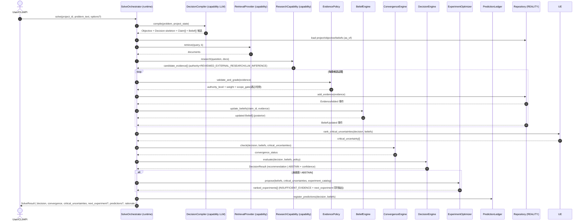
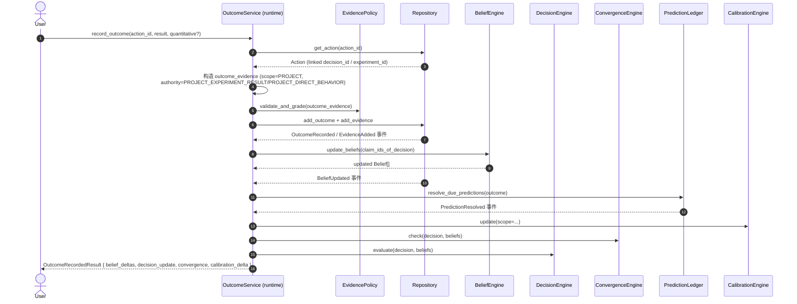
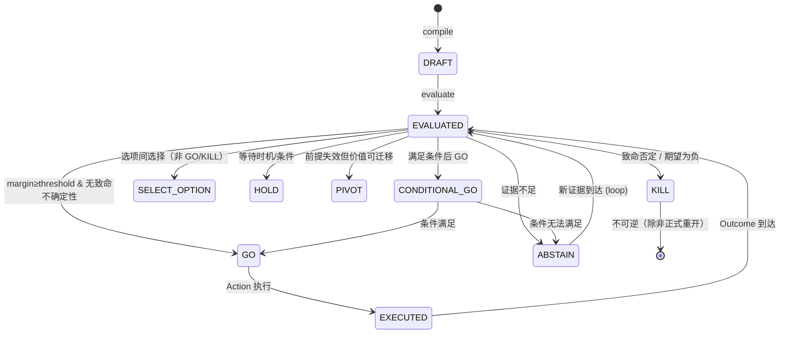
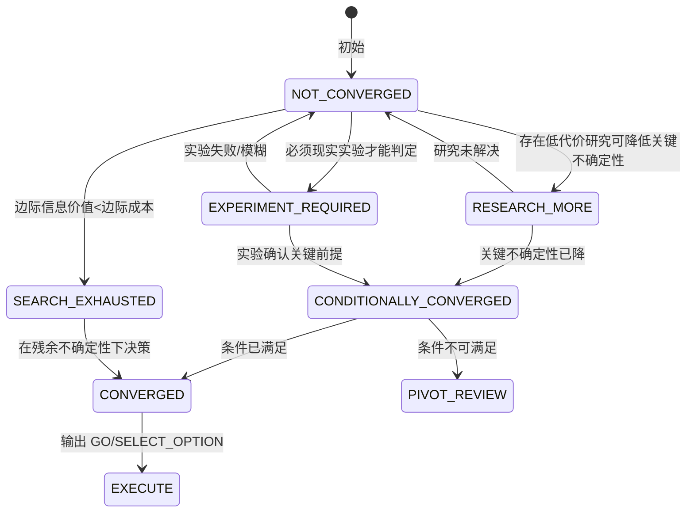
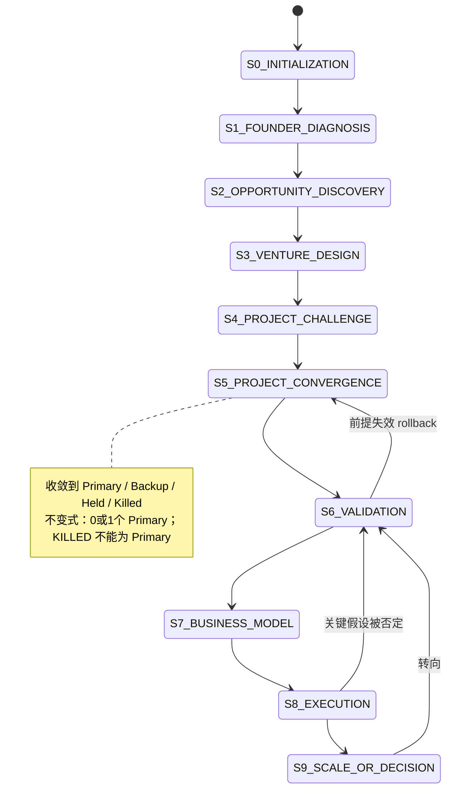

# Vencertia Adaptive Decision System v1.0 — 总体架构

> 状态：设计基线（v1.0）
> 作者：高见远（首席架构师）
> 上游：AgentV10.2 Full Release（User Knowledge Runtime V1.0 + Company Intelligence Runtime V1.1）＋ v0.1 Decision Kernel Prototype
> 读者：工程师（以 TASK_BREAKDOWN.md 为施工图）、评审者

---

## 1. 设计立场（与 v0.1 一致，v1.0 强化）

Vencertia **不是** Prompt-driven Multi-Agent Startup Advisory，而是一个 **Decision Runtime**：

- **确定性 Runtime 拥有状态变更权**。LLM/Agents 只是 capability modules（A0–A10 全部降级为 inference capability），无 canonical truth authority，不得直接修改 Project State，不得自宣 GO/KILL。
- **三层分离**：REALITY（canonical truth）→ DECISION INTELLIGENCE（可解释、可追溯、可校准的确定性引擎）→ CAPABILITY（外部智能，全部可替换适配器）。
- **判断闭环**：`问题 → Objective/Decision 编译 → 证据摄入 → Belief 更新 → 不确定性排序 → 收敛判定 → (决策 | 实验) → 现实 Outcome → 校准 → 更新`。
- **可以拒答（ABSTAIN）**：证据不足时强制给结论是缺陷；系统必须同时输出 `INSUFFICIENT_EVIDENCE + 下一步最有价值的实验`。
- **LLM 输出 ≠ Evidence**：无来源的模型输出只能进入 `MODEL_PRIOR / UNVERIFIED_INFERENCE` 低权重。
- **Company Case Evidence ≠ Project Evidence**：外部案例只能更新 WORLD/MARKET/BUSINESS_MODEL prior，必须通过 transferability 判定才能影响项目信念。

---

## 2. 三层架构

```mermaid
flowchart TB
    subgraph CAP[CAPABILITY 层 — 可替换适配器，无状态权威]
        A0_LLM[Capability: LLM Inference<br/>compile / extract / classify]
        A8_CI[Capability: CompanyCase Intelligence<br/>CaseUnitRef / FounderRecord / ClaimTrace]
        A_RES[Capability: Research / Retrieval / Search]
        A_FIN[Capability: Financial / Market / GTM / Challenger]
    end

    subgraph DEC[DECISION INTELLIGENCE 层 — Vencertia IP，确定性]
        EP[EvidencePolicy<br/>authority hierarchy / scope gate]
        BE[BeliefEngine<br/>Beta-Bernoulli / Weighted Log-Odds]
        UE[UncertaintyEngine<br/>DecisionImpact × BeliefUncertainty]
        DE[DecisionEngine<br/>EU + penalty + margin + abstain]
        CE[ConvergenceEngine<br/>7 态收敛判定]
        EO[ExperimentOptimizer<br/>EIG×Impact×Uncert ÷ Cost÷Time]
        PL[PredictionLedger<br/>快照 + 防篡改 + 结算]
        CAL[CalibrationEngine<br/>Brier / ECE / 分层]
        OC[OpportunityCostEngine<br/>Founder Opportunity Portfolio]
    end

    subgraph REAL[REALITY 层 — canonical truth，Runtime 独占写]
        OBJ[Objective]
        CL[Claim]
        EV[Evidence]
        BL[Belief]
        DC[Decision]
        EX[Experiment]
        AC[Action]
        OC2[Outcome]
        FP[FounderProfile / FounderState]
        FS[FinancialSnapshot]
        PRJ[Project / ProjectKB]
        MEM[MemoryRecord]
        CCI[CompanyCase / Company Intelligence]
        POP[Founder Opportunity Portfolio]
    end

    CAP -->|"候选 Evidence / 候选 Decision 结构<br/>MODEL_PRIOR 或 REVIEWED_* 权重"| DEC
    DEC -->|"validate / mutate / persist"| REAL
    REAL -->|"ContextBundle / 读投影"| CAP
    DEC -->|"触发"| EVENTS[(Event Log<br/>audit / replay)]
    EVENTS --> REAL
```



**权力边界（不可违反）**：

| 谁 | 能做什么 | 不能做什么 |
|---|---|---|
| Capability（LLM/Research/CI…） | 提出 candidate：候选 Claim、候选 Evidence、候选 Decision 结构、候选实验 | 直接写 Project State；给 Belief 赋值；宣布 GO/KILL；把无来源输出标为 VERIFIED |
| DECISION INTELLIGENCE（确定性引擎） | 校验证据 authority、更新 Belief、计算不确定性/收敛/决策/实验排序/校准 | 不能发明事实；不能替人类定义目标 |
| REALITY（Repository） | 唯一的持久化与状态变更入口（乐观锁、事件日志） | 不做业务判断 |
| 人（决策者） | 定义 Objective、批准/否决、拍板 | — |

---

## 3. 关键流程

### 3.1 Solve 主流程（compile → retrieve → research → evidence → belief → convergence → evaluate → experiment → 结构化答案）



### 3.2 Outcome → Evidence → Belief → Decision 闭环（现实学习回路）



### 3.3 Decision 状态机



### 3.4 Convergence 状态机



### 3.5 项目生命周期（继承 V10.2 Stage/Status，独立维度）



---

## 4. 域对象总览（字段级定义见 docs/domain-model.md）

| 域对象 | 层 | 说明 |
|---|---|---|
| Objective | REALITY | 一等公民；id/owner/scope/name/description/metric/direction/weight/constraints/time_horizon/priority/source/timestamps |
| Claim | REALITY | 可证伪命题，与 Evidence 分离（claim↔evidence 多对多） |
| Evidence | REALITY | 完整证据对象（scope/evidence_type/provenance/directness/reliability/relevance/strength/supports_or_contradicts/independence_group/freshness/conflict_status/authority_level） |
| Belief | REALITY（派生） | claim_id + probability/uncertainty/confidence/prior/posterior/update_method/calibration_group |
| Decision | REALITY | decision_question/options/type/horizon/reversible/estimated_cost/relevant_belief_ids/critical_uncertainty_ids/current_recommendation/confidence/convergence_status |
| Experiment | REALITY | target_belief_ids/hypothesis/action/predicted_observation/success/failure/ambiguity_criteria/EIG/decision_impact/cost/time/status |
| Action + Outcome | REALITY | 现实执行与观察；Outcome 触发 Evidence→Belief→Decision 链 |
| PredictionEntry | REALITY | Prediction Ledger（belief_snapshot/context_snapshot_hash/policy_version/resolution） |
| CalibrationProfile | REALITY（派生） | Brier/ECE/buckets/模块级/模型级/领域级 |
| FounderProfile / FounderState | REALITY | runway/time/energy/skills/network/domain expertise/sales ability/risk tolerance/capital access/motivation/execution reliability |
| FinancialSnapshot | REALITY | 版本化财务快照 |
| Project / ProjectKB | REALITY | stage/status/primary；项目知识库 |
| MemoryRecord | REALITY | 继承 V10.2（Scope/Type/Status/Operation/AccessClass 全保留） |
| CompanyCase 家族 | REALITY | CaseUnitRef/FounderRecord/FundingRound/ClaimTrace/Transferability |
| FounderOpportunityPortfolio | REALITY | Opportunity Cost 一等公民（域模型留位） |
| Policy/Invariant/Heuristic | REALITY | 规则三层分离，版本化 |

---

## 5. 技术选型

| 关注点 | 选择 | 理由 |
|---|---|---|
| 语言/运行时 | Python 3.11+ | 团队栈、pydantic v2 生态 |
| 域契约 | pydantic v2（`extra="forbid"`、`validate_assignment`、JSON Schema 导出） | 与 V10.2 一致的严格契约风格 |
| 状态持久化 | SQLite（默认，全量实现）＋ PostgreSQL（`psycopg[binary]`，DSN 门控） | 统一 repository 接口 + migrations + 乐观锁 |
| API | FastAPI + uvicorn | 与 v0.1 一致 |
| CLI | typer + rich | 与 v0.1 一致 |
| 模型网关 | `ModelProvider` 接口 + `MockProvider` + `OpenAICompatibleProvider`（httpx） | 域不依赖具体 provider；framework-agnostic |
| 检索/向量 | `SearchProvider`/`RetrievalProvider` 接口 + mock 实现 | 只留 adapter，不接依赖（Qdrant 等按 ADR-006 准入） |
| 测试 | pytest | 分层：单元/引擎/API/CLI/基准 |
| 事件 | 自研轻量 `EventBus` + `EventLog` 表 | 仅 audit/replay，**不做** Event Sourcing（ADR 见 architecture-decisions.md） |

**依赖最小化**（目标）：`pydantic` `fastapi` `uvicorn` `typer` `rich` `httpx` `pytest`；`psycopg[binary]` 为可选门控。

---

## 6. 目录结构（v1.0 目标）

```text
src/vencertia/
  __init__.py
  config.py                 # Settings：DB_DSN、MODEL_*、POLICY_* 环境
  domain/                   # 域对象全量（pydantic 契约）
  runtime/                  # 确定性引擎（EvidencePolicy/Belief/Decision/Convergence/ExperimentOptimizer/
                            #   PredictionLedger/Calibration/OpportunityCost/Uncertainty/SolveOrchestrator/Context）
  capabilities/             # LLM/Research/CI/Financial/Market/GTM/Challenger（骨架 + mock）
  providers/                # models/mock/openai_compatible/search/retrieval（接口 + mock）
  repositories/             # base/sqlite/postgres(DSN门控)/memory + migrations
  events/                   # EventBus + 域事件类型
  api.py                    # FastAPI 全量
  cli.py                    # typer 全量
  benchmark/                # l0/l1/metrics
  legacy/                   # V10.2 导入工具 + mapping
tests/
examples/
data/benchmarks/
docs/
Makefile
pyproject.toml
```

---

## 7. 与 v0.1 prototype 的继承关系

| v0.1 文件 | v1.0 去向 | 处理 |
|---|---|---|
| `domain.py` | `domain/` 包（拆分为多模块） | **重写**：新增 Objective/Claim/Convergence/Founder/Company/Memory/Policy/Action/Outcome；保留 Belief/Evidence/Decision/Experiment/Prediction 语义并升级 |
| `evidence.py` | `runtime/evidence_policy.py` | **升级**：SOURCE_PRIOR → AuthorityHierarchy（9 级版本化）；新增 scope gate、transferability、conflict_status |
| `decision.py` | `runtime/decision_engine.py` | **升级**：保留 EU+penalty+margin+abstain；新增 decision_type 显式化、convergence_status 输出 |
| `experiments.py` | `runtime/experiment_optimizer.py` | **升级**：保留 EIG×Impact×Uncertainty÷Cost÷Time；决策选项空间与信息获取行动空间严格分离 |
| `calibration.py` | `runtime/calibration_engine.py` | **保留+扩展**：Brier/ECE 不变；新增模块级/模型级/领域级分层 |
| `store.py` | `repositories/` | **重写**：泛型 objects 表 → 领域 repository + migrations + 乐观锁 |
| `runtime.py` | `runtime/runtime.py` | **重写**：DecideRuntime → SolveOrchestrator（含事件、收敛、预测登记） |
| `api.py` | `api.py` | **重写**：/v1/decide → /v1/decisions/compile、evaluate、/v1/evidence、/v1/outcomes、/v1/experiments/*、/v1/predictions、/v1/calibration、/v1/projects/*、/v1/solve |
| `cli.py` | `cli.py` | **重写**：新增 solve/decision/evidence/experiment/outcome/prediction/calibration/benchmark/project/migrate-v10.2 |
| `benchmark.py` | `benchmark/` | **重写**：L0（保留 24 例回归）+ L1 harness + metrics 全量 |
| `integrations/base.py` | `providers/` | **升级**：ResearchProvider/ReasoningProvider/RetrievalProvider → ModelProvider/SearchProvider/RetrievalProvider |

---

## 8. 关键不变式（Invariant，硬约束）

1. **LLM 输出不是真相**：无来源的模型输出 authority ≤ `LLM_INFERENCE`(0.2) / `MODEL_PRIOR`(0.1)。
2. **Evidence 不可变**：新增可、修正用 SUPERSEDE，不覆盖原记录。
3. **Belief 是派生状态**：任何写入必须记录 update_method 与证据链。
4. **决策必须可拒答**：ABSTAIN 与 next_experiment 同时输出。
5. **状态变更唯一入口是 Deterministic Runtime**：capability 无写权限。
6. **KILLED 项目不能是 Primary**；全局至多一个 Primary。
7. **Company Case 证据不得直接改项目 WTP**：先 transferability 判定。
8. **预测必须先登记后结算**：Prediction Ledger 快照不可事后篡改。
9. **没有 benchmark 证据的 OSS/模型集成不得准入**（ADR-006）。

---

## 9. 未决事项（Anything UNCLEAR）

- **多用户/租户边界**：v1.0 假设单用户或简单 user_id 字段；租户级权限（V10.2 AccessClass 精细化）留接口。
- **Financial Snapshot 数据来源**：v1.0 由用户/导入工具写入；不做自动记账。
- **Company Case 数据源**：v1.0 只提供 adapter 接口 + mock；真实案例库接入按 ADR-006 准入。
- **实验 catalog 来源**：v1.0 由用户/模板提供；自动生成实验候选属后续能力。
- **LLM compile 质量门**：v1.0 用 schema 校验 + L0 回归兜底；端到端质量指标待 L1 数据积累。
- **多轮迭代节奏**：详见 TASK_BREAKDOWN.md 的迭代计划（3 轮）。
