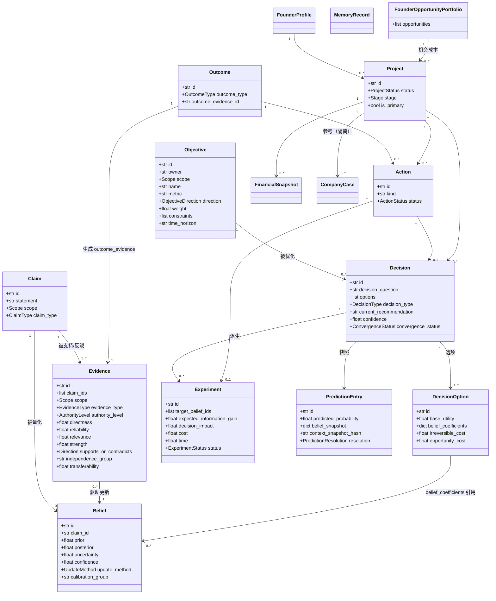

# Vencertia Adaptive Decision System v1.0 — 域模型（字段级定义）

> 本文是域契约的权威来源。实现时以 pydantic v2 为基准：`model_config = ConfigDict(extra="forbid", validate_assignment=True, use_enum_values=True, str_strip_whitespace=True)`。
> 约定：所有时间均为 `datetime`（UTC）；ID 由 `uuid4().hex` 或前缀生成；金额使用 `float`（v1.0 简化，不引入 Decimal，除非财务结算需求）。

---

## 1. 基础枚举

```python
class Scope(str, Enum):
    FOUNDER = "FOUNDER"          # 创始人个人
    PROJECT = "PROJECT"          # 当前项目
    CUSTOMER = "CUSTOMER"        # 客户/付费行为
    MARKET = "MARKET"            # 市场/行业
    COMPANY_CASE = "COMPANY_CASE"  # 外部公司案例
    WORLD = "WORLD"              # 世界/宏观

class EvidenceType(str, Enum):
    REAL_PAYMENT = "REAL_PAYMENT"
    CONTRACT = "CONTRACT"
    OBSERVED_BEHAVIOR = "OBSERVED_BEHAVIOR"
    EXPERIMENT_RESULT = "EXPERIMENT_RESULT"
    CUSTOMER_COMMITMENT = "CUSTOMER_COMMITMENT"       # 意向/承诺（弱于付款）
    OFFICIAL_DATA = "OFFICIAL_DATA"
    PRIMARY_RESEARCH = "PRIMARY_RESEARCH"
    REVIEWED_EXTERNAL_RESEARCH = "REVIEWED_EXTERNAL_RESEARCH"
    ELIGIBLE_EXTERNAL_CASE_FACT = "ELIGIBLE_EXTERNAL_CASE_FACT"
    COMPANY_CASE_FACT = "COMPANY_CASE_FACT"           # 案例事实（未通过 transferability 前不可用于项目信念）
    FOUNDER_STATEMENT = "FOUNDER_STATEMENT"
    EXPERT_INPUT = "EXPERT_INPUT"
    LLM_INFERENCE = "LLM_INFERENCE"
    MODEL_PRIOR = "MODEL_PRIOR"                       # 无来源模型先验
    SYSTEM_DERIVED = "SYSTEM_DERIVED"                 # 系统计算/派生

class AuthorityLevel(str, Enum):
    """证据权威层级（版本化，见 docs/evidence-policy.md）。数值越大权重越高。"""
    PROJECT_REALITY = "PROJECT_REALITY"                       # 1.00
    PROJECT_DIRECT_BEHAVIOR = "PROJECT_DIRECT_BEHAVIOR"       # 0.95
    PROJECT_EXPERIMENT_RESULT = "PROJECT_EXPERIMENT_RESULT"   # 0.90
    CUSTOMER_COMMITMENT_OR_PAYMENT = "CUSTOMER_COMMITMENT_OR_PAYMENT"  # 0.88
    ELIGIBLE_EXTERNAL_CASE_FACT = "ELIGIBLE_EXTERNAL_CASE_FACT"        # 0.75
    REVIEWED_EXTERNAL_RESEARCH = "REVIEWED_EXTERNAL_RESEARCH"          # 0.65
    FOUNDER_STATEMENT = "FOUNDER_STATEMENT"                   # 0.45
    LLM_INFERENCE = "LLM_INFERENCE"                           # 0.20
    MODEL_PRIOR = "MODEL_PRIOR"                               # 0.10

class Verification(str, Enum):
    VERIFIED = "VERIFIED"
    ESTIMATED = "ESTIMATED"
    ASSUMED = "ASSUMED"
    UNKNOWN = "UNKNOWN"

class Direction(str, Enum):
    SUPPORTS = "SUPPORTS"
    CONTRADICTS = "CONTRADICTS"
    NEUTRAL = "NEUTRAL"

class ConflictStatus(str, Enum):
    NO_CONFLICT = "NO_CONFLICT"
    CONFLICTED = "CONFLICTED"       # 与同 claim 其他证据矛盾，须显式呈现
    SUPERSEDED = "SUPERSEDED"
    EXPIRED = "EXPIRED"

class ClaimType(str, Enum):
    FACT = "FACT"
    ESTIMATE = "ESTIMATE"
    INFERENCE = "INFERENCE"
    HYPOTHESIS = "HYPOTHESIS"
    LESSON = "LESSON"
    CAUSAL_CLAIM = "CAUSAL_CLAIM"

class ClaimStatus(str, Enum):
    ACTIVE = "ACTIVE"
    SUPERSEDED = "SUPERSEDED"

class UpdateMethod(str, Enum):
    BETA_BERNOULLI = "BETA_BERNOULLI"       # 伪计数 Beta 更新（默认，透明可审计）
    WEIGHTED_LOG_ODDS = "WEIGHTED_LOG_ODDS" # 可替换算法（heuristic Bayesian-like）

class DecisionType(str, Enum):
    GO = "GO"
    CONDITIONAL_GO = "CONDITIONAL_GO"
    HOLD = "HOLD"
    PIVOT = "PIVOT"
    KILL = "KILL"
    SELECT_OPTION = "SELECT_OPTION"
    ABSTAIN = "ABSTAIN"

class ConvergenceStatus(str, Enum):
    NOT_CONVERGED = "NOT_CONVERGED"
    RESEARCH_MORE = "RESEARCH_MORE"
    EXPERIMENT_REQUIRED = "EXPERIMENT_REQUIRED"
    SEARCH_EXHAUSTED = "SEARCH_EXHAUSTED"
    CONDITIONALLY_CONVERGED = "CONDITIONALLY_CONVERGED"
    CONVERGED = "CONVERGED"
    EXECUTE = "EXECUTE"

class ExperimentStatus(str, Enum):
    PROPOSED = "PROPOSED"
    RUNNING = "RUNNING"
    RESOLVED_SUPPORT = "RESOLVED_SUPPORT"
    RESOLVED_REFUTE = "RESOLVED_REFUTE"
    RESOLVED_AMBIGUOUS = "RESOLVED_AMBIGUOUS"
    ABANDONED = "ABANDONED"

class PredictionResolution(str, Enum):
    OPEN = "OPEN"
    TRUE = "TRUE"
    FALSE = "FALSE"
    CANCELLED = "CANCELLED"

class ActionStatus(str, Enum):
    PLANNED = "PLANNED"
    RUNNING = "RUNNING"
    COMPLETED = "COMPLETED"
    FAILED = "FAILED"
    CANCELLED = "CANCELLED"

class OutcomeType(str, Enum):
    SUCCESS = "SUCCESS"
    FAILURE = "FAILURE"
    PARTIAL = "PARTIAL"
    AMBIGUOUS = "AMBIGUOUS"
    NOISE = "NOISE"

# ---- 继承自 V10.2（原样保留）----
class MemoryScope(str, Enum):
    USER_GLOBAL = "USER_GLOBAL"
    PROJECT_SPECIFIC = "PROJECT_SPECIFIC"

class MemoryType(str, Enum):
    FOUNDER_FACT = "FOUNDER_FACT"
    RESOURCE = "RESOURCE"
    CAPABILITY = "CAPABILITY"
    CONSTRAINT = "CONSTRAINT"
    RED_LINE = "RED_LINE"
    PREFERENCE = "PREFERENCE"
    PROJECT_FACT = "PROJECT_FACT"
    PROJECT_DECISION = "PROJECT_DECISION"
    ASSUMPTION = "ASSUMPTION"
    EVIDENCE = "EVIDENCE"
    CUSTOMER_FEEDBACK = "CUSTOMER_FEEDBACK"
    EXPERIMENT_RESULT = "EXPERIMENT_RESULT"
    FINANCIAL_DATA = "FINANCIAL_DATA"
    RISK = "RISK"
    ACTION = "ACTION"
    ACTION_RESULT = "ACTION_RESULT"
    MILESTONE = "MILESTONE"
    OPEN_QUESTION = "OPEN_QUESTION"
    EXCLUSION_RULE = "EXCLUSION_RULE"
    PIVOT_REASON = "PIVOT_REASON"
    LESSON = "LESSON"

class MemoryStatus(str, Enum):
    ACTIVE = "ACTIVE"
    SUPERSEDED = "SUPERSEDED"
    CONFLICTED = "CONFLICTED"
    REJECTED = "REJECTED"
    EXPIRED = "EXPIRED"
    ARCHIVED = "ARCHIVED"

class MemoryOperation(str, Enum):
    WRITE = "WRITE"
    MERGE = "MERGE"
    SUPERSEDE = "SUPERSEDE"
    CONFLICT = "CONFLICT"
    REJECT = "REJECT"
    EXPIRE = "EXPIRE"
    ARCHIVE = "ARCHIVE"

class AccessClass(str, Enum):
    PRIVATE = "PRIVATE"
    INTERNAL = "INTERNAL"
    MATCHABLE = "MATCHABLE"
    PUBLIC = "PUBLIC"

class ProjectStatus(str, Enum):
    IDEA = "IDEA"
    EXPLORING = "EXPLORING"
    VALIDATING = "VALIDATING"
    ACTIVE = "ACTIVE"
    PIVOTING = "PIVOTING"
    HOLD = "HOLD"
    KILLED = "KILLED"
    ARCHIVED = "ARCHIVED"

class Stage(str, Enum):
    S0_INITIALIZATION = "S0_INITIALIZATION"
    S1_FOUNDER_DIAGNOSIS = "S1_FOUNDER_DIAGNOSIS"
    S2_OPPORTUNITY_DISCOVERY = "S2_OPPORTUNITY_DISCOVERY"
    S3_VENTURE_DESIGN = "S3_VENTURE_DESIGN"
    S4_PROJECT_CHALLENGE = "S4_PROJECT_CHALLENGE"
    S5_PROJECT_CONVERGENCE = "S5_PROJECT_CONVERGENCE"
    S6_VALIDATION = "S6_VALIDATION"
    S7_BUSINESS_MODEL = "S7_BUSINESS_MODEL"
    S8_EXECUTION = "S8_EXECUTION"
    S9_SCALE_OR_DECISION = "S9_SCALE_OR_DECISION"
```

---

## 2. 核心域对象（pydantic 伪代码）

### 2.1 Objective（一等公民）

```python
class ObjectiveDirection(str, Enum):
    MAXIMIZE = "MAXIMIZE"
    MINIMIZE = "MINIMIZE"

class Objective(BaseModel):
    id: str
    owner: str                    # user_id
    scope: Scope = Scope.PROJECT
    name: str
    description: str
    metric: str                   # 如 "预期公司价值（含期权价值）"
    direction: ObjectiveDirection = ObjectiveDirection.MAXIMIZE
    weight: float = 1.0           # 多目标加权
    constraints: list[str] = []   # 硬约束描述（如 runway ≥ 6 个月）
    time_horizon: str             # 如 "18个月"
    priority: int = Field(ge=0, le=10)
    source: str = "user"          # user | system | capability
    created_at: datetime
    updated_at: datetime
    version: int = 1
```

### 2.2 Claim（可证伪命题）

```python
class Claim(BaseModel):
    id: str                       # "CLM_..."
    statement: str                # 可证伪命题文本
    scope: Scope
    claim_type: ClaimType = ClaimType.HYPOTHESIS
    project_id: str | None = None
    company_id: str | None = None # COMPANY_CASE 时
    status: ClaimStatus = ClaimStatus.ACTIVE
    supersedes_claim_id: str | None = None
    created_at: datetime
    updated_at: datetime
```

### 2.3 Evidence（完整字段）

```python
class Provenance(BaseModel):
    source_id: str | None = None    # "S_..." 来源注册
    source_url: str | None = None
    tool: str | None = None         # 采集工具/管道
    actor: str | None = None        # 记录人/agent
    raw_extract: str | None = None

class Evidence(BaseModel):
    id: str                         # "E_..."
    claim_ids: list[str]            # 关联 Claim（多对多）
    scope: Scope
    evidence_type: EvidenceType
    provenance: Provenance = Provenance()
    source: str                     # 证据文本/描述
    directness: float = Field(ge=0, le=1)     # 1=直接观测，0=间接推断
    reliability: float = Field(ge=0, le=1)    # 来源可信度
    relevance: float = Field(ge=0, le=1)      # 与目标 belief 的相关性
    strength: float = Field(ge=0, le=1)       # 影响强度
    supports_or_contradicts: Direction = Direction.NEUTRAL
    independence_group: str | None = None     # 同组证据共享信息，需折减
    observed_at: datetime = utcnow()          # freshness
    conflict_status: ConflictStatus = ConflictStatus.NO_CONFLICT
    authority_level: AuthorityLevel           # 由 EvidencePolicy 赋值
    verification: Verification = Verification.UNKNOWN
    transferability: float | None = None      # 仅 COMPANY_CASE 证据：外部案例→本项目的可迁移度
    created_at: datetime = utcnow()
    version: int = 1
```

### 2.4 Belief（派生状态）

```python
class Belief(BaseModel):
    id: str                       # "BLF_..."
    claim_id: str
    statement: str                # 冗余快照，便于阅读
    prior: float = Field(ge=0, le=1)
    posterior: float = Field(ge=0, le=1)   # 当前概率
    probability: float = Field(ge=0, le=1) # = posterior（输出别名）
    uncertainty: float = Field(ge=0, le=1) # 归一化不确定度（见 belief-engine）
    confidence: float = Field(ge=0, le=1)  # 1 - 归一化不确定度
    supporting_evidence_ids: list[str] = []
    contradicting_evidence_ids: list[str] = []
    # Beta-Bernoulli 内部参数（update_method=BETA_BERNOULLI 时使用）
    alpha: float = 1.0
    beta: float = 1.0
    update_method: UpdateMethod = UpdateMethod.BETA_BERNOULLI
    calibration_group: str = "default"   # model_tag × domain × task_class
    decision_relevant: bool = False
    created_at: datetime
    updated_at: datetime
    version: int = 1
```

### 2.5 Decision 家族

```python
class DecisionOption(BaseModel):
    id: str
    label: str
    description: str = ""
    kind: DecisionType | None = None      # 选项语义（EXECUTE/CONDITIONAL/HOLD/PIVOT/KILL/SELECT）
    base_utility: float = 0.0
    belief_coefficients: dict[str, float] = {}   # {belief_id: 权重}
    irreversible_cost: float = Field(default=0.0, ge=0)
    opportunity_cost: float = Field(default=0.0, ge=0)
    resource_requirements: dict[str, float] = {} # {runway_months: n, cash: x, ...}

class Decision(BaseModel):
    id: str                       # "DEC_..."
    decision_question: str
    objective_id: str
    project_id: str
    options: list[DecisionOption] = Field(min_length=1)
    decision_type: DecisionType | None = None   # 请求语义
    horizon: str = "short"        # short/medium/long
    reversible: bool = True
    estimated_cost: float = 0.0   # 执行决策的估计成本
    relevant_belief_ids: list[str] = []
    critical_uncertainty_ids: list[str] = []
    current_recommendation: str | None = None   # 推荐 option id（ABSTAIN 时为 None）
    confidence: float | None = Field(default=None, ge=0, le=1)
    convergence_status: ConvergenceStatus = ConvergenceStatus.NOT_CONVERGED
    status: str = "DRAFT"         # DRAFT/EVALUATED/EXECUTED
    snapshot_hash: str | None = None   # belief 快照哈希（Prediction Ledger 关联）
    rationale: list[str] = []
    created_at: datetime
    updated_at: datetime

class DecisionResult(BaseModel):
    decision_id: str
    status: DecisionType           # 注意：决策结果类型（含 ABSTAIN）
    recommended_option_id: str | None
    confidence: float = Field(ge=0, le=1)
    decision_margin: float
    option_scores: list[OptionScore]
    critical_belief_id: str | None
    critical_uncertainty: float
    convergence_status: ConvergenceStatus
    rationale: list[str]
    reversible_next_step: str | None = None   # 未收敛时 = 推荐实验 id

class OptionScore(BaseModel):
    option_id: str
    expected_utility: float
    uncertainty_penalty: float
    adjusted_utility: float
```

### 2.6 Experiment

```python
class Experiment(BaseModel):
    id: str                       # "EXP_..."
    name: str
    decision_id: str | None = None
    target_belief_ids: list[str]
    hypothesis: str
    action: str                   # 具体动作描述
    predicted_observation: str
    success_criteria: str
    failure_criteria: str
    ambiguity_criteria: str
    expected_information_gain: float = Field(ge=0)
    decision_impact: float = Field(ge=0)   # 对决策改变的影响权重
    cost: float = Field(default=1.0, gt=0)
    time: float = Field(default=1.0, gt=0) # 天
    status: ExperimentStatus = ExperimentStatus.PROPOSED
    outcome_evidence_id: str | None = None
    created_at: datetime
    resolved_at: datetime | None = None

class RankedExperiment(BaseModel):
    experiment: Experiment
    priority_score: float
```

### 2.7 Action + Outcome

```python
class Action(BaseModel):
    id: str                       # "ACT_..."
    project_id: str
    kind: str                     # EXECUTE / EXPERIMENT / RESEARCH / OUTREACH / OTHER
    description: str
    decision_id: str | None = None
    experiment_id: str | None = None
    status: ActionStatus = ActionStatus.PLANNED
    started_at: datetime | None = None
    completed_at: datetime | None = None
    created_at: datetime

class Outcome(BaseModel):
    id: str                       # "OUT_..."
    action_id: str
    observed_at: datetime
    result: str
    quantitative: dict[str, float] = {}
    outcome_type: OutcomeType = OutcomeType.PARTIAL
    outcome_evidence_id: str | None = None   # 自动生成的 Evidence
    created_at: datetime
```

### 2.8 Prediction Ledger

```python
class PredictionEntry(BaseModel):
    id: str                       # "PRD_..."
    project_id: str
    claim_id: str | None = None
    target: str                   # 可结算命题
    predicted_probability: float = Field(gt=0, lt=1)
    belief_snapshot: dict          # {belief_id: {probability, uncertainty, alpha, beta}}
    context_snapshot_hash: str     # 决策/项目上下文快照 SHA-256
    policy_version: str = "1.0"    # 生成时 Policy 版本
    due_at: datetime
    resolution: PredictionResolution = PredictionResolution.OPEN
    resolved_at: datetime | None = None
    outcome: bool | None = None    # True/False
    created_at: datetime
```

### 2.9 Calibration

```python
class CalibrationScope(str, Enum):
    ALL = "ALL"
    MODEL = "MODEL"       # 按 model_tag
    DOMAIN = "DOMAIN"     # 按 domain
    MODULE = "MODULE"     # 按引擎/模块

class CalibrationProfile(BaseModel):
    id: str
    scope: CalibrationScope
    scope_key: str                  # "ALL" / model_tag / domain / module
    n: int
    brier_score: float | None
    expected_calibration_error: float | None
    mean_confidence: float | None
    empirical_rate: float | None
    bins: list[dict]                # [{lo,hi,n,mean_confidence,empirical_rate,gap}]
    updated_at: datetime
```

### 2.10 Founder

```python
class FounderProfile(BaseModel):
    user_id: str
    summary: str = ""
    skills: list[str] = []
    domain_expertise: list[str] = []
    sales_ability: float = Field(default=0.0, ge=0, le=1)
    network: float = Field(default=0.0, ge=0, le=1)        # 目标客户可达性
    risk_tolerance: float = Field(default=0.5, ge=0, le=1)
    capital_access: float = Field(default=0.0, ge=0, le=1)
    motivation: float = Field(default=0.5, ge=0, le=1)
    execution_reliability: float = Field(default=0.5, ge=0, le=1)
    constraints: list[str] = []
    red_lines: list[str] = []
    preferences: list[str] = []
    updated_at: datetime

class FounderState(BaseModel):
    """时变状态，决策目标与行动策略的输入。"""
    user_id: str
    as_of: datetime
    runway_months: float | None
    time_available: float | None          # 每周可投入小时
    energy: float = Field(default=0.5, ge=0, le=1)
    skills: list[str] = []
    network: float = Field(default=0.0, ge=0, le=1)
    domain_expertise: float = Field(default=0.0, ge=0, le=1)
    sales_ability: float = Field(default=0.0, ge=0, le=1)
    risk_tolerance: float = Field(default=0.5, ge=0, le=1)
    capital_access: float = Field(default=0.0, ge=0, le=1)
    motivation: float = Field(default=0.5, ge=0, le=1)
    execution_reliability: float = Field(default=0.5, ge=0, le=1)
    source_evidence_ids: list[str] = []

class Opportunity(BaseModel):
    """Founder Opportunity Portfolio 成员。"""
    project_id: str
    name: str
    expected_value: float
    option_value: float                    # 期权价值
    opportunity_cost: float                # 做它放弃的最大替代
    priority: int = Field(ge=0, le=10)
    as_of: datetime

class FounderOpportunityPortfolio(BaseModel):
    user_id: str
    opportunities: list[Opportunity] = []
    updated_at: datetime
```

### 2.11 Financial / Project / Memory / Company

```python
class FinancialSnapshot(BaseModel):
    id: str                       # "FS_..."
    project_id: str
    as_of: datetime
    currency: str = "EUR"
    cash_on_hand: float | None
    burn_monthly: float | None
    runway_months: float | None
    revenue_monthly: float | None
    gross_margin: float | None
    unit_economics: dict = {}     # {cac: x, ltv: y, ...}
    source_evidence_ids: list[str] = []
    version: int = 1

class Project(BaseModel):
    id: str
    user_id: str
    name: str
    description: str = ""
    status: ProjectStatus = ProjectStatus.IDEA
    stage: Stage = Stage.S0_INITIALIZATION
    is_primary: bool = False      # 不变式：KILLED 不能 primary；全局至多 1 个
    created_at: datetime
    updated_at: datetime

class ProjectKB(BaseModel):
    project_id: str
    entries: dict[str, str] = {}  # key → value（结构化项目知识，非 canonical truth 主体）
    updated_at: datetime

class MemoryRecord(BaseModel):
    """继承 V10.2 契约（字段与语义原样保留）。"""
    memory_id: str
    user_id: str
    project_id: str | None = None
    scope: MemoryScope
    memory_type: MemoryType
    content: str
    structured_value: dict | None = None
    source_message_ids: list[str] = []
    source_entity_ids: list[str] = []
    evidence_ids: list[str] = []
    fact_status: Verification
    confidence: str                # LOW/MEDIUM/HIGH
    importance: str                # LOW/MEDIUM/HIGH/CRITICAL
    status: MemoryStatus = MemoryStatus.ACTIVE
    created_at: datetime
    updated_at: datetime
    valid_from: datetime | None = None
    valid_to: datetime | None = None
    supersedes_memory_id: str | None = None
    conflicts_with_memory_ids: list[str] = []

class MemoryCandidate(BaseModel):
    candidate_id: str
    proposed_scope: MemoryScope
    proposed_memory_type: MemoryType
    content: str
    structured_value: dict | None = None
    source_types: list[str] = []
    evidence_ids: list[str] = []
    fact_status: Verification = Verification.UNKNOWN
    confidence: str = "MEDIUM"
    importance: str = "MEDIUM"
    semantic_key: str | None = None
    access_class: AccessClass = AccessClass.PRIVATE
    proper_store: str = "STABLE_MEMORY"   # ProperStore 11 类

class CompanyCase(BaseModel):
    """Company Intelligence 核心（对齐 Company Case V1.4 子集）。"""
    company_id: str
    canonical_name: str
    aliases: list[str] = []
    case_roles: list[str] = []            # SUCCESS/FAILURE/PIVOT/...
    lifecycle_stage: str = "UNKNOWN"
    capital_stage: str = "UNKNOWN"
    as_of: datetime | None = None
    overall_confidence: str = "LOW"
    data_completeness: str = "LOW"
    research_status: str = "DRAFT"
    claim_ids: list[str] = []
    founder_records: list["FounderRecord"] = []
    funding_rounds: list["FundingRound"] = []
    updated_at: datetime

class CaseUnitRef(BaseModel):
    company_id: str
    snapshot_id: str
    operating_segment_ids: list[str] = []
    business_unit_id: str | None = None
    offer_ids: list[str] = []
    revenue_stream_ids: list[str] = []
    customer_segment_ids: list[str] = []
    geography: list[str] = []
    valid_period: str | None = None

class FounderRecord(BaseModel):
    founder_id: str
    company_id: str
    name: str
    education: list[str] = []
    previous_companies: list[str] = []
    previous_industries: list[str] = []
    previous_startups: list[str] = []
    technical_background: str | None = None
    sales_background: str | None = None
    industry_background: str | None = None
    capital_background: str | None = None
    special_resources: list[str] = []
    founder_market_fit_notes: str | None = None
    claim_ids: list[str] = []
    last_verified_at: datetime | None = None

class FundingRound(BaseModel):
    funding_round_id: str
    company_id: str
    round_name: str
    announced_at: date | None = None
    amount: float | None = None
    currency: str | None = None
    investors: list[str] = []
    lead_investors: list[str] = []
    pre_money_valuation: float | None = None
    post_money_valuation: float | None = None
    total_funding_after_round: float | None = None
    claim_ids: list[str] = []
    source_ids: list[str] = []
    last_verified_at: datetime | None = None

class ClaimTrace(BaseModel):
    claim_id: str
    status: str = "UNKNOWN"       # SUPPORTED/PARTIAL/CONFLICTED/REJECTED/STALE/UNKNOWN
    evidence_trace: list[dict] = []  # EvidenceTraceItem
    updated_at: datetime
```

### 2.12 Policy / Invariant / Heuristic（规则三层分离）

```python
class RuleKind(str, Enum):
    INVARIANT = "INVARIANT"   # 硬约束，不可配置（如 KILLED 不能 Primary）
    POLICY = "POLICY"         # 版本化策略（如 Score>75 门槛）
    HEURISTIC = "HEURISTIC"   # 可配置经验（如 7-14 天验证窗口）

class Rule(BaseModel):
    id: str
    kind: RuleKind
    name: str
    description: str
    params: dict = {}                # {"threshold": 0.75}
    version: str = "1.0"
    enabled: bool = True
    effective_from: datetime | None = None
    effective_to: datetime | None = None
```

### 2.13 事件（Event Log，非 Event Sourcing）

```python
class EventType(str, Enum):
    EVIDENCE_ADDED = "EVIDENCE_ADDED"
    BELIEF_UPDATED = "BELIEF_UPDATED"
    DECISION_CREATED = "DECISION_CREATED"
    DECISION_EVALUATED = "DECISION_EVALUATED"
    EXPERIMENT_PROPOSED = "EXPERIMENT_PROPOSED"
    EXPERIMENT_RESOLVED = "EXPERIMENT_RESOLVED"
    ACTION_CREATED = "ACTION_CREATED"
    OUTCOME_RECORDED = "OUTCOME_RECORDED"
    PREDICTION_CREATED = "PREDICTION_CREATED"
    PREDICTION_RESOLVED = "PREDICTION_RESOLVED"
    CALIBRATION_UPDATED = "CALIBRATION_UPDATED"
    PROJECT_STATE_CHANGED = "PROJECT_STATE_CHANGED"

class DomainEvent(BaseModel):
    event_id: str
    event_type: EventType
    entity_type: str
    entity_id: str
    payload: dict = {}
    actor: str = "system"
    occurred_at: datetime = utcnow()
```

---

## 3. 对象关系图



---

## 4. 设计说明（关键取舍）

1. **Claim 与 Evidence 分离**：V10.2 中 Claim 内嵌 Evidence；v1.0 将 Claim（可证伪命题）与 Evidence（观测）分离，允许多条证据支持/反驳同一 claim、同一证据链到多 claim，为 Belief 更新与 contradiction 检测提供结构。
2. **Belief 是 claim 的量化投影**：一个 claim 当前只有一个 active belief；历史版本由 version + updated_at 保留。
3. **CompanyCase 家族保留 V10.2 契约**：`CaseUnitRef`/`FounderRecord`/`FundingRound`/`ClaimTrace` 字段级继承，新增 `transferability` 挂在 Evidence 上而非案例对象上——因为可迁移度是"案例→项目"的关系属性。
4. **MemoryRecord 原样保留**：避免破坏 V10.2 的 User Knowledge Runtime 语义；新系统只增加"MemoryCandidate 事件化摄入"路径。
5. **金额统一 float**：v1.0 为决策支持工具，不需要财务精度；若财务结算成为需求再迁移 Decimal。
