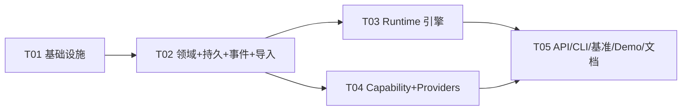

# Vencertia Adaptive Decision System v1.0 — System Design（施工总纲）

> 本文是架构师交付的**单一总纲**：Part A 系统设计（选型/文件清单/类图/时序/未决项）＋ Part B 任务分解（依赖/共享知识/依赖图）。
> 分册文档：`docs/architecture.md`（架构与流程图）、`docs/domain-model.md`（字段级域模型）、`docs/{decision,belief,evidence-policy,experiment-optimizer,calibration}-engine.md`（引擎算法）、`docs/migration-v10.2-to-decision-runtime.md`、`docs/architecture-decisions.md`（ADR-001~007）、`TASK_BREAKDOWN.md`（工程师施工图）。

---

# Part A：系统设计

## A.1 Implementation Approach（实现路径）

### 核心难点与对策

| 难点 | 对策 |
|---|---|
| LLM 权威失控 → 状态漂移 | ADR-001/002：capability 无写权；Deterministic Runtime 唯一状态入口 |
| 证据可信度量化 | EvidencePolicy 权威层级表（9 级、版本化）+ 门控（scope/transferability/LLM 降权） |
| 决策与实验混淆 | ADR-003：两个空间物理分离，ABSTAIN+next_experiment 同时输出 |
| 外部案例误用 | ADR-004：Company Case 隔离 + transferability gate |
| 模型/框架锁定 | ADR-005：providers 接口 + Mock/OpenAICompatible 实现 |
| 无法证明改进 | ADR-006：L0/L1/L2 分层基准先于集成 |
| 不确定性管理 | ConvergenceEngine 7 态 + Prediction Ledger 防篡改 + Calibration 分层 |

### 框架选型

- **域契约**：pydantic v2（`extra="forbid"`，与 V10.2 风格一致，可导出 JSON Schema）
- **API**：FastAPI + uvicorn（v0.1 沿用）
- **CLI**：typer + rich（v0.1 沿用）
- **持久化**：SQLite 全量（默认）+ PostgreSQL（`psycopg[binary]`，DSN 门控）
- **模型网关**：httpx（OpenAI-compatible）；域层仅依赖 `ModelProvider` 协议
- **测试**：pytest
- **事件**：轻量自研 EventBus + EventLog 表（非 Event Sourcing，ADR-002）

### 架构模式

- 分层：REALITY / DECISION INTELLIGENCE / CAPABILITY（三层分离）
- 编排：`SolveOrchestrator`（facade + 确定性编排）
- 持久化：Repository 模式（base 协议 + SQLite/Postgres/Memory 实现）
- 推理注入：Provider 模式（Model/Search/Retrieval）

## A.2 File List（目标文件清单）

```text
pyproject.toml                        # 依赖声明（最小集 + psycopg 门控）
Makefile                              # install/test/benchmark/demo/api
.env.example                          # DB_DSN/MODEL_* 环境样例
.gitignore

src/vencertia/__init__.py             # 版本/导出
src/vencertia/config.py               # Settings（pydantic-settings 或手写 dataclass）

src/vencertia/domain/
  __init__.py  base.py                # 基础模型/枚举
  objective.py claim.py evidence.py belief.py decision.py
  experiment.py action_outcome.py prediction.py calibration.py
  project.py founder.py company.py memory.py policy.py convergence.py

src/vencertia/runtime/
  __init__.py  evidence_policy.py belief_engine.py decision_engine.py
  convergence_engine.py experiment_optimizer.py prediction_ledger.py
  calibration_engine.py opportunity_cost.py uncertainty_engine.py
  runtime.py                          # SolveOrchestrator
  context.py                          # ContextBuilder（读投影）

src/vencertia/capabilities/
  __init__.py base.py market.py financial.py challenger.py
  company_intelligence.py research.py gtm.py founder_diagnosis.py

src/vencertia/providers/
  __init__.py models.py mock.py openai_compatible.py search.py retrieval.py

src/vencertia/repositories/
  __init__.py base.py sqlite.py postgres.py memory.py
  migrations/__init__.py 0001_initial.sql

src/vencertia/events/
  __init__.py bus.py types.py

src/vencertia/api.py
src/vencertia/cli.py

src/vencertia/benchmark/
  __init__.py l0.py l1.py metrics.py

src/vencertia/legacy/
  __init__.py mapping.py import_v10_2.py

tests/
  conftest.py test_domain.py test_evidence_policy.py test_belief_engine.py
  test_decision_engine.py test_experiment_optimizer.py test_convergence.py
  test_prediction_ledger.py test_calibration.py test_repositories.py
  test_opportunity_cost.py test_api.py test_cli.py test_solve.py
  test_benchmark_l0.py test_benchmark_l1.py test_legacy_import.py
  test_e2e_demo.py

examples/demo_b2b_saas_v1.json       # B2B SaaS MVP 6 周决策 + paid pilot 实验闭环
data/benchmarks/v0.2.jsonl           # 保留（L0 24 例）
data/benchmarks/l1_cases.jsonl       # L1 时间切片案例（新增）

docs/                                # 本批次全部设计文档
README.md  api.md  cli.md  benchmark.md  oss-admission-policy.md
implementation-report.template.md  changelog.md
```

## A.3 Data Structures and Interfaces（类图）

```mermaid
classDiagram
    class Objective {
        +str id
        +str owner
        +Scope scope
        +str name
        +str description
        +str metric
        +ObjectiveDirection direction
        +float weight
        +list constraints
        +str time_horizon
        +int priority
        +str source
    }
    class Claim {
        +str id
        +str statement
        +Scope scope
        +ClaimType claim_type
        +str project_id
        +str company_id
        +ClaimStatus status
    }
    class Evidence {
        +str id
        +list claim_ids
        +Scope scope
        +EvidenceType evidence_type
        +Provenance provenance
        +str source
        +float directness
        +float reliability
        +float relevance
        +float strength
        +Direction supports_or_contradicts
        +str independence_group
        +ConflictStatus conflict_status
        +AuthorityLevel authority_level
        +float transferability
    }
    class Belief {
        +str id
        +str claim_id
        +float prior
        +float posterior
        +float uncertainty
        +float confidence
        +list supporting_evidence_ids
        +list contradicting_evidence_ids
        +float alpha
        +float beta
        +UpdateMethod update_method
        +str calibration_group
    }
    class Decision {
        +str id
        +str decision_question
        +str objective_id
        +str project_id
        +list options
        +DecisionType decision_type
        +str current_recommendation
        +float confidence
        +ConvergenceStatus convergence_status
        +str snapshot_hash
    }
    class DecisionOption {
        +str id
        +str label
        +float base_utility
        +dict belief_coefficients
        +float irreversible_cost
        +float opportunity_cost
    }
    class Experiment {
        +str id
        +list target_belief_ids
        +str hypothesis
        +str action
        +float expected_information_gain
        +float decision_impact
        +float cost
        +float time
        +ExperimentStatus status
    }
    class Action {
        +str id
        +str kind
        +ActionStatus status
    }
    class Outcome {
        +str id
        +str action_id
        +OutcomeType outcome_type
        +str outcome_evidence_id
    }
    class PredictionEntry {
        +str id
        +float predicted_probability
        +dict belief_snapshot
        +str context_snapshot_hash
        +str policy_version
        +PredictionResolution resolution
    }
    class Project {
        +str id
        +str user_id
        +ProjectStatus status
        +Stage stage
        +bool is_primary
    }
    class FounderProfile {
        +str user_id
        +list skills
        +float sales_ability
        +float network
        +float risk_tolerance
        +float capital_access
    }
    class FounderState {
        +str user_id
        +float runway_months
        +float time_available
        +float energy
    }
    class CompanyCase {
        +str company_id
        +str canonical_name
        +list case_roles
        +list claim_ids
    }
    class MemoryRecord {
        +str memory_id
        +MemoryScope scope
        +MemoryType memory_type
        +MemoryStatus status
    }
    class FounderOpportunityPortfolio {
        +str user_id
        +list opportunities
    }
    class Rule {
        +str id
        +RuleKind kind
        +str name
        +dict params
        +str version
    }
    class DomainEvent {
        +str event_id
        +EventType event_type
        +str entity_type
        +str entity_id
        +dict payload
    }

    class EvidencePolicy {
        +grade(evidence, policy) EvidenceGrade
        +apply_authority(evidence, policy_version) Evidence
        +check_company_case_transferability(evidence, ctx) EvidenceGrade
        +version() str
    }
    class BeliefEngine {
        +update(inp) BeliefUpdateOutput
        +uncertainty_of(belief) float
    }
    class DecisionEngine {
        +evaluate(inp) DecisionEngineOutput
    }
    class ConvergenceEngine {
        +check(decision, beliefs, critical) ConvergenceReport
    }
    class ExperimentOptimizer {
        +propose(inp) ExperimentProposalOutput
        +rank(experiments, beliefs, critical) list
    }
    class PredictionLedger {
        +register(decision, beliefs) list
        +resolve(entry_id, outcome) PredictionEntry
    }
    class CalibrationEngine {
        +report(inp) CalibrationProfile
        +update(inp) CalibrationProfile
    }
    class UncertaintyEngine {
        +rank(decision, beliefs) list
    }
    class OpportunityCostEngine {
        +portfolio(user_id) FounderOpportunityPortfolio
    }
    class SolveOrchestrator {
        +solve(request) SolveResult
        +record_outcome(action_id, result) OutcomeRecordedResult
    }
    class ModelProvider {
        <<interface>>
        +generate_structured(task, schema, context) dict
        +complete(prompt) str
    }
    class SearchProvider {
        <<interface>>
        +search(query, k) list
    }
    class Repository {
        <<interface>>
        +add_evidence(evidence) void
        +get_beliefs(project_id) list
        +save_decision(decision) void
        +save_outcome(outcome) void
        +save_prediction(entry) void
        +events_since(after) list
    }

    Objective "1" --> "0..*" Decision
    Decision "1" --> "1..*" DecisionOption
    Claim "1" --> "0..*" Belief
    Claim "1" --> "0..*" Evidence
    Evidence "0..*" --> "1..*" Claim
    Belief --> Evidence : 证据链
    Decision --> Experiment : 未收敛派生
    Action --> Decision
    Action --> Experiment
    Outcome --> Action
    Outcome --> Evidence : 生成 outcome_evidence
    Project --> Decision
    Project --> Action
    FounderProfile --> FounderState
    FounderProfile --> FounderOpportunityPortfolio
    Project --> FounderOpportunityPortfolio : 机会成本成员

    SolveOrchestrator --> EvidencePolicy
    SolveOrchestrator --> BeliefEngine
    SolveOrchestrator --> DecisionEngine
    SolveOrchestrator --> ConvergenceEngine
    SolveOrchestrator --> ExperimentOptimizer
    SolveOrchestrator --> PredictionLedger
    SolveOrchestrator --> CalibrationEngine
    SolveOrchestrator --> Repository
    SolveOrchestrator --> ModelProvider
    SolveOrchestrator --> SearchProvider
    BeliefEngine --> EvidencePolicy
    DecisionEngine --> UncertaintyEngine
    DecisionEngine --> ConvergenceEngine
    ExperimentOptimizer --> UncertaintyEngine
    PredictionLedger --> Repository
    CalibrationEngine --> Repository
```



## A.4 Program Call Flow（时序图）

完整时序图见 `docs/sequence-diagram.mermaid`（solve 主流程 + outcome→belief→decision 闭环），架构文档含状态机（decision/convergence/project lifecycle）。

## A.5 Anything UNCLEAR

见 `docs/architecture.md` §9 未决事项。核心假设：
- 单用户/简单租户（AccessClass 保留字段语义，v1.0 不做完整 ACL 服务）；
- Company Case 数据源以 adapter 接口 + mock 交付；
- 财务快照由用户/导入工具写入，不做自动记账；
- 多轮迭代节奏 3 轮（见 TASK_BREAKDOWN §10）。

---

# Part B：任务分解

## B.1 Required Packages

```text
pydantic>=2.10          # 域契约
fastapi>=0.115          # API
uvicorn>=0.30           # API 服务
typer>=0.12             # CLI
rich>=13                # CLI 输出
httpx>=0.27             # OpenAICompatibleProvider
pytest>=8               # 测试（dev）
psycopg[binary]>=3.1    # PostgreSQL（可选门控，无 DSN 时不安装）
```

## B.2 Task List（ordered by dependency）

| Task ID | 名称 | 依赖 | 优先级 |
|---|---|---|---|
| T01 | 项目基础设施与工程骨架（配置/入口/依赖/Makefile/事件总线骨架） | — | P0 |
| T02 | 领域层 + 持久层 + 事件 + V10.2 导入工具（REALITY 层全量） | T01 | P0 |
| T03 | Runtime 确定性引擎全量（DECISION INTELLIGENCE 层） | T02 | P0 |
| T04 | Capability 骨架 + Providers（CAPABILITY 层，mock 实现） | T02 | P0 |
| T05 | 接口层（API/CLI）+ 基准（L0/L1/metrics）+ Demo + 文档 + 集成验证 | T03, T04 | P0 |

（任务明细、文件清单、接口签名、验收要点 → `TASK_BREAKDOWN.md`）

## B.3 Shared Knowledge（跨任务约定）

- 所有域对象 pydantic `extra="forbid"`；时间一律 UTC `datetime`；ID 前缀：`CLM_/E_/BLF_/DEC_/EXP_/ACT_/OUT_/PRD_/PRJ_/FS_/CMP_/M_`。
- API 响应统一 `{"code": 0, "data": ..., "message": "ok"}`（错误 code 非 0）。
- 状态变更唯一入口：Deterministic Runtime；capability 无写权。
- 证据 authority 表版本化：`policy_version` 记录于 PredictionEntry。
- 乐观锁：所有可写对象带 `version`/`row_version`；stale write 抛 `StaleWriteError`。
- 事件仅审计/回放（Event Log），不做 Event Sourcing。
- 基准纪律：L1 案例 `leakage_audit_passed=true` 才准入；冻结测试集不得优化。

## B.4 Task Dependency Graph


