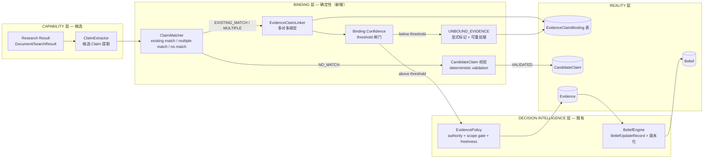
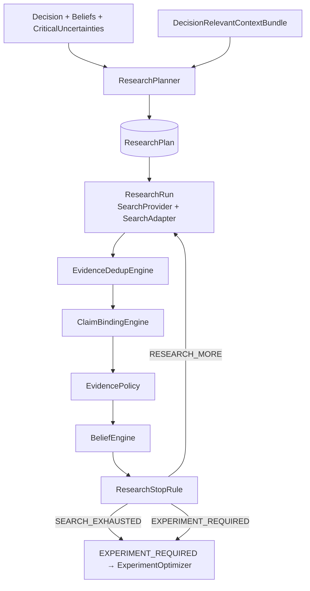
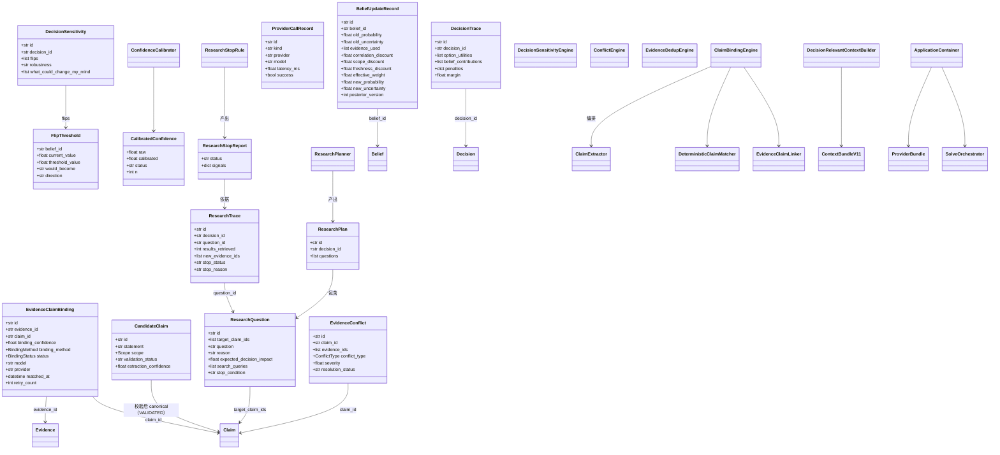
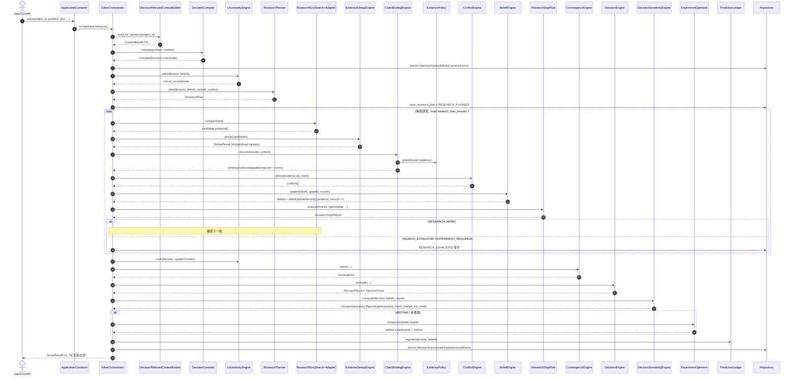
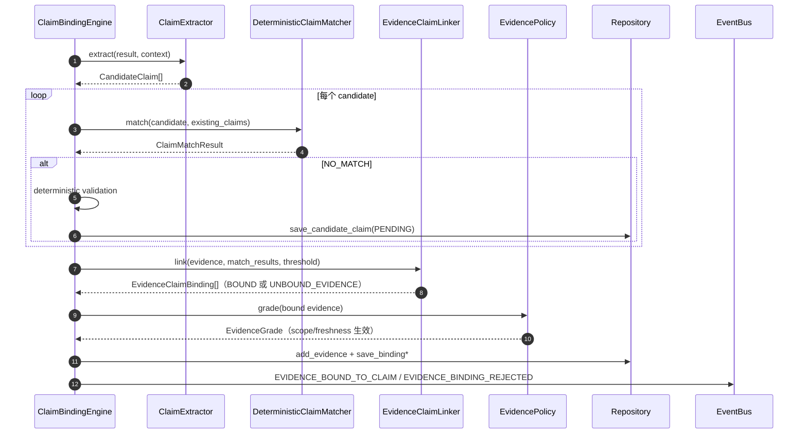

# Vencertia Adaptive Decision System v1.1 — 增量架构设计

> 状态：设计基线（v1.1）
> 作者：高见远（首席架构师）
> 上游：v1.0 Decision Runtime（git b0f0b63，65 src / 174 tests / L0 26-26 / L1 6-6 / demo 闭环）
> 读者：工程师（以 TASK_BREAKDOWN_NEXT.md 为施工图）、评审者、QA
> 约束：**不推翻 v1.0 设计原则**（Deterministic runtime owns state；capability 无写权；Agent 不成为架构）；**不大改 domain model 既有对象**（可扩展字段/新对象，不重写）；**依赖最小化**（不新增第三方运行时依赖；向量库只留 adapter）；语言中文。

---

## 1. 设计立场与范围

v1.1 是 v1.0 的**增量**：不动三层架构、不动域对象主干、不动事件日志模型，只做四件事：

1. **把研究证据真正接进判断闭环**（v1.0 最大缺口：`runtime.py:587` 附近 `claim_ids=[]` 空绑定 —— 检索/搜索产生的证据从未绑定 Claim，也就从未影响 Belief）。
2. **让 Settings 真正决定运行时 Provider**（v1.0 `api.py`/`cli.py` 各自硬编码 `MockProvider`，`MODEL_PROVIDER` 环境变量形同虚设）。
3. **把"决策相关性"显式化**：Context 按决策相关性构造、Research 有计划、Research 有停止规则、决策有敏感度与可解释追踪。
4. **把可评估性做实**：Claim Binding Accuracy / Research Efficiency / Evidence Yield / Belief Delta Quality / Decision Change Precision 全部有持久化记录与基准用例。

**v1.1 不可违反的继承不变式**（来自 v1.0 §8，原样保留）：
LLM 输出不是真相；Evidence 不可变；Belief 是派生状态；决策必须可拒答；状态变更唯一入口是 Deterministic Runtime；KILLED 不能是 Primary；Company Case 证据不得直接改项目 WTP；预测必须先登记后结算；没有 benchmark 证据的 OSS/模型集成不得准入。

---

## 2. 实现路径（难点分析与选型）

| 难点 | 应对 | 选型/理由 |
|---|---|---|
| 证据→Claim 绑定无监督且要可评估 | 引入 **ClaimBindingEngine** 四段流水线：Extract → Match → Link → Bind；绑定记录持久化，`UNBOUND_EVIDENCE` 显式留痕 | 不引入 NER/嵌入模型依赖；匹配默认 deterministic（exact/normalized/lexical），semantic 只留 Protocol adapter |
| Provider 可替换但无统一装配 | **ApplicationContainer**（Settings → Repository Factory → Provider Factory → Runtime Factory → API/CLI） | 单一装配根；API 与 CLI 共用；新增 provider 只改 factory 注册表 |
| 上下文要"决策相关"而非"最新 N 条" | **DecisionRelevantContextBuilder + ContextRanker**（10 维排序，deterministic/lexical 基线） | 不要求向量库；Vector 为可替换 adapter（`SemanticRanker` Protocol） |
| 研究无边界（一直搜下去） | **ResearchPlanner**（问题化）+ **ResearchStopRule**（信号化停止） | 纯确定性信号：marginal value / diversity / coverage / delta / cost / duplicate / quality |
| 决策为什么是这样 / 什么会改变它 | **DecisionTrace**（EU 分解）+ **DecisionSensitivityEngine**（翻转阈值 + STRONG/FRAGILE） | 纯函数扫描，无依赖 |
| 同一条新闻转载 10 次算 10 条 | **EvidenceDedupEngine**（fingerprint / canonical source / source family / independence / similarity） | fingerprint 精确去重丢弃；相似组共享 `independence_group` 走 v1.0 已有折减 |
| 过期信息与矛盾信息没被惩罚 | **Freshness**（published_at/valid_from/valid_until/freshness_score）+ **EvidenceConflictEngine** | freshness 折扣进 effective weight；conflict 抬升 uncertainty |
| 校准置信度会伪造 | **ConfidenceCalibrator**：样本不足 → `UNCALIBRATED`（calibrated=None），不插值伪造 | 复用 CalibrationProfile bins，分段线性映射，无新依赖 |
| 施工规模大但任务数受限 | 5 个任务 × 3 轮迭代（Iter1 Wiring / Iter2 Reliability / Iter3 Learning） | 见 TASK_BREAKDOWN_NEXT.md |

**技术选型不变**：Python 3.11+ / pydantic v2（`extra="forbid"`）/ SQLite 默认 + Postgres 门控 / FastAPI / typer+rich / httpx；新增 dev-only `ruff`（CI 用）；运行时第三方依赖**零新增**。

---

## 3. 增量架构总览（4 张增量图）

### 3.1 P0-1 Claim Binding Pipeline



### 3.2 P0-2 Provider Composition Root

```mermaid
flowchart TB
    ENV[env VENCERTIA_*]
    S[Settings<br/>model_provider / db_dsn / research_* / binding_*]
    S --> RF[Repository Factory<br/>sqlite | postgres(DSN门控)]
    S --> PF[Provider Factory<br/>model/search/retrieval]
    PF --> M[MockProvider]
    PF --> O[OpenAICompatibleProvider]
    PF -->|future registry| L[litellm/anthropic/gemini/local<br/>adapter 留接口]
    RF --> R[(Repository)]
    PF --> P[ProviderBundle]
    R --> EC[EngineBundle<br/>既有引擎 + v1.1 新引擎]
    P --> ORCH[SolveOrchestrator]
    EC --> ORCH
    ORCH --> API[FastAPI create_app]
    ORCH --> CLI[typer cli]
    style API fill:#eef
    style CLI fill:#eef
```

### 3.3 Research Pipeline（Planner → Run → Stop）



### 3.4 /v1/solve v1.1 完整闭环

```mermaid
flowchart LR
    A[ContextBuilder] --> B[DecisionCompiler]
    B --> C[Critical Unknowns]
    C --> D[ResearchPlanner]
    D --> E[ResearchRun]
    E --> F[ClaimBinding]
    F --> G[EvidencePolicy]
    G --> H[BeliefUpdate]
    H --> I[ResearchStopCheck]
    I -->|RESEARCH_MORE| E
    I --> J[Uncertainty]
    J --> K[Convergence]
    K --> L[DecisionEngine + Trace]
    L --> M[Sensitivity]
    M --> N{CONVERGED?}
    N -->|yes| O[Recommendation]
    N -->|no / SEARCH_CAN_HELP| P[ExperimentOptimizer]
    N -->|ABSTAIN| P
    P --> Q[PredictionLedger]
    Q --> R[Persist]
    R --> S[标准 Solve 输出]
```



---

## 4. 新增/修改模块职责与接口

### 4.1 P0-1 Claim Binding Engine（核心新增）

**职责**：把 Research Result 变成"绑定了 Claim 的 Evidence + 持久化绑定记录"；没有匹配时显式标记 `UNBOUND_EVIDENCE`，绝不偷偷绑定；Candidate Claim 必须过 deterministic validation 才能 canonical。

**领域对象（`domain/binding.py`）**：

```python
class BindingMethod(str, Enum):
    EXACT_MATCH = "EXACT_MATCH"                 # 归一化后全等
    NORMALIZED_MATCH = "NORMALIZED_MATCH"       # 归一化 + 停用词后近似
    LEXICAL_MATCH = "LEXICAL_MATCH"             # token overlap >= 阈值
    SEMANTIC_MATCH = "SEMANTIC_MATCH"           # adapter（可选）
    MANUAL = "MANUAL"
    EXTRACTOR_INFERRED = "EXTRACTOR_INFERRED"   # 提取器推断（低置信，需闸门）

class BindingStatus(str, Enum):
    BOUND = "BOUND"
    UNBOUND_EVIDENCE = "UNBOUND_EVIDENCE"

class EvidenceClaimBinding(VencertiaBaseModel):
    id: str                       # EB_...
    evidence_id: str
    claim_id: str | None = None   # UNBOUND_EVIDENCE 时为 None
    binding_confidence: float = Field(ge=0, le=1)
    binding_method: BindingMethod
    status: BindingStatus = BindingStatus.BOUND
    model: str | None = None      # 提取/匹配所用模型（无模型时 None）
    provider: str | None = None
    matched_at: datetime = Field(default_factory=utcnow)
    retry_count: int = 0          # UNBOUND 重处理次数
    version: int = 1

class CandidateClaim(VencertiaBaseModel):
    id: str                       # CC_...
    statement: str
    scope: Scope
    claim_type: ClaimType = ClaimType.HYPOTHESIS
    source_evidence_ids: list[str] = []
    extractor_model: str | None = None
    extractor_provider: str | None = None
    extraction_confidence: float = Field(default=0.5, ge=0, le=1)
    validation_status: str = "PENDING"   # PENDING | VALIDATED | REJECTED
    created_at: datetime = Field(default_factory=utcnow)

class ClaimMatchResult(VencertiaBaseModel):
    candidate: CandidateClaim
    matched_claim_ids: list[str]
    scores: dict[str, float] = {}       # {claim_id: score}
    verdict: str                        # EXISTING_MATCH | MULTIPLE_MATCH | NEW_CANDIDATE | NO_MATCH

class ClaimBindingInput(VencertiaBaseModel):
    research_results: list[dict]        # 归一化后的 Document/SearchResult 载荷
    context: ContextBundle
    existing_claims: list[Claim] = []
    auto_extract: bool = True
    binding_confidence_threshold: float = 0.6

class ClaimBindingOutput(VencertiaBaseModel):
    bindings: list[EvidenceClaimBinding]      # BOUND
    unbound: list[EvidenceClaimBinding]       # UNBOUND_EVIDENCE
    new_candidates: list[CandidateClaim]      # 待校验（绝不直接 canonical）
    applied_evidence: list[Evidence]          # 已通过 Policy 分级（供 Belief 更新）
    rejected_evidence: list[dict]             # [{evidence_id, reason}]
    notes: list[str] = []
```

**引擎接口（`runtime/claim_binding.py`）**：

```python
class ClaimExtractor:
    """Research Result → CandidateClaim[]（capability 输出，仅候选）。"""
    def __init__(self, model: ModelProvider | None = None, settings: Settings | None = None): ...
    def extract(self, result: dict, context: ContextBundle) -> list[CandidateClaim]: ...

class DeterministicClaimMatcher:
    """归一化匹配基线：exact → normalized → lexical；semantic 可注入。"""
    def normalize(self, text: str) -> str: ...          # lowercase / 去标点 / 折叠空白 / CJK 全半角统一
    def match(self, candidate: CandidateClaim, existing: list[Claim],
              semantic: SemanticClaimMatcher | None = None) -> ClaimMatchResult: ...
    # 阈值：EXACT 1.0 / NORMALIZED >= 0.9 / LEXICAL >= 0.7 / SEMANTIC(adapter) 可覆盖

class SemanticClaimMatcher(Protocol):
    """可替换 adapter（未来向量库），v1.1 不实现，仅协议。"""
    def similarity(self, query: str, candidates: list[str]) -> list[float]: ...

class EvidenceClaimLinker:
    """Evidence → Claim 多对多绑定；无匹配 → UNBOUND_EVIDENCE。"""
    def link(self, evidence: Evidence, result: ClaimMatchResult,
             threshold: float) -> list[EvidenceClaimBinding]: ...

class ClaimBindingEngine:
    """绑定流水线编排：Extract → Match → Validate Candidate → Link → Persist。"""
    def __init__(self, extractor: ClaimExtractor, matcher: DeterministicClaimMatcher,
                 linker: EvidenceClaimLinker, policy: EvidencePolicy,
                 repo: Repository, bus: EventBus | None = None): ...
    def process(self, inp: ClaimBindingInput) -> ClaimBindingOutput: ...
```

**关键规则**：
1. 同一 Evidence 可绑多条 Claim（MULTIPLE_MATCH）；每条绑定独立记录。
2. 无匹配 → `EvidenceClaimBinding(status=UNBOUND_EVIDENCE, claim_id=None)` 持久化 + 事件 `EVIDENCE_BINDING_REJECTED`；允许 `retry_count` 递增后重处理（`/v1/evidence/bind` 重跑）。
3. Candidate Claim 即使来自 LLM 也**不得**直接 `Claim.model_validate` canonical；必须过 `deterministic validation`（非空、scope 合法、长度界、与既有 claim 归一化去重、与同批候选去重）→ `validation_status=PENDING` 入库；`VALIDATED` 需人工/评审路径（v1.1 提供 API 标记）。
4. 绑定级 scope 门：`COMPANY_CASE` evidence 只能绑 `COMPANY_CASE/WORLD/MARKET` claim；`PROJECT` evidence 只能绑 `PROJECT/CUSTOMER` claim；跨 scope → rejected。
5. `binding_confidence = match_score × extraction_confidence`；低于阈值 → UNBOUND。
6. 绑定记录是 Claim Binding Accuracy 的唯一数据源（L1 指标）。

### 4.2 P0-2 Provider Composition Root（新增）

**职责**：Settings 决定运行时 Provider；API/CLI 共用同一装配根；未来 provider 注册表留接口。

**`providers/factory.py`**：

```python
class ProviderBundle(VencertiaBaseModel):
    model: ModelProvider
    search: SearchProvider | None = None
    retrieval: RetrievalProvider | None = None

def create_model_provider(settings: Settings) -> ModelProvider: ...
    # model_provider=mock → MockProvider
    # model_provider=openai_compatible → OpenAICompatibleProvider(base_url/api_key/model/timeout)
    # 未来: litellm/anthropic/gemini/local → 注册表 factory 追加（不破坏调用方）
def create_search_provider(settings: Settings) -> SearchProvider | None: ...
def create_retrieval_provider(settings: Settings) -> RetrievalProvider | None: ...
def create_provider_bundle(settings: Settings) -> ProviderBundle: ...
def register_model_provider(name: str, factory: Callable[[Settings], ModelProvider]) -> None: ...
    # OSS 准入（ADR-006）后注册；出厂仅 mock + openai_compatible
```

**`container.py`（ApplicationContainer）**：

```python
class ApplicationContainer:
    """单一装配根：Settings → Repository → Providers → Engines → Orchestrator → API/CLI。"""
    def __init__(self, settings: Settings | None = None): ...
    @property
    def settings(self) -> Settings: ...
    @property
    def repository(self) -> Repository: ...          # sqlite 默认；pg DSN 门控
    @property
    def providers(self) -> ProviderBundle: ...
    @property
    def bus(self) -> EventBus: ...                   # sink=repo.append_event
    @property
    def engines(self) -> EngineBundle: ...           # v1.0 引擎 + v1.1 引擎
    @property
    def orchestrator(self) -> SolveOrchestrator: ...
    def fastapi_app(self) -> FastAPI: ...            # API 唯一入口
    def typer_app(self) -> typer.Typer: ...          # CLI 唯一入口

def build_container(settings: Settings | None = None) -> ApplicationContainer: ...
```

`api.py` 与 `cli.py` 全部改为 `container = build_container()` → `container.fastapi_app()/typer_app()`，删除各自 `default_runtime` 硬编码装配。事件：`PROVIDER_SELECTED`（provider/model 选择后发）。

### 4.3 P0-3 DecisionRelevantContextBuilder（升级）

**职责**：每次 Decision Compiler / Research Planner / Capability 推理前构造统一 ContextBundle；组合 15 类上下文；10 维排序。

**`runtime/context_ranker.py`**：

```python
class ContextBundleV11(ContextBundle):
    """在 v1.0 ContextBundle 上扩展（保持字段兼容，新增全为可选）。"""
    objectives: list[Objective] = []
    claims: list[Claim] = []
    strong_evidence: list[Evidence] = []          # authority 高 + 与决策相关
    contradictory_evidence: list[Evidence] = []   # 冲突证据显式呈现
    recent_outcomes: list[Outcome] = []
    open_experiments: list[Experiment] = []
    previous_decisions: list[Decision] = []
    company_cases: list[CompanyCase] = []
    financial_snapshots: list[FinancialSnapshot] = []
    constraints: list[str] = []
    critical_uncertainties: list[CriticalUncertainty] = []

class ContextRanker:
    """确定性排序（10 维加权，全部可配置）。"""
    def score_evidence(self, e: Evidence, decision: Decision | None,
                       beliefs: list[Belief]) -> float: ...
    # 维度权重（settings.context_rank_weights，默认）：
    # scope_match 0.15 | decision_relevance 0.20 | belief_dependency 0.10 |
    # authority 0.15 | evidence_strength 0.10 | temporal_validity 0.05 |
    # recency 0.10 | conflict 0.05 | semantic 0.05 | information_value 0.05

class SemanticRanker(Protocol):
    """向量 ranker adapter（v1.1 不实现；deterministic/lexical 为默认）。"""
    def rank(self, query: str, candidates: list[str]) -> list[float]: ...

class DecisionRelevantContextBuilder(ContextBuilder):
    def __init__(self, repo: Repository, ranker: ContextRanker | None = None,
                 semantic: SemanticRanker | None = None): ...
    def build_for_decision(self, project_id: str, decision: Decision | None = None,
                           user_id: str | None = None, limit: int = 15) -> ContextBundleV11: ...
```

### 4.4 P0-4 ResearchPlanner（新增）

**职责**：输入 Decision/Claims/Beliefs/CriticalUncertainties/Context → `ResearchQuestion[]`；优先研究 Decision-Critical Unknowns。

**`domain/research.py`**：

```python
class ResearchQuestion(VencertiaBaseModel):
    id: str                       # RQ_...
    decision_id: str | None = None
    target_claim_ids: list[str]
    question: str
    reason: str
    expected_decision_impact: float = Field(ge=0, le=1)
    preferred_source_types: list[str] = []   # [OFFICIAL_DATA, PRIMARY_RESEARCH, ...]
    search_queries: list[str] = []
    stop_condition: str                      # 如 "3 个独立来源一致 或 belief delta < 0.02"

class ResearchPlan(VencertiaBaseModel):
    id: str                       # RP_...
    decision_id: str
    questions: list[ResearchQuestion] = []
    created_at: datetime = Field(default_factory=utcnow)
    version: int = 1

class ResearchTrace(VencertiaBaseModel):
    id: str                       # RT_...
    decision_id: str
    question_id: str
    started_at: datetime
    completed_at: datetime | None = None
    query: str = ""
    queries_executed: int = 0
    results_retrieved: int = 0
    new_evidence_ids: list[str] = []
    duplicate_dropped: int = 0
    stop_status: str = "RESEARCH_MORE"   # RESEARCH_MORE | SEARCH_EXHAUSTED | EXPERIMENT_REQUIRED
    stop_reason: str = ""
    provider: str = ""
    model: str = ""
    request_id: str = ""
```

**`runtime/research_planner.py`**：

```python
class ResearchPlanner:
    """确定性基线：按 CriticalUncertainty.impact 排序取 top-k 生成问题。"""
    def __init__(self, model: ModelProvider | None = None, settings: Settings | None = None,
                 repo: Repository | None = None): ...
    def plan(self, decision: Decision, beliefs: list[Belief],
             criticals: list[CriticalUncertainty],
             context: ContextBundleV11) -> ResearchPlan: ...
    # 无 criticals → 空 plan；model 提供时可用 LLM 生成候选问题，仍需 schema 校验 + 回退 deterministic
```

### 4.5 P0-5 Research Stop Rule（新增）

**职责**：区分 `RESEARCH_MORE / SEARCH_EXHAUSTED / EXPERIMENT_REQUIRED`；考虑 8 类信号。

**`domain/research.py` 增补**：

```python
class ResearchStopReport(VencertiaBaseModel):
    status: str                   # RESEARCH_MORE | SEARCH_EXHAUSTED | EXPERIMENT_REQUIRED
    reason: str = ""
    signals: dict = {}            # marginal_value/source_diversity/claim_coverage/
                                  # belief_delta/decision_change_prob/search_cost/duplicate_rate/source_quality
    per_question: list[dict] = []
```

**`runtime/research_stop.py`**：

```python
class ResearchStopRule:
    def __init__(self, settings: Settings | None = None,
                 sensitivity: DecisionSensitivityEngine | None = None): ...
    def evaluate(self, traces: list[ResearchTrace],
                 beliefs_before: list[Belief], beliefs_after: list[Belief],
                 target_claims: list[str], decision: Decision | None = None,
                 round_no: int = 1) -> ResearchStopReport: ...
    # 停止条件（settings 可调）：
    # 1) belief_delta(avg |Δp|) < research_stop_marginal_value(0.02) 且
    #    duplicate_rate > research_stop_duplicate_rate(0.5) 且
    #    source_quality(新证据平均 authority) < 阈值 且 coverage 高 → SEARCH_EXHAUSTED
    # 2) 剩余关键不确定性只能由 PROJECT 现实观测解决 → EXPERIMENT_REQUIRED
    # 3) 其余 → RESEARCH_MORE
```

### 4.6 Evidence Pipeline 升级（dedup / conflict / freshness / scope）

**`domain/evidence.py` 扩展字段**（全部可选，向后兼容）：

```python
# Evidence 新增（默认 None/0，不改既有构造语义）
published_at: datetime | None = None
valid_from: datetime | None = None
valid_until: datetime | None = None
freshness_score: float | None = None          # 0..1，EvidencePolicy 计算
content_fingerprint: str | None = None        # sha256(归一化文本)
canonical_source_id: str | None = None        # 来源规范化 id（URL/注册 source_id）
source_family: str | None = None              # 域名/媒体族（同一新闻转载识别）
similarity_group: str | None = None           # 相似组 id（analytics）
```

**`runtime/evidence_dedup.py`**：

```python
class DedupGroup(VencertiaBaseModel):
    group_id: str
    canonical_evidence_id: str
    member_ids: list[str]
    drop_reason: str = ""           # EXACT_FINGERPRINT | SAME_SOURCE_FAMILY | SIMILARITY
    independence_group: str

class DedupResult(VencertiaBaseModel):
    groups: list[DedupGroup]
    dropped_ids: list[str]          # 精确重复 → 不持久化
    kept_ids: list[str]             # canonical 保留，共享 independence_group 折减

class EvidenceDedupEngine:
    def fingerprint(self, evidence: Evidence) -> str: ...
    def canonical_source(self, evidence: Evidence) -> str: ...
    def source_family(self, evidence: Evidence) -> str: ...
    def group(self, evidence_list: list[Evidence]) -> DedupResult: ...
```

**`domain/evidence_conflict.py`**：

```python
class ConflictType(str, Enum):
    DIRECT_CONTRADICTION = "DIRECT_CONTRADICTION"
    TEMPORAL = "TEMPORAL"
    CAUSAL = "CAUSAL"
    NUMERIC = "NUMERIC"

class EvidenceConflict(VencertiaBaseModel):
    id: str                       # ECF_...
    claim_id: str
    evidence_ids: list[str]
    conflict_type: ConflictType = ConflictType.DIRECT_CONTRADICTION
    severity: float = Field(ge=0, le=1)
    resolution_status: str = "OPEN"   # OPEN | RESOLVED | SUPERSEDED
    created_at: datetime = Field(default_factory=utcnow)
    resolved_at: datetime | None = None
    version: int = 1

class ConflictEngine:
    def detect(self, evidence_by_claim: dict[str, list[Evidence]],
               threshold: float = 0.3) -> list[EvidenceConflict]: ...
    def apply_to_belief(self, belief: Belief, conflict: EvidenceConflict) -> Belief: ...
    # uncertainty += 0.15 * severity（封顶 1.0）；写入 BeliefUpdateRecord.conflict_uncertainty_raise
```

**EvidencePolicy 升级（`runtime/evidence_policy.py`）**：

```python
def freshness_factor(self, evidence: Evidence, now: datetime | None = None) -> float:
    # 0 if now > valid_until；1 if within [valid_from, valid_until]；
    # 否则 exp(-age_days / freshness_half_life_days)；未设有效期 → 1.0
def grade(...):  # effective_weight 乘 freshness_factor，返回 EvidenceGrade.freshness_discount
```

**Scope 加强**：新增绑定级 scope 矩阵（见 4.1 规则 4）+ L0 用例 `COMPANY_CASE≠PROJECT`（绑定与更新双测试）。

### 4.7 Belief Engine 升级

**`domain/belief.py` 扩展**：

```python
# Belief 新增字段（默认值向后兼容）
posterior_version: int = 1                    # 每次更新 +1
previous_snapshot: dict | None = None         # {probability, uncertainty, alpha, beta}
last_evidence_batch_id: str | None = None
policy_version: str = "1.0"

class BeliefUpdateRecord(VencertiaBaseModel):
    id: str                       # BUR_...
    belief_id: str
    claim_id: str
    old_probability: float
    old_uncertainty: float
    evidence_used: list[str]
    authority: str
    verification: str
    correlation_discount: float = 1.0     # independence 折减（v1.0 已有语义）
    scope_discount: float = 1.0           # COMPANY_CASE prior-only 折减
    freshness_discount: float = 1.0       # v1.1 新增
    effective_weight: float
    new_probability: float
    new_uncertainty: float
    conflict_uncertainty_raise: float = 0.0   # v1.1 新增（冲突抬升）
    update_method: str = "BETA_BERNOULLI"
    policy_version: str = "1.1"
    posterior_version: int
    created_at: datetime = Field(default_factory=utcnow)
    version: int = 1
```

**`runtime/belief_engine.py`**：`update()` 返回 `BeliefUpdateOutput` 时同步生成 `BeliefUpdateRecord[]` 并持久化（`repo.save_belief_update_record`），每个 Belief 的 `posterior_version += 1`、`previous_snapshot` 记录更新前快照、`last_evidence_batch_id` 记录批次。`uncertainty_of()` 后处理 `conflict_uncertainty_raise`。

### 4.8 Decision Engine 升级（Trace / Sensitivity / Robustness）

**`domain/decision_trace.py`**：

```python
class BeliefContribution(VencertiaBaseModel):
    belief_id: str
    claim_id: str
    contribution: float           # coef × p（该 belief 对 EU 的贡献）
    direction: str                # SUPPORTS | CONTRADICTS | NEUTRAL

class DecisionTrace(VencertiaBaseModel):
    id: str                       # DT_...
    decision_id: str
    option_utilities: list[dict] = []   # [{option_id, expected_utility, uncertainty_penalty, adjusted_utility}]
    belief_contributions: list[BeliefContribution] = []
    penalties: dict = {}                # {risk_aversion, irreversible, opportunity}
    margin: float = 0.0
    critical_uncertainty: float = 0.0
    computed_at: datetime = Field(default_factory=utcnow)

class FlipThreshold(VencertiaBaseModel):
    belief_id: str
    claim_id: str
    current_value: float
    threshold_value: float
    would_become: str             # 翻转后的推荐 option id / status
    direction: str                # falls_below | rises_above

class DecisionSensitivity(VencertiaBaseModel):
    id: str                       # DS_...
    decision_id: str
    current_recommendation: str
    flips: list[FlipThreshold] = []
    robustness: str               # STRONG_DECISION | FRAGILE_DECISION
    what_could_change_my_mind: list[str] = []
    computed_at: datetime = Field(default_factory=utcnow)
    version: int = 1
```

**`runtime/decision_sensitivity.py`**：

```python
class DecisionSensitivityEngine:
    def __init__(self, settings: Settings | None = None): ...
    def compute(self, decision: Decision, beliefs: list[Belief],
                decision_result: DecisionResult) -> DecisionSensitivity: ...
    # 对每个 relevant belief：p ∈ [0,1] 步进 settings.sensitivity_step(0.01) 重算 option scores，
    # 找到推荐翻转的阈值；robustness：margin >= robustness_margin_threshold(0.05)
    # 且无翻转阈值在 |Δp| < 0.10 内 → STRONG_DECISION，否则 FRAGILE_DECISION
```

`runtime/decision_engine.py`：`evaluate()` 增加 `build_trace()`（返回 `DecisionTrace`，纯函数不落库；落库由 orchestrator/API 完成）。

### 4.9 其他

#### 4.9.1 Experiment Optimizer（升级）
`domain/experiment.py` 新增字段：`executability: float = 1.0`、`founder_constraints: dict = {}`、`sample_quality: float = 0.5`、`ambiguity_clarity: float = 0.5`、`measurement_reliability: float = 0.5`。
`runtime/experiment_optimizer.py`：
- `validate(experiment) -> ExperimentValidationResult`：强制 `success_criteria/failure_criteria/ambiguity_criteria` 非空；`action` 非 vague（拒绝"再做些访谈"类：匹配 `interview` + `more/再` 或 action 长度 < 阈值 → REJECTED）。
- `rank()` 分数乘 `executability × measurement_reliability`，并对低 `sample_quality/ambiguity_clarity` 施加惩罚。

#### 4.9.2 Prediction Ledger（immutable 加强）
`domain/prediction.py` 新增 `resolution_source: str | None = None`（outcome_id / evidence_id / user）。
`runtime/prediction_ledger.py`：
- `resolve(entry_id, outcome, resolution_source=None)`：只新增 `resolution/outcome/resolved_at/resolution_source/snapshot_verified`，**永不改写** `predicted_probability/belief_snapshot`。
- `correct(entry_id, new_outcome, source)`：创建新版本 `PredictionEntry`（`version+1`，`corrected` 标记）+ 事件 `PREDICTION_CORRECTED`，原记录保留。

#### 4.9.3 Benchmark（L0/L1/L2 + OSS Admission）
- `benchmark/l0.py`：新增能力用例（claim binding / unbound / multiple binding / research stop / provider factory / context injection / dedup / contradiction / sensitivity / calibration correction）。
- `benchmark/metrics.py` 新增：`compute_claim_binding_accuracy`、`compute_research_efficiency`、`compute_evidence_yield`、`compute_belief_delta_quality`、`compute_decision_change_precision`；缺失数据返回 `None`（统一报告为 N/A，不伪造）。
- `benchmark/harness.py`：`BenchmarkReport` 支持 N/A；`comparison_report` 升级为 **OSSAdmissionExperiment**（baseline vs candidate frozen cases delta → `CANDIDATE_ADMITTED/REJECTED`）。
- `benchmark/l2.py`（新增）：`L2Runner` — prospective predictions 先登记后结算；schema 见 `data/benchmarks/l2/predictions.jsonl`（字段：id/project_id/claim_id/target/predicted_probability/registered_at/due_at/outcome/resolved_at/resolution_source）。

#### 4.9.4 可观测性
**`domain/observability.py`**：

```python
class ProviderCallRecord(VencertiaBaseModel):
    id: str                       # PCR_...
    kind: str                     # model | search | retrieval | research
    provider: str
    model: str
    request_id: str
    task_kind: str                # compile | research_plan | extract | match | research_run | ...
    started_at: datetime
    latency_ms: float
    tokens: dict = {}             # {input, output}
    cost: float = 0.0
    success: bool = True
    retry_count: int = 0
    error_type: str | None = None
    # 明确约定：不记录 prompt / 敏感内容
```

**`runtime/observability.py`**：`CallRecorder`（包装 provider 调用，记录 `ProviderCallRecord` 并 `repo.save_call_record`）。

#### 4.9.5 Provider Failure Handling
`providers/factory.py` 提供 `with_resilience(provider)` 包装：捕获 `httpx.TimeoutException / HTTPStatusError / json.JSONDecodeError / SchemaMismatchError / EmptyResultError / PartialResultError` → 重试策略（指数退避，`settings.provider_max_retries=2`）→ 失败返回结构化错误。**管道纪律**：外部输出一律 Candidate → Validation → 仅通过后才持久化（ClaimBindingEngine / EvidencePolicy 承担），失败绝不污染 canonical 状态。

#### 4.9.6 新事件（`events/types.py` 增补）
```python
RESEARCH_PLANNED, RESEARCH_STARTED, RESEARCH_COMPLETED, RESEARCH_EXHAUSTED,
EVIDENCE_BOUND_TO_CLAIM, EVIDENCE_BINDING_REJECTED,
DECISION_SENSITIVITY_COMPUTED, PROVIDER_SELECTED, PREDICTION_CORRECTED
```

#### 4.9.7 API 新增/增强
```
POST /v1/research/plan          {decision_id} → ResearchPlan
POST /v1/research/run           {decision_id, question_ids?, max_queries?} → ResearchTrace[]
POST /v1/evidence/bind          {evidence_id, candidate_claims?, auto_extract?} → ClaimBindingOutput
GET  /v1/evidence/{id}/bindings → EvidenceClaimBinding[]
GET  /v1/decisions/{id}/sensitivity → DecisionSensitivity
GET  /v1/decisions/{id}/trace   → DecisionTrace
GET  /v1/beliefs/{id}/history   → BeliefUpdateRecord[]
GET  /v1/research/{decision_id}/trace → ResearchTrace[]
POST /v1/solve（升级）            → SolveResultV11
```

#### 4.9.8 /v1/solve 标准输出
`SolveResult` 扩展为（新增字段全可选，向后兼容 v1.0 测试）：

```python
class SolveResultV11(SolveResult):
    confidence_calibrated: CalibratedConfidence | None = None
    why: DecisionTrace | None = None
    belief_snapshot: list[dict] = []              # [{belief_id, claim_id, probability, uncertainty, posterior_version}]
    what_could_change_my_mind: list[str] = []
    robustness: str | None = None
    research_performed: list[ResearchTrace] = []
    evidence_used: list[str] = []
    evidence_rejected: list[dict] = []
    success_criteria: str | None = None
    failure_criteria: str | None = None
    stop_condition: str | None = None
```

输出段（用户可见）：`DECISION / CONVERGENCE / CONFIDENCE / WHY / CRITICAL UNCERTAINTY / BELIEF SNAPSHOT / WHAT COULD CHANGE MY MIND / RESEARCH PERFORMED / EVIDENCE USED / EVIDENCE REJECTED / NEXT EXPERIMENT / SUCCESS CRITERIA / FAILURE CRITERIA / STOP CONDITION`。

#### 4.9.9 工程卫生与 CI
- `Makefile`：`PYTHON ?= python3`；新增 `make lint`（ruff）、`make ci`（lint→test→benchmark→API smoke→CLI smoke）。
- `.gitignore` 追加：`*.db`、`*.zip`、`coverage/`、`.coverage`、`data/benchmarks/output/`、`htmlcov/`。
- `.github/workflows/ci.yml`：`install → ruff check → pytest → benchmark L0 → API smoke → CLI smoke`。
- `pyproject.toml`：dev extra 增 `ruff>=0.5`；`[tool.ruff]` line-length=100 target-version="py311"；version `1.1.0`。
- 合并重复文档（见 §7 文件改动清单）。

---

## 5. 数据模型（v1.1 增量 classDiagram）



（完整 v1.1 类图另存 `docs/v1.1-class-diagram.mermaid`；v1.0 图不覆盖。）

---

## 6. 程序调用流（v1.1 关键 sequenceDiagram）

### 6.1 /v1/solve v1.1 完整闭环



### 6.2 Claim Binding（单证据路径）



---

## 7. 持久化与迁移

- **新实体类型**（generic `entities` 表即可容纳，均带唯一 id + version）：
  `candidate_claim` / `research_plan` / `research_trace` / `decision_sensitivity` / `decision_trace` / `evidence_conflict` / `call_record`。
- **专表（SQLite，热查询路径）**：`claim_bindings`（按 evidence_id/claim_id 快速查绑定）、`belief_update_records`（历史查询）。Postgres/Memory 复用 generic store 或同结构表。
- **`repositories/migrations/0003_v1_1.sql`**（幂等）：创建 `claim_bindings`、`belief_update_records` 两表。
- `Repository` 协议新增方法（EntityStoreMixin 提供 generic 默认实现；SQLite 覆盖热路径）：

```python
def save_binding(self, b: EvidenceClaimBinding, expected_version: int | None = None) -> None: ...
def get_binding(self, binding_id: str) -> EvidenceClaimBinding | None: ...
def list_bindings(self, evidence_id: str | None = None, claim_id: str | None = None,
                  status: str | None = None) -> list[EvidenceClaimBinding]: ...
def save_candidate_claim(self, c: CandidateClaim, expected_version: int | None = None) -> None: ...
def list_candidate_claims(self, validation_status: str | None = None) -> list[CandidateClaim]: ...
def save_belief_update_record(self, r: BeliefUpdateRecord) -> None: ...
def list_belief_update_records(self, belief_id: str) -> list[BeliefUpdateRecord]: ...
def save_research_plan(self, p: ResearchPlan) -> None: ...
def get_research_plan(self, plan_id: str) -> ResearchPlan | None: ...
def list_research_plans(self, decision_id: str) -> list[ResearchPlan]: ...
def save_research_trace(self, t: ResearchTrace) -> None: ...
def list_research_traces(self, decision_id: str) -> list[ResearchTrace]: ...
def save_decision_trace(self, t: DecisionTrace) -> None: ...
def get_decision_trace(self, decision_id: str) -> DecisionTrace | None: ...
def save_decision_sensitivity(self, s: DecisionSensitivity, expected_version: int | None = None) -> None: ...
def get_decision_sensitivity(self, decision_id: str) -> DecisionSensitivity | None: ...
def save_evidence_conflict(self, c: EvidenceConflict, expected_version: int | None = None) -> None: ...
def list_evidence_conflicts(self, claim_id: str | None = None) -> list[EvidenceConflict]: ...
def save_call_record(self, r: ProviderCallRecord) -> None: ...
def list_call_records(self, kind: str | None = None, since: datetime | None = None) -> list[ProviderCallRecord]: ...
```

---

## 8. 现有文件改动清单（v1.0 → v1.1）

### 8.1 修改（M）

| 文件 | 改动 |
|---|---|
| `src/vencertia/config.py` | 新增 Settings：`research_max_questions/rounds/queries_per_round`、`research_stop_marginal_value/duplicate_rate`、`binding_confidence_threshold`、`semantic_rank_provider`（默认 deterministic）、`dedup_similarity_threshold`、`freshness_half_life_days`、`sensitivity_step`、`robustness_margin_threshold`、`context_rank_weights`、`provider_max_retries`、`call_log_enabled`；`policy_version` → `"1.1"` |
| `src/vencertia/domain/evidence.py` | 扩展 freshness/dedup 字段（§4.6） |
| `src/vencertia/domain/belief.py` | `posterior_version/previous_snapshot/last_evidence_batch_id/policy_version`（§4.7） |
| `src/vencertia/domain/experiment.py` | `executability/founder_constraints/sample_quality/ambiguity_clarity/measurement_reliability`（§4.9.1） |
| `src/vencertia/domain/prediction.py` | `resolution_source`（§4.9.2） |
| `src/vencertia/domain/calibration.py` | `CalibratedConfidence`（§4.9.4/4.9.8） |
| `src/vencertia/domain/__init__.py` | 导出新对象 |
| `src/vencertia/events/types.py` | 新事件枚举（§4.9.6） |
| `src/vencertia/repositories/base.py` | 新协议方法 + `ENTITY_TYPES` 增补（§7） |
| `src/vencertia/repositories/sqlite.py` | `claim_bindings`/`belief_update_records` 专表 + 新方法 |
| `src/vencertia/repositories/postgres.py` / `memory.py` | 新方法（generic/内存实现） |
| `src/vencertia/runtime/evidence_policy.py` | freshness 折扣；绑定级 scope 门；`EvidenceGrade.freshness_discount` |
| `src/vencertia/runtime/belief_engine.py` | `BeliefUpdateRecord` 生成 + 版本化 + conflict raise |
| `src/vencertia/runtime/decision_engine.py` | `build_trace()` 返回 `DecisionTrace` |
| `src/vencertia/runtime/convergence_engine.py` | 集成 ResearchStop 信号（SEARCH_EXHAUSTED 判定可注入） |
| `src/vencertia/runtime/experiment_optimizer.py` | criteria 强制 + executability/sample/ambiguity/measurement 评分（§4.9.1） |
| `src/vencertia/runtime/prediction_ledger.py` | immutable resolve + `correct()` 新版本 + audit（§4.9.2） |
| `src/vencertia/runtime/calibration_engine.py` | `calibrate(raw, group)`（样本不足 UNCALIBRATED） |
| `src/vencertia/runtime/runtime.py` | solve 闭环重构（§6.1）；`_research` 删除空绑定；`SolveResultV11` |
| `src/vencertia/runtime/context.py` | `ContextBundleV11` + `DecisionRelevantContextBuilder` 底座（或独立新文件，见新增） |
| `src/vencertia/api.py` | 全部走 `ApplicationContainer`；新端点（§4.9.7）；solve 返回 v1.1 |
| `src/vencertia/cli.py` | 全部走 `ApplicationContainer`；新命令 `research plan/run`、`evidence bind`、`decision sensitivity/trace`、`belief history` |
| `src/vencertia/capabilities/research.py` | ResearchRun（planner→search→candidate evidence，带 provider call record） |
| `src/vencertia/capabilities/__init__.py` | `DecisionCompiler.compile` 接收 ContextBundleV11 |
| `src/vencertia/providers/mock.py` | 新增 research_plan / extract / match 的确定性模板；provider name 规范化 |
| `src/vencertia/providers/openai_compatible.py` | 超时/错误映射（Timeout/RateLimit/InvalidJSON/SchemaMismatch/Empty/Partial） |
| `src/vencertia/providers/search.py` | `SearchAdapter` 输出含 fingerprint/source_family/canonical_source + call record |
| `src/vencertia/benchmark/l0.py` | 新增能力用例（§4.9.3） |
| `src/vencertia/benchmark/l1.py` | 新指标接入（Claim Binding Accuracy 等） |
| `src/vencertia/benchmark/metrics.py` | 5 个新指标函数；N/A 语义 |
| `src/vencertia/benchmark/harness.py` | N/A 支持 + `oss_admission_experiment()` |
| `Makefile` | `PYTHON ?= python3`；`lint/ci` 目标 |
| `.gitignore` | 追加 `*.db/*.zip/coverage/benchmark outputs` |
| `pyproject.toml` | version 1.1.0；dev extra `ruff`；`[tool.ruff]` 配置 |

### 8.2 新增（A）

| 文件 | 职责 |
|---|---|
| `src/vencertia/providers/factory.py` | Provider Factory + `ProviderBundle` + resilience 包装 + 注册表（§4.2） |
| `src/vencertia/container.py` | `ApplicationContainer`（§4.2） |
| `src/vencertia/domain/binding.py` | `EvidenceClaimBinding/CandidateClaim/ClaimMatchResult/BindingMethod/BindingStatus`（§4.1） |
| `src/vencertia/domain/research.py` | `ResearchQuestion/ResearchPlan/ResearchTrace/ResearchStopReport`（§4.4/4.5） |
| `src/vencertia/domain/belief_update.py` | `BeliefUpdateRecord`（§4.7） |
| `src/vencertia/domain/evidence_conflict.py` | `EvidenceConflict/ConflictType`（§4.6） |
| `src/vencertia/domain/decision_trace.py` | `BeliefContribution/DecisionTrace/FlipThreshold/DecisionSensitivity`（§4.8） |
| `src/vencertia/domain/observability.py` | `ProviderCallRecord`（§4.9.4） |
| `src/vencertia/runtime/claim_binding.py` | `ClaimExtractor/DeterministicClaimMatcher/EvidenceClaimLinker/ClaimBindingEngine`（§4.1） |
| `src/vencertia/runtime/context_ranker.py` | `ContextBundleV11/ContextRanker/SemanticRanker/DecisionRelevantContextBuilder`（§4.3） |
| `src/vencertia/runtime/research_planner.py` | `ResearchPlanner`（§4.4） |
| `src/vencertia/runtime/research_stop.py` | `ResearchStopRule`（§4.5） |
| `src/vencertia/runtime/evidence_dedup.py` | `EvidenceDedupEngine/DedupGroup/DedupResult`（§4.6） |
| `src/vencertia/runtime/conflict_engine.py` | `ConflictEngine`（§4.6） |
| `src/vencertia/runtime/decision_sensitivity.py` | `DecisionSensitivityEngine`（§4.8） |
| `src/vencertia/runtime/confidence_calibrator.py` | `ConfidenceCalibrator`（§4.9.4） |
| `src/vencertia/runtime/observability.py` | `CallRecorder`（§4.9.4） |
| `src/vencertia/repositories/migrations/0003_v1_1.sql` | 新表（§7） |
| `src/vencertia/benchmark/l2.py` | L2 prospective runner（§4.9.3） |
| `src/vencertia/benchmark/oss_admission.py` | OSSAdmissionExperiment（§4.9.3） |
| `.github/workflows/ci.yml` | CI（install→ruff→pytest→benchmark L0→API smoke→CLI smoke） |
| `data/benchmarks/l2/` | L2 schema 与样例（predictions.jsonl + README） |
| `docs/v1.1-design.md` / `docs/architecture-decisions-next.md` / `TASK_BREAKDOWN_NEXT.md` / `docs/v1.1-class-diagram.mermaid` / `docs/v1.1-sequence-diagram.mermaid` | 本文档族 |
| `tests/test_claim_binding.py` / `test_research.py` / `test_research_stop.py` / `test_dedup.py` / `test_conflict.py` / `test_sensitivity.py` / `test_container.py` / `test_observability.py` / `test_l2.py` | 新测试 |

### 8.3 不动（K）

`domain/claim.py`、`domain/objective.py`、`domain/project.py`、`domain/founder.py`、`domain/company.py`、`domain/memory.py`、`domain/policy.py`、`domain/action_outcome.py`、`domain/convergence.py`、`events/bus.py`、`capabilities/financial.py`、`capabilities/market.py`、`capabilities/challenger.py`、`capabilities/gtm.py`、`capabilities/founder_diagnosis.py`、`capabilities/company_intelligence.py`、`repositories/migrations/0001_initial.sql`、`0002_pg.sql`、`legacy/`、`providers/retrieval.py`、`examples/`、`schemas/`。

### 8.4 文档合并（D）

合并重复文档，保留小写连字符版为 canonical，更新引用：
- `BELIEF_ENGINE.md` + `belief-engine.md` → `belief-engine.md`
- `EVIDENCE_POLICY.md` + `evidence-policy.md` → `evidence-policy.md`
- `DECISION_ENGINE.md` + `decision-engine.md` → `decision-engine.md`
- `EXPERIMENT_OPTIMIZER.md` + `experiment-optimizer.md` → `experiment-optimizer.md`
- `DOMAIN_MODEL.md` + `domain-model.md` → `domain-model.md`
- `MIGRATION_V10_2_TO_DECISION_RUNTIME.md` + `migration-v10.2-to-decision-runtime.md` → `migration-v10.2-to-decision-runtime.md`

---

## 9. Anything UNCLEAR / 假设

1. **Semantic/Vector ranker**：v1.1 只提供 `SemanticRanker`/`SemanticClaimMatcher` Protocol + deterministic 实现；具体向量库（Qdrant 等）按 ADR-006 准入后以 adapter 接入，不进本版本依赖。
2. **CandidateClaim 的 VALIDATED 路径**：v1.1 提供 API 标记（`/v1/claims/candidates/{id}/validate`）；人工评审 UI 不在本版本。
3. **UNBOUND_EVIDENCE 重处理**：默认由用户重调 `/v1/evidence/bind` 触发；自动重试策略留 settings（`binding_auto_retry=False`）。
4. **ResearchPlanner 的 LLM 模式**：mock provider 提供确定性模板；真实 LLM 生成需先过 schema 校验（compile 同款路径），质量待 L1 数据积累。
5. **provider 成本计量**：`ProviderCallRecord.cost` 对 mock 为 0，对 OpenAI 兼容端点按 token 计价规则估算；不接入计费系统。
6. **L2 结算人工依赖**：`L2Runner` 只负责登记与到期提醒；`outcome` 由用户/OutcomeService 结算，系统不自动臆断结果。
7. **多轮 research 默认轮数**：`research_max_rounds=3`，超限未收敛 → `SEARCH_EXHAUSTED`（可配置）。
8. **SolveResultV11 向后兼容**：v1.0 的 `SolveResult` 字段全部保留，v1.1 新增字段默认 None/[]，不破坏 v1.0 测试与 API 消费者。
