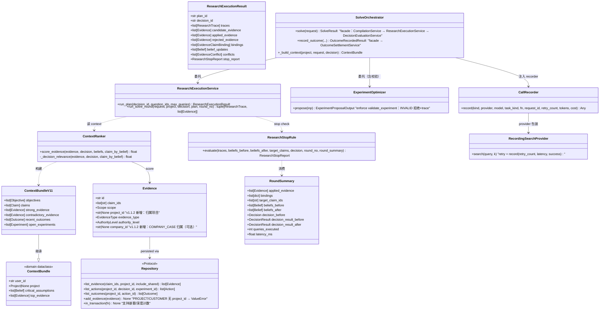
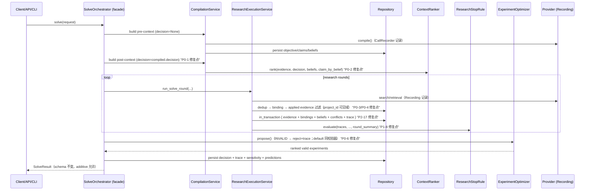

# Vencertia v1.1.2 — Runtime Integrity Hardening 审计 + 增量设计

> 作者：高见远（首席架构师） · 日期：2026-08-12 · 基线：3bf22c8（v1.1.1 RC）
> 上游：`docs/baseline-v1-1-2.md`（40 节 Master Prompt 摘要，P0×6 / P1×7 / P2×4）
> 约束：不推翻 v1.1 架构；SolveResult/API/CLI 向后兼容；新增依赖零（jsonschema 已有）

---

## 0. 审计结论总表

| # | 项 | 结论 | 确认位置（文件:行） |
|---|---|---|---|
| P0-1 | post-compile Context 无当前 Decision | **确认存在** | `runtime/runtime.py:280` 重建 context 未传 decision；`runtime/runtime.py:812-817` `_build_context` 不接收 decision；`runtime/context_ranker.py:190-196` `build_for_decision(decision=None)` 从未被传值 |
| P0-2 | ContextRanker ID namespace bug | **确认存在** | `runtime/context_ranker.py:111-123`，尤其 :119 `{f"CLM_{r}" for r in relevant}` 字符串猜测 + :121 直接比较 claim_ids vs belief_ids |
| P0-3 | Evidence 无 project_id（跨项目串扰，Release Blocker） | **确认存在** | `domain/evidence.py:29-59` 无 project_id 字段；`repositories/base.py:280-285` `list_evidence` 全量读；`runtime/context.py:56` 与 `runtime/context_ranker.py:200` 全库读 |
| P0-4 | recent_outcomes 用错误 namespace | **确认存在** | `runtime/context_ranker.py:219` `get_outcome(action.id)`（Outcome.id=OUT_* ≠ Action.id=ACT_*）；:216/:223 依赖私有 `repo._list`；修复依赖 :223 兜底循环才能取到 outcome |
| P0-5 | Research API/CLI 丢弃 candidate evidence | **确认存在** | `api.py:373-379` 与 `cli.py:254-260` `_run_research_round(...)[0]` 只存 trace；solve 主循环 :313-315 已用双返回值（API/CLI 与 solve 三路行为不一致） |
| P0-6 | Experiment validation 未 enforce | **确认存在** | `runtime/experiment_optimizer.py:118-134` propose() 注释声称 orchestrator enforce 但从不调用；`runtime/runtime.py:493` solve propose 无校验；`api.py:205-230` / `cli.py:272-298` 同样无校验；`validate_experiment` 全 src 仅导出，零调用 |
| P1-7 | CallRecorder 未接线 | **确认存在** | `runtime/runtime.py:163,202,222` EngineBundle 创建但从未包裹任何 provider call；`providers/factory.py:82-158` `_Resilient*Provider` 只做 retry/错误映射 |
| P1-8 | ResearchStopRule 假信号 | **确认存在** | `runtime/research_stop.py:61` `source_quality=0.5` 占位；:53-54 claim_coverage 用 `eid.split(":")[0]`（evidence id 不是 claim id）；:64 `decision_change_prob = avg_delta`（命名误导） |
| P1-9 | OpportunityCostEngine 命运 | **审计裁决：B（明确 Deferred）** | `runtime/runtime.py:181,212` 创建；solve/record_outcome 全程未调用（grep 仅 EngineBundle 字段） |
| P1-10 | Benchmark 语义 | **确认存在** | `benchmark/metrics.py:193-200,219` decision_accuracy 把 gold_option_id=None 的 case 按 "NO_DECISION" 计入分母；:102-107 `compute_decision_regret` 空列表返回 0.0，L1 无 utility 标签 → 假 0 regret |
| P1-11 | Skip 修复 | **确认存在** | `tests/test_api_v11.py:109-116` 依赖场景偶然性（list_candidate_claims 为空即 skip） |
| P1-12 | 版本单一来源 | **确认存在** | `pyproject.toml:7` 1.1.1；`api.py:117` FastAPI 1.1.0；`api.py:133` health api_version 1.1.0；`api.py:132` health version 1.0.0；`__init__.py:13` 1.0.0；`.env.example` 头 v1.0；`examples/demo_b2b_saas_mvp.py:1,155` v1.0 |
| P1-13 | 文档 skip=PG 门控错误 | **确认存在** | `docs/baseline-v1-1-rc.md:30`、`docs/operations.md:72,205`、`docs/iteration-v1-1-rc-3.md:25`、`docs/implementation-report-v1-1-rc.md:41,47,128`（真实原因=test_api_v11.py:113 无 candidate，非 PG 门控） |
| P2-14 | Repository private 调用 | **确认存在** | 全 src 仅 `runtime/context_ranker.py:216,223` 两处 `repo._list`（rg 确认） |
| P2-15 | 层依赖环 | **确认存在** | `capabilities/base.py:10`、`research.py:14-15`、`market.py:9`、`gtm.py:9`、`financial.py:9`、`founder_diagnosis.py:9`、`challenger.py:9`、`company_intelligence.py:12` 均 `from vencertia.runtime.context import ...`；`runtime/runtime.py:21` 又 import capabilities → 环 |
| P2-16 | SolveOrchestrator 拆分 | **确认存在** | `runtime/runtime.py` 1130 行（solve 271-606 / record_outcome 610-760 / evaluate_decision 762-808 / internals 810-1130） |
| P2-17 | Transaction boundaries | **确认存在（含隐患）** | `repositories/sqlite.py:154-161` `_txn` 存在但 `_store` :101 每次 commit → 事务内提前提交，批量原子性无效；research round 与 outcome settlement 均未事务化 |

---

## Part A：系统设计

### 1. 实现路线（Implementation Approach）

**核心难点**：v1.1.1"测试全绿但调用链语义断点"——6 个 P0 均为**真实现与文档语义之间的错位**，不是新增功能。因此 v1.1.2 的实现路线是 **增量硬化（additive hardening）+ 单一共享实现（single shared pipeline）**：

1. **不重写架构**：SolveOrchestrator 仍是确定性状态变更入口（ADR-002）；capability 输出仍是 candidate→validation→persistence（ADR-012）；所有新增字段默认值保持向后兼容（Evidence.project_id=None、RoundSummary 可选、settings 新 flag 有默认值）。
2. **三个共享实现，禁止三套 pipeline**：
   - `ResearchExecutionService`：solve 主循环、`/v1/research/run`、CLI `research run` 三路共用（P0-5 + P2-16 合一）。
   - `ContextRanker` 的 belief→claim 映射：唯一实现，禁止字符串猜测（P0-2）。
   - `validate_experiment`：唯一校验器，ExperimentOptimizer.propose / solve / API / CLI / compiled provider 输出 / default experiment 全部过同一校验器（P0-6）。
3. **租户隔离放在读边界 + 写边界各一层**：写边界在 `EntityStoreMixin.add_evidence` 强制 PROJECT/CUSTOMER 必须有 project_id；读边界在 `Repository.list_evidence(project_id=...)` 统一过滤（P0-3）。
4. **观察性走 provider 包装层**：把 CallRecorder 与 `_Resilient*Provider` 组合成 Recording 包装（P1-7），在组合根（container）接线，不动各调用点。
5. **框架选型不变**：Vite/React 不适用（纯 Python 决策运行时）；继续 FastAPI + pydantic + typer + stdlib sqlite3。新增依赖零。

**架构模式**：分层（domain / repositories / runtime / capabilities / providers / api-cli）+ 组合根（ADR-009 ApplicationContainer）+ 门面（SolveOrchestrator 保留 facade）。

### 2. 文件清单（File List）

新增（5）：
```
src/vencertia/domain/context.py                      # ContextBundle/ContextBundleV11 迁移目标（P2-15）
src/vencertia/runtime/research_service.py            # ResearchExecutionService + ResearchExecutionResult（P0-5/P2-16）
src/vencertia/runtime/compilation_service.py         # CompilationService（P2-16）
src/vencertia/runtime/decision_evaluation_service.py # DecisionEvaluationService（P2-16）
src/vencertia/runtime/outcome_settlement_service.py  # OutcomeSettlementService（P2-16）
```

修改（20）：
```
src/vencertia/__init__.py                            # __version__ 单一来源（P1-12）
pyproject.toml                                       # version=1.1.2（P1-12）
src/vencertia/domain/evidence.py                     # +project_id（P0-3）
src/vencertia/repositories/base.py                   # list_evidence(project_id=...)、list_actions/list_outcomes、add_evidence 强校验、事务深度（P0-3/P0-4/P2-17）
src/vencertia/repositories/sqlite.py                 # _store 事务内不提前 commit（P2-17）
src/vencertia/repositories/memory.py                 # 同上（EntityStoreMixin 继承，通常无需改）
src/vencertia/repositories/postgres.py               # 同上（EntityStoreMixin 继承，通常无需改）
src/vencertia/runtime/context_ranker.py              # _decision_relevance belief→claim 映射；recent_outcomes 走公开 API（P0-2/P0-4）
src/vencertia/runtime/context.py                     # ContextBundle 移走后保留 ContextBuilder；import 指向 domain.context
src/vencertia/runtime/research_stop.py               # 真实信号 + RoundSummary（P1-8）
src/vencertia/runtime/experiment_optimizer.py        # propose() enforce validate_experiment（P0-6）
src/vencertia/runtime/runtime.py                     # _build_context(decision=...)、validate 接线、CallRecorder 接线、OpportunityCost 裁决、服务拆分 facade（P0-1/P0-6/P1-7/P1-9/P2-16）
src/vencertia/runtime/observability.py               # CallRecorder.record 支持 retry/tokens/cost；或迁移至 providers/observability.py
src/vencertia/providers/factory.py                   # create_provider_bundle(settings, recorder=None) 组合 Recording 包装（P1-7）
src/vencertia/container.py                           # provider 构造传 recorder（P1-7）
src/vencertia/api.py                                 # /v1/research/run 走 ResearchExecutionService；版本；/v1/experiments/propose 校验（P0-5/P0-6/P1-12）
src/vencertia/cli.py                                 # research run 走同一服务；版本（P0-5/P1-12）
src/vencertia/benchmark/metrics.py                   # decision_accuracy 拆分；regret N/A（P1-10）
src/vencertia/benchmark/harness.py                   # chosen/best_utility → float|None（P1-10）
src/vencertia/benchmark/l0.py / l1.py                # 指标口径适配（P1-10）
src/vencertia/config.py                              # opportunity_cost_enabled、evidence 相关 flag（P1-9/P0-3）
src/vencertia/capabilities/*.py                      # ContextBundle import 指向 domain.context（P2-15）
src/vencertia/capabilities/__init__.py               # DecisionCompiler 输出 experiments 记录 validation 状态（P0-6）
tests/test_api_v11.py                                # skip 修复：确定性 fixture（P1-11）
tests/test_context.py / test_evidence_policy.py 等   # PROJECT 证据补 project_id（P0-3 机械修正）
.env.example                                         # 全量 Settings + 去 v1.0 标注（P1-12）
examples/demo_b2b_saas_mvp.py                        # banner v1.1.2（P1-12）
docs/baseline-v1-1-rc.md / operations.md / iteration-v1-1-rc-3.md / implementation-report-v1-1-rc.md
                                                     # skip 原因修正 + HISTORICAL SNAPSHOT（P1-13）
```

### 3. 数据结构与接口（Data Structures & Interfaces）



### 4. 程序调用流（Program Call Flow）



### 5. 未明确事项（Anything UNCLEAR）

1. **P0-3 COMPANY_CASE 隔离粒度**：当前 Evidence 无 company_id；v1.1 用 CompanyCase 实体 + transferability gate。最小实现先按"project_id 归属 + project_id=None 视为共享（仍受 ADR-004 transferability gate 约束）"，company 级隔离留待 v1.2（Intelligence Competition）。若用户要求 COMPANY_CASE 按 company identity 严格隔离，需为 Evidence 增加 company_id（已留字段位，见 classDiagram）。
2. **P1-8 decision_sensitivity_signal 的数值口径**：采用"推荐是否翻转 + distance-to-flip 缩减比例"的确定性定义；无统计依据，不叫 probability。
3. **P1-9 OpportunityCost**：选择 B（Deferred）基于成本/收益判断（见 7.9 裁决理由）；若产品侧要求 solve 后自动更新 portfolio，改为 A 的成本在 2-4 人日，可在 Iter2 追加。
4. **P0-5 `/v1/research/run` 语义**：修复后该端点将从"只存 trace"升级为"完整执行一轮 research pipeline 并落库 applied evidence/beliefs"。响应体 additive（原有 traces 字段保留在 result 内）。破坏性仅在于端点此前不产生证据——这正是要修的缺陷。
5. **迁移数据**：真实 v1.1 库中已有的 PROJECT/CUSTOMER evidence 无 project_id。提供 `scripts/backfill_evidence_project_ids.py`（按 claim_ids → claims.project_id 回填；无法解析的保持 None，读时不再进入任何项目上下文，只作为共享 external 的 MARKET/WORLD 可见）。若用户数据量很大需评审回填脚本性能。

---

## Part B：P0 修复设计（Iter1）

### 6.1 P0-1 post-compile Context 无当前 Decision

**审计确认**：
- `runtime.py:280`：`context = self._build_context(project, request)`（post-compile 重建，未传 decision）。
- `runtime.py:812-817`：`_build_context` 调用 `build_for_decision(project.id, user_id=..., limit=15)`，无 decision 参数。
- `runtime.py:856-872` `_persist_compiled` 不落库 decision → 此时 `repo.list_decisions()` 为空 → `context_ranker.py:232` `latest = decisions[0] if decisions else decision` = None → 全部证据 `_decision_relevance` 退化为 0.5 平坦分。
- 结论：post-compile 的 15 类上下文（决策相关性排序、critical uncertainties）在决策未落库时是"决策盲"的。

**修复设计**：
```python
# runtime.py
def _build_context(self, project: Project, request: SolveRequest,
                   decision: Decision | None = None) -> ContextBundle:
    if self.engines.context_builder_v11 is not None:
        return self.engines.context_builder_v11.build_for_decision(
            project.id, user_id=request.user_id, limit=15, decision=decision,
        )
    return self.engines.context_builder.build(project.id, request.user_id, limit=15)

# solve():
pre_context = self._build_context(project, request)                     # decision=None 合法
...
context = self._build_context(project, request, decision=compiled.decision)  # P0-1 修复
```
- pre-compile 允许 None（编译前本来就没有 decision）；post-compile 必须传 `compiled.decision`。
- `context_ranker.py:232` 保持 `latest = decisions[0] if decisions else decision` 不变（现在 decisions 可能仍为空，但 decision 参数已就位）。

**测试**：`post_compile_context_uses_current_decision`
- 用 FakeCompiler（或直接构造 SolveOrchestrator + stub compiler）返回 decision A（relevant_belief_ids=["BLF_WTP"]）与 decision B（relevant_belief_ids=["BLF_OTHER"]）。
- 库中 belief: `BLF_WTP→CLM_WTP`、`BLF_OTHER→CLM_OTHER`；evidence E_REL(claim_ids=["CLM_WTP"])、E_IRR(claim_ids=["CLM_OTHER"])（同 authority，排除 P0-2 修复前 authority 主导的遮蔽）。
- 断言 solve 内部重建的 `context.top_evidence[0] == E_REL`；换 decision B 后排序翻转。

### 6.2 P0-2 ContextRanker ID namespace bug

**审计确认**：
- `context_ranker.py:111-123`：`claim_ids`（CLM_*）vs `decision.relevant_belief_ids`（BLF_* / mock 里是 "wtp"）。
- :119 `{f"CLM_{r}" for r in relevant}` 字符串猜测：对 mock 的 `wtp` 生成 `CLM_wtp`，与实际 `CLM_WTP` 大小写不匹配 → 永不命中；:121 直接 `claim_ids ∩ relevant` 跨 namespace 永不命中。
- 现状被 L0 `_cap_context_injection` 通过是因为 authority 权重（0.95 vs 0.65）主导，decision_relevance 0.4 vs 0.3 只差 0.02，bug 被遮蔽。

**修复设计**：
```python
# context_ranker.py
@staticmethod
def _decision_relevance(evidence, decision, claim_by_belief: dict[str, str] | None = None) -> float:
    if decision is None:
        return 0.5
    claim_ids = {c for c in (evidence.claim_ids or [])}
    if not claim_ids:
        return 0.3
    if claim_by_belief:
        relevant_claim_ids = {
            claim_by_belief[bid] for bid in (decision.relevant_belief_ids or [])
            if bid in claim_by_belief
        }
        if relevant_claim_ids and claim_ids.intersection(relevant_claim_ids):
            return 1.0
        return 0.4
    # 无 mapping（纯 legacy 调用）：降级 0.5，绝不字符串猜测
    return 0.5

def score_evidence(self, evidence, decision, beliefs, claim_by_belief=None) -> float:
    decision_relevance = self._decision_relevance(evidence, decision, claim_by_belief)
    ...
```
- `DecisionRelevantContextBuilder.build_for_decision` 构造 `claim_by_belief = {b.id: b.claim_id for b in beliefs}` 并传入 ranker。
- **禁止字符串猜测**：删除 `{f"CLM_{r}" ...}` 逻辑。

**测试**：`relevant_evidence_outranks_unrelated_evidence_via_belief_mapping`
- decision.relevant_belief_ids=["wtp"]；beliefs=[Belief(id="wtp", claim_id="CLM_WTP")]。
- E_REL claim_ids=["CLM_WTP"]，E_IRR claim_ids=["CLM_OTHER"]，其余维度完全一致。
- 断言 `ranker.score_evidence(E_REL, decision, beliefs, claim_by_belief) > ranker.score_evidence(E_IRR, ...)`，且 E_REL 的 decision_relevance 维度 = 1.0。
- 回归：L0 `_cap_context_injection` 仍通过（修复后相关性贡献更强，正确性提升不破坏断言）。

### 6.3 P0-3 Project/Tenant Evidence Isolation（Release Blocker）

**审计确认**：
- `domain/evidence.py:29-59` 无 project_id。
- `repositories/base.py:280-285` `list_evidence` 全量；`context.py:56`、`context_ranker.py:200` 全库读。
- 任意项目 A 的 PROJECT 证据在项目 B 的 ContextBundle 中可见 → 决策污染。

**修复设计**：
1. **模型**：`Evidence.project_id: str | None = None`；`Evidence.company_id: str | None = None`（COMPANY_CASE 预留，v1.1.2 可选）。
2. **写边界（Repository 单一入口 enforce，ADR-002）**：
```python
# repositories/base.py EntityStoreMixin
def add_evidence(self, evidence, *, allow_missing_project: bool = False) -> None:
    scope = evidence.scope.value if hasattr(evidence.scope, "value") else str(evidence.scope)
    if (not allow_missing_project) and scope in (Scope.PROJECT.value, Scope.CUSTOMER.value) \
            and not evidence.project_id:
        raise ValueError(
            f"project-scoped evidence requires project_id (scope={scope}, id={evidence.id}) — v1.1.2 integrity rule"
        )
    self._save(evidence)
```
   - `allow_missing_project=True` 仅用于迁移/导入（`legacy/import_v10_2.py`）。
3. **读边界**：
```python
# repositories/base.py
def list_evidence(self, claim_ids=None, project_id=None, include_shared=True) -> list[Evidence]:
    rows = self._list("evidence")
    if project_id is not None:
        out = []
        for e in rows:
            if e.project_id == project_id:
                out.append(e)
            elif include_shared and e.project_id is None:
                scope = e.scope.value if hasattr(e.scope, "value") else str(e.scope)
                if scope in (Scope.WORLD.value, Scope.MARKET.value, Scope.COMPANY_CASE.value):
                    out.append(e)  # 共享 external / company case（仍受 ADR-004 transferability gate）
        rows = out
    if claim_ids is not None:
        wanted = set(claim_ids)
        rows = [e for e in rows if wanted.intersection(e.claim_ids)]
    return rows
```
   - ContextBuilder（context.py:56）与 DecisionRelevantContextBuilder（context_ranker.py:200）改为 `self.repo.list_evidence(project_id=project_id)`。
   - solve 主循环 :328 `repo.list_evidence()`（fingerprint 去重用）保持全量（技术查询），但绑定/applied 路径仍走 project 域。
4. **归属规则**：
   - `record_outcome` 生成 PROJECT 证据（runtime.py:648-663）→ `project_id=action.project_id`（decision 缺失时用 action.project_id）。
   - `_run_research_round` / `_doc_to_evidence` / SearchAdapter → `project_id=当前 project.id`（"为该项目收集的"MARKET 证据）。
   - `claim_binding.py:458/474` repo.add_evidence → 传入 project_id（由 ClaimBindingInput.context 携带 project_id 或由 orchestrator 在 process 前回填 candidate.project_id）。
   - API `add_evidence`：EvidenceRequest 可带 project_id；缺省时尝试从 claim_ids 推导（第一个 claim 的 project_id），否则 REJECTED（HTTP 400）。
5. **迁移/向后兼容**：
   - Evidence 存 JSON → 无 DDL。新增 `scripts/backfill_evidence_project_ids.py`：对 project_id=None 且 scope ∈ {PROJECT,CUSTOMER} 的行，按 claim_ids → claims.project_id 回填；无法解析 → 保持 None（读时只见于共享 external 过滤外，即不进入任何项目上下文）。
   - 现有测试中构造 PROJECT 证据未带 project_id 的 fixture 需机械补 `project_id="PRJ_1"`（test_context.py、test_evidence_policy.py 等；行为变化按 Release Gate D 记录 comparison report）。

**测试**：`project_A_private_evidence_not_visible_to_project_B`
- repo：Project A/B；E_A(PROJECT, project_id=A, claim CLM_A)、E_B(PROJECT, project_id=B, claim CLM_B)、E_SHARED(MARKET, project_id=None)。
- `repo.list_evidence(project_id="A")` → 含 E_A、E_SHARED，不含 E_B。
- `ContextBuilder(repo).build("A").top_evidence` 不含 E_B；`build("B")` 不含 E_A。
- `repo.add_evidence(E_PROJECT_NO_PID)` → ValueError。

### 6.4 P0-4 recent_outcomes 空 / namespace bug

**审计确认**：
- `context_ranker.py:219` `get_outcome(action.id)`：Outcome.id=OUT_*，Action.id=ACT_* → 永远查不到（None）。
- :216/:223 依赖 `repo._list("action"/"outcome")` 私有 API；:223-225 兜底循环实际是唯一能取到 outcome 的路径（且只对 decision_id 关联的 action 生效）。
- 结论：recent_outcomes 依赖私有 API + 错误 namespace 的"意外恢复"，语义断裂。

**修复设计**：
1. **Repository Protocol 正式扩展**（base.py）：
```python
def list_actions(self, project_id: str | None = None,
                 decision_id: str | None = None,
                 experiment_id: str | None = None) -> list[Action]: ...
def list_outcomes(self, project_id: str | None = None,
                  action_id: str | None = None) -> list[Outcome]: ...
```
   - EntityStoreMixin 实现基于 `_list` 过滤（InMemory/SQLite/Postgres 三后端 parity 自动获得）。
2. **ContextBuilder 重写**（context_ranker.py:212-225）：
```python
actions = self.repo.list_actions(project_id=project_id)
outcomes = self.repo.list_outcomes(project_id=project_id)
# 或按 decision 过滤：
actions = self.repo.list_actions(decision_id=d.id) for d in decisions
outcomes = [o for a in actions for o in self.repo.list_outcomes(action_id=a.id)]
```
   - 禁用 `repo._list`（P2-14 一并清除）。
   - `recent_outcomes` = outcomes（按 observed_at 倒序截断 limit）。

**测试**：
- `context_contains_recent_outcomes`：save_action(ACT_1, decision_id=DEC_1) + save_outcome(OUT_1, action_id=ACT_1) → build_for_decision("PRJ_1") 的 recent_outcomes 含 OUT_1（此前 get_outcome(ACT_1) 为 None）。
- `repository_public_action_outcome_queries`：list_actions(project_id/decision_id/experiment_id) 与 list_outcomes(project_id/action_id) 三后端（InMemory/SQLite/PG-skip 环境至少 InMemory+SQLite）过滤正确。

### 6.5 P0-5 Research API/CLI 不完整

**审计确认**：
- `api.py:373-379`：`trace = runtime._run_research_round(...)[0]`，只存 trace，candidate evidence 丢弃、不做 binding/belief update。
- `cli.py:254-260`：同样 `[0]`。
- solve 主循环（runtime.py:313-315）已正确使用 `(trace, candidates)` → 三路行为不一致。

**修复设计**：正式 `ResearchExecutionService`（与 P2-16 提取合一）。
```python
# src/vencertia/runtime/research_service.py
class ResearchExecutionResult(VencertiaBaseModel):
    plan_id: str
    decision_id: str
    traces: list[ResearchTrace] = []
    candidate_evidence: list[Evidence] = []
    applied_evidence: list[Evidence] = []
    rejected_evidence: list[dict] = []
    bindings: list = []
    belief_updates: list[Belief] = []
    conflicts: list = []
    stop_report: ResearchStopReport | None = None

class ResearchExecutionService:
    def __init__(self, repo, engines, policy, settings, bus, model, search, retrieval): ...
    def run_plan(self, decision_id: str, question_ids: list[str] | None = None,
                 max_queries: int | None = None) -> ResearchExecutionResult: ...
    def run_solve_round(self, request, project, decision, plan, round_no) -> tuple[ResearchTrace, list[Evidence]]:
        """solve 主循环使用的单轮实现（与 run_plan 共享内部 _execute_round）。"""
```
- 内部 `_execute_round`：search/retrieval（外部 IO，Recording 包装）→ dedup → claim binding → applied 证据落库（project_id 回填）→ conflict → belief update → trace → stop rule。**solve 主循环、/v1/research/run、CLI research run 三路只调这一个实现**。
- solve 主循环改为委托 `self.engines.research_execution.run_solve_round(...)`（保持现有 SolveResult 字段不变）。
- `run_plan` 返回完整 `ResearchExecutionResult`；API/CLI 输出其 model_dump。
- provider 失败路径保持现有纪律（不产生假证据，trace.notes 记录，stop 规则自然 SEARCH_EXHAUSTED）。

**测试**：
- `research_api_changes_belief_when_valid_evidence_arrives`：POST /v1/research/plan + /v1/research/run 后，repo 中存在 applied evidence 且目标 belief posterior 变化。
- `research_cli_uses_same_pipeline`：CLI research run 与 solve 路径产生相同 applied evidence 集合（同一 search 输入）。
- `research_provider_failure_creates_no_fake_evidence`：FailingSearchProvider 抛 ProviderError → applied_evidence 为空、trace.notes 含失败说明、belief 不变（现有 GAP-02 纪律保持）。

### 6.6 P0-6 Experiment validation 未 enforce

**审计确认**：
- `experiment_optimizer.py:118-134` propose() 注释声称"orchestrator/API enforce"，但 runtime.py:493、api.py:205、cli.py:272 均未调用 validate_experiment。
- 全 src 中 validate_experiment 仅测试调用（tests/test_v11_extra.py）。

**修复设计**：
```python
# experiment_optimizer.py ExperimentProposalInput 增加
class ExperimentProposalInput:
    ...
    rejected: list[dict] = field(default_factory=list)  # 输出：被拒实验及原因（通过输出对象回传）

def propose(self, inp) -> ExperimentProposalOutput:
    valid, rejected = [], []
    for exp in inp.candidates:
        result = validate_experiment(exp)
        if result.valid:
            valid.append(exp)
        else:
            rejected.append({"experiment_id": exp.id, "name": exp.name,
                             "reasons": result.reasons})
    ranked = self.rank(valid, inp.beliefs, critical_belief_id=inp.critical_belief_id)
    # 全 invalid 时：default experiment 也必须过同一 validator
    if not ranked and inp.candidates and not valid:
        from vencertia.runtime.runtime import SolveOrchestrator
        default = SolveOrchestrator._synthesize_default_experiment(inp.decision, inp.critical_belief_id)
        v = validate_experiment(default)
        if v.valid:
            ranked = [RankedExperiment(experiment=default, priority_score=0.0)]
        # INVALID default → 理论上不可能（默认模板自带三 criteria），仍防御性记录
    return ExperimentProposalOutput(ranked=..., decision_insufficient=True,
                                    reason=..., rejected=rejected)
```
- `ExperimentProposalOutput` 增加 `rejected: list[dict]`（additive）。
- solve（runtime.py:493-511）：`proposal.rejected` 追加到 trace/rationale；default experiment 分支改为"先过 validator，VALID 才作为 next_experiment"。
- `api.py /v1/experiments/propose`：INVALID candidate 不进 ranked，响应带 `rejected` 列表（additive）。
- **compiled provider 输出**（capabilities/__init__.py:92-99）：DecisionCompiler 返回的 `experiments` 在 solve 中使用前先过 `validate_experiment` 过滤（放在 propose() 内统一处理即覆盖）。
- **统一入口**：所有入口（solve / API / CLI / provider 输出 / default）都过 `validate_experiment`，无第二套标准。

**测试**：
- `solve_never_persists_invalid_experiment`：FakeCompiler 输出含模糊 action 的 experiment → solve 后 repo.list_experiments 不含该 id，且 proposal.rejected 非空。
- `provider_generated_vague_experiment_is_rejected`：直接 ExperimentOptimizer.propose(候选="Do some more interviews") → rejected 命中、ranked 不含它。
- `default_experiment_passes_validator`：`validate_experiment(_synthesize_default_experiment(...)).valid is True`。

---

## Part C：P1 修复设计（Iter2）

### 7.7 CallRecorder 接线（P1-7）

**审计确认**：EngineBundle 创建 CallRecorder（runtime.py:163,202,222）但从未包裹任何 provider call。

**修复设计**：
1. **组合式包装**：扩展 `providers/factory.py` 的 `_Resilient*Provider`，接受可选 `recorder: CallRecorder | None`；内部调用改为"retry 循环 + 记录"：
```python
class _ResilientSearchProvider:
    def __init__(self, inner, settings, recorder=None):
        ...
    def search(self, query, k=5):
        attempts = self.settings.provider_max_retries + 1
        def _do():
            last = None
            for attempt in range(attempts):
                try:
                    return self._inner.search(query, k=k), attempt
                except Exception as exc:
                    last = exc
            raise classify_provider_error(last)
        if self.recorder is None:
            result, _ = _do()
            return result
        result = self.recorder.record(
            kind="search", provider=self.name, model=getattr(self._inner, "model", ""),
            task_kind="search", fn=lambda: _do()[0],
            retry_count=lambda: ...,  # 或 _do 返回 attempts 计数
        )
        return result
```
   - 简化方案：`CallRecorder.record` 增加可选参数 `retry_count: int = 0, tokens: dict | None = None, cost: float = 0.0`；包装器把最终 attempt 计数、provider 暴露的 usage（OpenAICompatible 可提供）传入。
2. **接线**：`create_provider_bundle(settings, recorder=None)` → `with_resilience(provider, settings, recorder)`；`container.providers` 属性改为 `create_provider_bundle(self.settings, recorder=self.call_recorder)`（container 新增 `call_recorder` property：`CallRecorder(self.repository, enabled=self.settings.call_log_enabled, settings=self.settings)`）。
   - EngineBundle 保留 call_recorder 字段（不破坏构造），但真实接线在 provider 层完成。
3. **红线保持**：ProviderCallRecord 不存 prompt/API key（域模型已有约束，observability.py:76 suppress 逻辑保留）。
4. `repo.list_call_records()` 可见真实 solve 记录。

**测试**：
- `solve_records_model_call`：solve 后 list_call_records(kind="model") 非空，含 provider/model/latency_ms/success。
- `research_records_search_calls`：research run 后 list_call_records(kind="search") 非空。
- `failed_provider_call_is_recorded`：FailingProvider → record.success=False、error_type 结构化、异常照常上抛。

### 7.8 ResearchStopRule 真实信号（P1-8）

**审计确认**：source_quality=0.5 占位（:61）；claim_coverage 用 evidence id 字符串分割（:53-54，非 claim-based）；decision_change_prob=avg belief delta（:64，命名误导且非决策信号）。

**修复设计**：
```python
# runtime/research_stop.py
@dataclass
class RoundSummary:
    applied_evidence: list[Evidence] = field(default_factory=list)
    bindings: list = field(default_factory=list)            # evidence→claim
    target_claim_ids: list[str] = field(default_factory=list)
    beliefs_before: list[Belief] = field(default_factory=list)
    beliefs_after: list[Belief] = field(default_factory=list)
    decision_before: Decision | None = None
    decision_result_before: Any | None = None
    decision_result_after: Any | None = None
    queries_executed: int = 0
    latency_ms: float = 0.0

def evaluate(self, traces, beliefs_before, beliefs_after, target_claims,
             decision=None, round_no=1, round_summary: RoundSummary | None = None) -> ResearchStopReport:
    # 1) belief_delta：只对 target claims 的 posterior 真 delta（不是全库平均）
    # 2) source_quality：applied_evidence 的 authority 权重均值 × verification 乘子
    #    （用 EvidencePolicy.AUTHORITY_TABLE / VERIFICATION_MULTIPLIER；无 applied → 0.0，禁止占位 0.5）
    # 3) claim_coverage：| bound target claims ∪ new_evidence.claim_ids ∩ target_claims | / |target_claims|
    #    （claim-based，禁止 eid.split(":") 猜测）
    # 4) duplicate_rate：trace.duplicate_dropped / results_retrieved（保留）
    # 5) decision_sensitivity_signal（替代 decision_change_probability）：
    #    recommendation 翻转 → 1.0；否则 distance-to-flip 缩减比例 = clamp(1 - margin_after/margin_before, 0, 1)
    #    （margin_before<=0 → 0.0；保留 decision_change_prob 为 alias，标记 deprecated）
    # 6) search_cost：真实 queries_executed + latency_ms
```
- 向后兼容：新增 `round_summary` 可选参数；无 summary 时按现有 trace 数据尽力计算（source_quality=0.0 而非 0.5）。

**测试**（5 个）：
- `high_quality_new_evidence_leads_to_research_more`
- `duplicate_low_delta_leads_to_search_exhausted`
- `no_new_unique_leads_to_experiment_required`
- `target_claim_coverage_is_claim_based`（applied 证据 claim_ids 与 target_claims 交集驱动，证据 id 无关）
- `low_authority_results_do_not_fake_high_source_quality`（LLM_INFERENCE 证据 → source_quality 低，不得回到 0.5）
- 回归：现有 qa_v11 research_stop 三个断言（SEARCH_EXHAUSTED/EXPERIMENT_REQUIRED/RESEARCH_MORE）保持通过。

### 7.9 OpportunityCostEngine 命运（P1-9）— 裁决：B（Deferred）

**审计确认**：EngineBundle 创建（runtime.py:181,212）但 solve/record_outcome 全程未调用；仅 test_opportunity_cost.py 直接测引擎。

**裁决理由**：
1. **价值**：机会成本是 founder portfolio 级信号，需多项目 user 数据；solve 是单项目入口，当前无 portfolio 需求方（SolveResult 无此字段）。
2. **成本**：方案 A 需在 solve 尾部查询 portfolio → 重算 → 回写 options，引入 list_projects(user_id) 依赖 + 破坏"决策结果与 portfolio 解耦"的既有语义 + 回归面大。
3. **收益**：规格（40 节）未要求 solve 更新 portfolio；H2 标注本身即"非默认"。
4. **风险**：默认开启会把单项目决策与用户级组合耦合，违背 v1.1 单项目确定性。

**设计（B）**：
- EngineBundle 字段标注 `opportunity_cost: OpportunityCostEngine | None`（保持创建，兼容现有测试）。
- 新增 `Settings.opportunity_cost_enabled: bool = False`。
- solve() 尾部（decision 持久化后）：
```python
if self.settings.opportunity_cost_enabled and self.engines.opportunity_cost is not None:
    portfolio = self.repo.get_portfolio(project.user_id)
    if portfolio is not None:
        opp = next((o for o in portfolio.opportunities if o.project_id == project.id), None)
        if opp is not None:
            for option in decision.options:
                option.opportunity_cost = round(opp.opportunity_cost, 4)
            self.repo.save_decision(decision, expected_version=decision.version)
            decision_trace.notes.append("opportunity_cost updated from portfolio (opt-in)")
```
- 文档/feature claims 标注：`AVAILABLE ENGINE / NOT ACTIVE BY DEFAULT`。
- 行为默认零变化（flag=False）→ 不触发 Release Gate D 的 comparison report 要求。

**测试**：`opportunity_cost_opt_in_updates_options_only_when_enabled`
- flag=False：solve 后 options 的 opportunity_cost 不变。
- flag=True + portfolio 存在：solve 后匹配 option 更新、trace 有标注。

### 7.10 Benchmark 语义（P1-10）

**审计确认**：
- `metrics.py:219` decision_accuracy：gold 列表含 gold_option_id=None 的 case（gold="NO_DECISION"）→ 分母被无标签 case 污染（≈0.615）。
- `metrics.py:102-107` compute_decision_regret：空列表 → 0.0；L1 无 utility 标签（harness 默认 0.0/0.0）→ 假 0 regret。

**修复设计**：
1. `metrics.py compute_all` 新增三个键：
```python
option_cases  = [c for c in cases if c.get("gold_option") not in (None, "", "NO_DECISION")]
status_cases  = [c for c in cases if c.get("gold_status")]
metrics = {
    "n_cases": len(cases),
    "policy_regression_pass_rate": round(passed / n, 6) if n else 0.0,   # 全量 case 通过率（现有 pass_rate 口径）
    "decision_option_accuracy": round(compute_decision_accuracy(
        [c["predicted_option"] for c in option_cases],
        [c["gold_option"] for c in option_cases]), 6) if option_cases else None,
    "decision_status_accuracy": round(compute_status_accuracy(
        [c["predicted_status"] for c in status_cases],
        [c["gold_status"] for c in status_cases]), 6) if status_cases else None,
    # decision_accuracy 保留为 option accuracy 的兼容别名（语义修正：仅 gold_option_id 非空）
    "decision_accuracy": ...  # = decision_option_accuracy
}
```
2. `compute_decision_regret(chosen, best)`：过滤 None；无可用对 → None（N/A）。`compute_all` 的 `decision_regret` 同理。
3. `harness.BenchmarkCaseResult.chosen_utility / best_utility` 改为 `float | None = None`；L1 runner 不填（无 utility 标签）；L0 runner 保留引擎计算值（内部 utility，注明口径）。渲染层把 None 显示为 N/A（CLI benchmark_run 已有 None 处理先例：L1 metrics 置 None）。

**测试**：
- `decision_accuracy_splits_gold_option_cases`：构造 gold_option_id=None 的 case，断言 policy_regression_pass_rate 计入、decision_option_accuracy 分母排除它。
- `l1_regret_is_none_without_utility_labels`：L1 风格 case（chosen/best=None）→ decision_regret is None。
- 回归：L0 36/36 pass_rate 口径不变（gate 用 pass_rate）。

### 7.11 Skip 修复（P1-11）

**审计确认**：`test_api_v11.py:109-116` `list_candidate_claims()` 为空即 skip。

**修复设计**：测试显式创建 CandidateClaim（确定性 fixture）：
```python
def test_candidate_validate_endpoint(client):
    tc, repo, _ = client
    candidate = CandidateClaim(
        id="CC_FIXTURE",
        statement="ICP has a severe recurring problem",
        scope="PROJECT",
        source_evidence_ids=["E_FIXTURE"],
        extraction_confidence=0.9,
        validation_status="PENDING",
    )
    repo.save_candidate_claim(candidate)
    r = tc.post(f"/v1/claims/candidates/{candidate.id}/validate")
    assert r.status_code == 200
    assert r.json()["data"]["validation_status"] == "VALIDATED"
```
- 目标 0 skipped；除非真实环境 gated（PG 用例保持 DSN 门控但须在 docs 准确标注）。

### 7.12 版本单一来源（P1-12）

**修复设计**：
```python
# src/vencertia/__init__.py
__version__ = "1.1.2"                 # runtime 版本（单一来源）
__api_contract_version__ = "1.1"      # API 合约版本（minor 级）
```
- `pyproject.toml` version=1.1.2（与 `__version__` 一致；加测试 `test_version_single_source`：`importlib.metadata.version("vencertia-decision-runtime") == vencertia.__version__ == pyproject 解析值`）。
- `api.py`：`FastAPI(title=..., version=vencertia.__version__)`。
- health：
```python
{"ok": True,
 "runtime_version": vencertia.__version__,          # 1.1.2
 "api_contract_version": vencertia.__api_contract_version__,  # "1.1"
 "policy_version": settings.policy_version,
 "model_provider": settings.model_provider,
 # legacy 兼容键（不再硬编码）：
 "version": "1.0.0",        # 保留：v1.0 合约的 legacy 别名（文档注明含义）
 "api_version": vencertia.__api_contract_version__ + ".0",  # 派生 "1.1.0"
}
```
- `.env.example`：头改 v1.1.2；补齐全部 VENCERTIA_* 变量（research/binding/provider_resilience/evidence 相关）；删 v1.0 标注。
- `examples/demo_b2b_saas_mvp.py` banner → v1.1.2。

### 7.13 文档事实修复（P1-13）

- 修正文件：`docs/baseline-v1-1-rc.md:30`、`docs/operations.md:72,205`、`docs/iteration-v1-1-rc-3.md:25`、`docs/implementation-report-v1-1-rc.md:41,47,128`。
- 统一改为真实原因：`tests/test_api_v11.py:113 — no candidate claims generated in this scenario（非 PostgreSQL 门控）`。
- 历史文档（v1.0/v1.1 交付时点文档）头部加 `> HISTORICAL SNAPSHOT — 记录 v1.1.1 交付时点事实，不作为 v1.1.2 的 authority`。
- README/DELIVERY/CHANGELOG 数字在 v1.1.2 回归后更新（Iter3 收口）。

---

## Part D：P2 设计（Iter3，行为冻结后）

### 8.14 Repository private 清理
- `rg 'repo\._|self\.repo\._' src/vencertia` 仅剩 context_ranker.py:216/223 → 由 P0-4 的 list_actions/list_outcomes 公开 API 消除。Iter3 复扫确认 0 命中（backend 内部 `_list_all` 等除外）。

### 8.15 层依赖环修复
- 新建 `domain/context.py`：ContextBundle、ContextBundleV11 迁入（dataclass，无 repository 依赖）。
- `runtime/context.py` 只留 ContextBuilder（import 自 domain.context）；`runtime/context_ranker.py` import 自 domain.context。
- `capabilities/*` 全部改 `from vencertia.domain.context import ContextBundle, ContextBundleV11`。
- 依赖方向：`capabilities → domain`；`runtime → capabilities + domain`；无环。
- ContextBundle 是 DTO（ADR-001：永不持久化）→ 放 domain 层语义成立（作为 capability 接口契约）。

### 8.16 SolveOrchestrator 拆分
- 保留 `SolveOrchestrator` facade（API/CLI/container 引用不变）。
- 提取 4 个服务（新增文件见 §2）：
  - `CompilationService`：`_compile` / `_persist_compiled` / pre-post context 构建。
  - `ResearchExecutionService`：research plan + round 执行（与 P0-5 共用实现）。
  - `DecisionEvaluationService`：convergence / decision engine / trace / sensitivity / calibrator。
  - `OutcomeSettlementService`：record_outcome 全链路（outcome+evidence+belief+prediction+calibration+action）。
- `EngineBundle` 增加 4 个 service 字段（additive；`default_engine_bundle` 注入 repo/settings/bus）。
- **行为兼容约束**：SolveResult schema 不变（除非 additive）；API/CLI 签名不变；持久化数据可读（不改变 entity 语义，仅方法归属变化）。
- 拆分验收：全量 pytest 与基线一致（Iter3 回归）。

### 8.17 Transaction boundaries
- **隐患确认**：`sqlite.py:101` `_store` 每次 `self.conn.commit()`，`_txn` 包住的多写会被内层 commit 提前提交 → 批量原子性失效。
- 修复：
  - `EntityStoreMixin` 增加事务深度计数：`self._txn_depth`；`_txn` BEGIN/深度+1 → fn → COMMIT/深度-1；`_store` 仅在 `_txn_depth == 0` 时 commit（否则交给外层）。
  - InMemory：`_txn` 已直接执行 fn（内存操作天然原子，无需改）。
  - Postgres：确认 `_txn` 实现同样语义（psycopg 事务块）。
- 应用事务边界：
  1. **research round**：外部 IO（search/retrieval）完成后，把 deterministic mutation batch（evidence adds + bindings + belief updates + conflicts + trace save）包进 `repo.in_transaction(...)`。
  2. **outcome settlement**：Outcome + Evidence + Belief updates + Prediction settlement + Action completion 包进同一事务。
  3. 失败不留半个 batch：`in_transaction` 抛异常 → 整体 rollback（现有 `_txn` 已 rollback，修复 commit 时机后语义正确）。

**测试**：
- `research_round_mutation_is_atomic`：在 batch 中部注入失败（FakeRepo 在 save_binding 抛错）→ 断言 evidence/beliefs 均未落库。
- `outcome_settlement_rolls_back_on_failure`：同上，断言 Outcome 不存在。
- `sqlite_store_does_not_commit_inside_txn`：in_transaction 内两次 save，中途读连接看不到半提交（可选，用计数断言）。

---

## Part E：Shared Knowledge（共享约定）

- 所有 API 响应统一 `{code, data, message}`；错误映射：EntityNotFoundError→404、StaleWriteError→409、ValueError→400。
- **证据隔离规则（ADR-014）**：PROJECT/CUSTOMER 证据必须带 project_id（写边界强校验）；MARKET/WORLD 可 project_id=None 作为共享 external；COMPANY_CASE 受 ADR-004 transferability gate；research pipeline 产生的证据 project_id=当前项目（"为该项目收集的"）。
- **ID namespace 纪律**：Evidence.claim_ids=CLM_*；Decision.relevant_belief_ids=BLF_*；Outcome.id=OUT_* 且通过 action_id 关联 Action（ACT_*）。**禁止字符串猜测映射**；跨 namespace 必须经 Repository/引擎显式 lookup。
- **单一共享实现**：research pipeline 只允许 ResearchExecutionService 一套；experiment validation 只允许 validate_experiment 一套；版本只允许 `vencertia.__version__` 一个来源。
- ProviderCallRecord 红线：永不存 prompt/API key/敏感内容，只存元数据。
- 所有日期 ISO 8601 UTC（utcnow() aware）。
- 新增实体默认向后兼容（可选字段 + 默认值）；行为变化需 Release Gate D comparison report。
