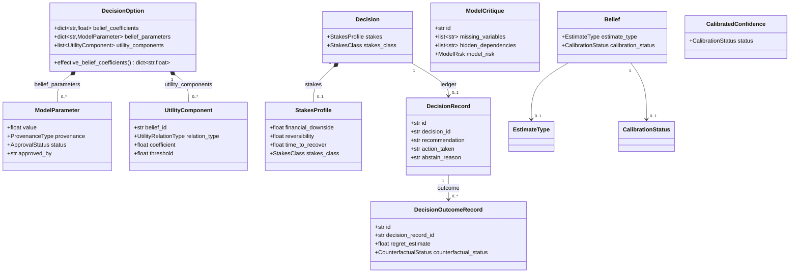
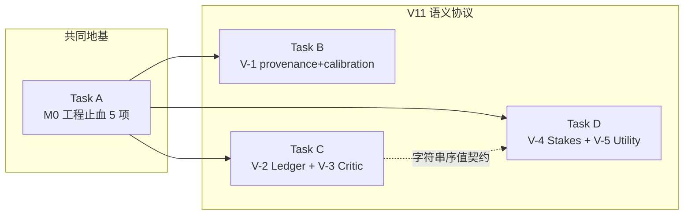

# Vencertia v1.2 增量施工图（M0 止血 + V-1~V-5 语义协议）

> 版本：1.2（增量，不重写 v1.1.2 内核）
> 架构师：高见远（Gao）· 日期：2026-08-13
> 上游输入：`docs/v1.1.2-code-walkthrough-review.md`（§7 的 5 P0 + §6 的 9 P1/P2）与 `docs/agentv11-v112-mapping-review.md`（§C 的 M0/V-1~V-7 合并排序）
> 范围裁决（主理人已定）：本轮做 **M0-1~M0-5 + V-1~V-5**；V-6（BeliefEdge 因果图）/ V-7（ActionState 词表 + EXPLORE/OPERATE）后置。
> 任务总量：**4 个任务（Task A–Task D）**（硬上限 5），按层次分组（不按单文件拆分）。
> 阅读顺序：先读 `TASK_BREAKDOWN_NEXT.md`（v1.1 施工图，粒度基准）+ 本文件，再按 Task A→D 顺序实现。

---

## 0. 铁律与总原则

1. **向后兼容铁律**：v1.1.2 的 417 tests 必须全部不回归；所有新字段必须**可选/有默认值**；默认值必须复现 v1.1.2 行为。
2. **复用既有范式**：`VencertiaBaseModel`（`extra="forbid"` + `validate_assignment` + `use_enum_values`）、`EntityStoreMixin`（generic `entities` 表）、`container.py` Composition Root、`default_engine_bundle` 装配链。
3. **零新运行时第三方依赖**；`ruff`/`pytest` 仅 dev/CI。
4. **新增枚举值一律向后兼容**：旧数据用字符串读取；`str, Enum` + `use_enum_values=True` 保证序列化仍是普通字符串，旧 JSON 能 `model_validate` 回来。
5. **M0 止血优先于 V-1~V-5**（M0 是"已承诺未兑现"的工程正确性，且是引入 V11 语义的前提）。

---

## 1. 任务总览

| ID | 任务 | 内容 | 依赖 | 优先级 |
|---|---|---|---|---|
| **Task A** | M0 工程止血（5 项） | M0-1 env 别名 / M0-2 停止信号真实化 / M0-3 API 错误 envelope / M0-4 prediction 单次落库 / M0-5 PG parity | — | P0 |
| **Task B** | V-1 provenance + calibration 地基 | CalibrationStatus 5 态 + EstimateType + ModelParameter + approval gate | Task A | P0 |
| **Task C** | V-2 Decision Ledger + V-3 Model Critic | DecisionRecord/OutcomeRecord 持久化 + 结构化 ModelCritique + critic gate 纯函数 | Task A（部分依赖 Task D 的 StakesClass，见 §6.4） | P0 |
| **Task D** | V-4 Stakes/Adaptive ABSTAIN + V-5 Utility 关系类型 | StakesProfile/StakesClass + 三段阈值带 + UtilityComponent/硬约束 | Task A | P0 |

> 依赖最小化：Task B/C/D 均只依赖 Task A（M0 是共同地基），彼此**尽量正交**；仅 Task C 的 critic gate 触发条件引用 Task D 的 `StakesClass` 字符串（跨任务契约在 §6.4 用字符串序值解耦，避免硬链）。

---

## 2. Task A — M0 工程止血（5 项，P0）

**依赖**：无（直接改 v1.1.2 代码）

### 2.1 文件清单

| 文件（相对 `src/vencertia/` 或 `tests/`） | 新增/修改 | 归属 M0 项 | 职责 |
|---|---|---|---|
| `config.py` | 修改 | M0-1 | `from_env` 兼容 `MODEL_PROVIDER` 别名（优先 `VENCERTIA_MODEL_PROVIDER`，回退读旧名 + `warnings.warn`） |
| `runtime/runtime.py` | 修改 | M0-2, M0-4 | RoundSummary 喂 `decision_result_before/after`；`_register_predictions` 单次落库 |
| `runtime/research_service.py` | 修改 | M0-2 | RoundSummary 喂 `decision_result_before/after` |
| `api.py` | 修改 | M0-3, M0-4 | 注册统一 exception handler；`create_predictions` 单次落库 |
| `cli.py` | 修改 | M0-4 | `prediction create` 单次落库 |
| `runtime/prediction_ledger.py` | 修改 | M0-4 | `register()` 不落库、由调用方落一次 |
| `repositories/migrations/__init__.py` | 修改 | M0-5 | postgres 分支执行 `0004_pg_v1_1.sql` |
| `repositories/postgres.py` | 修改 | M0-5 | override `save/get/list_bindings` + `save/list_belief_update_records` 走专表 |
| `repositories/migrations/0004_pg_v1_1.sql` | **新增** | M0-5 | PG 方言 `claim_bindings` + `belief_update_records` 专表 |
| `tests/test_v12_m0_hardening.py` | **新增** | M0-1~M0-5 | env 别名端到端、停止信号非 0、API envelope、prediction 单次落库 |
| `tests/test_postgres_parity.py` | **新增** | M0-5 | PG parity 测试（无 PG 环境 `skip`） |
| `tests/test_prediction_ledger.py` | 修改 | M0-4 | 同步 `register()` 不落库（补显式 `save_prediction`） |
| `tests/test_v11_extra.py` | 修改 | M0-4 | 同步 `_prediction` helper |
| `tests/qa/test_qa_prediction_tamper.py` | 修改 | M0-4 | 同步 4 处 `register()→resolve()` |
| `tests/qa_v11/test_qa_v11_outcome_prediction_l2.py` | 修改 | M0-4 | 同步 `_registered` helper |

### 2.2 关键接口签名

```python
# config.py
@classmethod
def from_env(cls) -> Settings:
    # M0-1：先读 VENCERTIA_MODEL_PROVIDER；未设时回退读 MODEL_PROVIDER 并告警
    model_provider = os.environ.get("VENCERTIA_MODEL_PROVIDER")
    if model_provider is None:
        legacy = os.environ.get("MODEL_PROVIDER")
        if legacy:
            warnings.warn(
                "MODEL_PROVIDER is deprecated; use VENCERTIA_MODEL_PROVIDER",
                DeprecationWarning, stacklevel=2,
            )
            model_provider = legacy
    model_provider = model_provider or "mock"
    # ... 其余字段不变，model_provider=model_provider

# runtime/prediction_ledger.py
class PredictionLedger:
    def register(
        self,
        decision: Decision,
        beliefs: list[Belief],
        *,
        domain: str = "general",
        model_tag: str = "default",
        module_tag: str = "decision",
    ) -> list[PredictionEntry]:
        # M0-4：回填 domain/model_tag/module_tag 到 entry 后返回，**不再调用 repo.save_prediction**
        ...

# runtime/runtime.py（M0-4 落库收敛到一处）
def _register_predictions(self, decision, beliefs, request) -> list[PredictionEntry]:
    entries = self.engines.prediction_ledger.register(
        decision, beliefs, domain=request.domain, model_tag=request.model_tag, module_tag="decision"
    )
    for entry in entries:
        self.repo.save_prediction(entry)          # 只落一次（fresh insert，无 expected_version）
        self._emit(EventType.PREDICTION_CREATED, "prediction", entry.id, {})
    return entries

# api.py（M0-3 统一异常→envelope；M0-4 单次落库）
def _register_exception_handlers(app: FastAPI, fail) -> None: ...
#    EntityNotFoundError -> 404 {code:404, data:None, message:str(exc)}
#    StaleWriteError     -> 409（沿用现有 stale_write_handler）
#    ValueError          -> 400
#    ProviderError       -> 502（providers.errors.ProviderError 及其子类）

# repositories/migrations/__init__.py
SCHEMA_PG_V1_1 = (Path(__file__).parent / "0004_pg_v1_1.sql").read_text(encoding="utf-8")
def run_migrations(conn, backend="sqlite"):
    if backend == "postgres":
        conn.execute(SCHEMA_POSTGRES)      # 0002 entities + event_log
        conn.execute(SCHEMA_PG_V1_1)       # 0004 v1.1 专表（PG 方言）
        conn.commit(); return
    ...
```

### 2.3 验收要点（可写成 pytest 断言）

- **M0-1**：`monkeypatch.setenv("MODEL_PROVIDER", "openai_compatible")` + `del VENCERTIA_MODEL_PROVIDER` 后 `Settings.from_env().model_provider == "openai_compatible"`，且 `pytest.warns(DeprecationWarning)`；`VENCERTIA_MODEL_PROVIDER` 优先于 `MODEL_PROVIDER`。
- **M0-2**：跑一次 `solve`（走 research 循环），断言 `repo.list_research_traces(decision_id)` 的 `stop_status` 存在，且至少一个 round 的 `ResearchStopReport.signals["decision_sensitivity_signal"]` **可非 0**（构造一个 belief 翻转场景直接测 `ResearchStopRule.evaluate` 喂 `decision_result_before/after` 后信号 == 1.0）。
- **M0-3**：`TestClient` 请求不存在的 decision → `status_code==404` 且 `resp.json()["code"]==404`、`"message" in resp.json()`（不再是 `{"detail": ...}`）；`/v1/predictions/{id}/resolve` 已结算 → `code==400` envelope。
- **M0-4**：`PredictionLedger.register(...)` 后 `repo.get_prediction(entry.id) is None`（不落库）；`runtime.solve(...)` 后 `repo.list_predictions(project_id)` 中每条 `model_tag==request.model_tag`、`domain==request.domain`、`module_tag=="decision"`；`repo.get_prediction(id).version == 1`（无二次写、版本不膨胀）。
- **M0-5**：`run_migrations(conn, "postgres")` 后 `claim_bindings`/`belief_update_records` 表存在；`PostgresRepository(dsn=None)` 仍抛 `PostgresDisabledError`（既有测试不回归）；无 `VENCERTIA_PG_DSN` 或 `psycopg` 时 `pytest.skip` 并 `warnings` 诚实声明。

---

## 3. Task B — V-1 provenance + calibration 地基（P0）

**依赖**：Task A

### 3.1 文件清单

| 文件 | 新增/修改 | 职责 |
|---|---|---|
| `domain/model_parameter.py` | **新增** | `ProvenanceType`/`ApprovalStatus`/`ModelParameter` |
| `domain/calibration.py` | 修改 | 新增 `CalibrationStatus`（5 态 + 旧别名 `CALIBRATED`）、`EstimateType`；`CalibratedConfidence.status` 换枚举类型；新增 `classify_calibration()` |
| `domain/belief.py` | 修改 | `Belief` 加 `estimate_type`/`calibration_status`（可选，默认复现旧行为） |
| `domain/decision.py` | 修改 | `DecisionOption` 加 `belief_parameters: dict[str, ModelParameter] | None = None`（保留 `belief_coefficients` 不动）+ `effective_belief_coefficients` 属性 |
| `runtime/uncertainty_engine.py` | 修改 | 新增 `option_coefficients(option)` 辅助函数；`compute_option_scores`/`rank` 改用之 |
| `runtime/decision_engine.py` | 修改 | `build_trace` 改用 `option_coefficients` |
| `capabilities/__init__.py` | 修改 | `DecisionCompiler.compile` 对非 mock 模型产物标记 `LLM_PROPOSED/PROPOSED` |
| `domain/__init__.py` | 修改 | 导出 `ProvenanceType/ApprovalStatus/ModelParameter/CalibrationStatus/EstimateType` |
| `tests/test_v12_v1_provenance.py` | **新增** | 枚举契约 / ModelParameter 兼容读 / 编译产物标记 / approval gate |

### 3.2 关键接口签名

```python
# domain/model_parameter.py（新）
class ProvenanceType(str, Enum):
    USER_DEFINED = "USER_DEFINED"
    OBSERVED = "OBSERVED"
    DOMAIN_DEFAULT = "DOMAIN_DEFAULT"
    EMPIRICALLY_ESTIMATED = "EMPIRICALLY_ESTIMATED"
    LLM_PROPOSED = "LLM_PROPOSED"
    UNKNOWN = "UNKNOWN"

class ApprovalStatus(str, Enum):
    PROPOSED = "PROPOSED"
    APPROVED = "APPROVED"
    REJECTED = "REJECTED"

class ModelParameter(VencertiaBaseModel):
    value: float
    provenance: ProvenanceType = ProvenanceType.DOMAIN_DEFAULT
    status: ApprovalStatus = ApprovalStatus.APPROVED   # 默认 APPROVED 复现旧行为
    approved_by: str | None = None
    note: str | None = None

# domain/calibration.py（改）
class CalibrationStatus(str, Enum):
    UNCALIBRATED = "UNCALIBRATED"
    LOW_SAMPLE = "LOW_SAMPLE"
    DOMAIN_CALIBRATED = "DOMAIN_CALIBRATED"
    USER_CALIBRATED = "USER_CALIBRATED"
    VALIDATED = "VALIDATED"
    CALIBRATED = "CALIBRATED"   # v1.1 兼容别名（读取旧数据不炸）

class EstimateType(str, Enum):
    UNSPECIFIED = "UNSPECIFIED"
    ORDINAL_SUPPORT = "ORDINAL_SUPPORT"
    MODEL_SCORE = "MODEL_SCORE"
    CALIBRATED_PROBABILITY = "CALIBRATED_PROBABILITY"

def classify_calibration(n: int, min_samples: int = 20) -> CalibrationStatus:
    # n<=0 -> UNCALIBRATED；0<n<min_samples -> LOW_SAMPLE；else -> DOMAIN_CALIBRATED

# domain/belief.py（改，可选字段）
class Belief(VencertiaBaseModel):
    estimate_type: EstimateType = EstimateType.UNSPECIFIED
    calibration_status: CalibrationStatus = CalibrationStatus.UNCALIBRATED
    # ... 其余字段不变

# domain/decision.py（改，向后兼容）
class DecisionOption(VencertiaBaseModel):
    belief_coefficients: dict[str, float] = Field(default_factory=dict)   # 保持不动
    belief_parameters: dict[str, ModelParameter] | None = None            # 新增，可选
    # ... 其余不变
    @property
    def effective_belief_coefficients(self) -> dict[str, float]: ...      # parameters 覆盖 coefficients

# runtime/uncertainty_engine.py（改）
def option_coefficients(option: DecisionOption) -> dict[str, float]: ...
#    if option.belief_parameters: 返回 {bid: p.value for ...} ∪ belief_coefficients
#    else: 返回 option.belief_coefficients

# capabilities/__init__.py（改）
class DecisionCompiler:
    def _model_is_llm(self) -> bool:  # getattr(self.model, "name", None) not in (None, "mock")
    def _mark_parameters_proposed(self, decision: Decision) -> Decision: ...
    #    对每个 option：把 belief_coefficients 的每个 float 包装成
    #    ModelParameter(value=v, provenance=LLM_PROPOSED, status=PROPOSED) 写入 belief_parameters
```

### 3.3 验收要点

- `ModelParameter(value=0.8)` 默认 `provenance==DOMAIN_DEFAULT`、`status==APPROVED`；`extra="forbid"` 拒绝未知字段。
- 旧 JSON（`{"belief_coefficients": {"wtp": 0.8}}`）`DecisionOption.model_validate` 成功，`effective_belief_coefficients["wtp"] == 0.8`。
- `CalibrationStatus("CALIBRATED")` / `("UNCALIBRATED")` 反序列化成功（旧数据兼容）；`classify_calibration(0)==UNCALIBRATED`、`(10, min=20)==LOW_SAMPLE`、`(25)==DOMAIN_CALIBRATED`。
- `compute_option_scores` 对只带 `belief_parameters` 的 option 计算结果 == 等价 `belief_coefficients` 的结果（有效系数路径等价）。
- MockProvider 编译产物 `belief_parameters is None`（DOMAIN_DEFAULT 隐含，放行）；注入 `name="openai_compatible"` 的假模型后编译产物 `belief_parameters[*].provenance == LLM_PROPOSED`、`status == PROPOSED`。
- 既有 417 tests 中所有 `DecisionOption(belief_coefficients={...})` 与 `result.confidence_calibrated.status == "UNCALIBRATED"` / `== "CALIBRATED"` 断言**不改**仍然通过（旧别名 + 引擎不改发射值）。

---

## 4. Task C — V-2 Decision Ledger + V-3 Model Critic（P0）

**依赖**：Task A（critic gate 的触发阈值字符串引用 Task D 的 `StakesClass` 值，但不 import，见 §6.4）

### 4.1 文件清单

| 文件 | 新增/修改 | 归属 | 职责 |
|---|---|---|---|
| `domain/decision_ledger.py` | **新增** | V-2 | `CounterfactualStatus`/`DecisionRecord`/`DecisionOutcomeRecord` |
| `domain/critic.py` | **新增** | V-3 | `ModelRisk`/`CritiqueFindingType`/`ModelCritique`/`ModelCriticGate` |
| `repositories/base.py` | 修改 | V-2 | `Repository` 协议 + `ENTITY_TYPES` 增 `decision_record`/`decision_outcome_record`；`EntityStoreMixin` 提供 generic CRUD |
| `capabilities/base.py` | 修改 | V-3 | `CapabilityResult` 加 `critique: ModelCritique | None = None` |
| `capabilities/challenger.py` | 修改 | V-3 | `ChallengerCapability.run` 同时产出结构化 `ModelCritique` |
| `runtime/runtime.py` | 修改 | V-2 | solve 落地时写 `DecisionRecord` |
| `runtime/outcome_settlement_service.py` | 修改 | V-2 | outcome 回填 `DecisionOutcomeRecord`（regret NOT_IDENTIFIABLE）+ 更新 DecisionRecord 状态 |
| `events/types.py` | 修改 | V-2 | 新增 `DECISION_RECORDED`/`DECISION_OUTCOME_RECORDED` |
| `config.py` | 修改 | V-3 | 新增 `critic_required_stakes: str = "HIGH"` |
| `domain/__init__.py` | 修改 | V-2/V-3 | 导出新对象 |
| `tests/test_v12_v2_ledger.py` | **新增** | V-2 | DecisionRecord 写入/回填/NOT_IDENTIFIABLE |
| `tests/test_v12_v3_critic.py` | **新增** | V-3 | ModelCritique 结构化 + gate 纯函数 |

### 4.2 关键接口签名

```python
# domain/decision_ledger.py（新）
class CounterfactualStatus(str, Enum):
    NOT_IDENTIFIABLE = "NOT_IDENTIFIABLE"
    LOW_CONFIDENCE_ESTIMATE = "LOW_CONFIDENCE_ESTIMATE"
    ESTIMATED = "ESTIMATED"
    OBSERVED = "OBSERVED"

class DecisionRecord(VencertiaBaseModel):
    id: str                                    # DR_...
    decision_id: str
    project_id: str
    recommendation: str | None = None          # recommended_option_id
    action_taken: str | None = None            # 实际采纳的 option（outcome 回填）
    model_version: str | None = None           # policy_version 或 model_tag
    status: str = "RECOMMENDED"                # RECOMMENDED | ACTED | SETTLED
    abstain_reason: str | None = None
    created_at: datetime = Field(default_factory=utcnow)
    updated_at: datetime = Field(default_factory=utcnow)
    version: int = 1

class DecisionOutcomeRecord(VencertiaBaseModel):
    id: str                                    # OLR_...
    decision_record_id: str
    outcome_id: str | None = None
    regret_estimate: float | None = None       # 无 utility 标签 → None
    counterfactual_status: CounterfactualStatus = CounterfactualStatus.NOT_IDENTIFIABLE
    created_at: datetime = Field(default_factory=utcnow)
    version: int = 1

# domain/critic.py（新）
class ModelRisk(str, Enum):
    LOW = "LOW"; MEDIUM = "MEDIUM"; HIGH = "HIGH"

class CritiqueFindingType(str, Enum):
    MISSING_VARIABLE = "MISSING_VARIABLE"
    HIDDEN_DEPENDENCY = "HIDDEN_DEPENDENCY"
    REGIME_RISK = "REGIME_RISK"
    DOUBLE_COUNTING = "DOUBLE_COUNTING"
    TAIL_RISK = "TAIL_RISK"
    MODEL_MISSPECIFICATION = "MODEL_MISSPECIFICATION"

class ModelCritique(VencertiaBaseModel):
    id: str                                    # MCR_...
    decision_id: str
    missing_variables: list[str] = Field(default_factory=list)
    hidden_dependencies: list[str] = Field(default_factory=list)
    regime_risks: list[str] = Field(default_factory=list)
    double_counting: list[str] = Field(default_factory=list)
    model_risk: ModelRisk = ModelRisk.LOW
    findings: list[CritiqueFindingType] = Field(default_factory=list)
    recommendation: str = ""
    created_at: datetime = Field(default_factory=utcnow)
    version: int = 1

class ModelCriticGate:
    @staticmethod
    def should_require(stakes_class: str | None, required: str = "HIGH") -> bool:
        # 序值 LOW=1/MEDIUM=2/HIGH=3；stakes_class is None → False（无 stakes 不强制 critic）

# repositories/base.py（新增 generic 方法，复用 EntityStoreMixin）
def save_decision_record(self, r: DecisionRecord, expected_version: int | None = None) -> None: ...
def get_decision_record(self, decision_id: str) -> DecisionRecord | None: ...   # 按 decision_id 查找
def list_decision_records(self, project_id: str | None = None) -> list[DecisionRecord]: ...
def save_decision_outcome_record(self, r: DecisionOutcomeRecord) -> None: ...
def list_decision_outcome_records(self, decision_record_id: str) -> list[DecisionOutcomeRecord]: ...

# capabilities/base.py（改）
class CapabilityResult(VencertiaBaseModel):
    critique: ModelCritique | None = None      # 新增，可选（默认 None 不破坏旧 capability）
    # ... 其余字段不变

# capabilities/challenger.py（改）
class ChallengerCapability:
    def run(self, task: str, context: ContextBundle) -> CapabilityResult:
        # 保留原有 counter-evidence（触发 conflict_engine），新增 critique
        return CapabilityResult(evidence=evidence, critique=ModelCritique(...), notes=[...])

# runtime/runtime.py（solve 落地段，在 save_decision 之后）
self.repo.save_decision_record(DecisionRecord(
    id="DR_" + uuid4().hex, decision_id=decision.id, project_id=decision.project_id,
    recommendation=decision_result.recommended_option_id,
    model_version=request.model_tag,
    status="RECOMMENDED",
    abstain_reason=("; ".join(decision_result.rationale[-1:]) if decision_result.status == "ABSTAIN" else None),
))

# runtime/outcome_settlement_service.py（在 save_outcome 之后、若有 decision）
self.repo.save_decision_outcome_record(DecisionOutcomeRecord(
    id="OLR_" + uuid4().hex, decision_record_id=<最新 DR.id>,
    outcome_id=outcome.id,
    regret_estimate=None,                                  # v1.2 无 utility 标签 → 诚实 N/A
    counterfactual_status=CounterfactualStatus.NOT_IDENTIFIABLE,
))
# 并更新对应 DecisionRecord: action_taken / status="SETTLED"
```

### 4.3 验收要点

- `solve()` 后 `repo.get_decision_record(decision_id)` 非 None，`recommendation == result.decision.recommended_option_id`；ABSTAIN 时 `abstain_reason` 非空。
- `record_outcome()` 后 `repo.list_decision_outcome_records(dr.id)` 非空，`regret_estimate is None` 且 `counterfactual_status == "NOT_IDENTIFIABLE"`（诚实 N/A 不伪造）。
- `DecisionRecord`/`DecisionOutcomeRecord` 经 SQLite + InMemory 均能 `save/get/list`（generic entities 复用，无新迁移）。
- `ChallengerCapability.run(context)` 返回 `critique` 且 `critique.model_risk in ("LOW","MEDIUM","HIGH")`、`findings` 含 `MISSING_VARIABLE`/`DOUBLE_COUNTING`；旧代码只读 `evidence` 仍可用（`critique` 默认 None）。
- `ModelCriticGate.should_require(None) is False`、`("HIGH","HIGH") is True`、`("MEDIUM","HIGH") is False`。

---

## 5. Task D — V-4 Stakes/Adaptive ABSTAIN + V-5 Utility 关系类型（P0）

**依赖**：Task A

### 5.1 文件清单

| 文件 | 新增/修改 | 归属 | 职责 |
|---|---|---|---|
| `domain/stakes.py` | **新增** | V-4 | `StakesClass`/`StakesProfile` |
| `domain/utility.py` | **新增** | V-5 | `UtilityRelationType`/`UtilityComponent` |
| `domain/decision.py` | 修改 | V-4/V-5 | `Decision` 加 `stakes: StakesProfile | None`、`stakes_class`；`DecisionOption` 加 `utility_components`；`DecisionResult` 加 `stakes_class`/`abstain_exit_condition` |
| `config.py` | 修改 | V-4 | 新增 `stakes_thresholds`（HIGH/MEDIUM/LOW 三段，默认与现全局一致） |
| `runtime/decision_engine.py` | 修改 | V-4 | `evaluate` 按 `stakes_class` 查阈值带；ABSTAIN 附退出条件 |
| `runtime/uncertainty_engine.py` | 修改 | V-5 | `compute_option_scores` 支持 `utility_components` 硬约束 |
| `domain/__init__.py` | 修改 | V-4/V-5 | 导出新对象 |
| `tests/test_v12_v4_stakes.py` | **新增** | V-4 | 三段阈值带 + adaptive ABSTAIN |
| `tests/test_v12_v5_utility.py` | **新增** | V-5 | 硬约束阻断 + 向后兼容线性路径 |

### 5.2 关键接口签名

```python
# domain/stakes.py（新）
class StakesClass(str, Enum):
    LOW = "LOW"; MEDIUM = "MEDIUM"; HIGH = "HIGH"

class StakesProfile(VencertiaBaseModel):
    financial_downside: float = 0.0
    reversibility: float = 1.0        # 1=完全可逆
    time_to_recover: float = 0.0      # 月
    legal_exposure: float = 0.0
    optionality: float = 1.0
    risk_tolerance: float = 0.5
    deadline_pressure: float = 0.0
    stakes_class: StakesClass = StakesClass.MEDIUM   # 派生；默认 MEDIUM 复现旧全局行为

# domain/utility.py（新）
class UtilityRelationType(str, Enum):
    ADDITIVE = "ADDITIVE"; MULTIPLICATIVE = "MULTIPLICATIVE"
    THRESHOLD = "THRESHOLD"; AND_GATE = "AND_GATE"; OR_GATE = "OR_GATE"
    MINIMUM_REQUIRED = "MINIMUM_REQUIRED"; INTERACTION = "INTERACTION"
    NONLINEAR = "NONLINEAR"; UNKNOWN = "UNKNOWN"

class UtilityComponent(VencertiaBaseModel):
    belief_id: str
    relation_type: UtilityRelationType = UtilityRelationType.ADDITIVE
    coefficient: float = 1.0
    threshold: float | None = None    # THRESHOLD/AND_GATE/MINIMUM_REQUIRED 用

# domain/decision.py（改，全部可选默认复现旧行为）
class Decision(VencertiaBaseModel):
    stakes: StakesProfile | None = None
    stakes_class: StakesClass = StakesClass.MEDIUM
    # ... 其余不变

class DecisionOption(VencertiaBaseModel):
    utility_components: list[UtilityComponent] | None = None   # None → 原线性路径
    # ... 其余不变

class DecisionResult(VencertiaBaseModel):
    stakes_class: StakesClass = StakesClass.MEDIUM
    abstain_exit_condition: str | None = None
    # ... 其余不变

# config.py（改）
stakes_thresholds: dict[str, dict[str, float]] = field(default_factory=lambda: {
    "HIGH":   {"minimum_margin": 0.12, "max_critical_uncertainty": 0.35},
    "MEDIUM": {"minimum_margin": 0.08, "max_critical_uncertainty": 0.45},   # == 现全局值
    "LOW":    {"minimum_margin": 0.04, "max_critical_uncertainty": 0.60},
})

# runtime/decision_engine.py（改）
def _thresholds_for(self, decision: Decision, inp: DecisionEngineInput) -> tuple[float, float]:
    sc = decision.stakes_class.value if hasattr(decision.stakes_class, "value") else str(decision.stakes_class)
    band = self.settings.stakes_thresholds.get(sc)
    if band is not None:
        return band["minimum_margin"], band["max_critical_uncertainty"]
    return inp.minimum_margin, inp.max_critical_uncertainty   # 兜底：旧全局

# runtime/uncertainty_engine.py（改）
def compute_option_scores(decision, beliefs, risk_aversion=0.25) -> list[OptionScore]:
    # 若 option.utility_components is None → 走原线性路径（不变）
    # 否则：先跑硬约束（AND_GATE/THRESHOLD/MINIMUM_REQUIRED：belief.probability < threshold
    #        → adjusted_utility = -inf，OptionScore 标记）→ 再 ADDITIVE 线性加和 → MULTIPLICATIVE 乘性因子
```

### 5.3 验收要点

- **V-4**：`Decision(stakes_class=HIGH)` 时 `DecisionEngine.evaluate` 用 `(0.12, 0.35)`；`stakes_class` 缺省（MEDIUM）时用 `(0.08, 0.45)`——与 v1.1.2 全局阈值逐位一致（既有 `test_decision_engine.py` 不回归）。构造 `margin=0.10`（在 0.08~0.12 之间）：MEDIUM 下 GO、HIGH 下 ABSTAIN——断言 adaptive 生效。
- **V-4**：ABSTAIN 且 `stakes` 存在时 `result.abstain_exit_condition` 非空，`result.stakes_class == HIGH`。
- **V-5**：`utility_components=[AND_GATE(threshold=0.6)]` 且对应 belief `probability=0.4` → `adjusted_utility == -inf`（硬约束阻断）；`probability=0.8` → 通过。`utility_components=None` 的 option 结果与旧线性路径逐位一致（既有 `test_uncertainty_engine.py` 不回归）。
- **V-5**：`THRESHOLD` 不满足 → score 归零/INF，且**先于** ADDITIVE 执行（构造 WTP 高 + Distribution≈0 的 C04 型用例：硬约束使该 option 不得线性高分）。

---

## 6. Shared Knowledge（跨任务约定）

### 6.1 枚举新增值（全部向后兼容）

| 枚举 | 位置 | 新增成员 | 兼容策略 |
|---|---|---|---|
| `ProvenanceType` | `domain/model_parameter.py` | 6 态 | 新枚举，默认 `DOMAIN_DEFAULT` |
| `ApprovalStatus` | `domain/model_parameter.py` | PROPOSED/APPROVED/REJECTED | 默认 `APPROVED`（旧行为） |
| `CalibrationStatus` | `domain/calibration.py` | 5 态 + `CALIBRATED` 旧别名 | 旧 `"CALIBRATED"`/`"UNCALIBRATED"` 字符串可反序列化；引擎默认仍发射旧值 |
| `EstimateType` | `domain/calibration.py` | 4 态 | 默认 `UNSPECIFIED` |
| `CounterfactualStatus` | `domain/decision_ledger.py` | 4 态 | 默认 `NOT_IDENTIFIABLE` |
| `ModelRisk` / `CritiqueFindingType` | `domain/critic.py` | 3 态 / 6 态 | 新枚举 |
| `StakesClass` | `domain/stakes.py` | LOW/MEDIUM/HIGH | 默认 `MEDIUM`（== 旧全局） |
| `UtilityRelationType` | `domain/utility.py` | 9 态 | 默认 `ADDITIVE` |

### 6.2 ID 前缀（新增）

| 前缀 | 对象 | 前缀 | 对象 |
|---|---|---|---|
| `DR_` | DecisionRecord | `MCR_` | ModelCritique |
| `OLR_` | DecisionOutcomeRecord | （`MP_` 不需要：ModelParameter 无独立 ID，内嵌于 option） | |

> 既有前缀不变：`E_/CLM_/DEC_/BLF_/EXP_/PRD_/OUT_/ACT_/RT_/BUR_` 等。

### 6.3 向后兼容铁律

- **所有新字段可选/有默认值**；默认值必须复现 v1.1.2 行为（`stakes_class=MEDIUM` == 旧全局阈值；`utility_components=None` == 旧线性路径；`belief_parameters=None` == 旧 float 系数；`critique=None` == 旧 CapabilityResult）。
- **`extra="forbid"` 守则**：新字段一律显式声明在模型上，不靠 `model_config` 放行；旧 JSON 不含新字段必须能 `model_validate`（靠默认值）。
- **`VencertiaBaseModel` 复用规则**：新对象一律继承 `VencertiaBaseModel`，禁止新建独立 `schemas_v11/` 包；枚举用 `str, Enum` + `use_enum_values=True`。
- **Repository 单写入口**：V-2 新增对象走 `EntityStoreMixin` generic `entities` 表（`ENTITY_TYPES` 增两行），**不新增迁移**；只有 M0-5 为 PG parity 增 `0004_pg_v1_1.sql`（PG 方言专表，不动 0003 SQLite）。
- **诚实 N/A**：runtime 侧 regret 无 utility 标签 → `None` + `NOT_IDENTIFIABLE`，禁止伪造。

### 6.4 跨任务依赖解耦（Task C ↔ Task D）

- `ModelCriticGate.should_require(stakes_class: str | None, required: str)` 只比较**字符串序值**（LOW=1/MEDIUM=2/HIGH=3），**不 import** `StakesClass`，因此 Task C 可独立编译/测试；Task D 落地后由 solve 喂 `decision.stakes_class.value`。
- v1.2 阶段 `Decision` 尚未带 `stakes_class`（Task D 前）时，`stakes_class=None → should_require=False`，critic gate 默认不阻断——即 Task C 交付"critic 能力 + gate 纯函数"，Task D 交付"gate 在 solve 的接线"。

---

## 7. 关键设计裁决（每项一句话理由）

| # | 裁决项 | 结论 | 一句话理由 |
|---|---|---|---|
| **M0-1** | env 别名 | **兼容读取 `MODEL_PROVIDER` 并 `warnings.warn`**（优先 `VENCERTIA_MODEL_PROVIDER`），不"只改文档" | 只改文档会让照旧 README 配置的用户**静默回退 mock**，兼容读取是零破坏止血 |
| **M0-2** | 停止信号真实化 | 在两个 `RoundSummary` 构造点（`runtime.py` + `research_service.py`）喂 `decision_result_before/after` | 兑现 P1-8"真实化"，恢复第 8 类停止信号（否则恒 0） |
| **M0-3** | API 错误 envelope | 注册统一 exception handler 把 `EntityNotFound/StaleWrite/ValueError/ProviderError` 映射 `{code,data,message}`（HTTP 状态码不变） | 一处 handler 覆盖 ~20 处散落 `HTTPException(detail=)`，兑现 api.py 顶部 docstring |
| **M0-4** | prediction 落库 | **`register()` 不落库、调用方统一落一次**；API/CLI 缺省 `domain="general"/model_tag="default"/module_tag="decision"` | 消除双重写 + 第一笔"写错桶"；字段回填收敛到 `register()` 一处 |
| **M0-5** | PG 迁移 | **新增 `0004_pg_v1_1.sql`**（不改 0003），postgres 分支执行 `0002+0004`；`postgres.py` override 两个专表方法 | 0003 是 SQLite 方言不能喂 PG，新 0004 是 PG 方言，避免破坏 SQLite 迁移历史；PG 无环境时 `pytest.skip` + 诚实声明 |
| **V-1** | `belief_coefficients` 兼容路径 | **保留 `dict[str,float]` 不动，新增可选 `belief_parameters: dict[str, ModelParameter]`**，引擎经 `option_coefficients()` 读取（parameters 覆盖 coefficients） | 旧数据/旧测试照读，provenance 语义作为**附加层**不破坏既有 float 契约 |
| **V-1** | approval gate 最小实现 | mock 产物 `belief_parameters=None`（隐含 DOMAIN_DEFAULT/APPROVED，放行）；非 mock（LLM）产物标 `LLM_PROPOSED/PROPOSED` 仅记状态，**v1.2 不做人工审批流** | 守住"LLM propose ≠ approve"语义，同时不阻断确定性引擎的 mock 闭环 |
| **V-2** | DecisionRecord 持久化 | **generic `entities` 表复用 `EntityStoreMixin`**（`ENTITY_TYPES` 增 2 行），不新建专表 | 避免迁移面扩大，三后端（SQLite/PG/Memory）零成本对齐 |
| **V-3** | critic gate 触发 | config `critic_required_stakes`（`stakes_class >= HIGH` 才强制 critic）；gate 用字符串序值、不 import StakesClass | 解耦 Task C/D 依赖，v1.2 无 stakes 信息时默认不阻断 |
| **V-4** | stakes 分层 | `StakesClass` + config 三段阈值带（HIGH/MEDIUM/LOW 各一组 `minimum_margin/max_critical_uncertainty`），**MEDIUM 默认 == 现全局 0.08/0.45** | 缺省路径逐位复现 v1.1.2，只有显式 HIGH/LOW 才走新阈值 |
| **V-5** | Utility 执行顺序 | **硬约束（AND_GATE/THRESHOLD 不满足 → score=-inf 或 0）先于线性加和**；`DecisionOption.utility_components` 缺省 None 走原线性路径 | 修复"WTP 高 + Distribution≈0 仍线性高分"的结构性缺陷，同时缺省零行为变化 |

---

## 8. 文件影响面清单（touch 的现有文件 + 新增文件 + 需同步的测试）

### 8.1 新增文件（6 个源 + 7 个测试）

```
src/vencertia/domain/model_parameter.py          # V-1
src/vencertia/domain/decision_ledger.py          # V-2
src/vencertia/domain/critic.py                   # V-3
src/vencertia/domain/stakes.py                   # V-4
src/vencertia/domain/utility.py                  # V-5
src/vencertia/repositories/migrations/0004_pg_v1_1.sql   # M0-5
tests/test_v12_m0_hardening.py                   # M0-1~M0-5
tests/test_postgres_parity.py                    # M0-5（无 PG skip）
tests/test_v12_v1_provenance.py                  # V-1
tests/test_v12_v2_ledger.py                      # V-2
tests/test_v12_v3_critic.py                      # V-3
tests/test_v12_v4_stakes.py                      # V-4
tests/test_v12_v5_utility.py                     # V-5
```

### 8.2 修改的现有源文件（20 个）

| 文件 | Task | 文件 | Task |
|---|---|---|---|
| `config.py` | A/B/C/D | `domain/__init__.py` | B/C/D |
| `runtime/runtime.py` | A/C | `runtime/uncertainty_engine.py` | B/D |
| `runtime/research_service.py` | A | `runtime/decision_engine.py` | B/D |
| `api.py` | A | `capabilities/__init__.py` | B |
| `cli.py` | A | `capabilities/base.py` | C |
| `runtime/prediction_ledger.py` | A | `capabilities/challenger.py` | C |
| `repositories/migrations/__init__.py` | A | `repositories/base.py` | C |
| `repositories/postgres.py` | A | `runtime/outcome_settlement_service.py` | C |
| `domain/calibration.py` | B | `events/types.py` | C |
| `domain/belief.py` | B | `domain/decision.py` | B/D |

### 8.3 需同步更新的现有测试文件（4 个，全部因 M0-4）

| 测试文件 | 受影响点 | 同步动作 |
|---|---|---|
| `tests/test_prediction_ledger.py` | 6 处 `register()→(get/resolve)` | `register()` 后补 `repo.save_prediction(entry)` |
| `tests/test_v11_extra.py` | `_prediction` helper（L74） | 同 helper 补落库 |
| `tests/qa/test_qa_prediction_tamper.py` | 4 处 | 同补落库 |
| `tests/qa_v11/test_qa_v11_outcome_prediction_l2.py` | `_registered` helper（L82） | 同补落库 |

> 其余 417 项测试**不改**：V-1~V-5 全部走"可选字段 + 默认值复现旧行为"路径，`test_qa_v11_belief_trace.py`（`UNCALIBRATED`/`CALIBRATED`）、`test_decision_engine.py`、`test_uncertainty_engine.py`、`test_solve_v11.py` 等零回归。

---

## 9. 风险与回滚

| 改动 | 回归风险点 | 回滚/渐进方式 |
|---|---|---|
| **M0-4** `register()` 不落库 | 4 个测试文件 ~17 处 `register()→resolve()` 直接炸 | **先改测试 helper 再改 `register()`**；单测文件内加一行 `save_prediction` 即可恢复；若要保守，可先落 `persist: bool = True` 参数过渡再切换默认 |
| **M0-3** 统一 envelope | 任何依赖 `{"detail": ...}` 形状的既有 API 测试 | 逐个端点把 `HTTPException(detail=)` 改为裸 `raise` 领域异常；`test_api.py` 若断言 `detail` 需同步改为断言 `code/message`（grep 确认，预计仅少数） |
| **M0-2** 停止信号 | research 循环多跑一次 `decision_engine.evaluate` 影响性能/时序 | 仅在 `decision` 存在且 `len(options)>=2` 时计算 before/after，包 try/except 兜底不阻断研究循环 |
| **M0-5** PG | `psycopg`/PG 环境缺失导致 `0004` 无法验证 | 测试 `importorskip("psycopg")` + `skipif(no VENCERTIA_PG_DSN)`；迁移 DDL 用 `CREATE TABLE IF NOT EXISTS` 幂等；本机无 PG 时在交付说明如实声明"未实库验证" |
| **V-1** `CalibrationStatus` | 若把引擎发射值从 `CALIBRATED` 改成 `DOMAIN_CALIBRATED` 会打破 `test_qa_v11_belief_trace.py` | **引擎不改发射值**（保留 `UNCALIBRATED`/`CALIBRATED`），5 态仅经 `classify_calibration()` 供新字段使用——渐进，零破坏 |
| **V-1** `belief_parameters` | `effective_belief_coefficients` 覆盖顺序错会改分值 | 覆盖顺序固定为 `belief_coefficients` 打底、`belief_parameters` 覆盖；对"两字段并存且值一致"断言等价 |
| **V-2** DecisionRecord | solve/outcome 写新对象失败会污染主链路 | 写入包在既有 `in_transaction` 批内（outcome 已在批内）；solve 侧 `save_decision_record` 失败只 warn 不阻断返回（或纳入批） |
| **V-3** `CapabilityResult.critique` | 新字段 + `extra="forbid"` 若旧 capability 返回未知键会炸 | `critique` 默认 None 且其它字段不动；旧 capability 未升级时**不构造** critique，零影响 |
| **V-4** 三段阈值 | 默认 MEDIUM 若不严格等于 0.08/0.45 会改全局行为 | 单测断言 `stakes_thresholds["MEDIUM"] == {"minimum_margin":0.08,"max_critical_uncertainty":0.45}`，且缺省 decision 路径逐位等于旧 `evaluate` 输出 |
| **V-5** 硬约束 | `utility_components` 引入后旧 `compute_option_scores` 路径被误改 | `utility_components is None` 时**完全走旧函数体**（不新增分支），用既有 `test_uncertainty_engine.py` 锁定 |

---

## 10. 新增领域对象总览（mermaid classDiagram）



---

## 11. 任务依赖图



---

## 附：实现顺序建议（工程师）

1. **先跑基线**：隔离 venv 装依赖，`pytest` 复现 417 passed（或如实记录偏差）。
2. **Task A**（M0 止血）：每项独立可提交；M0-4 先改测试 helper 再改 `register()`。
3. **Task B**（V-1）：纯增量 schema，跑全量回归确认零破坏。
4. **Task D**（V-4/V-5）：先落地 `StakesClass`（Task C 的 gate 契约前置值），再 `UtilityComponent`。
5. **Task C**（V-2/V-3）：最后落地 Decision Ledger + Model Critic，接线 `ModelCriticGate`（此时 StakesClass 已存在）。
6. **收尾**：`ruff check` 0 error、全量 pytest、更新 README/DELIVERY 与版本号（`__version__` 1.2.0 / `__api_contract_version__` 1.1 保持或升 1.2，由主理人裁）。
