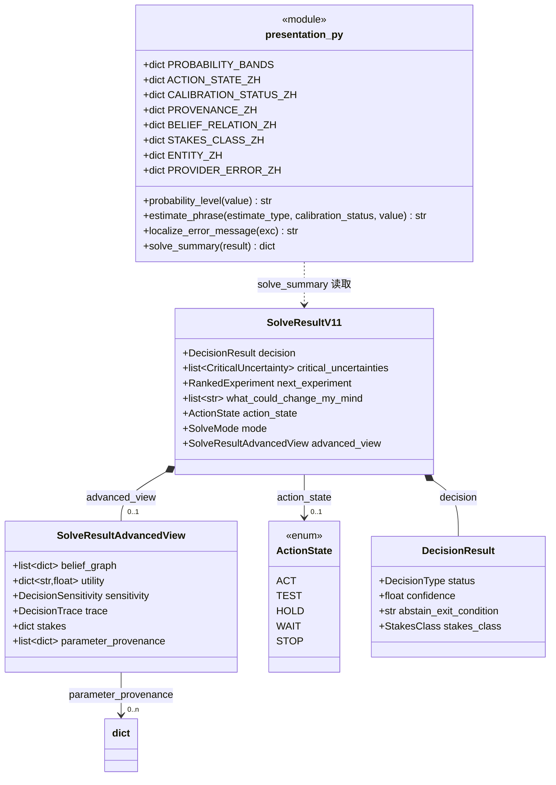
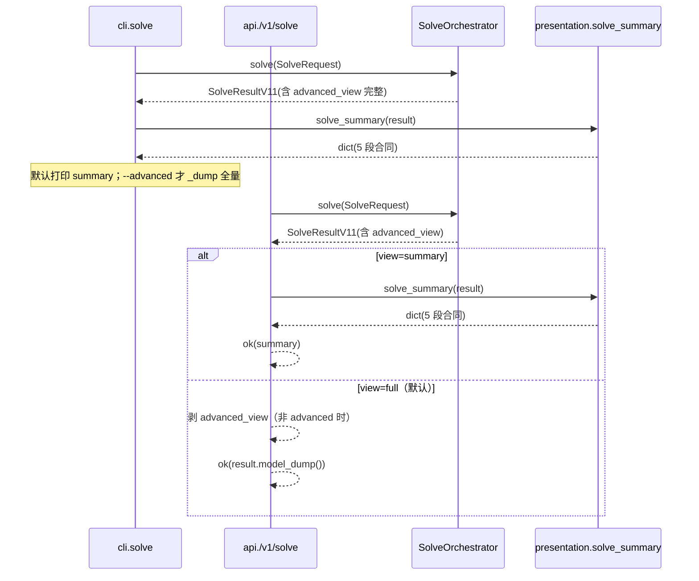
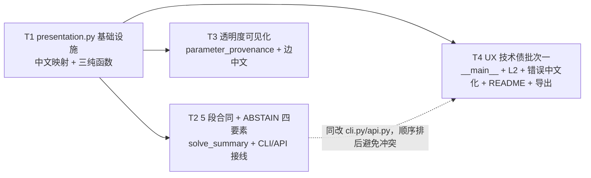

# Vencertia v1.3（UX 迭代）增量施工图（默认 5 段合同 + 概率文案 + ABSTAIN/透明度可见化 + UX 技术债批次一）

> 版本：1.2.1 → 1.3（增量，UX 投影层迭代，**零新引擎能力**）
> 架构师：高见远（Gao）· 日期：2026-08-13
> 上游输入：`docs/prd-v13-ux-2026-08-13.md`（P0×5 需求池 + 验收标准）、`docs/v1.2.1-construction-plan.md`（施工图格式范式）、`docs/v1.1.2-code-walkthrough-review.md`（§6/§7 技术债）
> 基线：**506 passed / 1 skipped / 0 failed**（ruff 0 error）；本轮目标**零回归**（新增字段全部可选/有默认值，不破坏既有 API/CLI 契约）。
> 主理人裁决已吸收：① CLI/API 优先不做 Web UI；② EXPLORE onboarding 不做；③ 概率默认"等级 + 校准标签"，精确数字仅 advanced；④ P0-5 技术债保留 P0；⑤ 集成仅 CLI/API 导入入口，CRM 同步单独立项；⑥ ActionState 维持五态不向六态对齐。
> 任务总量：**4 个（T1~T4）**；T1 为展示层基础设施（新模块 + 导出 + 单测），T2/T3/T4 均仅依赖 T1。

---

## 0. 铁律与总原则

1. **向后兼容铁律**：506 passed / 1 skipped 零回归。所有新字段**可选/有默认值**；`/v1/solve` 默认响应**逐字节不变**（仅新增查询参数）；CLI `solve` 默认输出改为 summary 是**唯一的默认行为变化**，且已核实 `tests/test_cli.py::test_cli_solve` 只断言 `exit_code == 0`、不断言输出内容（见 §7 风险表）。
2. **文案模板纯函数化**：所有中文文案/模板是**纯函数**（输入标量/枚举/已算对象，输出 str/dict），零副作用、可单测；**不硬编码在 api.py / cli.py**。
3. **中文文案单一归宿**：集中在 `src/vencertia/runtime/presentation.py`（一个模块 = 一个 import 面），api/cli 只调用、不写文案。
4. **零新第三方依赖**：本计划不新增任何 pip 依赖；复用 `VencertiaBaseModel` / `use_enum_values` / `SolveResultAdvancedView` 既有范式。
5. **双词表并存（沿用 v1.2.1）**：`DecisionType` 是引擎唯一决策词表；`ActionState` 是展示层映射；`solve_summary` 只读不改引擎语义。
6. **provenance 诚实语义**：`LLM_PROPOSED` 参数在展示层恒标"待确认"；`UNCALIBRATED/LOW_SAMPLE` 概率恒称"信念分/初步估计"而非"概率"。

---

## 1. 任务总览

| ID | 任务 | P0 覆盖 | 内容 | 依赖 | 优先级 |
|---|---|---|---|---|---|
| **T1** | 展示层文案基础设施（presentation.py） | P0-2（文案模板）+ 全量中文映射 | 新建 `runtime/presentation.py`：中文映射常量 + `estimate_phrase` / `probability_level` / `localize_error_message`；`runtime/__init__.py` 导出；单测 | —（纯新增模块） | P0 |
| **T2** | 默认 5 段输出合同接线（CLI/API）+ ABSTAIN 四要素 | P0-1 + P0-3 | `solve_summary()` 纯函数（5 段 + ABSTAIN 四要素 + 透明度段）；CLI `solve` 默认 summary + `--advanced`；API `/v1/solve?view=summary`；测试 | T1（用 estimate_phrase + 映射） | P0 |
| **T3** | 模型透明度可见化（BeliefEdge + provenance 数据源） | P0-4 | `SolveResultAdvancedView.parameter_provenance` 新字段 + solve() 计算；`belief_graph` 边类型附中文；测试 | T1（用映射常量） | P0 |
| **T4** | UX 技术债清零批次一 | P0-5 | `__main__.py` + L2 CLI 接 repo + API 错误中文化接线 + README canonical + `SolveResultAdvancedView` 导出；测试 | T1（用 localize_error_message） | P0 |

> 依赖最小化：T1 是唯一"基础设施"前置；T2/T3/T4 互不强依赖（均仅依赖 T1）。T4 与 T2 都改 `cli.py`/`api.py`，**实现顺序上排 T2 之后**避免同文件编辑冲突（见 §11 软依赖虚线）。

---

## 2. T1 — 展示层文案基础设施（P0，P0-2 文案模板 + 全量中文映射）

**目标**：落地 v1.3 所有中文文案的单一归宿 `runtime/presentation.py`，包含三类纯函数（概率文案 / 等级切分 / 错误中文化）与全部枚举→中文映射常量；供 T2/T3/T4 复用。

### 2.1 文件清单

| 文件（相对 `src/vencertia/` 或 `tests/`） | 新增/修改 | 职责 |
|---|---|---|
| `runtime/presentation.py` | **新增** | 中文映射常量 + `estimate_phrase` / `probability_level` / `localize_error_message` |
| `runtime/__init__.py` | 修改 | 导出 `estimate_phrase` / `probability_level` / `localize_error_message` + `SolveResultAdvancedView`（后者一并补上，避免 T4 二次触碰） |
| `tests/test_presentation.py` | **新增** | 三函数 + 映射常量契约单测 |

### 2.2 关键接口签名与模板结构

```python
# runtime/presentation.py（新）
from __future__ import annotations

# ---- 概率等级切分阈值（静态常量，见 §6 裁决 #4）----
PROBABILITY_BANDS: dict[str, float] = {"low": 0.40, "high": 0.60}

# ---- 枚举 → 中文映射常量（全部集中此处，T2/T3/T4 复用）----
ACTION_STATE_ZH = {
    "ACT": "行动", "TEST": "试验验证", "HOLD": "暂缓",
    "WAIT": "等待", "STOP": "停止",
}
DECISION_TYPE_ZH = {
    "GO": "推进", "CONDITIONAL_GO": "有条件推进", "SELECT_OPTION": "选择方案",
    "HOLD": "暂缓", "PIVOT": "转向", "KILL": "终止", "ABSTAIN": "暂不决策",
}
CALIBRATION_STATUS_ZH = {
    "UNCALIBRATED": "未校准", "LOW_SAMPLE": "样本不足",
    "DOMAIN_CALIBRATED": "领域校准", "USER_CALIBRATED": "用户校准",
    "VALIDATED": "已验证", "CALIBRATED": "已校准",  # 兼容别名
}
PROVENANCE_ZH = {
    "USER_DEFINED": "由你设定", "OBSERVED": "由观察得到",
    "DOMAIN_DEFAULT": "领域默认值", "EMPIRICALLY_ESTIMATED": "经验估计",
    "LLM_PROPOSED": "模型建议，未经你确认", "UNKNOWN": "来源未知",
}
BELIEF_RELATION_ZH = {
    "CAUSES": "因果关系", "DEPENDS_ON": "依赖关系", "MEDIATES": "中介作用",
    "MODERATES": "调节作用", "SHARES_LATENT_FACTOR": "共享潜在因子",
    "SHARED_SIGNAL": "共享信号", "REDUNDANT_WITH": "冗余",
    "MUTUALLY_EXCLUSIVE": "互斥", "UNKNOWN_RELATIONSHIP": "关系未知",
}
STAKES_CLASS_ZH = {
    "HIGH": "高风险（不可逆，需谨慎）", "MEDIUM": "中等风险", "LOW": "低风险（可逆）",
}
ENTITY_ZH = {
    "decision": "决策", "project": "项目", "evidence": "证据", "experiment": "实验",
    "belief": "信念", "prediction": "预测", "claim": "声明", "candidate_claim": "候选声明",
    "decision_trace": "决策追踪", "decision_sensitivity": "决策敏感度", "outcome": "结果",
}
PROVIDER_ERROR_ZH = {
    "TIMEOUT": "提供方超时", "RATE_LIMIT": "提供方限流", "UNAVAILABLE": "提供方不可用",
    "INVALID_JSON": "提供方返回格式错误", "SCHEMA_MISMATCH": "提供方返回结构不匹配",
    "EMPTY_RESULT": "提供方返回空结果", "PARTIAL_RESULT": "提供方返回部分结果",
    "PROVIDER_ERROR": "提供方错误",
}

def _enum_value(x) -> str:
    """enum 或纯字符串 → 规范值（use_enum_values 下运行时已是字符串）。"""
    return x.value if hasattr(x, "value") else str(x)

def _pct_int(value: float) -> str:
    """0-1 → 整数百分比字符串（无 % 号）。"""
    return f"{max(0.0, min(1.0, value)) * 100:.0f}"

def probability_level(value: float) -> str:
    """v1.3 裁决#3：默认输出以等级（Low/Moderate/High）替代裸小数。"""
    v = max(0.0, min(1.0, value))
    if v < PROBABILITY_BANDS["low"]:
        return "Low"
    if v > PROBABILITY_BANDS["high"]:
        return "High"
    return "Moderate"

def estimate_phrase(estimate_type, calibration_status, value: float) -> str:
    """v1.3 P0-2：概率可信度文案模板（纯函数，措辞锁单测）。
    estimate_type 保留（未来按 MODEL_SCORE vs CALIBRATED_PROBABILITY 选"信念分/概率"
    名词）；v1.3 模板由 calibration_status 驱动。"""
    _ = estimate_type  # 预留，v1.3 不分支
    st = _enum_value(calibration_status)
    v = _pct_int(value)
    if st == "UNCALIBRATED":
        return f"模型信念分 {v}（未校准，不表示真实概率）"
    if st == "LOW_SAMPLE":
        return f"初步估计 {v}（样本不足）"
    # DOMAIN_CALIBRATED / USER_CALIBRATED / VALIDATED / CALIBRATED(legacy)
    return f"校准后约 {v}%"

def localize_error_message(exc: Exception) -> str:
    """v1.3 P0-5：异常 → 中文可读话术（envelope message 用；保留 HTTP 状态码不变）。"""
    from vencertia.providers.errors import ProviderError
    from vencertia.repositories.base import EntityNotFoundError, StaleWriteError
    if isinstance(exc, EntityNotFoundError):
        return f"未找到{ENTITY_ZH.get(exc.entity_type, exc.entity_type)}：{exc.entity_id}"
    if isinstance(exc, StaleWriteError):
        return f"数据已过期（{ENTITY_ZH.get(exc.entity_type, exc.entity_type)}:{exc.entity_id}），请刷新后重试"
    if isinstance(exc, ProviderError):
        return PROVIDER_ERROR_ZH.get(getattr(exc, "error_type", ""), "提供方错误")
    if isinstance(exc, ValueError):
        return f"参数错误：{exc}"
    return str(exc)
```

### 2.3 验收要点（可写成 pytest 断言）

- **5 态校准中文映射**：`len(CALIBRATION_STATUS_ZH) == 6`（含 legacy `CALIBRATED`），且 `CALIBRATION_STATUS_ZH["UNCALIBRATED"] == "未校准"`、`CALIBRATION_STATUS_ZH["LOW_SAMPLE"] == "样本不足"`、`CALIBRATION_STATUS_ZH["VALIDATED"] == "已验证"`。
- **estimate_phrase 措辞锁定**（精确字符串）：
  - `estimate_phrase("MODEL_SCORE", "UNCALIBRATED", 0.73) == "模型信念分 73（未校准，不表示真实概率）"`。
  - `estimate_phrase("ORDINAL_SUPPORT", "LOW_SAMPLE", 0.42) == "初步估计 42（样本不足）"`。
  - `estimate_phrase("CALIBRATED_PROBABILITY", "DOMAIN_CALIBRATED", 0.73) == "校准后约 73%"`。
  - `estimate_phrase(..., "USER_CALIBRATED", ...)` / `("VALIDATED", ...)` 同样命中"校准后约 X%"分支；legacy `"CALIBRATED"` 也命中。
  - `estimate_phrase(..., "UNCALIBRATED", 0.73)` 文案中**不含**"概率"二字（单测锁定：`"概率" not in phrase`）。
- **probability_level 切分**：`probability_level(0.39) == "Low"`、`probability_level(0.40) == "Moderate"`（边界闭左）、`probability_level(0.60) == "Moderate"`、`probability_level(0.61) == "High"`。
- **localize_error_message**：
  - `localize_error_message(EntityNotFoundError("decision", "DEC_X")) == "未找到决策：DEC_X"`。
  - `localize_error_message(StaleWriteError("belief", "BLF_X", 3)) == "数据已过期（信念:BLF_X），请刷新后重试"`。
  - `localize_error_message(ProviderTimeoutError("x")) == "提供方超时"`；未知 ProviderError 子类 → `"提供方错误"`。
- **导出契约**：`from vencertia.runtime import estimate_phrase, probability_level, localize_error_message, SolveResultAdvancedView` 全部可用。

### 2.4 设计裁决

- `estimate_phrase` 放 `runtime/presentation.py`（**非 domain**）：虽纯静态不读 settings，但与 `solve_summary` 同属"输出投影层"，集中一个模块利于 api/cli 单一 import 面（裁决 #1）。
- `probability_level` 阈值用**静态常量 `PROBABILITY_BANDS`**（**非** ConfidenceCalibrator、非新增 Settings 字段）：ConfidenceCalibrator 语义是"样本数→校准态"不负责等级切分；新增 Settings 字段会涟漪 config.py 与既有测试，本轮无运行时调参需求（裁决 #4）。

---

## 3. T2 — 默认 5 段输出合同接线 + ABSTAIN 四要素（P0，P0-1 + P0-3）

**目标**：`solve_summary()` 纯函数产出 5 段合同（当前判断/为什么/最大未知/下一步/什么会改变判断），ABSTAIN 分支附四要素；CLI `solve` 默认打印 summary（`--advanced` 全量），API 新增 `view=summary`（默认 `full` 逐字节不变）。

### 3.1 文件清单

| 文件 | 新增/修改 | 职责 |
|---|---|---|
| `runtime/presentation.py` | 修改 | 新增 `solve_summary(result: SolveResultV11) -> dict`（5 段 + ABSTAIN 四要素 + 透明度段，防御读取 provenance） |
| `cli.py` | 修改 | `solve` 命令默认打印 `solve_summary(result)`，`--advanced` 才全量；belief 相关输出走 `estimate_phrase` |
| `api.py` | 修改 | `/v1/solve` 加 `view: str = "full"` 查询参数；`view="summary"` 返回 `solve_summary(result)`，默认/`full` 行为不变 |
| `tests/test_v13_summary.py` | **新增** | summary 5 键契约 / ABSTAIN 四要素 / mode 措辞切换 / API view 参数 |
| `tests/test_cli.py` | 修改 | `solve` 默认输出含 5 键；`--advanced` 全量 |

### 3.2 关键接口签名与模板结构

```python
# runtime/presentation.py（改）
def solve_summary(result: SolveResultV11) -> dict:
    """v1.3 P0-1：默认 5 段输出合同（渐进披露默认层）。纯函数，无副作用。

    字段来源（全部取自 SolveResultV11 已算素材，不重算）：
      段1 当前判断   ← result.action_state / decision.status / decision.confidence
      段2 为什么     ← result.why（DecisionTrace）+ len(result.evidence_used)
      段3 最大未知   ← result.critical_uncertainties[0]
      段4 下一步     ← result.next_experiment 或 decision.abstain_exit_condition
      段5 什么会改变 ← result.what_could_change_my_mind / sensitivity.flips
      ABSTAIN 四要素 ← decision.abstain_exit_condition / next_experiment /
                        stop_condition+success/failure_criteria / stakes
      透明度段       ← advanced_view.belief_graph / parameter_provenance（防御读取）
    """
    decision = result.decision
    action = _enum_value(result.action_state) if result.action_state else "HOLD"
    status = _enum_value(decision.status)
    stakes_class = _enum_value(decision.stakes_class)
    mode = _enum_value(result.mode) if result.mode else None

    # 段1
    current_judgment = action
    current_judgment_zh = ACTION_STATE_ZH.get(action, action)
    confidence_phrase = estimate_phrase(
        "MODEL_SCORE", "UNCALIBRATED", decision.confidence
    ) if decision.confidence is not None else "置信度未知"

    # 段2（1-2 句 + 关键证据数）
    evidence_count = len(result.evidence_used or [])
    rationale = f"判断基于 {evidence_count} 条已采信证据与确定性效用引擎；" \
                f"引擎结论为「{DECISION_TYPE_ZH.get(status, status)}」（{current_judgment_zh}）。"

    # 段3
    top = result.critical_uncertainties[0] if result.critical_uncertainties else None
    biggest_unknown = (
        f"关键未知：{top.statement}（belief {top.belief_id}，不确定性 {top.uncertainty:.0%}）"
        if top else "暂无关键未知项"
    )

    # 段4（mode 措辞切换：EXPLORE=最小验证动作 / OPERATE=下一步行动 / None=中性）
    step_noun = {"EXPLORE": "最小验证动作", "OPERATE": "下一步行动"}.get(mode, "下一步")
    if result.next_experiment is not None:
        exp = result.next_experiment.experiment
        next_step = f"{step_noun}：{exp.name}（{exp.action or '见实验详情'}，成本 {exp.cost:.1f}）"
    elif status == "ABSTAIN":
        next_step = f"{step_noun}：{decision.abstain_exit_condition or '补充决策改变型证据'}"
    else:
        next_step = "无待办实验（判断已收敛，可执行）"

    # 段5
    change_condition = list(result.what_could_change_my_mind or [])
    if not change_condition:
        change_condition = ["当前无邻近翻转阈值（判断对信念扰动稳健）"]

    # P0-3 ABSTAIN 四要素（仅 ABSTAIN/TEST/WAIT/HOLD 分支填充，否则空串）
    is_abstain = status == "ABSTAIN"
    why_not_decide = (
        f"暂不决策：{decision.abstain_exit_condition or '证据不足以区分选项'}"
        if is_abstain else ""
    )
    lowest_cost_next_step = next_step if is_abstain else ""
    stop_condition = ""
    if is_abstain:
        # 停止研究条件：优先取停止状态，叠加实验成功/失败判据；全缺则显式"未设置"
        parts = [p for p in (result.stop_condition, result.success_criteria,
                             result.failure_criteria) if p]
        stop_condition = "；".join(parts) if parts else "未设置停止条件"
    deadline = "未设置"  # StakesProfile 无 deadline 字段 → 恒"未设置"（裁决 #3 文案铁律）
    stakes_class_zh = STAKES_CLASS_ZH.get(stakes_class, stakes_class)

    # P0-4 透明度段（T3 填数据源；此处防御读取）
    adv = result.advanced_view
    belief_deps = []
    if adv is not None and adv.belief_graph:
        belief_deps = [
            {"source_belief_id": e.get("source_belief_id"),
             "target_belief_id": e.get("target_belief_id"),
             "relation": e.get("relation"),
             "relation_zh": BELIEF_RELATION_ZH.get(e.get("relation", ""), "关系未知")}
            for e in adv.belief_graph
        ]
    provenance = getattr(adv, "parameter_provenance", []) or []  # T3 新增字段，防御读取

    return {
        "view": "summary",
        "current_judgment": current_judgment,          # ∈ ActionState 五态
        "current_judgment_zh": current_judgment_zh,
        "decision_status": status,
        "confidence_phrase": confidence_phrase,
        "rationale": rationale,
        "evidence_count": evidence_count,
        "biggest_unknown": biggest_unknown,
        "next_step": next_step,
        "change_condition": change_condition,
        # ABSTAIN 四要素
        "why_not_decide": why_not_decide,
        "lowest_cost_next_step": lowest_cost_next_step,
        "stop_condition": stop_condition,
        "deadline": deadline,
        "stakes_class": stakes_class,
        "stakes_class_zh": stakes_class_zh,
        # 透明度
        "belief_dependencies": belief_deps,
        "provenance_summary": provenance,
    }

# cli.py（改）
@app.command()
def solve(request_path: Path, db: str | None = None, advanced: bool = False) -> None:
    """Run the full solve loop; default prints the 5-section summary contract."""
    settings = _settings_with_db(db)
    runtime, _ = _default_runtime(settings)
    request = SolveRequest.model_validate(_load_json(request_path))
    result = runtime.solve(request)
    if advanced:
        _dump(result.model_dump(mode="json"))          # 全量（含 advanced_view）
    else:
        from vencertia.runtime.presentation import solve_summary
        _dump(solve_summary(result), "summary")        # 默认 5 段合同

# api.py（改）
@app.post("/v1/solve", response_model=ApiResponse)
def solve(req: SolveRequest, advanced: bool = False, view: str = "full") -> ApiResponse:
    result = runtime.solve(req)
    if view == "summary":
        from vencertia.runtime.presentation import solve_summary
        return ok(solve_summary(result))
    if not advanced:
        result.advanced_view = None                    # V-7 既有：Default 剥 advanced_view
    return ok(result.model_dump(mode="json"))
```

### 3.3 验收要点（可写成 pytest 断言）

- **5 键契约**：对 demo ABSTAIN 场景 `s = solve_summary(result)`，`set(s) >= {"current_judgment","rationale","biggest_unknown","next_step","change_condition"}`；五键均非空（`all(s[k] for k in 五键)`，`change_condition` 为 `len(s["change_condition"]) >= 1`）。
- **current_judgment ∈ ActionState**：`s["current_judgment"] in {"ACT","TEST","HOLD","WAIT","STOP"}`；ABSTAIN+next_experiment → `s["current_judgment"] == "TEST"`；`s["current_judgment_zh"] == "试验验证"`。
- **ABSTAIN 四要素**：ABSTAIN 场景 `s["why_not_decide"]` / `s["lowest_cost_next_step"]` / `s["stop_condition"]` 非空；`s["deadline"] == "未设置"`（缺字段不省略）；`s["stakes_class"] in {"HIGH","MEDIUM","LOW"}` 且 `s["stakes_class_zh"]` 非空。
- **mode 措辞切换**：`mode="EXPLORE"` 时 `s["next_step"].startswith("最小验证动作")`；`mode="OPERATE"` 时 `startswith("下一步行动")`。
- **confidence_phrase 走模板**：`s["confidence_phrase"]` 命中 `estimate_phrase` 三种模板之一（可断言 `"未校准" in s["confidence_phrase"]`，mock solve 无样本 → UNCALIBRATED）。
- **API 向后兼容 + view 参数**：
  - `POST /v1/solve`（无参）→ `data["advanced_view"] is None`（**不变**，`test_v12_v7_action_state.py::test_solve_api_default_strips_advanced_view` 仍过）。
  - `POST /v1/solve?advanced=true` → `data["advanced_view"]` 为 dict（不变）。
  - `POST /v1/solve?view=summary` → `data["view"] == "summary"` 且含 5 键、无 `decision`/`belief_snapshot` 全量字段。
- **CLI**：`runner.invoke(app, ["solve", req, "--db", db])` 输出 JSON 含 `"current_judgment"`；`--advanced` 输出含 `"advanced_view"`（`test_cli.py` 既有 `test_cli_solve` 只断言 exit_code，零回归）。

### 3.4 设计裁决

- `solve_summary` 为**模块级纯函数**（非 `SolveResultV11.default_view` 方法）：无实例依赖、可拿合成 `SolveResultV11` 直接单测，符合"纯函数、可单测"铁律（裁决 #1）。
- API 向后兼容：**默认 `view="full"` 逐字节不变**，summary 走**新增查询参数** `view=summary`（裁决 #2）。`advanced` 是 bool 且默认 False，FastAPI 无法区分"显式 `advanced=false`"与"缺省"，故**不复用 advanced 参数承载 summary 语义**，避免既有默认响应被破坏。

---

## 4. T3 — 模型透明度可见化（P0，P0-4）

**目标**：为 advanced 视图的 belief_graph 每条边附中文关系标签；新增 `SolveResultAdvancedView.parameter_provenance` 字段并在 solve() 内计算，作为 summary"系数来源摘要"的数据源（T2 已防御读取）。

### 4.1 文件清单

| 文件 | 新增/修改 | 职责 |
|---|---|---|
| `runtime/runtime.py` | 修改 | `SolveResultAdvancedView` 加 `parameter_provenance` 字段；solve() 内 belief_graph 附 `relation_zh` + 计算 provenance |
| `tests/test_v13_transparency.py` | **新增** | 边类型中文映射 / provenance 六态中文 / LLM_PROPOSED 待确认 |
| `tests/test_v12_v7_action_state.py` | 修改 | advanced `belief_graph` 断言补 `relation_zh`（向后兼容补强，原断言保留） |

### 4.2 关键接口签名与模板结构

```python
# runtime/runtime.py（改）
class SolveResultAdvancedView(VencertiaBaseModel):
    belief_graph: list[dict] = Field(default_factory=list)      # BeliefEdge 投影（含 relation_zh）
    utility: dict[str, float] = Field(default_factory=dict)
    sensitivity: DecisionSensitivity | None = None
    trace: DecisionTrace | None = None
    stakes: dict | None = None
    # v1.3 P0-4：关键系数来源摘要（六态 provenance 中文投影；summary 数据源）
    parameter_provenance: list[dict] = Field(default_factory=list)

# solve() 内（return SolveResultV11 之前）
from vencertia.runtime.presentation import BELIEF_RELATION_ZH, PROVENANCE_ZH

belief_graph = []
for e in self.repo.list_belief_edges(project.id):
    row = e.model_dump(mode="json")
    row["relation_zh"] = BELIEF_RELATION_ZH.get(row.get("relation", ""), "关系未知")
    belief_graph.append(row)

parameter_provenance: list[dict] = []
for option in decision.options:
    for belief_id, param in (option.belief_parameters or {}).items():
        prov = param.provenance.value if hasattr(param.provenance, "value") else str(param.provenance)
        parameter_provenance.append({
            "option_id": option.id,
            "belief_id": belief_id,
            "value": param.value,
            "provenance": prov,
            "provenance_zh": PROVENANCE_ZH.get(prov, prov),
            "status": param.status.value if hasattr(param.status, "value") else str(param.status),
            "needs_confirmation": prov == "LLM_PROPOSED",
        })

advanced_view = SolveResultAdvancedView(
    belief_graph=belief_graph,
    utility={s.option_id: s.adjusted_utility for s in decision_result.option_scores},
    sensitivity=sensitivity,
    trace=decision_trace,
    stakes=decision.stakes.model_dump(mode="json") if decision.stakes else None,
    parameter_provenance=parameter_provenance,
)
```

### 4.3 验收要点（可写成 pytest 断言）

- **边类型中文**：构造含 `relation="UNKNOWN_RELATIONSHIP"` 的 BeliefEdge 后 solve，`advanced_view.belief_graph` 每条含 `relation_zh`，且 `UNKNOWN_RELATIONSHIP → "关系未知"`、`CAUSES → "因果关系"`（九类全映射由 `BELIEF_RELATION_ZH` 单测覆盖）。
- **provenance 六态**：构造 `belief_parameters` 含 `USER_DEFINED/LLM_PROPOSED/UNKNOWN` 的 DecisionOption，solve 后 `advanced_view.parameter_provenance` 含对应 `provenance_zh`（`"由你设定"` / `"模型建议，未经你确认"` / `"来源未知"`）。
- **LLM_PROPOSED 待确认**：`provenance=="LLM_PROPOSED"` 的行 `needs_confirmation is True`；`summary["provenance_summary"]`（T2）随之非空且含该行。
- **summary 透明度段联动**：`solve_summary(result)["belief_dependencies"]` 每条含 `relation_zh`；`["provenance_summary"]` 与 `advanced_view.parameter_provenance` 一致。
- **向后兼容**：`test_v12_v7_action_state.py` 既有 advanced 断言（belief_graph 是 list / utility 是 dict / 含 sensitivity+stakes）**不改仍过**（新增字段纯附加）。

### 4.4 设计裁决

- provenance 数据源放 **`SolveResultAdvancedView.parameter_provenance`**（而非给 SolveResultV11 再加一层字段）：`SolveResultV11` 已承载大量投影字段，且 `decision.options[].belief_parameters` 只通过 solve() 内可及，放 advanced_view 与既有 `stakes/belief_graph` 同范式、类型安全；`solve_summary` 用 `getattr(..., [])` 防御读取，T2/T3 解耦。

---

## 5. T4 — UX 技术债清零批次一（P0，P0-5）

**目标**：① `python -m vencertia` 可运行；② L2 CLI 接 repo + 空跑"需先 register"提示；③ API 错误 message 中文化；④ README canonical 统一小写连字符；⑤ `SolveResultAdvancedView` 顶层导出。

### 5.1 文件清单

| 文件 | 新增/修改 | 职责 |
|---|---|---|
| `__main__.py` | **新增** | `from vencertia.cli import app; app()`（`python -m vencertia` 入口） |
| `cli.py` | 修改 | `benchmark_run` 加 `db` 参数；L2 分支 `build_container().repository` 接 `L2Runner(repo=...)`；空跑打印"需先 register"提示 |
| `api.py` | 修改 | `_register_exception_handlers` 的 `_response` 调 `localize_error_message(exc)` 输出中文 message |
| `README.md` | 修改 | 文档索引 canonical 统一小写连字符（见 §5.3） |
| `tests/test_cli.py` | 修改 | 新增 `test_cli_l2_empty_hint` + `test_python_m_vencecia_help` |
| `tests/test_api.py` | 修改 | 新增 `test_404_message_localized`（中文 message 断言） |

### 5.2 关键接口签名

```python
# __main__.py（新）
from vencertia.cli import app

if __name__ == "__main__":
    app()

# cli.py（改）
@benchmark_app.command("run")
def benchmark_run(level: str = "L0", path: Path | None = None, db: str | None = None) -> None:
    # ... L0/L1/BINDING 分支不变 ...
    elif level.upper() == "L2":
        from vencertia.benchmark.l2 import L2Runner
        settings = _settings_with_db(db)
        _, repo = _default_runtime(settings)          # 复用 container 单根接线
        runner = L2Runner(repo=repo)                  # repo 非 None → 真实 due_report
        report = runner.due_report()
        if not report:
            console.print("[yellow]L2 前瞻预测库为空：需先 register 前瞻预测（参见 docs/BENCHMARK.md）。[/yellow]")
            return
        _dump([e.model_dump(mode="json") for e in report])

# api.py（改）
def _register_exception_handlers(app: FastAPI, fail) -> None:
    from fastapi.responses import JSONResponse
    from vencertia.runtime.presentation import localize_error_message
    def _response(status_code: int, exc: Exception) -> JSONResponse:
        return JSONResponse(status_code=status_code,
                            content=fail(status_code, localize_error_message(exc)).model_dump(mode="json"))
    @app.exception_handler(EntityNotFoundError)
    async def entity_not_found_handler(_, exc: EntityNotFoundError):
        return _response(404, exc)
    # ... StaleWriteError/ValueError/ProviderError 同理（均 _response(状态码, exc)）
```

### 5.3 README canonical 统一（人工核对）

- 文档索引表里所有 `docs/` 文件名一律**小写连字符** canonical：把混用的大写历史名（`ARCHITECTURE.md / INTELLIGENCE_INGESTION.md / CLAIM_BINDING.md / RESEARCH_RUNTIME.md / EVIDENCE_PIPELINE.md / BELIEF_UPDATE_TRACE.md / DECISION_SENSITIVITY.md / PROVIDERS.md / ITERATION_LOG.md / IMPLEMENTATION_REPORT_NEXT.md / BENCHMARK.md / OSS_ADMISSION_POLICY.md / API.md / CLI.md`）统一改指**实际存在的小写连字符文件名**（`docs/` 下 `ARCHITECTURE.md` 与 `architecture-decisions.md` 并存——**保留实际存在的两个文件**，索引表分别用小写 `architecture-decisions.md`、`architecture-decisions-next.md` 描述，标题仍写大写缩写可读名）。
- 已核实 `docs/` 同时存在 `ARCHITECTURE.md`（大写）与 `architecture-decisions.md`（小写）两类文件；**只统一"文档索引表"里的引用写法**，不重命名磁盘文件（避免破坏其他文档引用）。

### 5.4 验收要点（可写成 pytest 断言）

- **入口**：`runner.invoke(app, ["--help"])` 经 `python -m vencertia --help` 等价（`subprocess.run(["python","-m","vencertia","--help"])` 返回码 0、stdout 含 "Vencertia"）。
- **L2 CLI**：`benchmark run --level L2`（空库）输出含 `"需先 register"` 而非裸 `[]`；预置 1 条 due prediction 后输出含该 `id`。
- **错误中文化**：`POST /v1/decisions/DEC_MISSING`（GET）→ `r.json()["message"] == "未找到决策：DEC_MISSING"`（状态码仍 404）；`/v1/evidence` 传 PROJECT 无 project_id → 400 且 message 为中文（`"参数错误"` 前缀）。
- **导出**：`from vencertia.runtime import SolveResultAdvancedView` 可用（T1 已补，T4 核对）。
- **README**：文档索引表无大写文件名裸引用（人工核对 + 可选 grep：`README.md` 中 `docs/` 后接大写字母的 `|` 行数 == 0）。

### 5.5 设计裁决

- L2 接 repo 走 **`build_container()`/`_default_runtime` 单根接线**（非自建 SQLiteRepository）：与 cli 其余命令同源，避免第二条 wiring 路径；L2Runner 新增 `repo` 实参后 `due_report()` 不再恒空。

---

## 6. 关键设计裁决（每项一句话理由）

| # | 裁决项 | 结论 | 一句话理由 |
|---|---|---|---|
| 1 | `solve_summary` / `estimate_phrase` 位置 | **集中在 `runtime/presentation.py` 纯函数**（非 domain、非 `default_view` 方法） | 与输出投影同层、纯函数无实例依赖可直接单测，api/cli 单一 import 面 |
| 2 | API 向后兼容策略 | **默认 `view="full"` 逐字节不变，summary 走新增 `?view=summary`** | `advanced` 是 bool 默认 False、FastAPI 无法区分"显式 false"与"缺省"，复用它会破坏既有默认契约 |
| 3 | 错误短语映射表位置 | **`runtime/presentation.py` 的 `ENTITY_ZH/PROVIDER_ERROR_ZH` + `localize_error_message`**（constants 收敛同模块） | 与全部中文文案单一归宿，避免 `constants.py`/`i18n.py` 双模块散落 |
| 4 | `estimate_phrase` 等级切分阈值来源 | **`presentation.py` 静态常量 `PROBABILITY_BANDS`（low=0.40/high=0.60）** | ConfidenceCalibrator 语义是"样本→校准态"不负责等级切分；新增 Settings 字段会涟漪 config+测试，本轮无调参需求 |
| 5 | `current_judgment` 取值形态 | **纯字符串 ∈ ActionState 五态**，中文并列键 `current_judgment_zh` | 满足 PRD"`current_judgment` 取值 ∈ ActionState 五态"逐字断言，中文另键不污染枚举断言 |
| 6 | provenance 数据源 | **`SolveResultAdvancedView.parameter_provenance`**（solve() 内算），summary 用 `getattr(..., [])` 防御读取 | `decision.options[].belief_parameters` 仅 solve() 内可及，放 advanced_view 与 stakes/belief_graph 同范式，T2/T3 解耦 |
| 7 | deadline 缺失处理 | **恒输出 `"未设置"` 文案，不省略** | `StakesProfile` 无 deadline 字段，PRD 铁律"缺字段给未设置而非省略"，避免 ABSTAIN 四要素残缺 |

---

## 7. 文件影响面清单 + 风险与回滚

### 7.1 新增文件（3 源 + 3 测试）

```
src/vencertia/runtime/presentation.py        # T1（T2 追加 solve_summary）
src/vencertia/__main__.py                     # T4
tests/test_presentation.py                    # T1
tests/test_v13_summary.py                     # T2
tests/test_v13_transparency.py                # T3
```

### 7.2 修改的现有文件（8 个）

| 文件 | 任务 | 改动 |
|---|---|---|
| `runtime/__init__.py` | T1 | 导出 `estimate_phrase/probability_level/localize_error_message/SolveResultAdvancedView` |
| `runtime/presentation.py` | T2 | 追加 `solve_summary()` |
| `cli.py` | T2/T4 | solve 默认 summary + `--advanced`；benchmark L2 接 repo + 空跑提示 |
| `api.py` | T2/T4 | `/v1/solve` 加 `view` 参数；错误 message 中文化 |
| `runtime/runtime.py` | T3 | `SolveResultAdvancedView.parameter_provenance` + belief_graph 附 `relation_zh` + solve() 计算 |
| `README.md` | T4 | 文档索引 canonical 统一 |
| `tests/test_cli.py` | T2/T4 | solve summary 断言 + L2 空跑提示 + `python -m vencertia` |
| `tests/test_api.py` | T4 | 错误 message 中文断言 |
| `tests/test_v12_v7_action_state.py` | T3 | advanced belief_graph 补 `relation_zh` 断言（原断言保留） |

### 7.3 会被触碰的既有测试（回归风险核对）

| 既有测试 | 触碰方式 | 风险结论 |
|---|---|---|
| `tests/test_cli.py::test_cli_solve` | CLI solve 默认输出由全量改 summary | **零风险**——只断言 `exit_code == 0`（已核实 L32），不断言输出内容 |
| `tests/test_api.py`（`/v1/solve` 8 处）、`test_api_v11.py:141`、`qa/test_qa_api_extra.py` | `/v1/solve` 加 `view` 参数 | **零风险**——均键级/状态级断言（`decision.status`/`next_experiment`/`decision_id`），`view` 默认 `full` 响应逐字节不变 |
| `tests/test_v12_v7_action_state.py`（Default/Advanced 投影） | advanced `belief_graph` 附 `relation_zh`、加 `parameter_provenance` | **零风险**——断言均为 `isinstance(list/dict)` + `in` 键存在，新字段纯附加；该文件另补 1 条 `relation_zh` 断言 |
| `tests/test_default_container_api_smoke.py` | POST `/v1/solve` 返回 200 | **零风险**——不查响应体细节 |
| `tests/test_benchmark.py` / `test_l2.py` / `qa_v11/test_qa_v11_outcome_prediction_l2.py` | L2 CLI 接 repo | **零风险**——这些测试直接构造 `L2Runner(repo=...)`，不经过 CLI |
| `tests/test_api.py::test_404_on_missing_decision` | 错误 message 中文化 | **零风险**——只断言 `status_code == 404`，未断言 message 文本（已核实） |

### 7.4 风险与回滚

| 改动 | 回归风险点 | 回滚/渐进方式 |
|---|---|---|
| **T2** CLI `solve` 默认改 summary | 若未来有测试/脚本解析 CLI solve 的 `decision_id` 字段 | 已核实无此断言；`--advanced` 仍输出全量，脚本可显式加 `--advanced` 恢复旧行为 |
| **T2** `/v1/solve` 加 `view` 参数 | FastAPI 参数注入 | `view: str = "full"` 默认值复现旧行为；`view="summary"` 是纯新增分支，旧调用零影响 |
| **T3** `SolveResultAdvancedView` 加字段 | `extra="forbid"` 对旧构造 | 新字段 `default_factory=list`，旧 `model_validate`/构造不报错；`parameter_provenance` 空列表不破坏既有 `model_dump` 键级断言 |
| **T4** 错误 message 中文化 | 若任何测试/客户端断言英文 message | 已核实无此断言；HTTP 状态码不变，message 仅文案变化；回滚=删 `localize_error_message` 包装 |
| **T4** L2 CLI 空跑改提示 | `benchmark run --level L2` 旧输出裸 `[]` 被依赖 | 已核实无测试断言裸 `[]`；有数据时仍输出真实 due_report（`model_dump` 列表），仅空库才提示 |
| **T4** README canonical 统一 | 文档侧引用误伤 | 只改索引表引用写法、不重命名磁盘文件，避免破坏其他 `.md` 交叉引用 |

---

## 8. Shared Knowledge（跨任务约定）

1. **中文文案单一归宿**：所有中文常量/模板集中在 `runtime/presentation.py`（`*_ZH` 映射 + 三函数 + `solve_summary`）；`api.py`/`cli.py`/`runtime.py` 只 `from vencertia.runtime.presentation import ...`，**禁止散落硬编码中文字符串**。
2. **新枚举值**：本轮**零新增枚举**（复用 `ActionState`/`DecisionType`/`CalibrationStatus`/`EstimateType`/`ProvenanceType`/`BeliefRelationType`/`StakesClass`）；仅新增**中文映射常量**（不在 domain 加枚举，避免 `extra="forbid"` 反序列化涟漪）。
3. **零新依赖**：`pyproject.toml` 不动；只用到 stdlib + 既有 typer/rich/fastapi/pydantic。
4. **`use_enum_values=True` 注意**：`result.action_state`/`decision.status`/`decision.stakes_class`/`param.provenance` 运行时**都是纯字符串**；所有读取用 `hasattr(x,"value")` 规范化（`_enum_value`）。
5. **向后兼容字段纪律**：`SolveResultAdvancedView.parameter_provenance` 是唯一新增 pydantic 字段，默认 `default_factory=list`；`solve_summary` 产出纯 dict 不落库、不改 `SolveResultV11` 结构。
6. **ABSTAIN 四要素恒四键**：`why_not_decide/lowest_cost_next_step/stop_condition/deadline` 恒存在，非 ABSTAIN 场景为 `""`/`"未设置"`，**绝不省略键**（可逐键断言非 None）。
7. **版本号**：默认**不升版本**（保持 `1.2.1`，`__version__`/`__api_contract_version__` 不动，测试零同步）；若主理人要求升 `1.3.0`，需同步 `tests/test_integrity_v112.py`/`test_api.py`/`test_api_v11.py`/`qa_v112` 中约 10 处 `"1.2.1"` 断言（沿用 v1.2.1 施工图 §6.4 表），本轮默认跳过。

---

## 9. 新增/修改对象总览（mermaid classDiagram）



---

## 10. 关键调用流（CLI solve 默认 summary + API view=summary）



---

## 11. 任务依赖图



---

## 12. 实现顺序建议（工程师）

1. **先跑基线**：隔离 venv，`pytest` 复现 506 passed / 1 skipped / ruff 0 error。
2. **T1（presentation.py）**：纯新增模块 + 三纯函数 + 映射常量；跑 `test_presentation.py`；`from vencertia.runtime import estimate_phrase` 冒烟。
3. **T2（summary 接线）**：`presentation.py` 追加 `solve_summary` → `cli.py`/`api.py`；跑 `test_v13_summary.py` + 既有 `test_cli.py`/`test_v12_v7_action_state.py` 回归确认 Default/Advanced 不破。
4. **T3（透明度）**：`runtime.py` 加字段 + solve() 计算 + 边中文；跑 `test_v13_transparency.py` + `test_v12_v6_belief_edge.py` 回归。
5. **T4（技术债）**：`__main__.py` → L2 CLI → 错误中文化 → README；跑 `test_cli.py`/`test_api.py` 新增断言 + 全量回归。
6. **收尾**：`ruff check` 0 error、全量 `pytest`（目标 **506 passed / 1 skipped / 0 failed** 持平，零回归）。

---

## 附：下一迭代候选（P1/P2 留档，本轮不排入任务）

| # | 需求 | 备注（评语依据） |
|---|---|---|
| P1-1 | 实验建议"决策价值框架"可见化（`decision_change_condition` + `stop_rule`，information gain → decision value） | 实验建议 940（9.4%）U00081/U00430 |
| P1-2 | 证据批量导入 + 去重结果可见（CSV/JSONL `evidence import`，canonical/dropped 回显） | 维护成本 1,036（10.4%）U00069/U00252 |
| P1-3 | 个性化可见化（StakesProfile 风险偏好/约束显式注入 + "基于你的 X 偏好"） | 个性化 527（5.3%）U00111/U00638 |
| P1-4 | 快速求解路径 `solve --quick`（三分钟决策，跳过高成本研究） | LLM对比 717 + 速度 640 U00015/U00320 |
| P1-5 | 校准复盘文案（样本不足显式"结论不可用" + Forecast/Decision 指标拆分） | 校准复盘 347（3.5%）U00019/U00059 |
| P2-1 | 团队协作角色/权限模型 | 团队协作 523（5.2%） |
| P2-2 | 证据结构"共享信号/重复计算"提示 | 证据结构 400（4.0%） |
| P2-3 | Model Critic 未知风险投影（"模型整体错了最可能错在哪"） | 未知风险 300（3.0%） |
| P2-4 | 剩余技术债（ConfidenceCalibrator/CalibrationEngine 重复、authority 权重表 4 处、convergence_engine 冗余、`__import__("math")` 内联） | walkthrough §5.7 |
| P2-5 | 集成自动 ingestion（CRM/邮件/Notion 同步） | 集成 692（6.9%），单独立项 |

---

> 本施工图仅覆盖 PRD P0×5；P1/P2 需求池已按主理人裁决留档于上表，不进入本轮任务列表。
