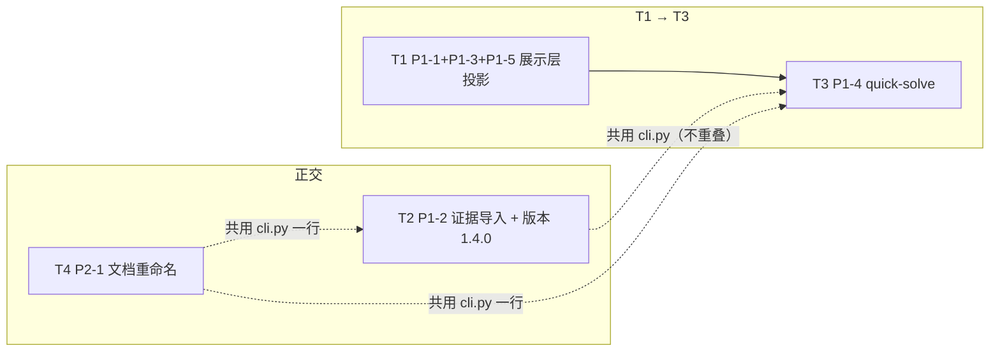

# Vencertia v1.4 增量施工图（P1×5 + 文档重命名规范化 + 版本 1.4.0）

> 版本：1.4.0（minor，P1 批次为新功能；`__api_contract_version__` 1.3 → 1.4）
> 架构师：高见远（Gao）· 日期：2026-08-13
> 上游输入：`docs/prd-v13-ux-2026-08-13.md`（P1×5 需求池，含验收标准）、`docs/implementation-plan-v14-2026-08-13.md`（主理人范围裁决）
> 基线：**533 passed / 1 skipped / 0 failed**（ruff 0 error）；本轮目标**零回归**（新字段全部可选/有默认值，默认值复现 v1.3 行为）。
> 任务总量：**4 个（T1~T4）**；其中 T4 为全局文档引用变更，风险最高，单独成任务并单提交可 revert。

---

## 0. 铁律与总原则

1. **向后兼容铁律**：533 passed / 1 skipped 零回归；所有新字段**可选/有默认值**；默认值复现 v1.3 行为；`/v1/solve` 既有响应结构不动，全是**新增可选字段/新增端点**。
2. **零新第三方依赖**：全部复用 `pydantic` / `typer` / `rich` / `fastapi` 既有栈；证据导入新增端点不引入文件解析库（JSON/JSONL 用标准库）。
3. **中文文案继续集中 `runtime/presentation.py`**：P1-1/P1-3/P1-5 的中文措辞全部落为 presentation.py 的纯函数常量，不得散落到 cli.py/api.py/engine。
4. **证据导入铁律（Candidate→Validation→持久化）**：P1-2 导入必须走 `EvidencePolicy.grade`（validation）→ `EvidenceDedupEngine.group`（dedup）→ `repo.add_evidence`（持久化），**不得绕过**；幂等以 `content_fingerprint` 为键。
5. **展示层只投影不重算**：P1-1/P1-3/P1-5 全部读取已算好的 `SolveResultV11` / `CalibrationProfile`，**不重算引擎状态**（遵循 v1.3 `solve_summary` 的纯函数约定）。
6. **T4 文档重命名铁律**：`git mv` 保持历史；引用同步用「旧大写文件名 → 新小写连字符文件名」的**字面串替换**（34 条映射，见 §5.2），不碰 `legacy/` 与生成物。

---

## 1. 任务总览

| ID | 任务 | 内容 | 依赖 | 优先级 |
|---|---|---|---|---|
| **T1** | P1-1 + P1-3 + P1-5 展示层投影扩展 | `experiment_voi`（决策改变条件 + 停止条件）+ `research_stop` 投影到 `SolveResultV11`；`solve_summary` 加「实验 VOI / 停止规则 / 个性化依据」三段；`calibration_summary`（Brier/ECE/样本/分桶中文解读 + 样本不足提示 + 预测校准/决策表现拆分） | —（基于 v1.3 代码） | P1 |
| **T2** | P1-2 证据批量导入 + 版本 1.4.0 | 新增 `runtime/evidence_import.py`（EvidenceImporter + EvidenceImportReport）；CLI `evidence import`；API `POST /v1/evidence/import`；版本号 1.3.0→1.4.0 + `__api_contract_version__` 1.3→1.4 及 4 个测试文件版本断言同步 | —（与 T1 正交；共用 cli.py） | P1 |
| **T3** | P1-4 快速求解 `quick-solve` | 新增 `src/vencertia/quick_solve.py`（InMemoryRepository + MockProvider 一次性端到端）；CLI `quick-solve` 命令（可选参数 + 全默认 demo 场景） | T1（quick-solve 输出 T1 增强后的 `solve_summary`） | P1 |
| **T4** | P2-1 文档重命名规范化 | `docs/` 34 个大写 .md → 小写连字符（git mv）+ 全仓库引用同步（README / docs 互引 / 根历史施工图 / 代码 docstring / 测试路径断言） | —（与 T1~T3 正交，但改 cli.py 一行，建议最后执行避免同文件冲突） | P1 |

> 依赖最小化：T1 → T3 线性（T3 的 quick-solve 渲染 T1 增强后的 `solve_summary`）；T2 与 T1 正交（走证据管线，不碰展示层）；T4 与前三者正交（纯文档 + 1 行代码）。T2/T3/T4 均触碰 `cli.py`，但改动位置不重叠（T2 加 `evidence import` 子命令、T3 加顶层 `quick-solve` 命令、T4 改 L2 提示文案一行），顺序执行即可无冲突。

---

## 2. T1 — P1-1 实验 VOI + P1-3 个性化 + P1-5 校准复盘（展示层投影，P1）

**目标**：把 v1.3 未投影的三块「已有能力」——实验决策价值、用户风险偏好、校准指标含义——投影到 `solve_summary` 与 `calibration report`，全部纯函数文案、零引擎重算。

### 2.1 文件清单

| 文件（相对 `src/vencertia/` 或 `tests/`） | 新增/修改 | 职责 |
|---|---|---|
| `runtime/runtime.py` | 修改 | `SolveResultV11` 加 `experiment_voi: dict \| None = None`、`research_stop: dict \| None = None`；solve() 组装这两块（读 `next_experiment` + `stop_report`） |
| `runtime/presentation.py` | 修改 | 加 `experiment_voi_summary()`、`personalization_summary()`、`calibration_summary()` 纯函数 + 中文常量；`solve_summary()` 追加三段键 |
| `cli.py` | 修改 | `calibration report` 命令改调 `calibration_summary()` 输出中文解读 + 分桶明细 |
| `tests/test_v14_presentation.py` | **新增** | P1-1/P1-3/P1-5 投影断言（见 §2.3） |

> 说明：P1-1 的「无论如何不改决策的实验默认降级」不改 `experiment_optimizer.rank` 排序算法（`decision_impact` 已在公式中，改算法 = 回归风险高）；改为**投影层标注**——`decision_impact <= 0` 或 `priority_score == 0` 的实验在文案中标「该实验不改变决策，已降级」。

### 2.2 关键接口签名

```python
# runtime/runtime.py（改：SolveResultV11 追加两个可选字段）
class SolveResultV11(SolveResult):
    # ... 既有字段不变
    # v1.4 P1-1: 实验决策价值投影 + 研究停止规则投影（可选，默认 None）
    experiment_voi: dict | None = None
    research_stop: dict | None = None

# solve() 内（return SolveResultV11 之前）
research_stop = None
if stop_report is not None:
    research_stop = {
        "status": stop_report.status,
        "reason": stop_report.reason,
        "signals": stop_report.signals,   # marginal_value/duplicate_rate/claim_coverage/...
    }
experiment_voi = None
if next_experiment is not None:
    exp = next_experiment.experiment
    experiment_voi = {
        "experiment_id": exp.id,
        "name": exp.name,
        "priority_score": next_experiment.priority_score,
        "decision_impact": exp.decision_impact,
        "expected_information_gain": exp.expected_information_gain,
        "decision_change_condition": {
            "success": exp.success_criteria,
            "failure": exp.failure_criteria,
            "ambiguity": exp.ambiguity_criteria,
        },
    }

# runtime/presentation.py（改：新增三个纯函数 + 常量）
CALIBRATION_MIN_SAMPLES: int = 20   # 与 domain.calibration.classify_calibration 默认一致

def experiment_voi_summary(voi: dict | None, stop: dict | None) -> dict: ...
def personalization_summary(stakes: dict | None) -> dict: ...
def calibration_summary(profile) -> dict: ...   # profile: CalibrationProfile

# solve_summary() 返回值追加三段（键永远存在，无数据时给空结构/占位文案）
{
    # ... 既有 20 键不变
    "experiment_voi": experiment_voi_summary(result.experiment_voi, result.research_stop),
    "personalization": personalization_summary(
        (result.advanced_view.stakes if result.advanced_view else None) or {}
    ),
}
```

`personalization_summary` 读取 `StakesProfile` 投影（`risk_tolerance` / `financial_downside` / `reversibility` / `time_to_recover` / `stakes_class`），无 profile 时返回 `{"note": "未设置风险偏好档案，个性化依据省略"}`：

```python
def personalization_summary(stakes: dict | None) -> dict:
    if not stakes:
        return {"available": False, "note": "未设置风险偏好档案"}
    risk_tolerance = stakes.get("risk_tolerance")
    risk_level = "风险厌恶" if (risk_tolerance or 0.5) < 0.4 else (
        "风险中性" if (risk_tolerance or 0.5) < 0.6 else "风险偏好"
    )
    return {
        "available": True,
        "risk_tolerance": risk_tolerance,
        "risk_profile_zh": risk_level,
        "max_financial_downside": stakes.get("financial_downside"),
        "reversibility": stakes.get("reversibility"),
        "basis": f"本建议基于你的{risk_level}偏好（风险容忍度 {risk_tolerance or 0.5:.2f}）",
    }
```

`calibration_summary` 读取 `CalibrationProfile`（`n` / `brier_score` / `expected_calibration_error` / `mean_confidence` / `empirical_rate` / `bins`），复用 `classify_calibration(n, min_samples=CALIBRATION_MIN_SAMPLES)` 判样本充足：

```python
def calibration_summary(profile) -> dict:
    from vencertia.domain.calibration import classify_calibration
    status = classify_calibration(profile.n, CALIBRATION_MIN_SAMPLES)
    sufficient = status not in ("UNCALIBRATED", "LOW_SAMPLE")
    return {
        "scope": profile.scope, "scope_key": profile.scope_key, "n": profile.n,
        "sufficient": sufficient,
        "verdict": (
            "样本不足，结论不可用" if not sufficient
            else f"校准可用（已结算样本 {profile.n}）"
        ),
        "forecast_calibration": {
            "brier_score": profile.brier_score,
            "brier_zh": "布赖尔分数（预测与事实的均方误差，0=完美，0.25=随机猜测）",
            "ece": profile.expected_calibration_error,
            "ece_zh": "期望校准误差（置信度与实际命中率的平均绝对偏差，越低越准）",
            "mean_confidence": profile.mean_confidence,
            "empirical_rate": profile.empirical_rate,
        },
        "buckets": profile.bins,   # 分桶明细（lo/hi/n/mean_confidence/empirical_rate/gap）
        "decision_performance": {
            "note": "决策表现（regret）需 outcome 复盘结算后计算，本轮不展示",
        },
    }
```

### 2.3 验收要点（可写成 pytest 断言）

- **experiment_voi 字段默认**：`SolveResultV11(...).experiment_voi is None`、`.research_stop is None`（旧构造不破坏）。
- **solve 集成投影**：ABSTAIN 场景 solve() 后 `result.experiment_voi["decision_change_condition"]` 含 `success/failure/ambiguity` 三键且均非空；`result.research_stop["status"] in {"SEARCH_EXHAUSTED","EXPERIMENT_REQUIRED","RESEARCH_MORE"}`；`result.research_stop["signals"]` 含 `decision_sensitivity_signal`。
- **solve_summary 实验段**：`s["experiment_voi"]` 含 `decision_change_condition` 与 `stop_rule` 两键；`stop_rule` 非空字符串（描述"何时算研究够了"）。
- **"不改决策"降级标注**：构造 `decision_impact=0` 的实验 → `experiment_voi_summary` 输出含"不改变决策"或"已降级"字样（单测锁措辞）。
- **personalization**：`SolveResult` 带 `stakes={"risk_tolerance": 0.3, ...}` 时 `s["personalization"]["available"] is True` 且 `basis` 含"风险厌恶"；无 stakes 时 `available is False`。`stakes_class` 高低分档可断言。
- **solve_summary 零回归**：`set(s) >= FIVE_KEYS`（v1.3 既有断言）继续成立（新键是纯追加）。
- **calibration_summary 样本不足**：`CalibrationProfile(n=3)` → `verdict == "样本不足，结论不可用"`、`sufficient is False`；`n=50` → `sufficient is True` 且 `verdict` 含"校准可用"。
- **calibration_summary 指标拆分**：返回键同时含 `forecast_calibration`（brier/ECE）与 `decision_performance`（note）两块；`buckets` 为 `list[dict]` 且每项含 `lo/hi/mean_confidence/empirical_rate/gap`。
- **CLI 输出中文**：`calibration report` 输出的 `verdict`/`brier_zh`/`ece_zh` 为中文（单测断言样例字符串）。

---

## 3. T2 — P1-2 证据批量导入 + 版本 1.4.0（P1）

**目标**：新增证据批量导入入口（CLI + API），走 EvidencePolicy→dedup→候选入库管线，幂等（同 `content_fingerprint` 跳过并报告），输出导入报告（导入数/去重数/冲突数/绑定状态）；同步版本号升 1.4.0（P1-2 新增 API 端点是契约升级理由）。

### 3.1 文件清单

| 文件 | 新增/修改 | 职责 |
|---|---|---|
| `runtime/evidence_import.py` | **新增** | `EvidenceImportReport`（报告 DTO）+ `EvidenceImporter.load_file/import_batch`（JSON/JSONL 解析 + dedup + 幂等 + policy grade + 入库） |
| `runtime/__init__.py` | 修改 | 导出 `EvidenceImporter` / `EvidenceImportReport` |
| `cli.py` | 修改 | `evidence_app.command("import")` 子命令（文件路径 + `--project` 可选） |
| `api.py` | 修改 | `POST /v1/evidence/import` 端点 + `EvidenceImportRequest` DTO |
| `__init__.py` | 修改 | `__version__ = "1.4.0"`；`__api_contract_version__ = "1.4"` |
| `pyproject.toml` | 修改 | `version = "1.4.0"` |
| `tests/test_v14_evidence_import.py` | **新增** | 导入管线 / 幂等 / 报告字段断言（见 §3.3） |
| `tests/test_integrity_v112.py` / `tests/test_api.py` / `tests/test_api_v11.py` / `tests/qa_v112/test_qa_v112_p1p2.py` | 修改 | 版本断言 `1.3.0`→`1.4.0`、`"1.3"`→`"1.4"`（见 §3.4） |

### 3.2 关键接口签名

```python
# runtime/evidence_import.py（新）
class EvidenceImportReport(VencertiaBaseModel):
    total: int                    # 输入总条数
    imported: int                 # 实际写库条数
    deduplicated: int             # 批内 exact-fingerprint 去重 + 已存在 fingerprint 跳过
    conflicts: int                # EvidencePolicy scope_gate == REJECTED
    bound: int                    # 导入条数中 claim_ids 非空（已绑定）
    unbound: int                  # 导入条数中 claim_ids 为空（待绑定）
    imported_ids: list[str] = Field(default_factory=list)
    dropped_ids: list[str] = Field(default_factory=list)
    rejected: list[dict] = Field(default_factory=list)   # {index,id,reason}

@dataclass
class EvidenceImporter:
    repo: Repository
    policy: EvidencePolicy
    dedup: EvidenceDedupEngine

    @staticmethod
    def load_file(path: Path) -> tuple[list[Evidence], list[dict]]:
        """JSON 数组或 JSONL（逐行 JSON）；返回 (合法 items, 无效行明细)。"""

    def import_batch(
        self, items: list[Evidence], project_id: str | None = None
    ) -> EvidenceImportReport:
        # 1) 批内 dedup：dedup.group(items) → dropped_ids（EXACT_FINGERPRINT）
        # 2) 幂等：existing_fps = {e.content_fingerprint for e in repo.list_evidence() if e.content_fingerprint}
        #    kept 且 content_fingerprint in existing_fps → deduplicated++（跳过，不写库）
        # 3) 校验：policy.grade(e).scope_gate == "REJECTED" → conflicts++ + rejected.append
        # 4) 入库：policy.apply_authority(e) → repo.add_evidence(graded) → imported++，按 claim_ids 计 bound/unbound
        # 5) 返回 EvidenceImportReport

# api.py（改：DTO + 端点）
class EvidenceImportRequest(VencertiaBaseModel):
    items: list[Evidence]          # 复用 Evidence 全字段（不造简化 DTO）
    project_id: str | None = None  # 可选：为缺失 project_id 的项目级证据补 owner

@app.post("/v1/evidence/import", response_model=ApiResponse)
def evidence_import(req: EvidenceImportRequest) -> ApiResponse:
    importer = EvidenceImporter(repo=repo, policy=runtime.policy, dedup=runtime.engines.dedup_engine)
    report = importer.import_batch(req.items, project_id=req.project_id)
    return ok(report.model_dump(mode="json"))

# cli.py（改：子命令）
@evidence_app.command("import")
def evidence_import(path: Path, project: str | None = None, db: str | None = None) -> None:
    settings = _settings_with_db(db)
    runtime, repo = _default_runtime(settings)
    importer = EvidenceImporter(repo=repo, policy=runtime.policy, dedup=runtime.engines.dedup_engine)
    items, invalid = EvidenceImporter.load_file(path)
    report = importer.import_batch(items, project_id=project)
    # report 附加 invalid 明细后 _dump
```

> 关键点：`import_batch` 对缺失 `project_id` 且 scope 为 PROJECT/CUSTOMER 的证据，若传了 `project_id` 参数则补上；否则沿用 api.py `add_evidence` 的「从首个 claim 反推 owner」逻辑，仍缺则让 `repo.add_evidence` 抛 `ValueError`（v1.1.2 租户隔离铁律，不静默放行）。

### 3.3 验收要点（可写成 pytest 断言）

- **导入报告字段契约**：`EvidenceImportReport.model_fields` 含 `{total, imported, deduplicated, conflicts, bound, unbound, imported_ids, dropped_ids, rejected}`。
- **基本导入**：3 条合法证据（不同 `content_fingerprint`，2 条带 `claim_ids`、1 条不带）→ `imported == 3`、`bound == 2`、`unbound == 1`、`deduplicated == 0`、`conflicts == 0`。
- **幂等（同 fingerprint 跳过）**：先导入 1 条，再导入同 `content_fingerprint` 的 1 条 → 第二次 `imported == 0`、`deduplicated == 1`，`repo.list_evidence()` 数量不增（不重复写库）。
- **批内去重**：同一批 2 条 `content_fingerprint` 相同 → `imported == 1`、`deduplicated == 1`，`dropped_ids` 长度 1。
- **冲突计数**：1 条 COMPANY_CASE 证据 transferability < 阈值（policy 判 REJECTED/COMPANY_CASE_PRIOR_ONLY 非 REJECTED 时不计冲突——按 `grade.scope_gate == "REJECTED"` 计）→ `conflicts >= 1` 且 `rejected` 非空。若只走 COMPANY_CASE_PRIOR_ONLY（非 REJECTED），应照常入库（`conflicts == 0`，`imported` 计 1）。
- **不得绕过 policy**：monkeypatch `policy.grade` 抛异常 → `import_batch` 不写库且抛错（证明走 policy 门）；或断言入库证据的 `authority_level` 已被 `apply_authority` 改写（非 MODEL_PRIOR 默认）。
- **load_file**：JSON 数组 2 条 + 1 行非法 → `load_file` 返回 `(len(items)==2, len(invalid)==1)`；JSONL 逐行等价解析。
- **API 端点**：`POST /v1/evidence/import`（`{"items":[...]}`）→ `code==0`，`data` 含 `imported/deduplicated/conflicts/bound/unbound`；空 items → 200 且全 0。
- **版本 1.4.0**：见 §3.4 版本断言同步表。

### 3.4 版本号升 1.4.0（同步断言的测试，精确到行）

| 文件 | 行 | 现断言 | 改为 |
|---|---|---|---|
| `src/vencertia/__init__.py` | 15 | `__version__ = "1.3.0"` | `"1.4.0"` |
| | 18 | `__api_contract_version__ = "1.3"` | `"1.4"` |
| `pyproject.toml` | （project.version） | `1.3.0` | `1.4.0` |
| `tests/test_integrity_v112.py` | 666 | `__version__ == "1.3.0"` | `"1.4.0"` |
| | 667 | `__api_contract_version__ == "1.3"` | `"1.4"` |
| | 677 | `runtime_version == "1.3.0"` | `"1.4.0"` |
| | 678 | `api_contract_version == "1.3"` | `"1.4"` |
| | 679 | `version == "1.3.0"` | `"1.4.0"` |
| | 680 | `api_version == "1.3.0"` | `"1.4.0"` |
| `tests/test_api.py` | 43 | `version == "1.3.0"` | `"1.4.0"` |
| `tests/test_api_v11.py` | 43 | `runtime_version == "1.3.0"` | `"1.4.0"` |
| | 44 | `api_contract_version == "1.3"` | `"1.4"` |
| | 45 | `version == "1.3.0"` | `"1.4.0"` |
| | 46 | `api_version == "1.3.0"` | `"1.4.0"` |
| `tests/qa_v112/test_qa_v112_p1p2.py` | 264 | `__version__ == "1.3.0"` | `"1.4.0"` |
| | 270 | `api_contract_version == "1.3"` | `"1.4"` |
| | 272 | `api_version == "1.3.0"` | `"1.4.0"` |

---

## 4. T3 — P1-4 快速求解 `quick-solve`（P1）

**目标**：一条命令「建临时项目 → 决策 → solve → summary」端到端，demo 级体验；InMemoryRepository 一次性（不落库 = 不写完整 Decision Ledger），输出标注"轻量模式"。

### 4.1 文件清单

| 文件 | 新增/修改 | 职责 |
|---|---|---|
| `src/vencertia/quick_solve.py` | **新增** | 内置 demo 场景常量 + `run_quick_solve()` 纯函数（InMemory + MockProvider 端到端） |
| `cli.py` | 修改 | 顶层 `quick-solve` 命令（`--problem` / `--options` 可选参数） |
| `tests/test_v14_quick_solve.py` | **新增** | quick-solve 端到端断言（见 §4.3） |

### 4.2 关键接口签名

```python
# src/vencertia/quick_solve.py（新）
QUICK_PROBLEM = "Should we commit six weeks to building the MVP now?"
QUICK_OPTIONS = [
    {"id": "commit", "label": "Commit six weeks to MVP"},
    {"id": "stop", "label": "Stop and redeploy"},
]

def run_quick_solve(
    problem_text: str | None = None,
    options: list[dict] | None = None,
) -> dict:
    """InMemoryRepository + MockProvider 一次性端到端；返回 solve_summary + lightweight 标记。"""
    repo = InMemoryRepository()
    bus = EventBus(sink=repo.append_event)
    engines = default_engine_bundle(repo, bus=bus)
    orchestrator = SolveOrchestrator(
        repo=repo, engines=engines, bus=bus,
        model=MockProvider(), search=MockSearchProvider(), retrieval=MockRetrievalProvider(),
    )
    request = SolveRequest(
        project_id="PRJ_QUICK",
        problem_text=problem_text or QUICK_PROBLEM,
        options=[DecisionOption(**o) for o in options] if options else None,
        mode=SolveMode.OPERATE,
    )
    result = orchestrator.solve(request)
    summary = solve_summary(result)
    summary["lightweight"] = True          # 轻量模式：未写完整 Decision Ledger（InMemory 一次性）
    return summary

# cli.py（改：顶层命令）
@app.command("quick-solve")
def quick_solve(problem: str | None = None, options_json: str | None = None) -> None:
    """三分钟快速决策：一条命令端到端，输出 5 段合同（轻量模式）。"""
    from vencertia.quick_solve import run_quick_solve
    opts = json.loads(options_json) if options_json else None
    _dump(run_quick_solve(problem_text=problem, options=opts), "summary")
```

### 4.3 验收要点（可写成 pytest 断言）

- **默认全参数可用**：`run_quick_solve()` 无参调用返回 `view == "summary"` 的 dict，`set(s) >= FIVE_KEYS`，`s["lightweight"] is True`。
- **返回 5 段合同**：`s["current_judgment"] in {"ACT","TEST","HOLD","WAIT","STOP"}`；`s["next_step"]` 非空。
- **自定义参数覆盖默认**：`run_quick_solve(problem_text="自定义问题", options=[{"id":"a","label":"A"}])` 可跑通且不抛错。
- **轻量模式不落库**：`run_quick_solve()` 内部用 InMemoryRepository（断言可注入 spy repo 或断言返回 summary 无 `decision_id` 之外的结构；核心断言 = summary 含 `lightweight` 标记）。
- **耗时上限（mock 下，软断言）**：`run_quick_solve()` 在 mock provider 下返回（不强绑 wall-clock，避免 CI 抖动；QA 侧另做耗时冒烟）。
- **CLI 注册**：`from vencertia.cli import app` 后，`app` 的命令集含 `quick-solve`（`"quick-solve" in [c.name for c in app.registered_commands]`）。

---

## 5. T4 — P2-1 文档重命名规范化（P1，全局引用变更，风险最高）

**目标**：`docs/` 下 34 个大写 .md → 小写连字符；全仓库引用同步；验收 = 链接检查脚本 0 断链 + pytest 全绿。

### 5.1 磁盘重命名映射表（34 个，`git mv` 保持历史）

| # | 旧文件名（docs/） | 新文件名（docs/） |
|---|---|---|
| 1 | `API.md` | `api.md` |
| 2 | `ARCHITECTURE.md` | `architecture.md` |
| 3 | `BASELINE_V1_0.md` | `baseline-v1-0.md` |
| 4 | `BASELINE_V1_1_2.md` | `baseline-v1-1-2.md` |
| 5 | `BASELINE_V1_1_RC.md` | `baseline-v1-1-rc.md` |
| 6 | `BELIEF_UPDATE_TRACE.md` | `belief-update-trace.md` |
| 7 | `BENCHMARK.md` | `benchmark.md` |
| 8 | `BENCHMARK_SPEC.md` | `benchmark-spec.md` |
| 9 | `CHANGELOG.md` | `changelog.md` |
| 10 | `CLAIM_BINDING.md` | `claim-binding.md` |
| 11 | `CLI.md` | `cli.md` |
| 12 | `DECISION_SENSITIVITY.md` | `decision-sensitivity.md` |
| 13 | `EVIDENCE_PIPELINE.md` | `evidence-pipeline.md` |
| 14 | `IMPLEMENTATION_PLAN.md` | `implementation-plan.md` |
| 15 | `IMPLEMENTATION_REPORT.md` | `implementation-report.md` |
| 16 | `IMPLEMENTATION_REPORT.template.md` | `implementation-report.template.md` |
| 17 | `IMPLEMENTATION_REPORT_NEXT.md` | `implementation-report-next.md` |
| 18 | `IMPLEMENTATION_REPORT_V1_1_RC.md` | `implementation-report-v1-1-rc.md` |
| 19 | `INTELLIGENCE_INGESTION.md` | `intelligence-ingestion.md` |
| 20 | `ITERATION_LOG.md` | `iteration-log.md` |
| 21 | `ITERATION_V1_1_2_1.md` | `iteration-v1-1-2-1.md` |
| 22 | `ITERATION_V1_1_2_2.md` | `iteration-v1-1-2-2.md` |
| 23 | `ITERATION_V1_1_2_3.md` | `iteration-v1-1-2-3.md` |
| 24 | `ITERATION_V1_1_RC_1.md` | `iteration-v1-1-rc-1.md` |
| 25 | `ITERATION_V1_1_RC_2.md` | `iteration-v1-1-rc-2.md` |
| 26 | `ITERATION_V1_1_RC_3.md` | `iteration-v1-1-rc-3.md` |
| 27 | `MIGRATION_FROM_AGENTV9.md` | `migration-from-agentv9.md` |
| 28 | `OPERATIONS.md` | `operations.md` |
| 29 | `OSS_ADMISSION_POLICY.md` | `oss-admission-policy.md` |
| 30 | `OSS_INTEGRATION_DECISIONS.md` | `oss-integration-decisions.md` |
| 31 | `OVERVIEW.md` | `overview.md` |
| 32 | `PROVIDERS.md` | `providers.md` |
| 33 | `README.md` | `readme.md` |
| 34 | `RESEARCH_RUNTIME.md` | `research-runtime.md` |

> 已核实：`docs/` 下另有一些**已小写**的文件（`system_design.md`、`domain-model.md`、`architecture-decisions.md`、`belief-engine.md`、`calibration.md`、`evidence-policy.md`、`experiment-optimizer.md`、`migration-v10.2-to-decision-runtime.md`、各类 mermaid 等）**不在重命名范围**（非大写），保持不动。

### 5.2 引用同步（34 条字面串替换 + 1 条既有死链修复）

**执行顺序**（先 `git mv`，再对引用面跑 34 条 `sed -i 's/<OLD>/<NEW>/g'` 字面串替换；`<OLD>` 即 §5.1 旧文件名、`<NEW>` 即新文件名，带 `.md` 后缀、点号转义）：

```bash
# 1) 重命名（git 记录 rename）
cd docs && git mv API.md api.md && ...  # 共 34 条

# 2) 引用同步：对每个 (OLD, NEW) 对，在引用面文件集上做字面串替换
for pair in "API.md api.md" "ARCHITECTURE.md architecture.md" ... ; do
  old="${pair%% *}"; new="${pair##* }"
  # 目标文件集 = 根 README + docs/*.md + 根历史施工图 + 代码 + 测试
done
# 3) 既有死链修复：IMPLEMENTATION_REPORT.md:122 的 docs/migration-v10.2-to-decision-runtime.md
#    → docs/migration-v10.2-to-decision-runtime.md（该文件早已合并为小写）
```

**引用面清单**（Grep 全量枚举结果，共 6 类、约 40+ 处）：

| 引用面 | 文件（:行） | 说明 |
|---|---|---|
| 根 README 索引 | `README.md:34,52,56,57,58,59,60,61,62,66,67,68,69,70,75` | 文档索引表 + 基线注释 |
| docs 索引 | `docs/readme.md:37,42,43,44,45,46`（自身也重命名 → `docs/readme.md`） | 文档索引表 |
| docs 互引 | `OVERVIEW.md:13,15` · `ARCHITECTURE.md:6,333` · `OPERATIONS.md:5,6,211` · `CHANGELOG.md:46,68,83,99,109` · `BASELINE_V1_0.md:6,12,13,14` · `BASELINE_V1_1_RC.md:53,54,65,66` · `BASELINE_V1_1_2.md:49` · `IMPLEMENTATION_REPORT.md:24,122` · `IMPLEMENTATION_REPORT_NEXT.md:10,12,28,112` · `IMPLEMENTATION_REPORT_V1_1_RC.md:6,12,27,28,31,35,36` · `EVIDENCE_PIPELINE.md:45` · `OSS_ADMISSION_POLICY.md:3,24` · `ITERATION_LOG.md:76,77` · `ITERATION_V1_1_RC_1.md:6,31` · `ITERATION_V1_1_RC_2.md:6,87` · `ITERATION_V1_1_RC_3.md:6` · `ITERATION_V1_1_2_1.md` · `ITERATION_V1_1_2_2.md` · `ITERATION_V1_1_2_3.md:14` · `architecture-decisions.md:66,79` · `v1.1.2-design.md:4,25,90,688` · `v1.1.2-code-walkthrough-review.md:59,70,234` · `system_design.md:4,101,102,396` | 40+ 处交叉引用，全部字面串替换 |
| 根历史施工图/报告 | `TASK_BREAKDOWN.md:38,392,393,394,395,396,397,453` · `TASK_BREAKDOWN_V1_1_2.md:102,143` · `TASK_BREAKDOWN_NEXT.md:338,340` · `DELIVERY_REPORT.md`（若有引用） | 根级活文件（非 docs/），内部引用同步、文件本身不重命名 |
| 代码 docstring | `src/vencertia/cli.py:440`（`docs/benchmark.md`）· `src/vencertia/benchmark/metrics.py:1`（`docs/benchmark.md`） | 各 1 行 |
| 测试路径断言 | `tests/qa/test_qa_benchmark_repro.py:33,34`（读 `docs/benchmark.md`） | **必须同步，否则该测试读文件失败** |

**明确不碰**（裁决）：`legacy/**`（历史归档）、`src/vencertia_decision_runtime.egg-info/**`（生成物）、`pyproject.toml:9`（`readme = "README.md"` 指向根 README，不改名）、`data/benchmarks/l2/README.md`（非 docs/）、`.github/**`、`Makefile`（已核实无 doc 引用）、`.git/**`。

### 5.3 验收要点（可写成 pytest / 脚本断言）

- **0 大写 docs 文件名**：`find docs -maxdepth 1 -name '*.md'` 中无「含大写字母的 basename」（`docs/readme.md` 等小写为主）。
- **0 断链（链接检查脚本）**：扫描根 `README.md` + `docs/*.md` + 根 `TASK_BREAKDOWN*.md`/`DELIVERY_REPORT.md` + `src/**/*.py` docstring + `tests/**/*.py` 中 `docs/[A-Z].*\.md` 的引用计数 == 0（正则 `docs/[A-Z][A-Z0-9_.]*\.md`）。
- **代码/测试引用同步**：`tests/qa/test_qa_benchmark_repro.py` 读 `docs/benchmark.md` 成功（该测试 PASS 即证明重命名 + 引用同步闭环）。
- **pytest 全绿**：533 passed / 1 skipped 零回归（T4 仅改文档 + 1 行代码 + 1 处测试路径，不触碰引擎）。
- **git rename 保历史**：`git status` 显示 34 个 rename（相似度 > 95%），非「删除 + 新增」。

---

## 6. Shared Knowledge（跨任务约定）

1. **新字段全部可选/有默认值**：`experiment_voi=None`、`research_stop=None`、`personalization` 键恒在但空档案时 `available=False`、`calibration_summary` 恒返回完整 dict（样本不足给 `verdict="样本不足，结论不可用"`）。
2. **中文文案集中 `presentation.py`**：P1-1/P1-3/P1-5 的全部中文措辞是 `presentation.py` 的模块常量 + 纯函数，`cli.py` 只调用不写文案。
3. **展示层只投影不重算**：`solve_summary` / `calibration_summary` 只读 `SolveResultV11` / `CalibrationProfile`，不重新计算引擎状态（延续 v1.3 ADR）。
4. **证据导入铁律**：`EvidenceImporter.import_batch` 必走 `policy.grade` → `dedup.group` → `repo.add_evidence`，幂等键 = `content_fingerprint`，`repo.add_evidence` 是唯一写入口（租户隔离 `project_id` 规则不降级）。
5. **新 CLI 命令注册（typer）**：`evidence import` 走既有 `evidence_app = typer.Typer()` 子命令（`@evidence_app.command("import")`）；`quick-solve` 走顶层 `@app.command("quick-solve")`（typer 把 `quick_solve` 函数名转 `--` 风格，可用 `name=` 显式指定）。
6. **新 API 端点 envelope**：`POST /v1/evidence/import` 返回 `ApiResponse(code=0, data=EvidenceImportReport, message="ok")`；错误沿用 `_register_exception_handlers`（404/409/400/502 中文映射）。
7. **`use_enum_values=True`**：`SolveMode/StakesClass/CalibrationScope` 序列化后为纯字符串；判等/传参用 `_enum_value()` 规范化（沿用 v1.3 约定）。
8. **版本 1.4.0**：`__version__="1.4.0"`、`__api_contract_version__="1.4"`（本轮唯一契约升级 = P1-2 新端点）；`/health` 的 `api_version` 派生为 `"1.4.0"`。

---

## 7. 关键设计裁决（每项一句话理由）

| # | 裁决项 | 结论 | 一句话理由 |
|---|---|---|---|
| 1 | P1-2 导入端点 schema | **复用 `Evidence` 模型**（`items: list[Evidence]` + 轻量 `EvidenceImportRequest` wrapper），不造简化 DTO | 导入走 EvidencePolicy 完整 grading，全字段是必要输入；`Evidence` 自带 `content_fingerprint` 支撑幂等，造 DTO 只会二次映射引 bug |
| 2 | P1-2 幂等策略 | **`content_fingerprint` 相等即跳过**（批内 dedup + 与 `repo.list_evidence()` 已存在比对），跳过计入 `deduplicated`，绝不重复写库 | 与 solve() 研究轮既有幂等（runtime.py:456-465）同一键，复用既有语义零新增概念 |
| 3 | P1-4 quick-solve 默认参数来源 | **settings 默认值 + 内置 demo 场景常量**（`QUICK_PROBLEM`/`QUICK_OPTIONS`），`--problem`/`--options` 可覆盖 | settings 全字段有默认值，demo 场景保证「三分钟决策」可复现，InMemory 一次性即「轻量模式、不写完整 Decision Ledger」 |
| 4 | P1-5 校准解读指标选择 | **Brier + ECE + 样本数 n + 分桶明细 bins**，复用 `classify_calibration(n, min_samples=20)` 判充足；「决策表现（regret）」独立成段诚实标注"需 outcome 复盘后计算" | 这四个是 `CalibrationProfile` 已算字段，投影零重算；regret 本轮无数据，不伪造 |
| 5 | P1-1 排序算法 | **不改 `experiment_optimizer.rank` 排序**，只投影 `decision_change_condition`/`stop_rule` + 标注低决策影响实验 | 排序公式已含 `decision_impact`，改算法会触 `test_experiment_optimizer.py` 回归；投影是零风险兑现「VOI 可见化」 |
| 6 | T4 重命名是否触碰 docs/ 之外 | **触碰**根 README + 代码 docstring（cli.py/metrics.py）+ 测试路径断言（test_qa_benchmark_repro.py）+ 根历史施工图内部引用；**不碰** `legacy/`、`egg-info/`、`pyproject readme`、`data/benchmarks/l2/README.md` | legacy 是历史归档、egg-info 是生成物；活引用面必须同步否则断链/测试红 |
| 7 | 版本号归属 | 版本 1.4.0 + 契约 1.4 折叠进 T2 | P1-2 新端点是本轮唯一 API 契约变更，是契约升级的唯一理由；硬限制 4 任务，不单拆 |

---

## 8. 文件影响面清单 + 风险与回滚

### 8.1 新增文件（2 源 + 3 测试）

```
src/vencertia/runtime/evidence_import.py        # T2
src/vencertia/quick_solve.py                    # T3
tests/test_v14_presentation.py                  # T1
tests/test_v14_evidence_import.py               # T2
tests/test_v14_quick_solve.py                   # T3
```

### 8.2 修改的现有源文件（8 个）

| 文件 | 任务 | 文件 | 任务 |
|---|---|---|---|
| `runtime/runtime.py` | T1 | `api.py` | T2 |
| `runtime/presentation.py` | T1 | `runtime/__init__.py` | T2 |
| `cli.py` | T1/T2/T3/T4 | `__init__.py` | T2 |
| `src/vencertia/benchmark/metrics.py` | T4 | `pyproject.toml` | T2 |

### 8.3 修改的既有测试（5 个）

| 文件 | 任务 | 改动 |
|---|---|---|
| `tests/test_integrity_v112.py` | T2 | 版本断言 1.3.0→1.4.0、1.3→1.4 |
| `tests/test_api.py` | T2 | 版本断言 |
| `tests/test_api_v11.py` | T2 | 版本断言 |
| `tests/qa_v112/test_qa_v112_p1p2.py` | T2 | 版本断言 |
| `tests/qa/test_qa_benchmark_repro.py` | T4 | 路径 `docs/benchmark.md`→`docs/benchmark.md` |

### 8.4 重命名（34 docs 文件）+ 引用同步（约 30 个引用文件）

见 §5.1 / §5.2。

### 8.5 风险与回滚

| 改动 | 回归风险点 | 回滚/渐进方式 |
|---|---|---|
| **T1** `SolveResultV11` 加 2 字段 | 对 `model_dump()` 整字典等值的既有测试 | 已 grep：`test_v13_summary.py` 用 `set(s) >= FIVE_KEYS`（超集断言），`test_solve_v11.py`/`test_api*.py` 为键级/属性级断言，零整字典等值；新字段纯追加 |
| **T1** `solve_summary` 追加三段键 | `test_solve_api_view_summary` 断言 `"decision" not in data` / `"belief_snapshot" not in data` | 新键不引入 decision/belief_snapshot，不违反；仅追加 `experiment_voi/personalization` 键 |
| **T2** `add_evidence` 租户隔离 | PROJECT/CUSTOMER 证据缺 `project_id` 时 `ValueError` | `import_batch` 先补 `project_id`（参数或 claim 反推），仍缺则抛错计入报告，不静默放行 |
| **T2** 版本 1.4.0 | 4 个测试文件 ~17 处 `"1.3.0"/"1.3"` 断言炸 | 精确按 §3.4 表同步；契约升 1.4 是主理人裁决 |
| **T3** quick-solve 用 InMemory | 若误接默认 SQLite 会污染 `data/vencertia.db` | `run_quick_solve()` 强制新建 `InMemoryRepository()`，不读 `db_dsn`；CLI 不暴露 `--db` |
| **T4** 全局引用变更（最高风险） | 漏改任一引用 → 断链 / `test_qa_benchmark_repro.py` 读文件失败 | **git 单提交可 revert**；执行顺序 = 先 `git mv` → 再 34 条字面串替换 → 链接检查脚本 0 断链 → pytest；失败即 `git revert` 该提交 |

---

## 9. 任务依赖图



---

## 附：实现顺序建议（工程师）

1. **先跑基线**：隔离 venv，`pytest` 复现 533 passed / 1 skipped / ruff 0 error。
2. **T1**：`runtime.py` 加字段 → `presentation.py` 加三纯函数 + `solve_summary` 追加段 → `cli.py` calibration 改调 `calibration_summary`；跑 `test_v14_presentation.py` + 既有 `test_v13_summary.py`/`test_presentation.py`/`test_calibration.py` 回归。
3. **T2**：`evidence_import.py` → `runtime/__init__.py` 导出 → `cli.py evidence import` + `api.py` 端点 → 版本 1.4.0 同步（§3.4）；跑 `test_v14_evidence_import.py` + 既有 `test_evidence_policy.py`/`test_dedup.py`/版本断言测试回归。
4. **T3**：`quick_solve.py` → `cli.py quick-solve`；跑 `test_v14_quick_solve.py` + 既有 `test_cli.py`/`test_demo.py` 回归。
5. **T4**：`git mv` 34 文件 → 34 条字面串替换（§5.2 引用面）→ 死链修复 → 链接检查脚本 0 断链 → `tests/qa/test_qa_benchmark_repro.py` PASS。
6. **收尾**：`ruff check` 0 error、全量 pytest（目标 533 passed / 1 skipped 零回归）、主理人统一 `push origin main`（本轮工程师只提交不 push）。
