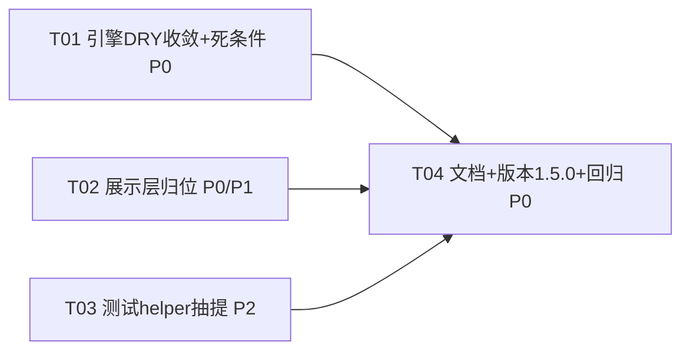

# Vencertia v1.5 重构施工图

> 版本：1.5.0（minor，重构级迭代，零行为变更）
> 架构师：高见远（Gao）· 日期：2026-08-14
> 基线：**559 passed / 1 skipped / 0 failed**，ruff 0 error，已 push origin main
> 上游输入：主理人齐活林《Vencertia v1.5 架构愿景核对 + 重构施工图》任务书
> 铁律：**重构不改行为只改结构**；所有变更必须被 559 个既有测试证明零回归；不引入新框架/依赖。

---

## 0. 结论摘要（TL;DR）

**"项目是不是预想的那样"一句话结论：** 基本是预想的那样——三层权力边界主体成立（Repository 仍是唯一写入口、`extra="forbid"` 未破、CAPABILITY 无写权、evidence_import 完整走 Candidate→Validation→持久化），但存在 **三处偏离**：① 展示层 `presentation.py` 被放进 `runtime/`（确定性引擎层），且 `runtime.py` 反向内联中文投影，边界轻微渗漏；② API/CLI 组合层存在直连 repository + 内联业务逻辑（实验结算状态机）的编排泄露；③ 4 项已知技术债全部仍在，且 README 版本/测试数字滞后一轮（仍停在 v1.3.0 / 532）。

**三项位置裁决：**

| 裁决项 | 结论 | 一句话理由 |
|---|---|---|
| `runtime/presentation.py` 位置 | **动**（迁移到 `src/vencertia/presentation/`） | 展示文案投影不属于确定性引擎层，且引擎层 `runtime.py` 反向 import 展示常量是必须解除的边界渗漏；纯移动零行为变更 |
| `SolveResultV11` 字段拆分 | **不动**（本轮不拆） | 26 字段全可选有默认值、`advanced_view` 子模型已承担投影分离主责；大改 DTO 破坏面大、零回归约束下收益/风险不划算 |
| `quick_solve.py` 顶层模块位置 | **不动**（保留顶层） | 它与 `api.py`/`cli.py` 同是顶层组合入口，迁到 runtime/ 或 presentation/ 都会错位，迁移收益低、破坏 CLI import + 测试 |

**版本裁决：1.5.0（minor），非 1.4.1（patch）。** 理由见 §2.8。

---

# 第一部分：现状 vs 愿景审查报告

## 1.1 三层边界完整性

### 1.1.1 REALITY 层（Repository 唯一写入口）

**结论：基本完好，但组合层存在"直连 repository + 内联业务逻辑"的编排泄露。**

- ✅ `VencertiaBaseModel.model_config` 仍为 `extra="forbid"`（`src/vencertia/domain/base.py:24-29`），domain 对象仍是 canonical 契约。
- ✅ 乐观锁（`expected_version`）单写入口未破：`repo.save_decision(..., expected_version=...)` 等仍在（`runtime/runtime.py:1042`、`api.py:326`）。
- ⚠️ **组合层直连 repository**（非 capability 越界，但违背"经引擎/服务封装"的愿景）：
  - `api.py:241` `repo.add_evidence(graded)` —— `add_evidence` 端点把 `grade → apply_authority → add_evidence` 内联在 API 层（`api.py:237-241`），未走 service。
  - `api.py:300-326` `resolve_experiment` 端点把"实验结算状态机"（建 Action → `save_action` → 改 `experiment.status` → `save_experiment`）写在 API 层，这是本应下沉到 `OutcomeSettlementService`/引擎的业务逻辑。
  - `api.py:339-341` `create_predictions` 端点循环 `repo.save_prediction(entry)`。
  - `cli.py:114-117` `decision evaluate` 命令直写 `repo.save_decision` + `repo.save_belief`。
  - `cli.py:182` `evidence add` 命令内联 `grade → apply_authority → repo.add_evidence`。
  - `cli.py:408` `calibration report` 命令 `SolveOrchestrator(repo=repo, settings=settings)` 二次构造运行时（不走 `build_container()` 单根接线）。

> 严格说 REALITY 写入口仍是 Repository（没有绕过），但上述 API/CLI 承担了本应由 service 封装的编排/状态迁移，属于**组合层编排泄露**，非 P0 阻断，列为 P2 观察项。

### 1.1.2 DECISION INTELLIGENCE 层（确定性引擎纯函数化 / 无外部 IO）

**结论：引擎主体纯函数化良好；但展示层混入引擎包 + 引擎反向依赖展示常量，是本次审查最主要的边界问题。**

- ✅ `runtime/` 下引擎（belief/decision/convergence/calibration/uncertainty 等）均为确定性纯函数，无外部 IO；`SolveOrchestrator`（`runtime/runtime.py`）作为唯一编排门面承担 IO/持久化，符合 ADR-002。
- ❌ **`runtime/presentation.py` 归属错误**：该模块是"展示层中文文案映射 + 纯函数投影模板"（`runtime/presentation.py:1-10` 自述），语义上属于"视图投影层"，**不属于 DECISION INTELLIGENCE 确定性引擎层**。它被 `api.py`/`cli.py`/`quick_solve.py`（展示入口）消费，与引擎零调用关系。
- ❌ **反向依赖**：`runtime/runtime.py:912` 从展示层 import `BELIEF_RELATION_ZH, PROVENANCE_ZH`，并在引擎门面的 `solve()` 内组装中文投影（`runtime/runtime.py:914-935` 的 `belief_graph[relation_zh]` / `parameter_provenance[provenance_zh]`）。这是"引擎层依赖展示层"的反向耦合——展示投影被内联进了 `advanced_view` 组装。裁决见 §2.8-1（迁移，但不强行反转依赖，标注为遗留债）。

### 1.1.3 CAPABILITY 层（候选产出者无写权）

**结论：完好。** `capabilities/` 模块（compiler/challenger/research 等）只返回 candidates，无 repository 写路径。`ChallengerCapability` 产出 `ModelCritique`（`runtime/runtime.py:366`）降级放行，永不阻塞。

### 1.1.4 `evidence_import.py` 是否完整走管线

**结论：完整走管线，无绕过路径。** `EvidenceImporter.import_batch`（`runtime/evidence_import.py:130-181`）严格执行：
1. 批内 dedup（`dedup.group`）→ 2. 幂等（`content_fingerprint` 对库比对）→ 3. 校验（`policy.grade`，`REJECTED` 计入 conflicts）→ 4. 持久化（`policy.apply_authority` → `repo.add_evidence`）。

两处小瑕疵（非阻断）：
- `evidence_import.py:172` `apply_authority` 内部会再调一次 `grade()`（`evidence_policy.py:165-167`），导致 grade 被调两次，纯低效。
- `evidence_import.py:147-156` 的"已存在 fingerprint 过滤"与 `runtime/runtime.py:460-469` 的跨轮过滤是同一逻辑写了两遍（DRY 违例，见 §1.2）。

### 1.1.5 `SolveResultV11` 字段膨胀

**现状**：26 字段（继承 `SolveResult` 6 字段 + 自身 20 字段，`runtime/runtime.py:114-161`）。核心状态（decision/convergence/predictions）与视图投影（action_state/mode/advanced_view/experiment_voi/research_stop）混在同一 DTO。

**裁决：不动（本轮不拆）。** 理由见 §2.8-2。真正的问题是投影**组装内联在 runtime.py**（§1.1.2），而非 DTO 字段数量本身；`SolveResultAdvancedView`（`runtime/runtime.py:124-134`）已经承担了投影分离的主责。

## 1.2 DRY 与单一权威来源

### 1.2.1 已知债 4 项（全部仍在，行号确认）

| # | 债 | 位置 | 现状 |
|---|---|---|---|
| 1 | 校准 bins/piecewise 重复 | `confidence_calibrator.py:56-94` vs `calibration_engine.py:216-252` | **仍在**，两处逐行同构（`_bins_from_predictions`/`_piecewise` vs `_bins`/`_map_piecewise`） |
| 2 | authority 权重表重复 | `context.py:40-50` / `context_ranker.py:133-143` / `evidence_dedup.py:146-156` / `evidence_policy.py:24-34` | **仍在**，4 处硬编码（canonical 应为 `evidence_policy.AUTHORITY_TABLE`，`research_stop.py:33` 已是正确 import 范式） |
| 3 | 冗余死条件 | `convergence_engine.py:50`、`convergence_engine.py:130` | **仍在**，`or e.status == "PROPOSED"` 冗余（`"PROPOSED"` 已在 `(None, "PROPOSED", "RUNNING")` 元组内） |
| 4 | `__import__("math")` 内联 import | `evidence_policy.py:114`、`belief_engine.py:329-330` | **仍在**（注：任务书说的 `belief_engine.py:315-316` 是旧行号，当前实际为 329-330） |

**补充发现（第 5 处 authority 表达 + 派生债）：**
- `belief_engine.py:428-438` `_authority_rank` 的 9 级顺序 list 是第 5 处 authority 层级表达（顺序语义，与权重表不同但同源）。
- `domain/base.py:70-78` `AuthorityLevel` 枚举内联注释 `# 1.00 / # 0.95 / ...` 是第 6 处（注释形式），有漂移风险。
- `belief_engine.py:393` `policy_version="1.1"` 硬编码（应为 `self.settings.policy_version` 派生），单一权威来源违例。

### 1.2.2 v1.4 新增代码引入的新重复

| # | 新增重复 | 位置 |
|---|---|---|
| 1 | `min_samples=20` 校准最小样本数 4 处重复 | `confidence_calibrator.py:23/29/42`、`calibration_engine.py:179/198`、`presentation.py:101`（`CALIBRATION_MIN_SAMPLES`）、`domain/calibration.py:46`（`classify_calibration` 默认） |
| 2 | settled 预测过滤逻辑 3 处 | `confidence_calibrator.py:35-40`、`calibration_engine.py:32-33`（`_settled`）+ `calibration_engine.py:191-196` |
| 3 | 跨库 fingerprint 幂等逻辑 2 处 | `evidence_import.py:147-156` vs `runtime/runtime.py:460-469` |
| 4 | 阈值常量 0.4/0.6 语义歧义 | `presentation.py:20`（`PROBABILITY_BANDS` 概率带）与 `presentation.py:207-212`（风险容忍度带）各用 0.4/0.6，语义不同但同值，易混淆 |

> 结论：v1.4 新增代码的重复主要集中在**校准最小样本数**与**指纹幂等**，前者可随 §2.2 T01 一并收敛，后者属 P2。

## 1.3 文档漂移

| 文档 | 漂移点 | 应更新为 |
|---|---|---|
| `README.md:1` | 标题仍为 `v1.3.0` | `v1.4.0`（重构后 `v1.5.0`） |
| `README.md:21` | 快速开始写 `532 passed / 1 skipped —— v1.3.0 最终回归` | `559 passed / 1 skipped` |
| `README.md:34` | 历史数字止于 `v1.3.0 532` | 追加 `v1.4.0 559` |
| `src/vencertia/__init__.py:1` | docstring 仍为 `v1.1.2` | `v1.4.0`（重构后 `v1.5.0`） |
| `DELIVERY_REPORT.md` | 交付段止于 v1.2.1（506 passed），无 v1.3/v1.4 段 | 追加 v1.3/v1.4 交付段 |
| `docs/iteration-log.md` | 迭代记录止于 v1.2.1 | 追加 v1.3/v1.4 迭代 |
| `docs/api.md` | 无 `/v1/evidence/import`、无 `/v1/solve` 的 `view`/`advanced` 参数说明 | 补齐 |
| `docs/cli.md` | 无 `quick-solve`、`evidence import`、`calibration report` 中文输出 | 补齐 |

> 说明：`DELIVERY_REPORT.md` 顶部仍保留 v0.1/v1.1 历史段（合理），但**当前状态**段缺失 v1.3/v1.4；`docs/` 下已有 `v1.3-construction-plan.md`/`v1.4-construction-plan.md`，但 README/DELIVERY/iteration-log 未同步。

## 1.4 测试债（v1.2~v1.4 快迭代痕迹，抽样评估）

抽样 4 个新测试文件（`test_v13_summary.py` / `test_v14_presentation.py` / `test_v14_evidence_import.py` / `test_v14_quick_solve.py`）：

| 债 | 位置 | 评估 |
|---|---|---|
| `_orchestrator()` 复制粘贴（同构 8 行） | `test_v13_summary.py:22-31` = `test_v14_presentation.py:29-38` | 快迭代痕迹，无共享 fixture |
| `_client()` 复制粘贴（同构 13 行） | `test_v13_summary.py:108-123` = `test_v14_evidence_import.py:221-233` | 同上 |
| `FIVE_KEYS` 常量 3 处重复定义 | `test_v13_summary.py:19`、`test_v14_presentation.py:26`、`test_v14_quick_solve.py:8` | 同上 |
| `_evidence()` 构造器硬编码 payload | `test_v14_evidence_import.py:26-55` | 未抽公共 factory |
| conftest 无 orchestrator/api_client fixture | `tests/conftest.py:40-67`（只有 `settings/event_bus/repo/policy/tmp_db/project_root`） | 缺组合层 fixture |

> 结论：测试本身断言质量合格（键级/属性级/超集断言，非整字典脆断言），但 setup 存在复制粘贴，无 helper 复用。属 P2，不阻断。

---

# 第二部分：重构施工图

## 2.1 任务分组总览（≤4）

| ID | 任务 | 优先级 | 动机 | 风险 |
|---|---|---|---|---|
| **T01** | 确定性引擎 DRY 收敛 + 死条件/异味清理 | P0 | 4 项已知债（DRY/死条件/math import）+ 校准 min_samples 重复 | 低（纯内聚重构，逐调用点验证 fallback） |
| **T02** | 展示层归位（presentation 独立成包） | P0/P1 | 三层边界：展示投影不属于引擎层 + 引擎反向依赖展示常量 | 中（import 面变更，保留 shim 降险） |
| **T03** | 测试 helper 抽提 | P2 | 消除 `_orchestrator`/`_client`/`FIVE_KEYS` 复制粘贴 | 低（纯测试重构，行为断言不变） |
| **T04** | 文档漂移修复 + 版本 1.5.0 落地 + 全量回归 | P0 | README/DELIVERY/iteration-log 滞后一轮；版本裁决落地 | 低（文档 + 版本断言同步） |

依赖：T01 → T04；T02 → T04；T03 → T04（T01/T02/T03 三者正交，T04 最后收尾）。

---

## 2.2 T01 — 确定性引擎 DRY 收敛 + 死条件/异味清理（P0）

**动机**：4 项已知债全部仍在（§1.2.1）；违反"单一权威来源 + DRY"愿景；校准 bins/piecewise 是逐行同构的复制，是最危险的"改一处漏一处"债。

**变更文件清单：**

| 文件 | 变更 | 说明 |
|---|---|---|
| `src/vencertia/runtime/evidence_policy.py` | 保持 `AUTHORITY_TABLE` 为 canonical；确认 `weight_of()` 是唯一权重入口 | 已有（`evidence_policy.py:24-34`、`87-89`） |
| `src/vencertia/runtime/context.py` | 删内联表（40-50），改 import `AUTHORITY_TABLE` | fallback 保持 `0.0` |
| `src/vencertia/runtime/context_ranker.py` | 删内联表（133-143），改 import `AUTHORITY_TABLE` | fallback 保持 `0.1` |
| `src/vencertia/runtime/evidence_dedup.py` | 删内联表（146-156），改 import `AUTHORITY_TABLE` | fallback 保持 `0.1` |
| `src/vencertia/runtime/confidence_calibrator.py` | 删 `_bins_from_predictions`/`_piecewise`（56-94），`calibrate()` 委托 `CalibrationEngine.calibrate()` | 薄门面化 |
| `src/vencertia/runtime/calibration_engine.py` | 保留 `_bins`/`_map_piecewise` 为 canonical；`min_samples` 默认值收敛到 Settings 或共享常量 | 提取单一 min_samples 来源 |
| `src/vencertia/runtime/convergence_engine.py` | 删冗余 `or e.status == "PROPOSED"`（50、130） | 死条件 |
| `src/vencertia/runtime/evidence_policy.py` | `__import__("math")` → 顶部 `import math`（114） | 异味 |
| `src/vencertia/runtime/belief_engine.py` | `__import__("math")` → 顶部 `import math`（329-330） | 异味 |
| `src/vencertia/config.py` | 可选：加 `calibration_min_samples: int = 20` 设置项 | 单一来源 |

**关键接口/结构变化：**

```python
# evidence_policy.py（保持，canonical 不变）
AUTHORITY_TABLE: dict[str, float] = { ... }          # 9 级权重，唯一来源
def weight_of(authority_level) -> float: ...          # 默认 0.10

# context.py（改：内联表 → import）
from vencertia.runtime.evidence_policy import AUTHORITY_TABLE
def evidence_key(e):
    authority_weight = AUTHORITY_TABLE.get(e.authority_level, 0.0)   # 默认 0.0 不变

# context_ranker.py / evidence_dedup.py（改）
from vencertia.runtime.evidence_policy import AUTHORITY_TABLE
return AUTHORITY_TABLE.get(key, 0.1)                                  # 默认 0.1 不变

# confidence_calibrator.py（改：委托）
def calibrate(self, raw, calibration_group="default"):
    if self.repo is None:
        return CalibratedConfidence(raw=raw, calibrated=None, status="UNCALIBRATED", n=0)
    return self.calibration_engine.calibrate(
        raw, calibration_group,
        predictions=self.repo.list_predictions(),
        min_samples=self.min_samples,
    )
```

**零回归策略（关键）**：
1. authority 表 9 个键值在 4 处**完全一致**（1.0/0.95/0.9/0.88/0.75/0.65/0.45/0.2/0.1），但 **fallback 默认值不同**（`context.py=0.0`，其余 `=0.1`），收敛时**逐调用点保留各自默认值**，不得统一。
2. `ConfidenceCalibrator.calibrate` 委托后，输出字段 `raw/calibrated/status/n/calibration_group` 必须与重构前逐字节一致（`CalibrationEngine.calibrate` 的 settled 过滤、`n<min_samples`、piecewise 映射与 `ConfidenceCalibrator` 原实现逐行同构，已核对 `calibration_engine.py:174-214` vs `confidence_calibrator.py:31-54`）。
3. 死条件删除：`(None, "PROPOSED", "RUNNING")` 已含 `"PROPOSED"`，删除 `or e.status == "PROPOSED"` 不改变 executable 集合，`convergence_engine` 既有测试必须全绿。
4. math import：纯 import 重排，无逻辑变更，`ruff` 验证。

**验收要点（pytest 断言）**：
- `EvidencePolicy.weight_of("PROJECT_REALITY") == 1.0` 且 `weight_of("NONEXISTENT") == 0.10`。
- `ContextRanker._authority(e)` / `EvidenceDedupEngine._source_priority(e)` 对 9 级 authority 的返回值与重构前一致（用既有 `test_context.py`/`test_dedup.py` 覆盖）。
- `ConfidenceCalibrator(...).calibrate(0.6)` 在 settled≥20 与 settled<20 两种场景下，输出与重构前 `==`（`test_calibration.py` + 若有 `test_confidence_calibrator`）。
- `ConvergenceEngine.check` 对含 `PROPOSED` 实验的用例，`EXPERIMENT_REQUIRED` 分支结果不变（`test_convergence.py`）。
- `EvidencePolicy.freshness_factor` / `BeliefEngine._update_log_odds` 数值不变（`test_evidence_policy.py`/`test_belief_engine.py`）。
- 全量 `pytest`：559 passed / 1 skipped，ruff 0 error。

**预估收益/风险**：收益高（消除最危险的复制逻辑 + 单一权威来源）；风险低（纯内聚重构，唯一风险点是 authority fallback 默认值，已显式标注）。

---

## 2.3 T02 — 展示层归位（presentation 独立成包）（P0/P1）

**动机**：`runtime/presentation.py` 是展示文案投影，不属于确定性引擎层；`runtime/runtime.py:912` 反向 import 展示常量是引擎层→展示层的反向耦合。迁移是三层边界愿景的兑现。

**变更文件清单：**

| 文件 | 变更 | 说明 |
|---|---|---|
| `src/vencertia/presentation/__init__.py` | **新增** | 原 `runtime/presentation.py` 全部内容（docstring 改为"展示层投影（独立于 runtime 引擎层）"） |
| `src/vencertia/runtime/presentation.py` | **改** | 改为 deprecated re-export shim（`from vencertia.presentation import *`），兼容既有 import |
| `src/vencertia/api.py` | 改 import ×2 | `api.py:132`、`api.py:533` → `from vencertia.presentation import ...` |
| `src/vencertia/cli.py` | 改 import ×2 | `cli.py:62`、`cli.py:404` → `from vencertia.presentation import ...` |
| `src/vencertia/quick_solve.py` | 改 import ×1 | `quick_solve.py:16` → `from vencertia.presentation import solve_summary` |
| `src/vencertia/runtime/runtime.py` | 改 import ×1 | `runtime.py:912` → `from vencertia.presentation import BELIEF_RELATION_ZH, PROVENANCE_ZH` |

**关键接口/结构变化：**
- 迁移后对外 import 面：`from vencertia.presentation import solve_summary, calibration_summary, ...`（新权威路径）。
- `runtime/presentation.py` 保留为 re-export shim，故**既有测试/第三方 import 零破坏**（`from vencertia.runtime.presentation import X` 仍可用），新代码用新路径。
- **明确标注的遗留债（本轮不动）**：`runtime/runtime.py:914-935` 在 `solve()` 内联组装中文投影（`belief_graph[relation_zh]`/`parameter_provenance[provenance_zh]`），仍由引擎门面调用展示纯函数。本轮仅把 import 路径从旧包切到新包，**不强行反转依赖**（完整解耦 = 投影组装整体迁到 presentation 层 + SolveResultV11 拆核心/视图，留待 v1.6，避免破坏面）。

**零回归策略**：
1. 纯文件移动 + import 更新，`presentation/__init__.py` 内容与迁移前 `runtime/presentation.py` 逐字节一致。
2. re-export shim 保证 `from vencertia.runtime.presentation import X` 继续可用 → 测试 import 无需改。
3. 不触碰 `SolveResultV11` 结构、不改任何投影函数实现、不改 solve() 组装逻辑（只改 import 语句）。

**验收要点（pytest 断言）**：
- `from vencertia.presentation import solve_summary` 成功导入，且 `solve_summary is __import__('vencertia.runtime.presentation').solve_summary`（shim 透传同一对象）。
- `test_presentation.py`/`test_v13_summary.py`/`test_v13_transparency.py`/`test_v14_presentation.py` 全绿（无需改 import）。
- `/v1/solve?view=summary` 与 `/v1/solve?advanced=true` 响应逐字节不变（`test_v13_summary.py`/`test_v14_presentation.py` 已有断言）。
- `quick-solve` 命令输出不变（`test_v14_quick_solve.py`）。
- 全量 `pytest`：559 passed / 1 skipped，ruff 0 error。

**预估收益/风险**：收益高（三层边界归位 + 解除引擎层反向 import 常量）；风险中（import 面变更，shim 已降险至低）。

---

## 2.4 T03 — 测试 helper 抽提（P2）

**动机**：消除 `_orchestrator`/`_client`/`FIVE_KEYS` 复制粘贴（§1.4），提高测试可维护性，不改变任何断言语义。

**变更文件清单：**

| 文件 | 变更 | 说明 |
|---|---|---|
| `tests/conftest.py` | 加 `orchestrator`、`api_client` fixture + `FIVE_KEYS` 常量 | 单一来源 |
| `tests/test_v13_summary.py` | 删本地 `_orchestrator`/`_client`/`FIVE_KEYS`，改用 fixture | 去复制 |
| `tests/test_v14_presentation.py` | 删本地 `_orchestrator`/`FIVE_KEYS`，改用 fixture | 去复制 |
| `tests/test_v14_evidence_import.py` | 删本地 `_client`，改用 `api_client` fixture | 去复制 |
| `tests/test_v14_quick_solve.py` | 删本地 `FIVE_KEYS`，改用共享常量 | 去复制 |

**关键接口/结构变化：**
```python
# conftest.py（新增）
FIVE_KEYS = {"current_judgment", "rationale", "biggest_unknown", "next_step", "change_condition"}

@pytest.fixture
def orchestrator():
    repo = InMemoryRepository(); bus = EventBus(sink=repo.append_event)
    return SolveOrchestrator(repo=repo, bus=bus,
        model=MockProvider(), search=MockSearchProvider(), retrieval=MockRetrievalProvider())

@pytest.fixture
def api_client():
    settings = Settings(db_dsn="sqlite:///:memory:")
    repo = InMemoryRepository(); bus = EventBus(sink=repo.append_event)
    engines = default_engine_bundle(repo, settings, bus)
    runtime = SolveOrchestrator(repo=repo, policy=engines.evidence_policy,
        engines=engines, bus=bus, settings=settings,
        model=MockProvider(), search=MockSearchProvider(), retrieval=MockRetrievalProvider())
    return TestClient(create_app(settings, repo, runtime))
```

**零回归策略**：仅把 setup 逻辑从测试文件平移到 fixture，`solve`/`summary`/`import` 断言原样保留；`_client()` 的 settings 从 `Settings(db_dsn="sqlite:///:memory:")` 与 `test_v13_summary.py:109` 一致，需确保 fixture 行为与各测试原 `_client` 完全一致（`test_v14_evidence_import.py:221-233` 与 `test_v13_summary.py:108-123` 已同构）。

**验收要点（pytest 断言）**：4 个测试文件全绿且断言条数不变；全量 559 passed / 1 skipped。

**预估收益/风险**：收益中（可维护性）；风险低（纯测试重构）。

---

## 2.5 T04 — 文档漂移修复 + 版本 1.5.0 落地 + 全量回归（P0）

**动机**：README/DELIVERY/iteration-log 滞后一轮（§1.3）；版本裁决落地为 1.5.0（§2.8）。

**变更文件清单：**

| 文件 | 变更 | 说明 |
|---|---|---|
| `README.md` | 标题 `v1.3.0`→`v1.5.0`；测试数 `532`→`559`；历史数字追加 `v1.4.0 559` | 去漂移 |
| `DELIVERY_REPORT.md` | 追加 v1.3 / v1.4 交付段 | 去漂移 |
| `docs/iteration-log.md` | 追加 v1.3 / v1.4 迭代记录 | 去漂移 |
| `docs/api.md` | 补 `/v1/evidence/import`、`/v1/solve` 的 `view`/`advanced` 参数 | 去漂移 |
| `docs/cli.md` | 补 `quick-solve`、`evidence import`、`calibration report` 中文输出 | 去漂移 |
| `src/vencertia/__init__.py` | docstring `v1.1.2`→`v1.5.0`；`__version__="1.5.0"`；`__api_contract_version__="1.5"` | 版本落地 |
| `pyproject.toml` | `version = "1.5.0"` | 版本同步 |
| `tests/test_integrity_v112.py` / `test_api.py` / `test_api_v11.py` / `tests/qa_v112/test_qa_v112_p1p2.py` | 版本断言 `1.4.0`→`1.5.0`、`1.4`→`1.5`（参照 v1.4 施工图 §3.4 同步表） | 版本断言同步 |

**关键接口/结构变化**：无代码行为变更；版本号 + 文档一致。

**零回归策略**：版本断言同步按 v1.4 施工图 §3.4 的精确行级清单执行（`__version__`/`__api_contract_version__`/`runtime_version`/`api_contract_version`/`version`/`api_version`）；文档改动不触碰引擎。

**验收要点（pytest 断言）**：
- `/health` 返回 `runtime_version == "1.5.0"`、`api_contract_version == "1.5"`（`test_api.py`/`test_api_v11.py` 版本断言）。
- `vencertia.__version__ == "1.5.0"` 且 `pyproject.toml` version 一致（`test_integrity_v112.py`）。
- 文档链接检查：根 README + docs 无 `docs/[A-Z].*\.md` 大写断链（延续 v1.4 P2-1 检查脚本）。
- 全量 `pytest`：559 passed / 1 skipped，ruff 0 error。

**预估收益/风险**：收益中（文档与代码一致，兑现"诚实声明"纪律）；风险低。

---

## 2.6 任务依赖图



---

## 2.7 Shared Knowledge（跨任务约定）

1. **零行为变更铁律**：所有重构只改结构不改逻辑；每个任务完成后跑相关测试文件 + 全量 `pytest`（目标 559 passed / 1 skipped）。
2. **authority 表单一来源**：`evidence_policy.AUTHORITY_TABLE` 是唯一 9 级权重表；各调用点保留各自的 fallback 默认值（`context.py=0.0`，其余 `=0.1`），**不得统一**（否则行为变更）。
3. **校准数学单一来源**：`CalibrationEngine._bins` / `_map_piecewise` 是唯一 bins/piecewise 实现；`ConfidenceCalibrator` 委托之。
4. **presentation 归位后**：新代码一律 `from vencertia.presentation import ...`；`runtime/presentation.py` shim 仅作兼容，下个版本删除。
5. **版本号单一来源**：`__version__` / `__api_contract_version__` / `pyproject.toml` / `/health` 四处必须一致（`test_integrity_v112.py` 强制）。
6. **不引入新依赖**：math/json 等标准库直接顶部 import，禁止 `__import__` 内联（除非循环导入隔离，且须注释说明）。
7. **中文文案仍集中 presentation 层**：引擎层不新增中文映射常量。

---

## 2.8 裁决专节

### 2.8.1 `presentation.py` 位置 → **动（迁移）**

**结论：迁移到 `src/vencertia/presentation/`。** 理由：
1. 三层架构中 `runtime/` = DECISION INTELLIGENCE 确定性引擎层；`presentation.py` 是展示文案投影 + 纯函数模板（`presentation.py:1-10` 自述），语义上属视图投影层。
2. 它被 `api.py`/`cli.py`/`quick_solve.py`（展示入口）消费，与引擎零调用；放进 `runtime/` 造成"展示关注点混入引擎包"。
3. `runtime/runtime.py:912` 反向 import 展示常量是引擎层→展示层的反向耦合，迁移是解除耦合的第一步。
4. 迁移 = 纯移动 + import 更新 + re-export shim，零行为变更、低风险。

### 2.8.2 `SolveResultV11` 拆分 → **不动（本轮不拆）**

**结论：不拆。** 理由：
1. 26 字段全部可选/有默认值，向后兼容，未造成消费者破坏。
2. `SolveResultAdvancedView`（`runtime/runtime.py:124-134`）已是独立子模型，承担了"视图投影分离"的主责。
3. 大改 DTO 破坏面大（`api.py`/`cli.py`/大量测试消费 `model_dump`），在"零行为变更"约束下收益/风险比不划算。
4. 真正的问题是投影**组装内联在 `runtime.py`**（§1.1.2），应由 T02/未来 v1.6 把组装迁到 presentation 层解决，而非拆 DTO 字段。

### 2.8.3 `quick_solve.py` 位置 → **不动（保留顶层）**

**结论：保留顶层。** 理由：
1. `src/vencertia/api.py` / `src/vencertia/cli.py` 同是顶层组合入口模块，`quick_solve.py` 是同类"应用便捷入口"，顶层并不破坏包结构一致性。
2. 它既编排 `SolveOrchestrator`（引擎），又调 `solve_summary`（展示），迁到 `runtime/`（错位，非引擎）或 `presentation/`（错位，它编排引擎）都会更糟；迁到新 `app/` 包收益低。
3. 迁移会破坏 CLI `quick-solve` 命令 import（`cli.py:79`）与测试（`test_v14_quick_solve.py:6`），收益/风险不划算。
4. 唯一动作：随 T02 更新其 `presentation` import 路径（`quick_solve.py:16`）。

### 2.8.4 版本裁决 → **1.5.0（minor），非 1.4.1（patch）**

**结论：1.5.0。** 理由：
1. `presentation` 独立成包是**包结构变更**（对外 import 路径变化，即便 shim 兼容，也是结构性升级），语义上属 minor 而非 patch。
2. patch（1.4.1）语义上暗示"bug 修复"，会低估本次结构变更的幅度；用户已明确授权"重构"。
3. 团队既有惯例：v1.4 因新增 API 端点升 minor、文档重命名单独列 P2-1，均把"结构性变更"计为 minor；本次为重构级迭代（施工图本身就是 v1.5-refactor-plan），minor 一致。
4. 零行为变更不影响版本升级合理性——版本反映"交付形态的变更"而非"仅行为变更"。

---

## 附：变更文件总表

| 任务 | 文件 | 新增/修改 |
|---|---|---|
| T01 | `runtime/evidence_policy.py`、`runtime/context.py`、`runtime/context_ranker.py`、`runtime/evidence_dedup.py`、`runtime/confidence_calibrator.py`、`runtime/calibration_engine.py`、`runtime/convergence_engine.py`、`runtime/belief_engine.py`、`config.py` | 修改 |
| T02 | `presentation/__init__.py`（新）、`runtime/presentation.py`（改 shim）、`api.py`、`cli.py`、`quick_solve.py`、`runtime/runtime.py` | 新增 1 + 修改 5 |
| T03 | `tests/conftest.py`、`tests/test_v13_summary.py`、`tests/test_v14_presentation.py`、`tests/test_v14_evidence_import.py`、`tests/test_v14_quick_solve.py` | 修改 |
| T04 | `README.md`、`DELIVERY_REPORT.md`、`docs/iteration-log.md`、`docs/api.md`、`docs/cli.md`、`src/vencertia/__init__.py`、`pyproject.toml`、`tests/test_integrity_v112.py`、`tests/test_api.py`、`tests/test_api_v11.py`、`tests/qa_v112/test_qa_v112_p1p2.py` | 修改 |
